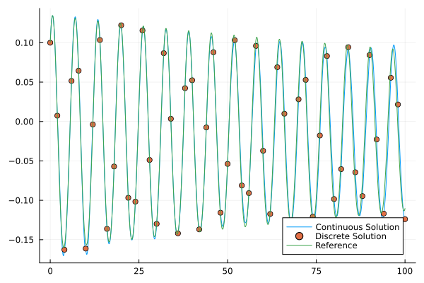

# NonlinearIntegrators

[](https://JuliaGNI.github.io/NonlinearIntegrators.jl/stable/)
[](https://JuliaGNI.github.io/NonlinearIntegrators.jl/dev/)
[](https://github.com/JuliaGNI/NonlinearIntegrators.jl/actions/workflows/CI.yml?query=branch%3Amain)
[](https://codecov.io/gh/JuliaGNI/NonlinearIntegrators.jl)
<!-- 
[](https://JuliaCI.github.io/NanosoldierReports/pkgeval_badges/N/NonlinearIntegrators.html) -->


[NonlinearIntegrators.jl](https://github.com/JuliaGNI/NonlinearIntegrators.jl) is a affliated package in the [GeometricIntegrators.jl](https://github.com/JuliaGNI/GeometricIntegrators.jl) community. This package aims to generalize continuous Galerkin variational integrators with linear basis to nonlinear basis to achieve large time-step integration.

Till now, several options for nonlinear basis are available.

- [x] One Hidden Layer Neural Network (Shallow Neural Network)
    - [x] Implemented with Lux
    - [x] Implemented with [GeometricMachineLearning.jl](https://github.com/JuliaGNI/GeometricMachineLearning.jl) and [SymbolicNeuralNetwork.jl](https://juliagni.github.io/SymbolicNeuralNetworks.jl)
- [x] Nested Sindy

Besides, several linear basis are also included:

- [x] Random Feature Model
- [_] Sindy


## installation
GeometricIntegrators.jl and all of its dependencies can be installed via the Julia REPL by typing
```
]add NonlinearIntegrators.jl
```

## Basic Usage
At first, we have to load several packages:
```
using Symbolics
using CompactBasisFunctions
using NonlinearIntegrators
using QuadratureRules
using GeometricProblems
using GeometricIntegrators
```
Additional package would be required if we want to use Nested Sindy expression.
```
using Symbolics
```
Like what we would do in *GeometricIntegrators.jl*, we first define the problem we want to solve. The type of problem here is restricted to _Lagrangian ordinary equations_, i.e. models have a regular Lagrangian and its Lagrangian equation of motions.

```
T = 100.0
h_step = 2.0
HHlode = GeometricProblems.HenonHeilesPotential.lodeproblem([0.1,0.1],[0.1,0.1],tspan = (0,T),tstep = h_step)
```

For each dimension of generalized coordinates __q__ = (q<sub>1</sub>, q<sub>2</sub>), we prescribe a expression that approximates the coordinates.
```
@variables W1[1:4] W2[1:4] t
q₁_expr = W1[1] *cos(W1[2]* t + W1[3]) + W1[4]
q₂_expr = W2[1] *cos(W2[2]* t + W2[3]) + W2[4]
```
then define a basis object for variational Galerkin integrator, in this case, a Polynomial-Radial basis for the two dimension problem.
```
PRB = PR_Basis{Float64}([q₁_expr,q₂_expr], [W1,W2], t,2)
```
along with a chosen quadrature rule, and initial guess for the parameters in the expression, we define the integrator, and start the game :)

```
PR_Int = PR_Integrator(PRB, QGau8,[[0.14831,1.0,-0.64812,- 0.018712],[0.14298,- 0.97215,0.7615,-0.0013983]]) 
PR_sol = integrate(HHlode, PR_Int)
```

One good thing about continuous Galerkin variational integrators is that you could record the coordinates values between two discrete steps for free!
```

HHlode_ref = GeometricProblems.HenonHeilesPotential.lodeproblem([0.1,0.1],[0.1,0.1],tspan = (0,TT),tstep = h_step/50)
ref_sol = integrate(HHlode_ref, ImplicitMidpoint())

using Plots
sol_mat = hcat(PR_sol[2][:,2:end,1]'...)[1,:]
plot(collect(h_step/40:h_step/40:TT),sol_mat,label = "Continuous Solution")
scatter!(collect(0:h_step:TT),collect(PR_sol[1].q[:,1]),label = "Discrete Solution")
plot!(collect(0:h_step/50:TT),collect(ref_sol[1].q[:,1]), label = "Reference")
```


