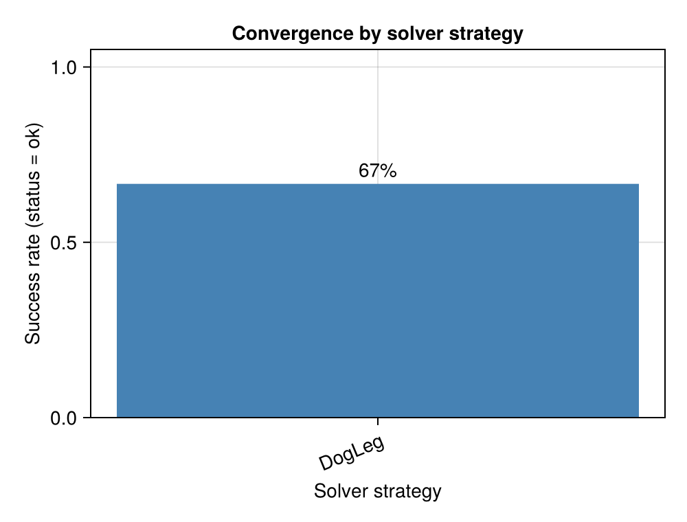
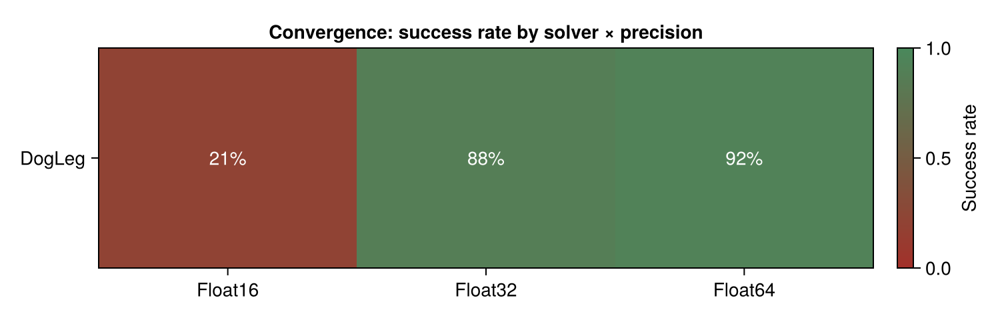
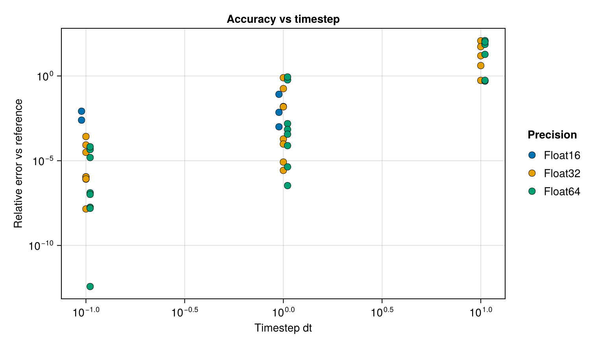
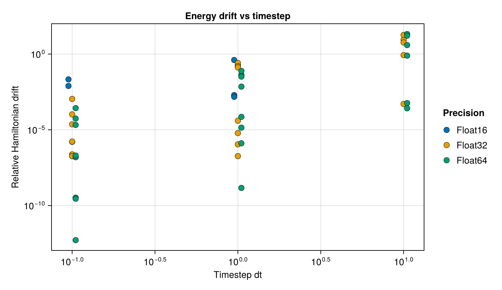
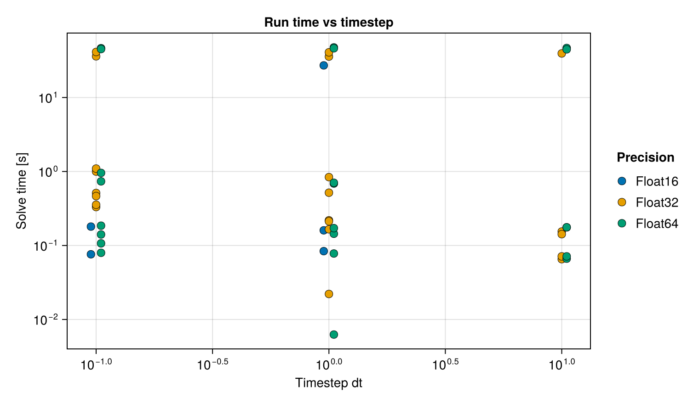
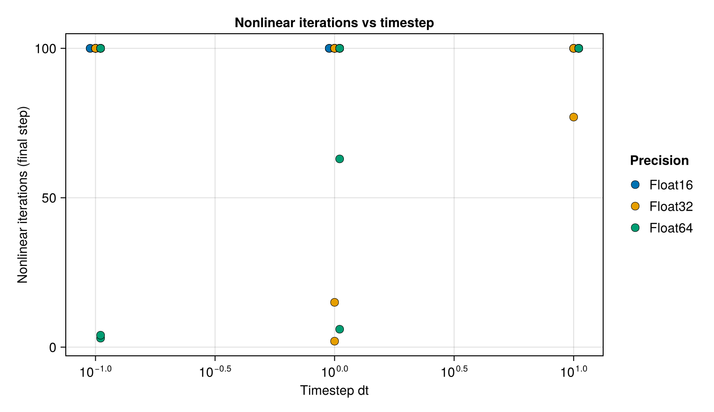

# Benchmarks

The package ships a benchmark suite (under `benchmark/`) for the one-layer GML
variational integrator `NonLinear_OneLayer_GML`. It runs each of several test
problems through a large grid of integrator configurations and records, for every case,
whether the nonlinear solve converged, how accurate the result is, how much the energy
drifts, how many nonlinear iterations it took, and how long it ran. The results are
written to CSV, summarised in a markdown report, and visualised with a set of plots.

The suite has three goals:

1. find which integrator-parameter configurations work well for each test problem;
2. identify issues in the package that are detrimental to performance;
3. identify robust solver strategies.

There is also a separate, narrower `benchmark/oga_comparison.jl` that compares the two
OGA initial-guess variants; see the *Orthogonal Greedy Algorithm* page and
`benchmark/README.md`.

## What is swept

Each case integrates a problem for exactly **10 time steps**; the time span is adapted
per case as `(0, 10·dt)`. The sweep spans, per problem:

| axis | meaning |
|---|---|
| timestep `dt` | integration step size |
| precision | working floating-point type (`Float16` / `Float32` / `Float64`) |
| `R` | Gauss–Legendre quadrature order |
| `S` | number of hidden neurons (network width) |
| activation | `ReLUᵏ` (`k = 2, 3, 4`) or `tanh` |
| solver strategy | `Newton` with `Static` / `Backtracking` / `StrongWolfe` line search, or trust-region `DogLeg` |
| `λ` | Jacobian regularization (`regularization_factor`) |
| initial guess | `midpoint` (`IntegratorExtrapolation`), `Hermite` (`HermiteExtrapolation`), or `previous` (`NoExtrapolation`) |

The test problems (from
[GeometricProblems.jl](https://github.com/JuliaGNI/GeometricProblems.jl)) are the
harmonic oscillator, the pendulum (a degenerate two-component IODE — it has no
`lodeproblem`), the double pendulum, and the Toda lattice with `N = 16`.

## Modes

Each per-problem run file takes a mode — `quick` (default) or `full` — from its first
command-line argument or from the `GML_BENCH_PRESET` environment variable.

| axis | `full` | `quick` |
|---|---|---|
| `dt` | 0.01, 0.1, 1.0, 10.0 | 0.1, 1.0, 10.0 |
| precision | Float16, Float32, Float64 | Float64, Float32, Float16 |
| `R` | 4, 8, 16 | 8 (16 for double pendulum & Toda) |
| `S` | 4, 6, 8 | 4 (8 for double pendulum & Toda) |
| activation | ReLU², ReLU³, ReLU⁴, tanh | ReLU³, tanh |
| solver | Newton/{Static, Backtracking, StrongWolfe}, DogLeg | DogLeg |
| `λ` | 0.0, 1e-7, 1e-5, 1e-3, 16√eps(T) | 16√eps(T) |
| initial guess | midpoint, Hermite, previous | midpoint |
| `max_iterations` | 10000 | 100 |

`quick` is roughly 18 cases per problem (seconds to minutes each — the Toda lattice is
the slowest because of its `N = 16` state and larger network); `full` is on the order of
tens of thousands of cases per problem (hours). Results are flushed to CSV per case, so an
interrupted `full` run keeps its partial output.

The `16√eps(T)` regularization scales the Jacobian-diagonal damping with the working
precision: ≈2.4e-7 at `Float64`, ≈5.5e-3 at `Float32`, and 0.5 at `Float16`. The last is
large and tends to over-damp half precision; note, however, that at half precision the
`ReLUᵏ` basis is ill-conditioned and diverges independently of `λ`, whereas `tanh` still
converges — the accuracy limit there is the precision, not the regularization.

## Metrics

For each case the suite records:

- **status** — `ok`, or a failure class (`singular`, `diverged`, `nonfinite`, or the
  short name of any other exception raised);
- **`ref_err`** — the relative max-norm error of the final state against a reference,
  which is a `Gauss(8)` integration at `Float64` using the smallest timestep in the
  sweep (over the same 10-step horizon);
- **`ham_drift`** — the maximum relative drift of the Hamiltonian over the run;
- **`iterations`** — the nonlinear-solver iteration count of the final step;
- **`solve_secs` / `total_secs`** — the summed nonlinear-solve time and the wall-clock
  time of the run.

## Running

Instantiate the benchmark environment (it `dev`s the package):

```
julia --project=benchmark -e 'using Pkg; Pkg.develop(PackageSpec(path=pwd())); Pkg.instantiate()'
```

Run one or more problems (mode defaults to `quick`):

```
julia --project=benchmark benchmark/run_harmonic_oscillator.jl
julia --project=benchmark benchmark/run_pendulum.jl
julia --project=benchmark benchmark/run_double_pendulum.jl
julia --project=benchmark benchmark/run_toda_lattice.jl full   # full sweep
```

Each run writes `benchmark/results/<problem>_<mode>.csv`, a
`benchmark/results/<problem>_<mode>.md` report, and PNG plots. Finally, aggregate every
CSV present into a combined report:

```
julia --project=benchmark benchmark/report.jl
```

which writes `benchmark/results/onelayer_gml_benchmark.md`. The reporting step reads the
CSVs, so a report can be regenerated (or restyled) without re-running the sweep. All
`benchmark/results/` contents are git-ignored.

## Outputs

The CSV has one row per case with the columns

```
problem, T, dt, steps, R, S, activation, solver, linesearch, initial_guess,
lambda, status, ref_err, ham_drift, iterations, solve_secs, total_secs
```

The markdown report contains a status breakdown, convergence/robustness tables (by solver
strategy, initial-guess strategy, precision, and problem), the best configuration found
per problem, and failure hot-spots. It embeds the plots:

- **convergence** — success-rate bars per solver strategy, and a solver × precision
  heatmap (red = not converged, green = converged);
- **accuracy**, **energy drift**, **run time**, and **nonlinear iterations** — each as a
  scatter versus the timestep, coloured by precision.

## Example results

The following is the combined report of a `quick` run over all four problems (72 cases:
harmonic oscillator, pendulum, double pendulum, and Toda lattice with `N = 16`), using
the `DogLeg` solver, the `midpoint` initial guess, and the precision-scaled regularization
`λ = 16√eps(T)`. It illustrates the kind of output the suite produces; the numbers below
are from one representative run and are not a fixed reference.

Of the 72 cases, 48 converged. Convergence is dominated by precision: half precision is
by far the least robust.

| precision | cases | converged | success | median `ref_err` | median `ham_drift` |
|---|---|---|---|---|---|
| Float16 | 24 | 5 | 21% | 7.15e-03 | 7.81e-03 |
| Float32 | 24 | 21 | 88% | 1.90e-04 | 1.04e-04 |
| Float64 | 24 | 22 | 92% | 2.22e-04 | 1.67e-04 |





Accuracy, energy drift, run time and nonlinear-iteration counts versus the timestep
(each dot is one converged case, coloured by precision). Accuracy and energy conservation
degrade sharply as the timestep grows; at `dt = 10` the 10-step horizon is far too coarse
and the relative error is `O(1)`.









The best (lowest `ref_err`) converged configuration found for each problem, and where the
failures concentrated:

| problem | best `ref_err` | T | dt | network | iguess / λ |
|---|---|---|---|---|---|
| harmonic\_oscillator | 3.77e-13 | Float64 | 0.1 | R8 S4 ReLU³ | midpoint, λ=2.4e-7 |
| pendulum | 1.03e-07 | Float64 | 0.1 | R8 S4 ReLU³ | midpoint, λ=2.4e-7 |
| double\_pendulum | 1.28e-07 | Float64 | 0.1 | R16 S8 tanh | midpoint, λ=2.4e-7 |
| toda\_lattice | 1.55e-08 | Float64 | 0.1 | R16 S8 tanh | midpoint, λ=2.4e-7 |

The failures concentrate at half precision (across all timesteps) and at the largest
timestep `dt = 10` (across all precisions) — consistent with the accuracy plot.

## Extending

To add a problem, copy one of the `run_*.jl` files and supply a `build_prob(T, timespan,
timestep)` closure returning an `AbstractProblemIODE` at element type `T`, plus a
`hamiltonian(t, q, p, params)` closure; then call `run_sweep`. Per-problem axis overrides
(as the double pendulum and Toda lattice use for `R` and `S`) are passed as the `Rs` /
`Ss` keyword arguments to `run_sweep`. The shared engine, presets, and reporting live in
`benchmark/gml_benchmark_common.jl` and `benchmark/gml_report.jl`.
