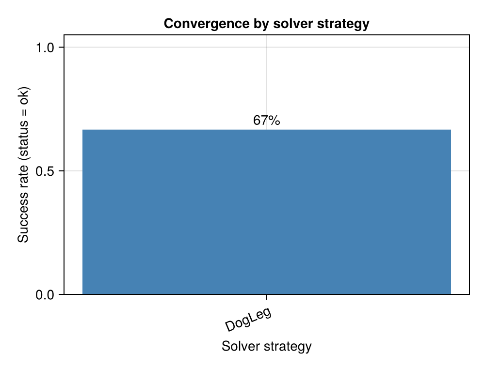
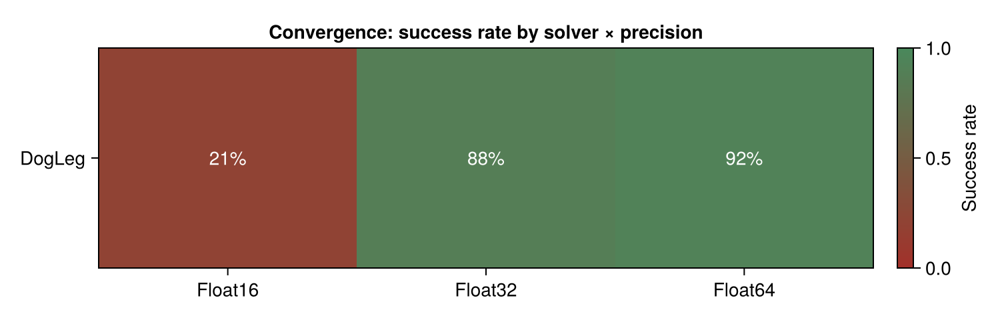
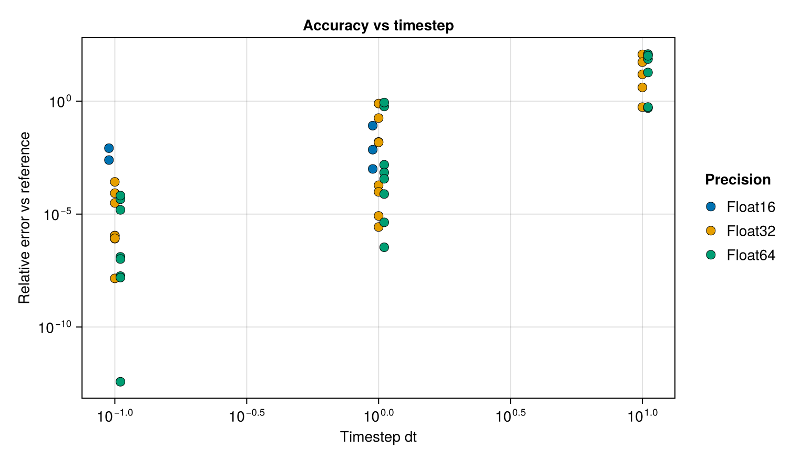
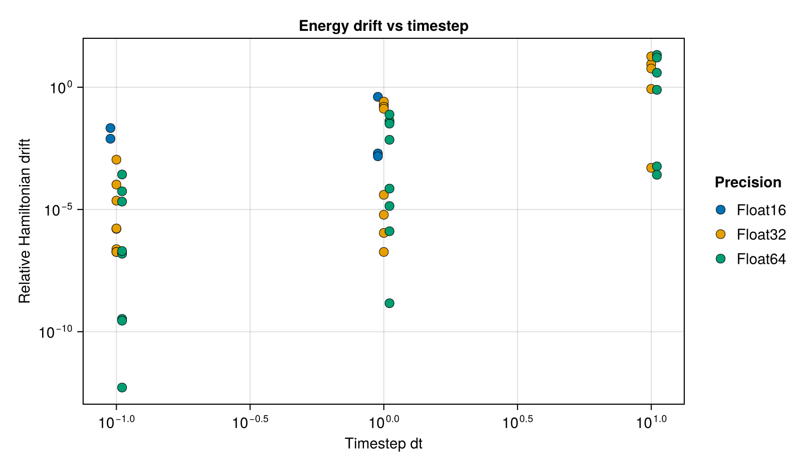
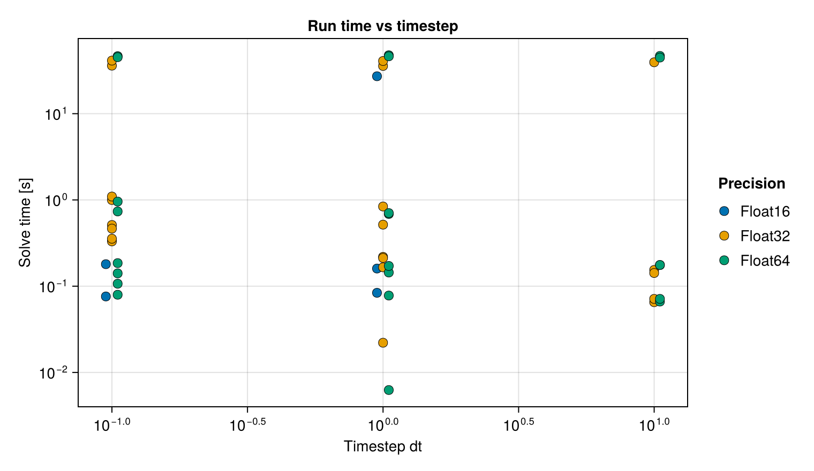
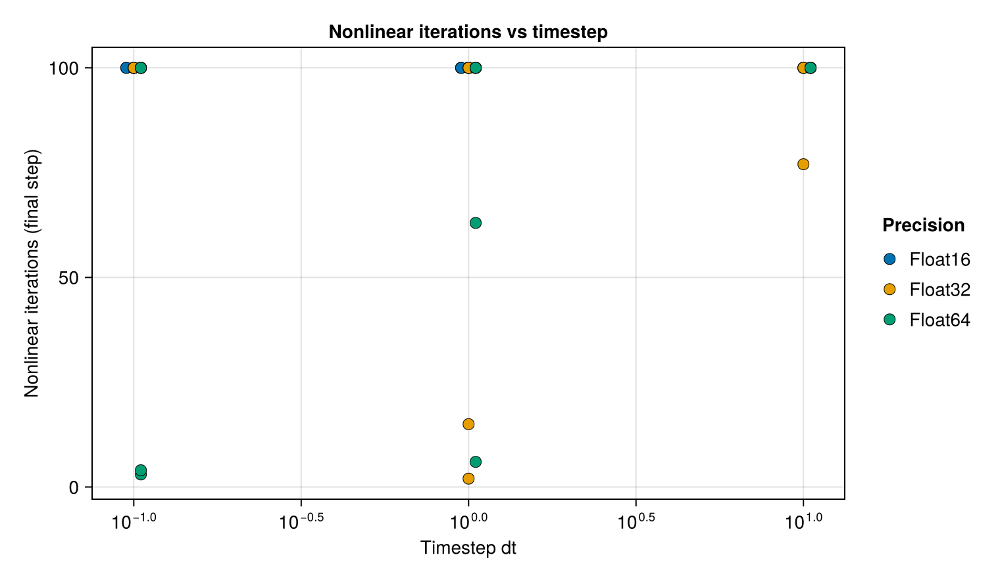

# Benchmarks

The package ships a benchmark suite (under `benchmark/`) for the one-layer GML
variational integrator `NonLinear_OneLayer_GML`. It runs each of several test
problems through a large grid of integrator configurations and records, for every case,
whether the nonlinear solve converged, how accurate the result is, how much the energy
drifts, how many nonlinear iterations it took, and how long it ran. The results are
written to CSV, summarised in a markdown report, and visualised with a set of plots.

The suite has three goals:

1. find which integrator-parameter configurations work well for each test problem;
2. identify issues in the package that are detrimental to performance;
3. identify robust solver strategies.

Three further studies target the OGA initial guess specifically:
`scripts/oga_fit_study.jl` measures seed quality on its own (no integrator, no Newton
solve), `scripts/oga_sweep.jl` runs the end-to-end harmonic-oscillator sweep over seed
variant × precision × regularization factor × activation, and
`scripts/oga_double_pendulum.jl` repeats a reduced grid on the hardest problem. They live
under `scripts/` rather than here because they study one component rather than the
integrator suite, and they are not part of the documentation build. See the *Orthogonal
Greedy Algorithm* section and `scripts/README.md`.

## What is swept

Each case integrates a problem for exactly **10 time steps**; the time span is adapted
per case as `(0, 10·dt)`. The sweep spans, per problem:

| axis | meaning |
|---|---|
| timestep `dt` | integration step size |
| precision | working floating-point type (`Float16` / `Float32` / `Float64`) |
| `R` | Gauss–Legendre quadrature order |
| `S` | number of hidden neurons (network width) |
| activation | `ReLUᵏ` (`k = 2, 3, 4`), `ELU`, `GELU`, or `tanh` |
| solver strategy | `Newton` with `Static` / `Backtracking` / `StrongWolfe` line search, or trust-region `DogLeg` |
| `λ` | Jacobian regularization (`regularization_factor`) |
| initial guess | `midpoint` (`IntegratorExtrapolation`), `Hermite` (`HermiteExtrapolation`), or `previous` (`NoExtrapolation`) |

The test problems (from
[GeometricProblems.jl](https://github.com/JuliaGNI/GeometricProblems.jl)) are the
harmonic oscillator, the pendulum (a degenerate two-component IODE — it has no
`lodeproblem`), the double pendulum, and the Toda lattice with `N = 16`.

The Toda lattice is currently **excluded from the documentation build**, though
`benchmark/run_toda_lattice.jl` still runs it on request and `full` still includes it. Its
network width has not been measured the way the other three now have (see *Network width*
below), so its residual floors above the convergence target and every `Float64` case runs its
full iteration budget: about five hours for its quick grid, against seven minutes for the
other three combined. It returns once a width has been chosen for it.

## Modes

Each per-problem run file takes a mode — `quick` (default) or `full` — from its first
command-line argument or from the `GML_BENCH_PRESET` environment variable.

| axis | `full` | `quick` |
|---|---|---|
| `dt` | 0.01, 0.1, 1.0, 10.0 | 0.1, 1.0, 10.0 |
| precision | Float16, Float32, Float64 | Float64, Float32, Float16 |
| `R` | 4, 8, 16 | 8 (16 for double pendulum) |
| `S` | 4, 6, 8 | per problem: 10 harmonic, 8 pendulum, 10 double pendulum |
| activation | ReLU², ReLU³, ReLU⁴, ELU, GELU, tanh | GELU, tanh |
| solver | Newton/{Static, Backtracking, StrongWolfe}, DogLeg | DogLeg |
| `λ` | 0.0, 1e-7, 1e-5, 1e-3, 16√eps(T) | 16√eps(T) |
| initial guess | midpoint, Hermite, previous | midpoint |
| `max_iterations` | 10000 | solver default (1000) |

`quick` is roughly 18 cases per problem (seconds to minutes each — the Toda lattice is
the slowest because of its `N = 16` state and larger network); `full` is on the order of
tens of thousands of cases per problem (hours). Results are flushed to CSV per case, so an
interrupted `full` run keeps its partial output.

The `16√eps(T)` regularization scales the Jacobian-diagonal damping with the working
precision: ≈2.4e-7 at `Float64`, ≈5.5e-3 at `Float32`, and 0.5 at `Float16`. The last is
large and tends to over-damp half precision; note, however, that at half precision the
`ReLUᵏ` basis is ill-conditioned and diverges independently of `λ`, whereas `tanh` still
converges — the accuracy limit there is the precision, not the regularization.

## Network width

`S` is set per problem rather than globally, because it decides the accuracy the ansatz can
*represent*, and therefore whether the nonlinear solve has a target it can meet at all. A
network too narrow for the trajectory floors its residual above the convergence tolerance;
the solve then iterates to its cap without ever getting there, which is a `maxiter` however
long it is given.

Measured at `Float64`/`tanh`/`DogLeg` over ten steps of `dt = 0.1`, `ref_err` against the
sweep's own `Gauss(8)` reference:

| `S` | harmonic oscillator | pendulum | double pendulum |
|---|---|---|---|
| 2 | 6.4e-05 | 3.5e-01 | 3.4e-04 |
| 4 | 2.8e-06 | 8.0e-05 | 2.4e-05 |
| 6 | 1.9e-07 | 1.4e-05 | 1.5e-06 |
| 8 | 1.9e-11 | **2.9e-07** | 5.9e-08 |
| 10 | **3.2e-14** | 5.8e-05 | **8.4e-10** |
| 12 | 4.4e-13 | 1.4e+03 | 9.3e-10 |

Three different shapes, which is why one global value will not do:

- The **harmonic oscillator** improves by eight orders of magnitude from `S = 4` to `S = 10`,
  and the iteration count collapses with it — 1000 at `S = 4`, 112 at `S = 10`, and **nine**
  at `S = 12`. Accuracy and cost improve together, because the solve stops chasing a target
  its ansatz cannot reach.
- The **pendulum** has a sharp optimum at `S = 8` and then *diverges* — `1.4e+03` at
  `S = 12`. Its `ϑ` is degenerate (`p₂ = 0`), which leaves the parameter Jacobian singular,
  and a wider network enlarges that null space. This is the one problem where
  over-parameterisation is the failure.
- The **double pendulum** falls monotonically and then flattens: the gain from `S = 10` to
  `S = 12` is nothing, so `S = 10` is where it stops.

#### The half-precision trade-off

The widths above are chosen for `Float64` accuracy, and that choice is paid for at `Float16`.
It is a deliberate trade, not an oversight, so the size of it is recorded here.

As `S` grows, `Float16` convergence *falls* while `Float64` accuracy improves. Measured on the
harmonic oscillator over the whole `quick` grid (36 cases per width, both solvers, three
timesteps, two activations):

| `S` | `Float16` converged | best `Float64` `ref_err` |
|---|---|---|
| 4 | 17 / 36 | 2.8e-06 |
| 8 | 12 / 36 | 1.9e-11 |
| 10 | **9 / 36** | **3.4e-14** |

A wider network is harder to condition in 11 bits of mantissa: more neurons means more nearly
dependent columns in the parameter Jacobian, and half precision has no digits to spare in
distinguishing them. So the same change that buys eight orders of magnitude at double precision
costs roughly half the half-precision cases.

The widths were chosen this way because accuracy is what the suite exists to report and because
`Float16` is a robustness study rather than a production precision here — the
[Orthogonal Greedy Algorithm Initial Guess](@ref) section covers half precision on its own
terms, with the seed measured directly rather than through a solve. If half-precision robustness were the
priority instead, `S` is the knob: `S = 4` nearly doubles the `Float16` success rate, at the
cost of everything in the table above.

## Metrics

For each case the suite records:

- **status** — `ok`, or a failure class: `maxiter` (the nonlinear solve exhausted
  `max_iterations` — it still returns a finite state, so this is *not* convergence and is
  counted separately, following the same rule as the OGA studies in `scripts/`),
  `singular`, `diverged`, `nonfinite`, or the short name of any other exception raised;
- **`ref_err`** — the relative max-norm error of the final state against a reference,
  which is a `Gauss(8)` integration at `Float64` using the smallest timestep in the
  sweep (over the same 10-step horizon);
- **`ham_drift`** — the maximum relative drift of the Hamiltonian over the run;
- **`iterations`** — the nonlinear-solver iteration count of the final step;
- **`total_secs`** — the wall-clock time of the run.

## Running

Instantiate the benchmark environment (it `dev`s the package):

```
julia --project=benchmark -e 'using Pkg; Pkg.develop(PackageSpec(path=pwd())); Pkg.instantiate()'
```

Run one or more problems (mode defaults to `quick`):

```
julia --project=benchmark benchmark/run_harmonic_oscillator.jl
julia --project=benchmark benchmark/run_pendulum.jl
julia --project=benchmark benchmark/run_double_pendulum.jl
julia --project=benchmark benchmark/run_toda_lattice.jl full   # full sweep
```

Each run writes `benchmark/results/<problem>_<mode>.csv`, a
`benchmark/results/<problem>_<mode>.md` report, and PNG plots. Finally, aggregate every
CSV present into a combined report:

```
julia --project=benchmark benchmark/report.jl
```

which writes `benchmark/results/onelayer_gml_benchmark.md`. The reporting step reads the
CSVs, so a report can be regenerated (or restyled) without re-running the sweep. All
`benchmark/results/` contents are git-ignored.

## Outputs

The CSV has one row per case with the columns

```
problem, T, dt, steps, R, S, activation, solver, linesearch, initial_guess,
lambda, status, ref_err, ham_drift, iterations, total_secs
```

The markdown report contains a status breakdown, convergence/robustness tables (by solver
strategy, initial-guess strategy, precision, and problem), the best configuration found
per problem, and failure hot-spots. It embeds the plots:

- **convergence** — success-rate bars per solver strategy, and a solver × precision
  heatmap (red = not converged, green = converged); the combined report also draws a
  success-rate bar per problem;
- **accuracy**, **energy drift**, **run time**, and **nonlinear iterations** — each as a
  scatter versus the timestep. A per-problem report colours the dots by precision; the
  combined report colours them by problem, so the four problems stay distinguishable.

## Results

The figures on this page are **not committed**: they are regenerated at documentation-build
time by a fresh `quick` run over the four problems (driven from `docs/make.jl`), so they
track the current package. The narrative and tables are kept as an illustrative reference
from one representative `quick` run — the numbers are not a fixed reference and may not
match the freshly generated figures exactly. That run used the `DogLeg` solver, the
`midpoint` initial guess, and the precision-scaled regularization `λ = 16√eps(T)`.

Results are organised as a summary across all problems followed by one section per problem
(harmonic oscillator, pendulum, double pendulum, Toda lattice). The summary scatters are
coloured by problem; each per-problem section shows that problem's scatters coloured by
precision.

### Summary across all problems

Across the three problems (108 cases in the representative run), 53 met the solver's
convergence criterion and a further 17 produced a finite trajectory without meeting it
(`maxiter`). The two are counted separately, and the medians below are over all 70 runs that
produced a trajectory, since a stalled run's accuracy is still measured.

| precision | cases | converged | success | measured | median `ref_err` | median `ham_drift` | median `iter` |
|---|---|---|---|---|---|---|---|
| Float16 | 36 | 9 | 25% | 9 | 1.07e-02 | 2.14e-02 | 2 |
| Float32 | 36 | 29 | 81% | 29 | 4.88e-06 | 2.05e-05 | 6 |
| Float64 | 36 | 15 | 42% | 32 | 5.22e-07 | 2.38e-06 | 1000 |

`Float32` is the most reliable column and `Float64` the most accurate — a distinction worth
keeping separate. `Float64` is judged against `f_abstol = max(8, solversize)·eps(T)` ≈ 1.8e-15,
which is a demanding target; where it is not met the run still integrates, and the median
`ref_err` of 5.2e-07 against `Float32`'s 4.9e-06 shows those runs are an order of magnitude
*more* accurate than the ones that converged. The median iteration count of 1000 in that
column is the flip side: reaching 1.8e-15 takes the whole budget when it is reachable at all.
`Float16` converges in a couple of iterations because its tolerance is 0.0078, and its
accuracy is correspondingly the worst by four orders of magnitude. Success rate and accuracy
are answering different questions.

The 25% in that `Float16` row is also *lower* than it would be with a narrower network — see
[The half-precision trade-off](@ref) for the measurement and why the widths were chosen that
way regardless.

Success rate broken down by problem, by solver strategy, and by solver × precision:






Accuracy, energy drift, run time and nonlinear-iteration counts versus the timestep, with
all four problems overlaid and **coloured by problem** (each dot is one case that produced a
trajectory, `ok` or `maxiter`). Accuracy and energy conservation degrade sharply as the
timestep grows; at `dt = 10` the 10-step horizon is far too coarse and the relative error is
`O(1)`.









The most accurate (lowest `ref_err`) configuration found for each problem, over the runs
that produced a trajectory:

| problem | best `ref_err` | T | dt | network | solver | iguess / λ |
|---|---|---|---|---|---|---|
| harmonic\_oscillator | 3.42e-14 | Float64 | 0.1 | R8 S10 tanh | DogLeg | midpoint, λ=2.4e-7 |
| pendulum | 1.77e-08 | Float64 | 0.1 | R8 S8 gelu | DogLeg | midpoint, λ=2.4e-7 |
| double\_pendulum | 8.36e-10 | Float64 | 0.1 | R16 S10 tanh | DogLeg | midpoint, λ=2.4e-7 |

All three peak at `Float64` and the smallest timestep, as expected. The `quick` preset sweeps
only `gelu` and `tanh`; the `ReLUᵏ` powers are in `full`. Outright failures — as opposed to
`maxiter` — concentrate at half precision and at the largest timestep `dt = 10`, consistent
with the accuracy plot.

### Harmonic oscillator

The simplest test problem: a single linear oscillator, and the most reliable of the three
(27 of 36 converged in the representative `quick` run). With `S = 10` it is also the most
accurate, reaching `ref_err = 3.4e-14` at `dt = 0.1` in `Float64` — and it gets there in ~100
iterations rather than exhausting the budget, because the ansatz can represent the trajectory
to below the convergence tolerance. Each dot below is a case that produced a trajectory,
coloured by precision.


### Pendulum

A *degenerate* two-component IODE (`ϑ`: `p₁ = ml²q₂`, `p₂ = 0`; it has no `lodeproblem`),
included deliberately to stress the nonlinear solve — and the one problem whose accuracy gets
*worse* with a wider network, since the degeneracy leaves the parameter Jacobian singular (see
*Network width*). At its measured optimum `S = 8` it reaches `ref_err = 1.8e-08` at
`dt = 0.1`, six orders better than the harmonic oscillator's floor but three worse than the
oscillator's own optimum.


### Double pendulum

A four-dimensional chaotic system, and the hardest of the three: it accounts for every
`singular` case in the representative run and has the lowest convergence rate (9 of 36).
Quick mode uses a larger quadrature order and network (`R = 16`, `S = 10`) than the two simple
problems; `tanh` gives the best accuracy here, `ref_err = 8.4e-10` at `dt = 0.1` in Float64.


### Toda lattice (N = 16)

The largest problem, with a 16-dimensional state and a correspondingly larger network. It is
**not part of the documentation build**, so no figures are generated for it here.

Its network width has not been measured the way the other three have, and the consequence is
not merely a slower run: with a width too narrow for the trajectory, the residual floors above
the convergence tolerance and every `Float64` case exhausts its iteration budget. That puts its
quick grid at roughly five hours against seven minutes for the other three combined, which is
why it is excluded rather than capped — an iteration cap would hide the cause instead of fixing
it.

To run it:

```
julia --project=benchmark benchmark/run_toda_lattice.jl quick
```

It is also included in `full`. Once a width has been chosen for it — the same measurement as
in *Network width* above — it returns to this page.

## Extending

To add a problem, copy one of the `run_*.jl` files and supply a `build_prob(T, timespan,
timestep)` closure returning an `AbstractProblemIODE` at element type `T`, plus a
`hamiltonian(t, q, p, params)` closure; then call `run_sweep`. Per-problem axis overrides
(as the double pendulum and Toda lattice use for `R` and `S`) are passed as the `Rs` /
`Ss` keyword arguments to `run_sweep`. The shared engine, presets, and reporting live in
`benchmark/gml_benchmark_common.jl` and `benchmark/gml_report.jl`.
