# ShallowNet

`ShallowNet` is the baseline single-hidden-layer neural variational integrator. It uses **symbolic derivatives** (pre-compiled via `SymbolicNeuralNetworks.jl`) to form the variational conditions, and an OGA seed (`OGA1d`) for the Newton initialization. Both `ReLUᵏ` and `tanh` activations are supported.

## Running the Parameter Scan

The parameter grid (`h`, `λ`, `f_abstol`, `x_suctol`, solver, and `dtype`) is configured at the top of `parallel_run.sh`:

```bash
# In parallel_run.sh:
INTEGRATOR="shallownet"
DP_FLAG=""             # set to "--double-pendulum" to include double pendulum

bash parallel_run.sh
```

The following results are based on the configurations in the above bash file:
```bash
# ── Configuration ─────────────────────────────────────────────────────────────
INTEGRATOR="shallownet"   # change to target integrator

DP_FLAG=""                # set to "--double-pendulum" to include DP problems
MAX_JOBS=${MAX_JOBS:-12}   # maximum number of Julia processes running simultaneously

# Neural integrator parameter grid
H_LIST="0.05 0.1 0.2 0.5 1.0" # 
REG_LIST="0.0 1e-3 1e-5 1e-7" # 
FABS_LIST="0.0" # 0.0 2.0 8.0
XSUC_LIST="2.0" # 0.0 2.0 8.0
SOLVER_LIST="backtracking dogleg" # static strongwolfe dogleg
DTYPE_LIST="Float64" #Float16 Float32
INT_TIMESPAN="100.0"
R_LIST="4 8 16"   # quadrature points
S_LIST="4 6 8"    # hidden neurons
K_LIST="2 3 4"    # ReLU exponent
```

After all jobs complete, generate the summary figures and error tables:

```bash
julia --project=scripts scripts/result_summary_shallownet.jl
```

Results are written to `docs/src/nvi/figures/`.


## Harmonic Oscillator Results

### ReLU Activation


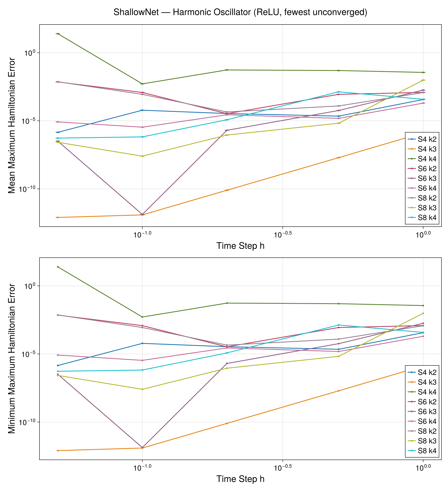

<!-- HO_RELU_TABLE_START -->

## ShallowNet HO — ReLU

### h = 0.05

<table>
<thead><tr><th></th><th>S = 4</th><th>S = 6</th><th>S = 8</th><th>S = 10</th><th>S = 12</th><th>S = 16</th></tr></thead>
<tbody>
<tr><th>k = 2</th><td><table style="width:100%"><tr><td style="text-align:center;vertical-align:top;width:50%"><strong>Min-Max Error: 7.003e-09</strong><br/>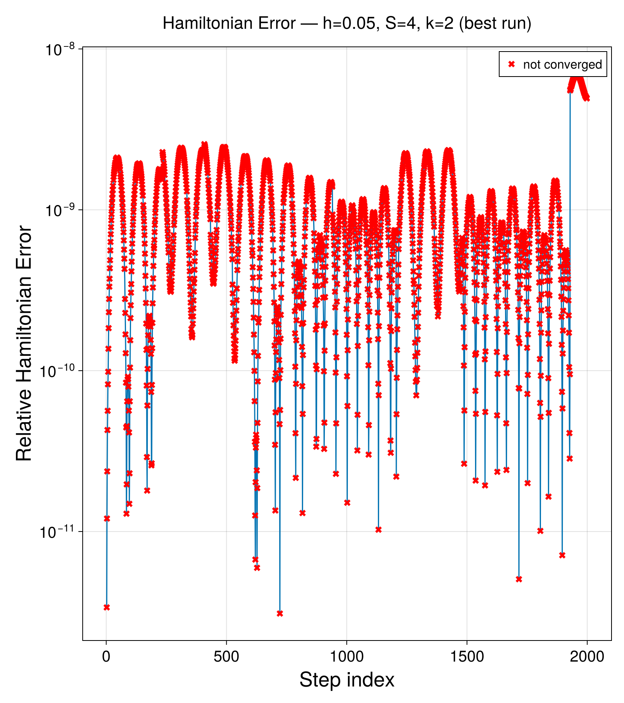<br/><small>S=4 · R=4 · k=2 · λ=0.0 · f_abs=-2.220446049250313e-16 · x_suc=-2.220446049250313e-16 · backtracking · Float64<br/>Unconverged: 92.9%</small></td><td style="text-align:center;vertical-align:top;width:50%"><strong>Fewest Unconverged Run — Error: 1.105e-05</strong><br/>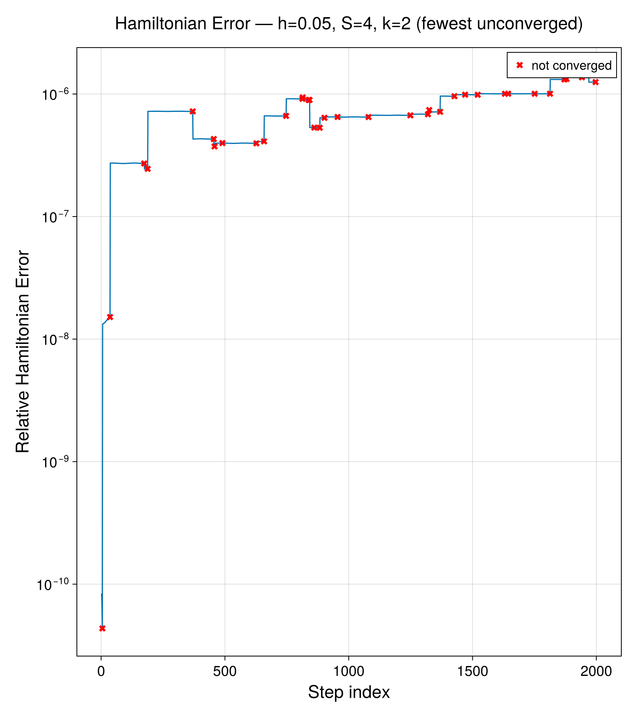<br/><small>S=4 · R=4 · k=2 · λ=1.0e-7 · f_abs=-2.220446049250313e-16 · x_suc=-2.220446049250313e-16 · dogleg · Float64<br/>Unconverged: 1.1%</small></td></tr></table></td><td><table style="width:100%"><tr><td style="text-align:center;vertical-align:top;width:50%"><strong>Min-Max Error: 1.171e-05</strong><br/>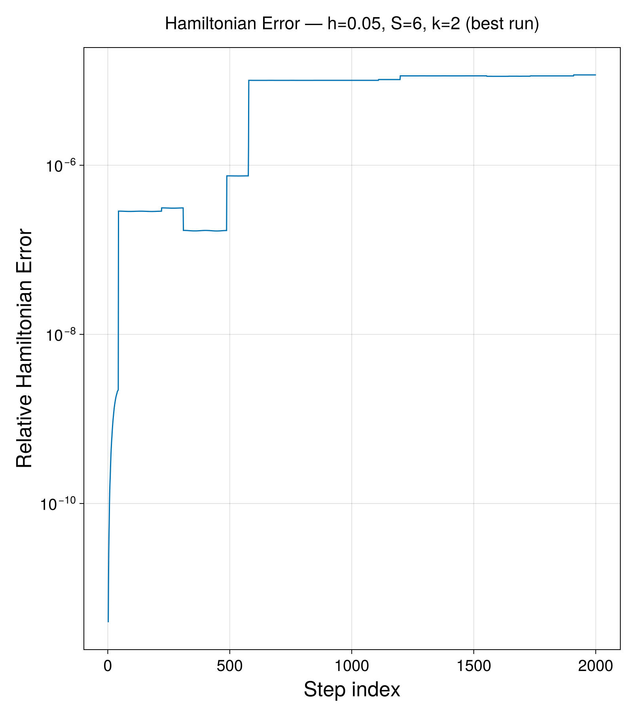<br/><small>S=6 · R=16 · k=2 · λ=0.0 · f_abs=0.0 · x_suc=4.440892098500626e-16 · backtracking · Float64<br/>Unconverged: n/a</small></td><td style="text-align:center;vertical-align:top;width:50%"><strong>Fewest Unconverged Run — Error: 7.112e-03</strong><br/>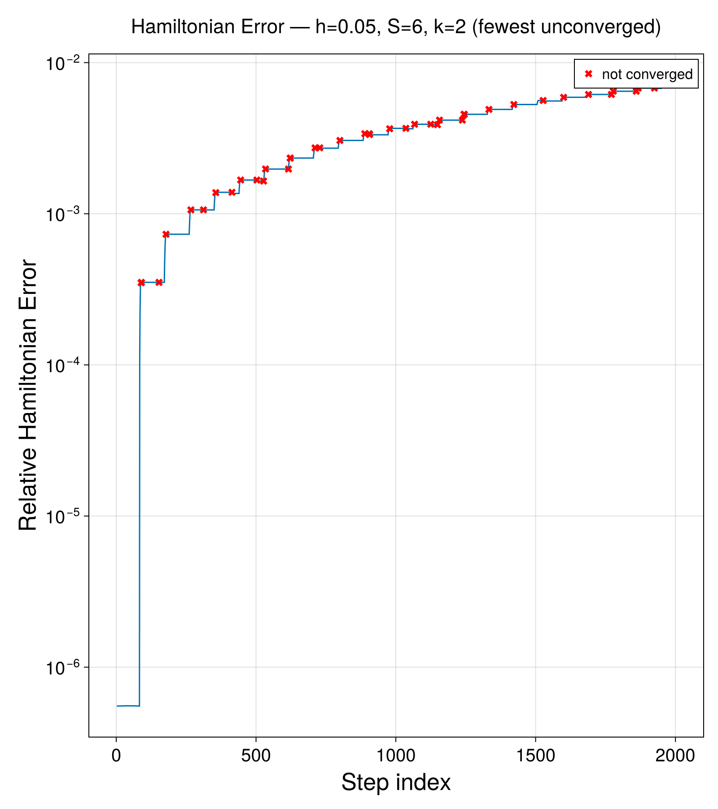<br/><small>S=6 · R=4 · k=2 · λ=1.0e-5 · f_abs=0.0 · x_suc=4.440892098500626e-16 · dogleg · Float64<br/>Unconverged: 2.1%</small></td></tr></table></td><td><table style="width:100%"><tr><td style="text-align:center;vertical-align:top;width:50%"><strong>Min-Max Error: 1.616e-06</strong><br/>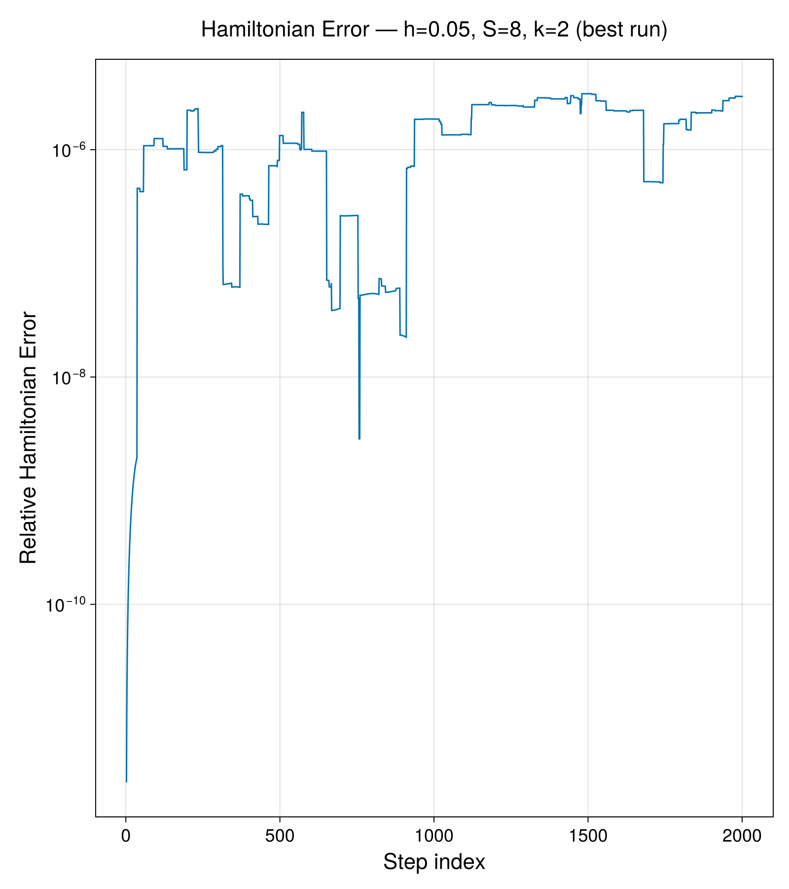<br/><small>S=8 · R=8 · k=2 · λ=0.0 · f_abs=-2.220446049250313e-16 · x_suc=-2.220446049250313e-16 · dogleg · Float64<br/>Unconverged: 97.9%</small></td><td style="text-align:center;vertical-align:top;width:50%"><strong>Fewest Unconverged Run — Error: 2.412e-04</strong><br/>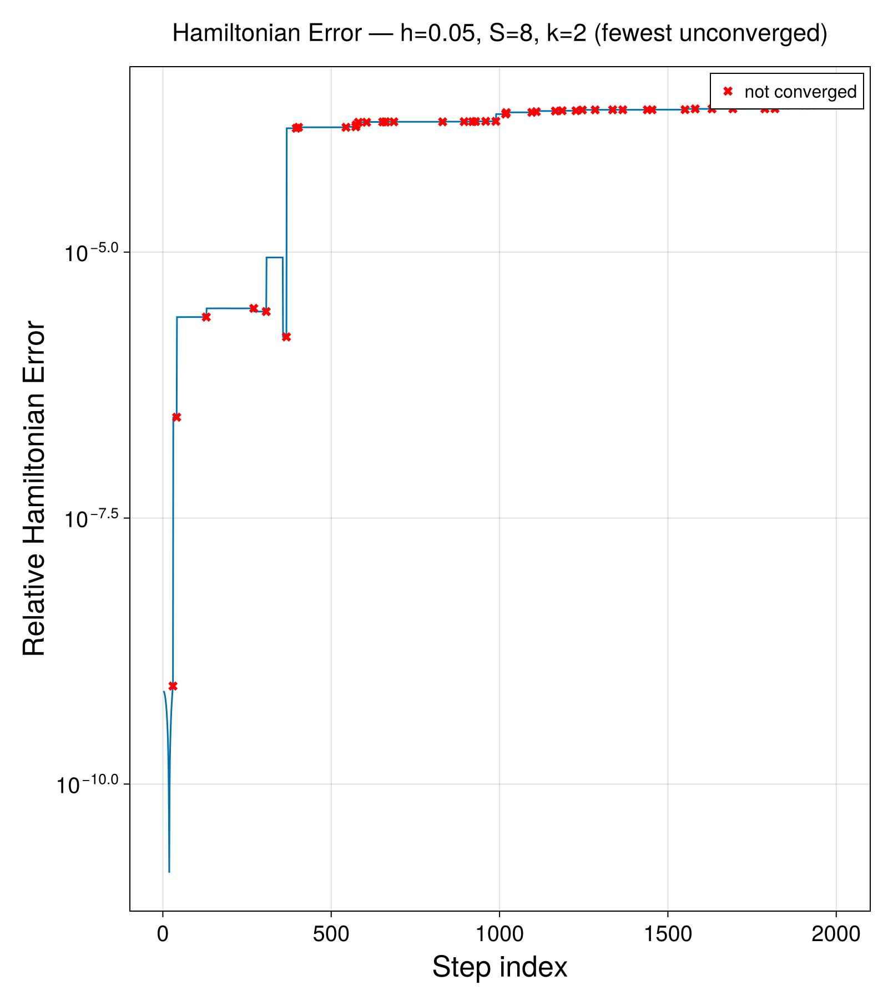<br/><small>S=8 · R=4 · k=2 · λ=1.0e-7 · f_abs=-2.220446049250313e-16 · x_suc=-2.220446049250313e-16 · dogleg · Float64<br/>Unconverged: 2.3%</small></td></tr></table></td><td><table style="width:100%"><tr><td style="text-align:center;vertical-align:top;width:50%"><strong>Min-Max Error: 1.810e-06</strong><br/>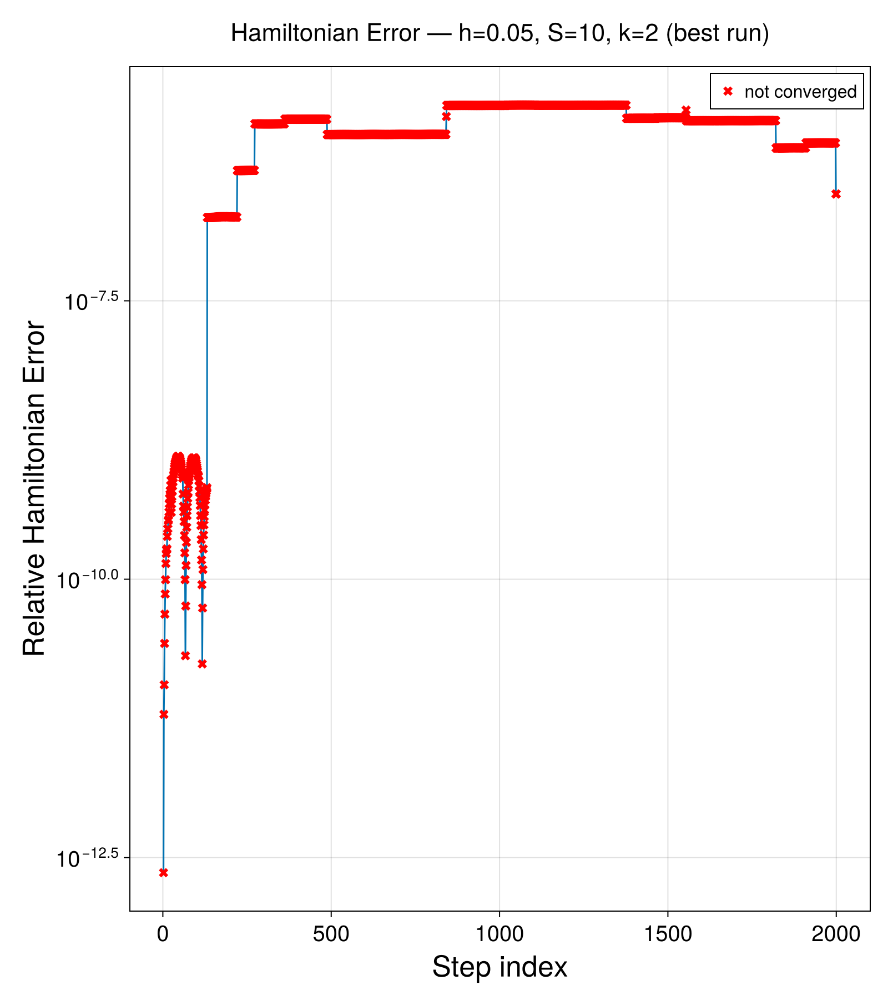<br/><small>S=10 · R=16 · k=2 · λ=0.0 · f_abs=-2.220446049250313e-16 · x_suc=-2.220446049250313e-16 · dogleg · Float64<br/>Unconverged: 99.7%</small></td><td style="text-align:center;vertical-align:top;width:50%"><strong>Fewest Unconverged Run — Error: 1.629e-04</strong><br/>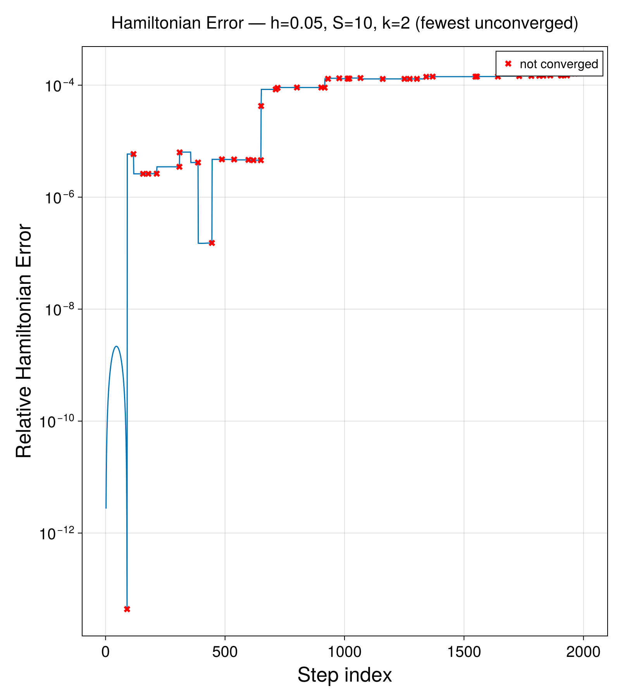<br/><small>S=10 · R=4 · k=2 · λ=1.0e-7 · f_abs=-2.220446049250313e-16 · x_suc=-2.220446049250313e-16 · dogleg · Float64<br/>Unconverged: 2.2%</small></td></tr></table></td><td><table style="width:100%"><tr><td style="text-align:center;vertical-align:top;width:50%"><strong>Min-Max Error: 3.776e-07</strong><br/>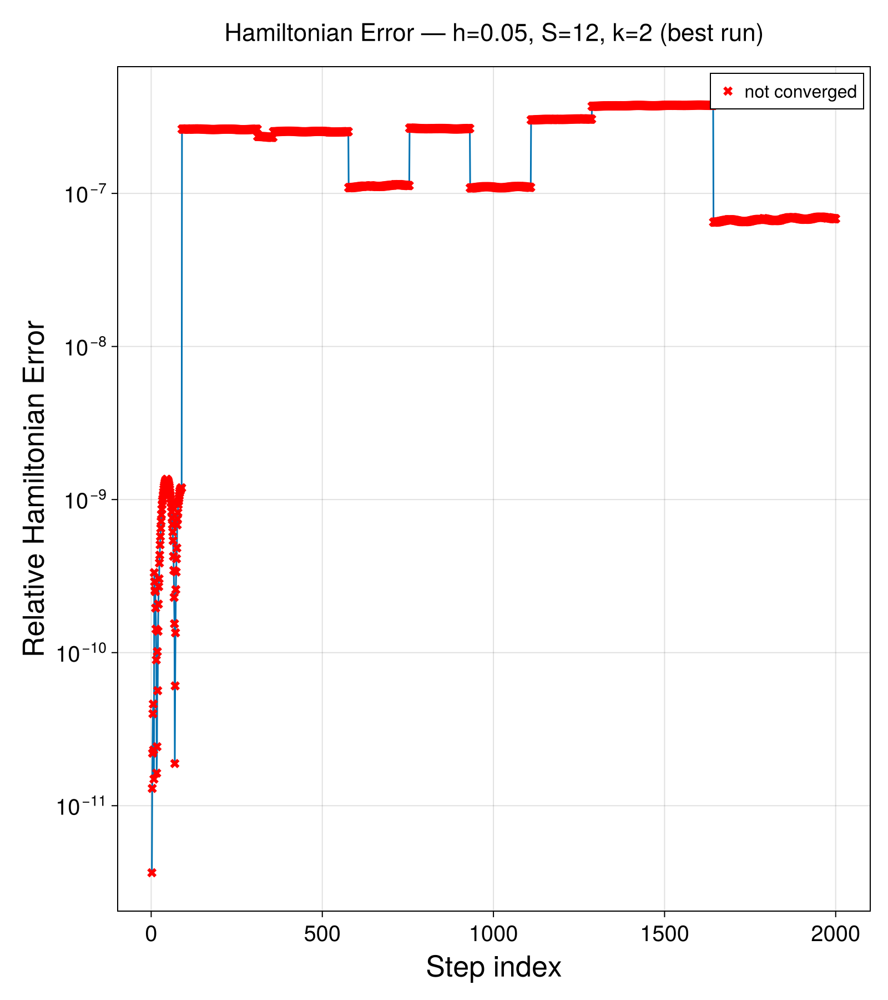<br/><small>S=12 · R=16 · k=2 · λ=0.0 · f_abs=-2.220446049250313e-16 · x_suc=-2.220446049250313e-16 · dogleg · Float64<br/>Unconverged: 99.8%</small></td><td style="text-align:center;vertical-align:top;width:50%"><strong>Fewest Unconverged Run — Error: 3.121e-04</strong><br/>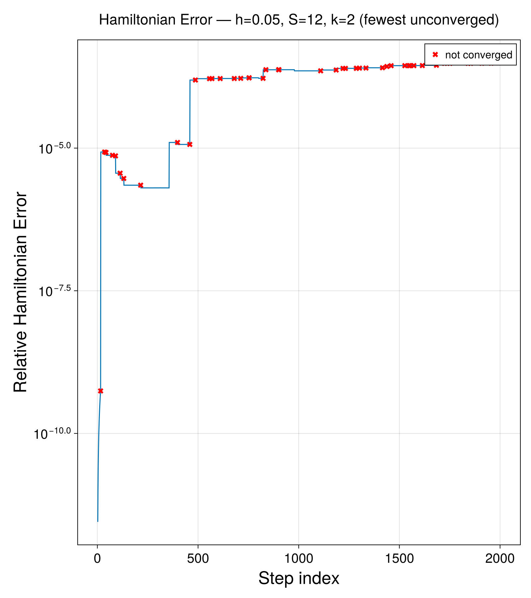<br/><small>S=12 · R=4 · k=2 · λ=1.0e-7 · f_abs=-2.220446049250313e-16 · x_suc=-2.220446049250313e-16 · dogleg · Float64<br/>Unconverged: 2.3%</small></td></tr></table></td><td><table style="width:100%"><tr><td style="text-align:center;vertical-align:top;width:50%"><strong>Min-Max Error: 8.275e-07</strong><br/>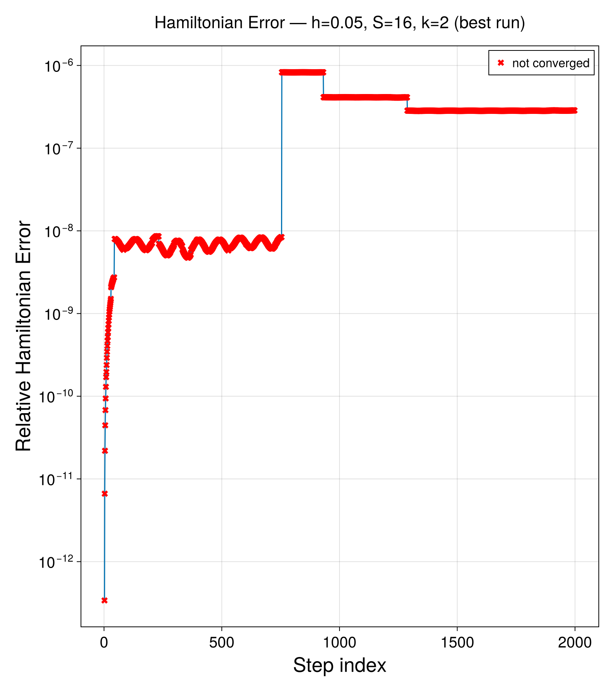<br/><small>S=16 · R=4 · k=2 · λ=0.0 · f_abs=-2.220446049250313e-16 · x_suc=-2.220446049250313e-16 · backtracking · Float64<br/>Unconverged: 98.2%</small></td><td style="text-align:center;vertical-align:top;width:50%"><strong>Fewest Unconverged Run — Error: 4.108e-05</strong><br/>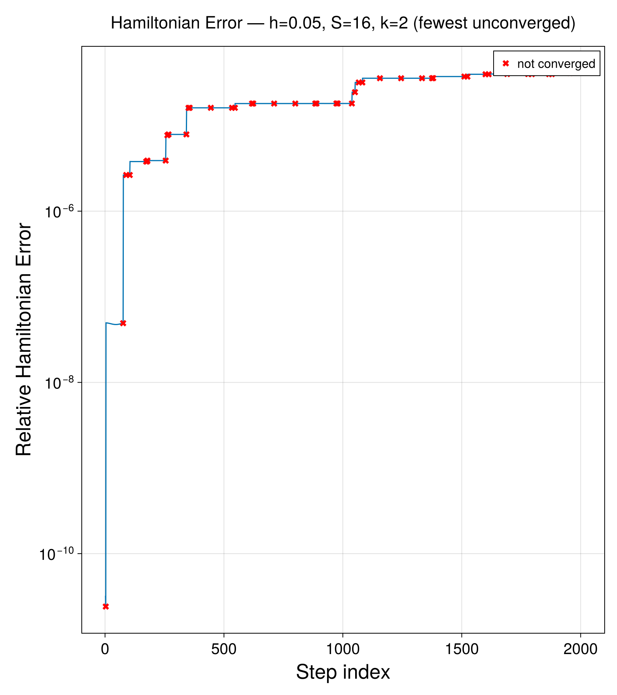<br/><small>S=16 · R=16 · k=2 · λ=1.0e-7 · f_abs=-2.220446049250313e-16 · x_suc=-2.220446049250313e-16 · dogleg · Float64<br/>Unconverged: 2.2%</small></td></tr></table></td></tr>
<tr><th>k = 3</th><td><table style="width:100%"><tr><td style="text-align:center;vertical-align:top;width:50%"><strong>Min-Max Error: 5.753e-13</strong><br/><br/><small>S=4 · R=4 · k=3 · λ=0.001 · f_abs=-2.220446049250313e-16 · x_suc=-2.220446049250313e-16 · dogleg · Float64<br/>Unconverged: 3.2%</small></td><td style="text-align:center;vertical-align:top;width:50%"><strong>Fewest Unconverged Run — Error: 7.415e-13</strong><br/>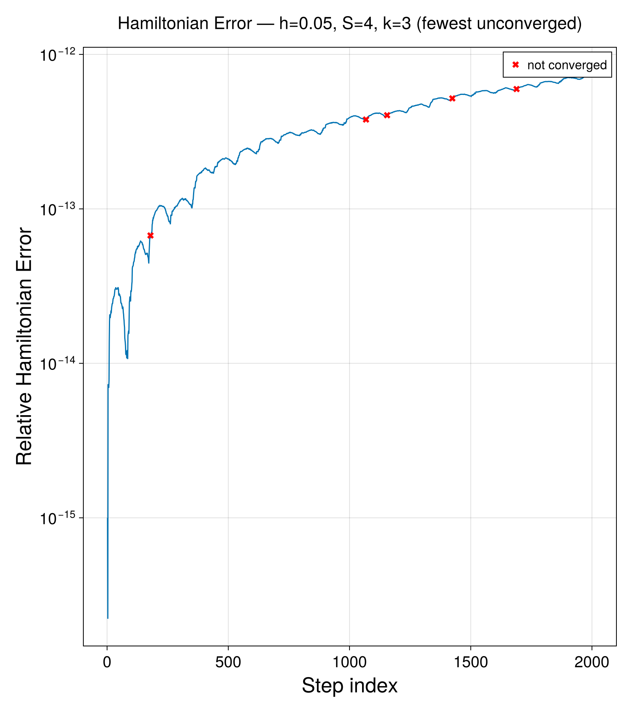<br/><small>S=4 · R=16 · k=3 · λ=1.0e-7 · f_abs=-2.220446049250313e-16 · x_suc=-2.220446049250313e-16 · dogleg · Float64<br/>Unconverged: 0.2%</small></td></tr></table></td><td><table style="width:100%"><tr><td style="text-align:center;vertical-align:top;width:50%"><strong>Min-Max Error: 1.011e-08</strong><br/><br/><small>S=6 · R=16 · k=3 · λ=0.0 · f_abs=-2.220446049250313e-16 · x_suc=-2.220446049250313e-16 · dogleg · Float64<br/>Unconverged: 100.0%</small></td><td style="text-align:center;vertical-align:top;width:50%"><strong>Fewest Unconverged Run — Error: 3.228e-07</strong><br/>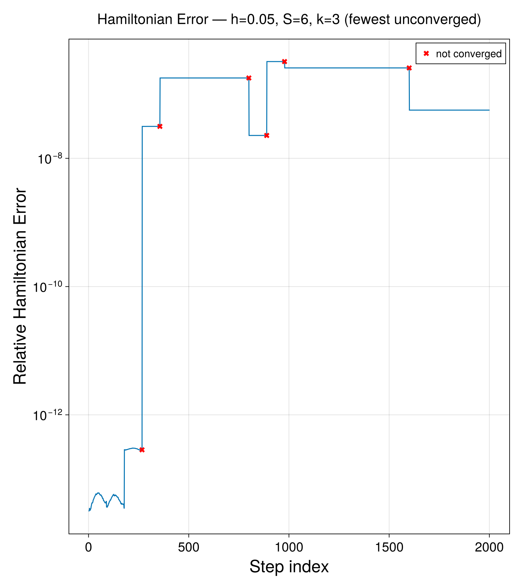<br/><small>S=6 · R=4 · k=3 · λ=1.0e-7 · f_abs=-2.220446049250313e-16 · x_suc=-2.220446049250313e-16 · dogleg · Float64<br/>Unconverged: 0.2%</small></td></tr></table></td><td><table style="width:100%"><tr><td style="text-align:center;vertical-align:top;width:50%"><strong>Min-Max Error: 1.281e-08</strong><br/><br/><small>S=8 · R=16 · k=3 · λ=0.0 · f_abs=-2.220446049250313e-16 · x_suc=-2.220446049250313e-16 · dogleg · Float64<br/>Unconverged: 100.0%</small></td><td style="text-align:center;vertical-align:top;width:50%"><strong>Fewest Unconverged Run — Error: 2.642e-07</strong><br/>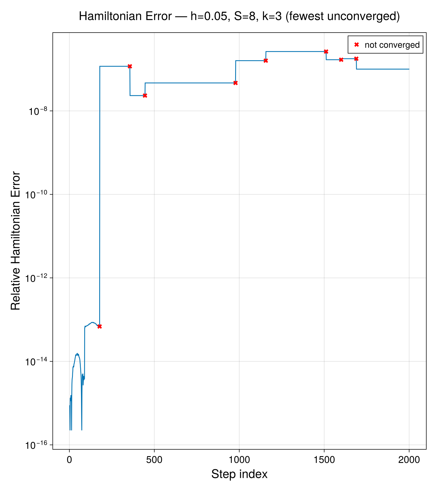<br/><small>S=8 · R=4 · k=3 · λ=1.0e-7 · f_abs=0.0 · x_suc=4.440892098500626e-16 · dogleg · Float64<br/>Unconverged: 0.4%</small></td></tr></table></td><td><table style="width:100%"><tr><td style="text-align:center;vertical-align:top;width:50%"><strong>Min-Max Error: 9.321e-09</strong><br/>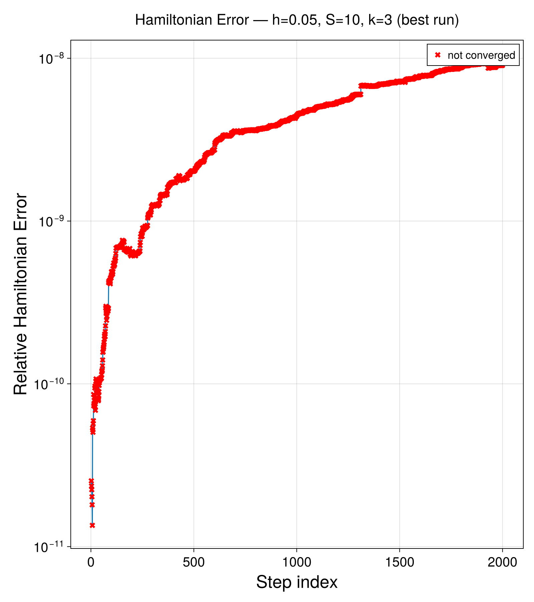<br/><small>S=10 · R=16 · k=3 · λ=0.0 · f_abs=-2.220446049250313e-16 · x_suc=-2.220446049250313e-16 · dogleg · Float64<br/>Unconverged: 100.0%</small></td><td style="text-align:center;vertical-align:top;width:50%"><strong>Fewest Unconverged Run — Error: 4.307e-07</strong><br/>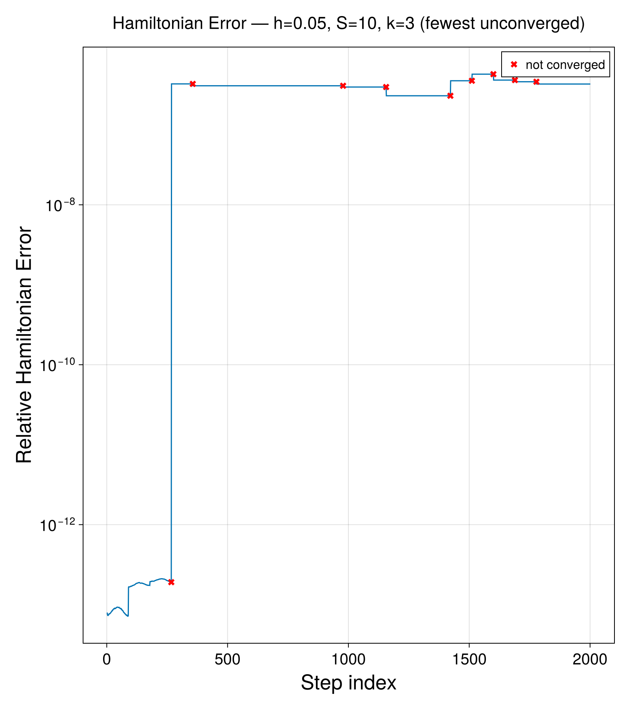<br/><small>S=10 · R=4 · k=3 · λ=1.0e-7 · f_abs=-2.220446049250313e-16 · x_suc=-2.220446049250313e-16 · dogleg · Float64<br/>Unconverged: 0.4%</small></td></tr></table></td><td><table style="width:100%"><tr><td style="text-align:center;vertical-align:top;width:50%"><strong>Min-Max Error: 9.716e-09</strong><br/>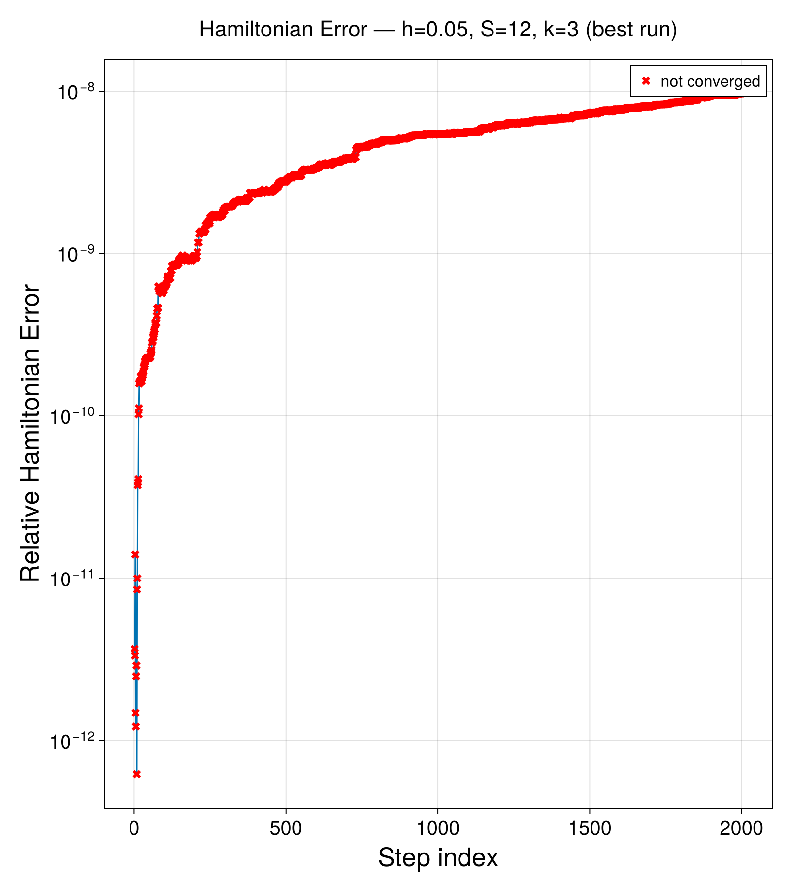<br/><small>S=12 · R=16 · k=3 · λ=0.0 · f_abs=-2.220446049250313e-16 · x_suc=-2.220446049250313e-16 · dogleg · Float64<br/>Unconverged: 100.0%</small></td><td style="text-align:center;vertical-align:top;width:50%"><strong>Fewest Unconverged Run — Error: 5.985e-07</strong><br/>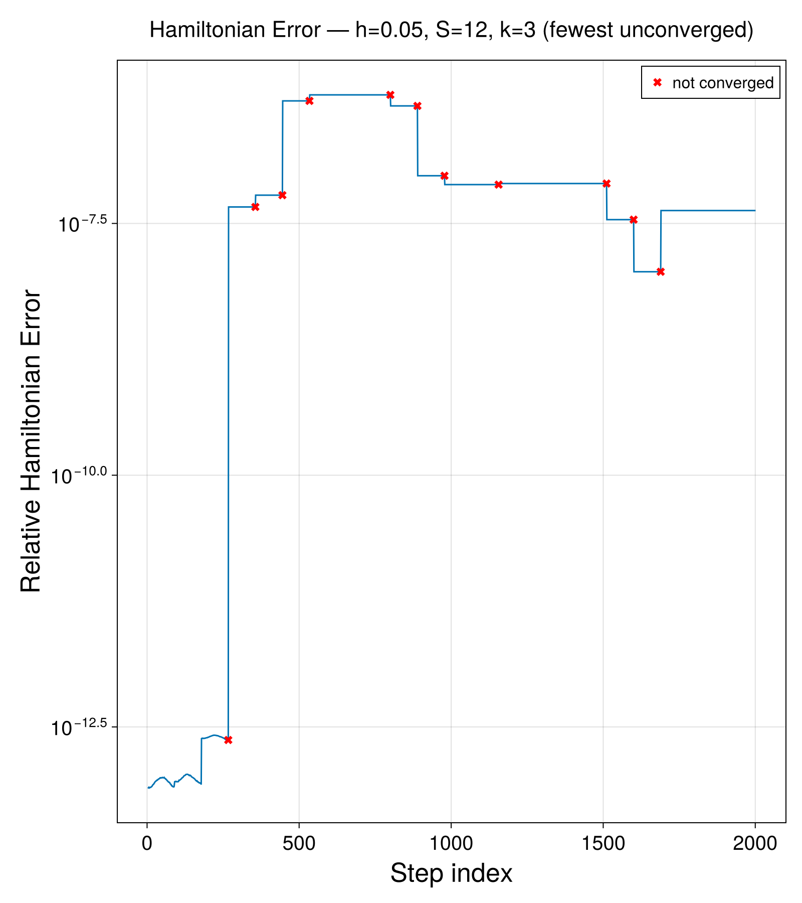<br/><small>S=12 · R=4 · k=3 · λ=1.0e-7 · f_abs=-2.220446049250313e-16 · x_suc=-2.220446049250313e-16 · dogleg · Float64<br/>Unconverged: 0.5%</small></td></tr></table></td><td><table style="width:100%"><tr><td style="text-align:center;vertical-align:top;width:50%"><strong>Min-Max Error: 1.453e-08</strong><br/>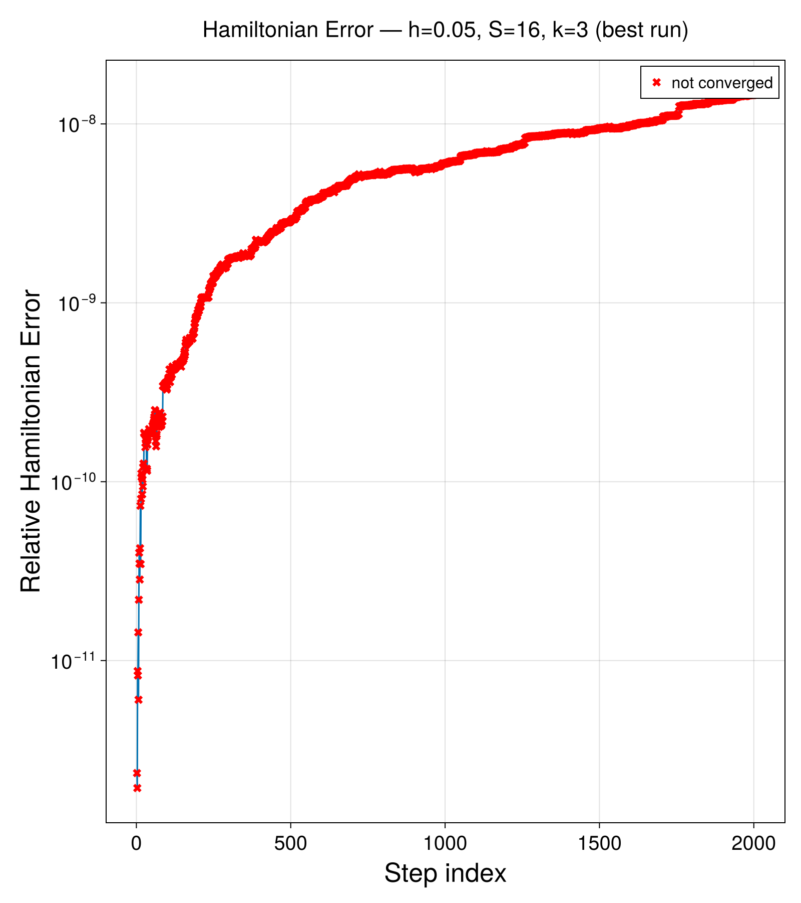<br/><small>S=16 · R=4 · k=3 · λ=0.0 · f_abs=-2.220446049250313e-16 · x_suc=-2.220446049250313e-16 · backtracking · Float64<br/>Unconverged: 100.0%</small></td><td style="text-align:center;vertical-align:top;width:50%"><strong>Fewest Unconverged Run — Error: 7.093e-07</strong><br/>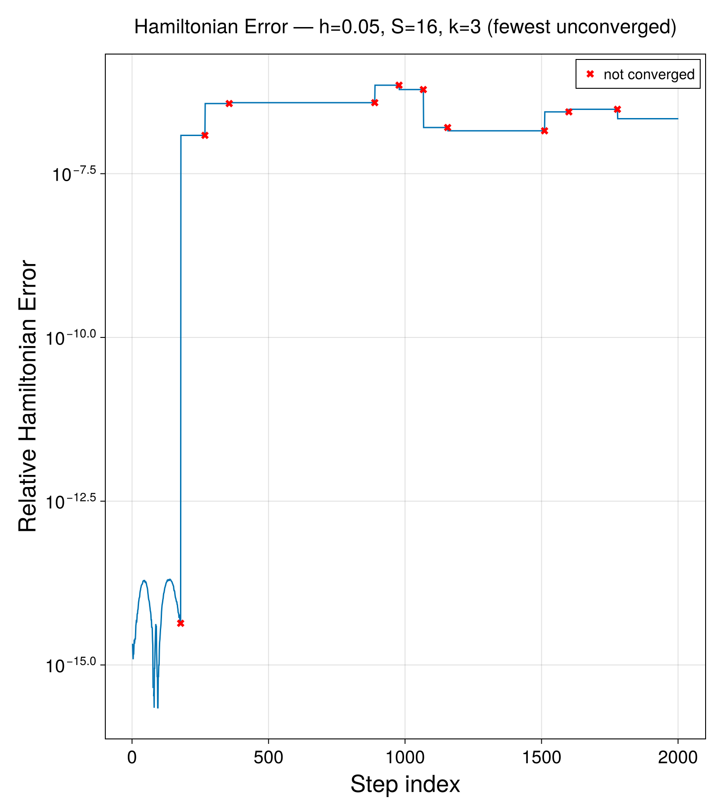<br/><small>S=16 · R=4 · k=3 · λ=1.0e-7 · f_abs=-2.220446049250313e-16 · x_suc=-2.220446049250313e-16 · dogleg · Float64<br/>Unconverged: 0.5%</small></td></tr></table></td></tr>
<tr><th>k = 4</th><td><table style="width:100%"><tr><td style="text-align:center;vertical-align:top;width:50%"><strong>Min-Max Error: 1.740e-02</strong><br/><br/><small>S=4 · R=8 · k=4 · λ=0.001 · f_abs=-2.220446049250313e-16 · x_suc=-2.220446049250313e-16 · dogleg · Float64<br/>Unconverged: 100.0%</small></td><td style="text-align:center;vertical-align:top;width:50%"><strong>Fewest Unconverged Run — Error: 2.489e+01</strong><br/>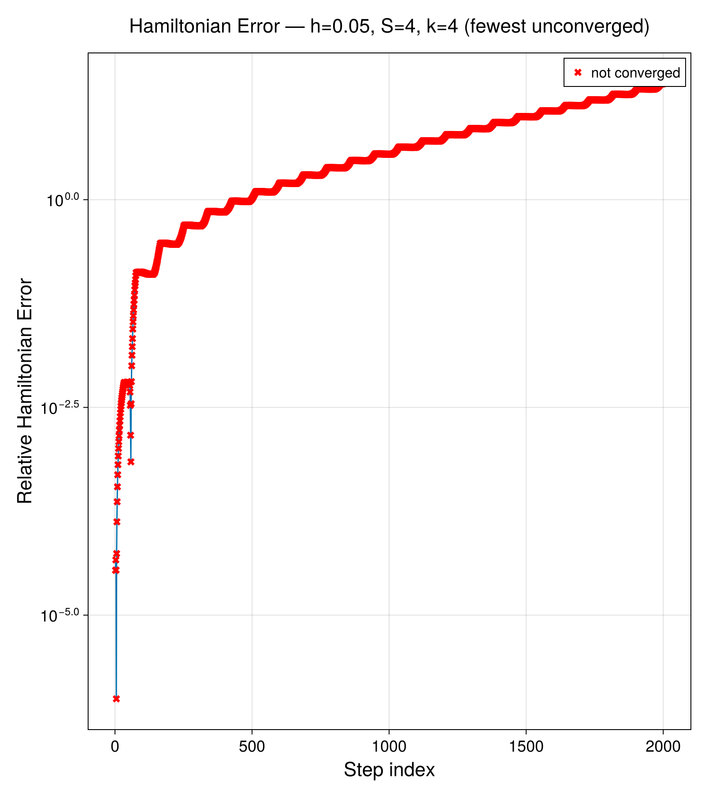<br/><small>S=4 · R=16 · k=4 · λ=1.0e-7 · f_abs=-2.220446049250313e-16 · x_suc=-2.220446049250313e-16 · backtracking · Float64<br/>Unconverged: 99.9%</small></td></tr></table></td><td><table style="width:100%"><tr><td style="text-align:center;vertical-align:top;width:50%"><strong>Min-Max Error: 3.734e-08</strong><br/><br/><small>S=6 · R=16 · k=4 · λ=0.001 · f_abs=-2.220446049250313e-16 · x_suc=-2.220446049250313e-16 · backtracking · Float64<br/>Unconverged: 100.0%</small></td><td style="text-align:center;vertical-align:top;width:50%"><strong>Fewest Unconverged Run — Error: 8.285e-06</strong><br/>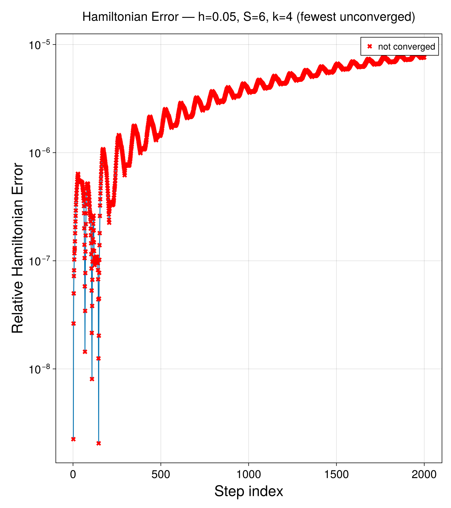<br/><small>S=6 · R=8 · k=4 · λ=1.0e-7 · f_abs=-2.220446049250313e-16 · x_suc=-2.220446049250313e-16 · dogleg · Float64<br/>Unconverged: 100.0%</small></td></tr></table></td><td><table style="width:100%"><tr><td style="text-align:center;vertical-align:top;width:50%"><strong>Min-Max Error: 5.355e-07</strong><br/><br/><small>S=8 · R=8 · k=4 · λ=1.0e-5 · f_abs=-2.220446049250313e-16 · x_suc=-2.220446049250313e-16 · backtracking · Float64<br/>Unconverged: 100.0%</small></td><td style="text-align:center;vertical-align:top;width:50%"><strong>Fewest Unconverged Run — Error: 5.355e-07</strong><br/>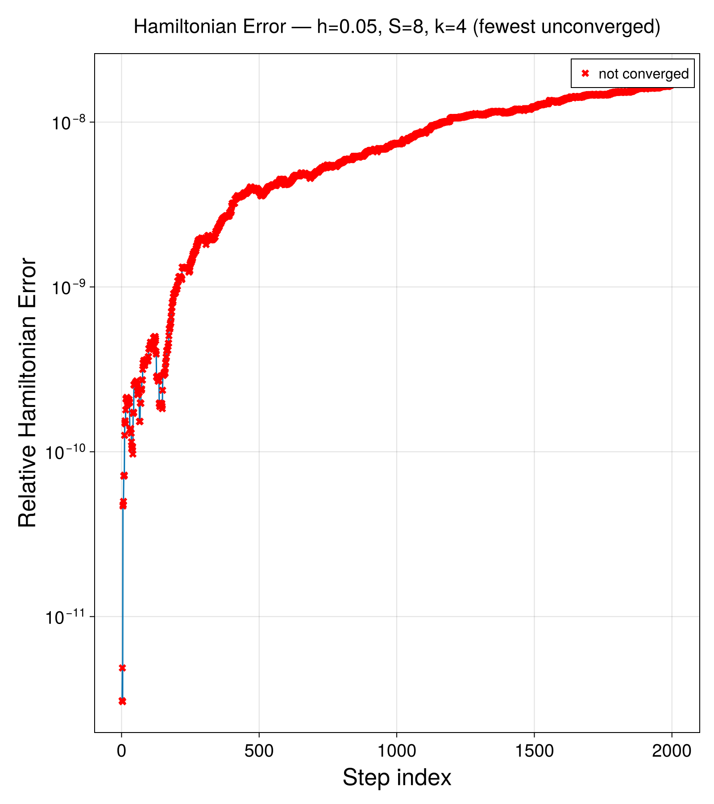<br/><small>S=8 · R=8 · k=4 · λ=1.0e-5 · f_abs=-2.220446049250313e-16 · x_suc=-2.220446049250313e-16 · backtracking · Float64<br/>Unconverged: 100.0%</small></td></tr></table></td><td><table style="width:100%"><tr><td style="text-align:center;vertical-align:top;width:50%"><strong>Min-Max Error: 1.918e-07</strong><br/>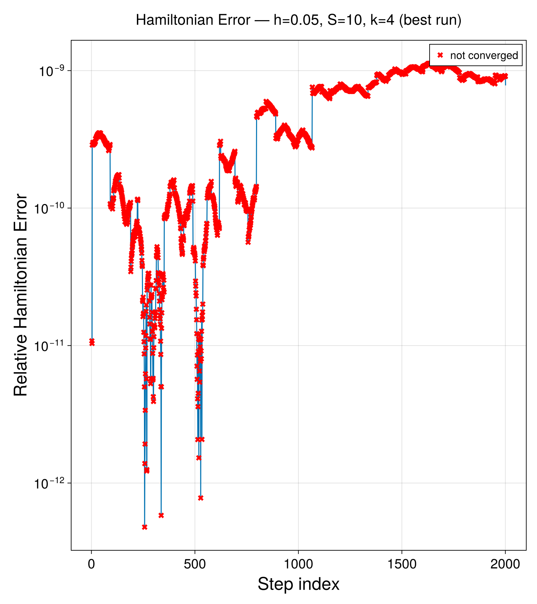<br/><small>S=10 · R=4 · k=4 · λ=0.0 · f_abs=-2.220446049250313e-16 · x_suc=-2.220446049250313e-16 · backtracking · Float64<br/>Unconverged: 100.0%</small></td><td style="text-align:center;vertical-align:top;width:50%"><strong>Fewest Unconverged Run — Error: 1.918e-07</strong><br/>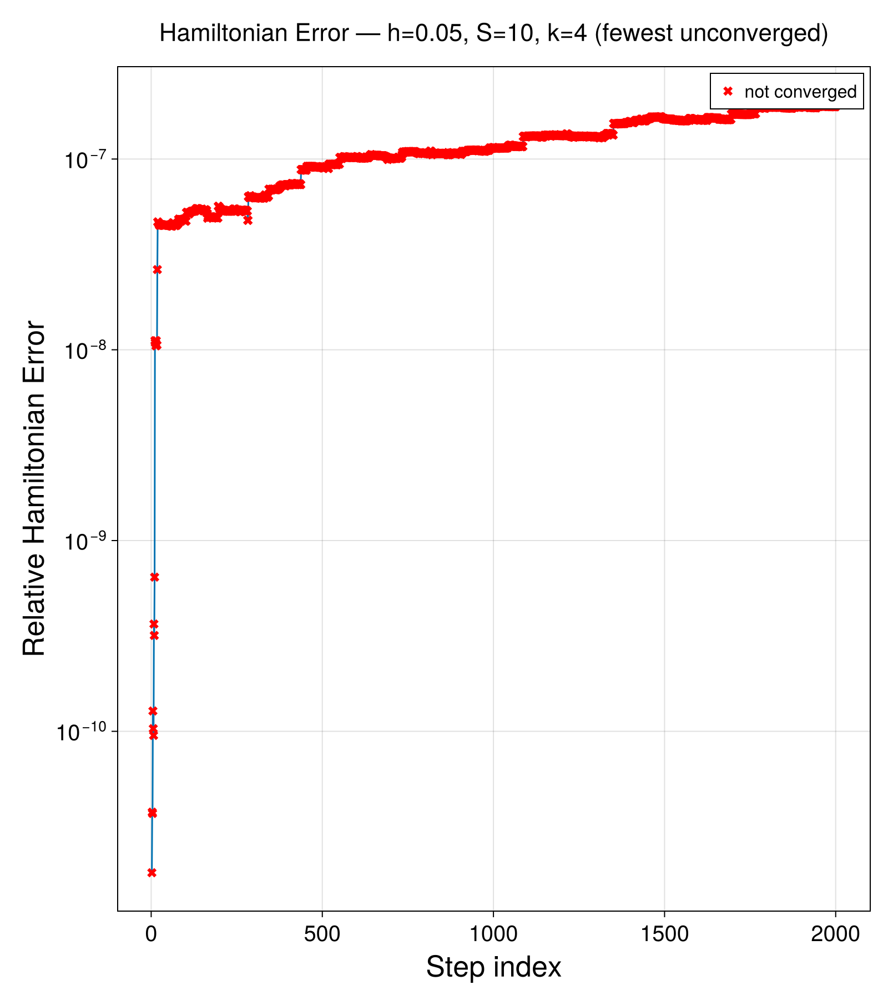<br/><small>S=10 · R=4 · k=4 · λ=0.0 · f_abs=-2.220446049250313e-16 · x_suc=-2.220446049250313e-16 · backtracking · Float64<br/>Unconverged: 100.0%</small></td></tr></table></td><td><table style="width:100%"><tr><td style="text-align:center;vertical-align:top;width:50%"><strong>Min-Max Error: 1.248e-07</strong><br/>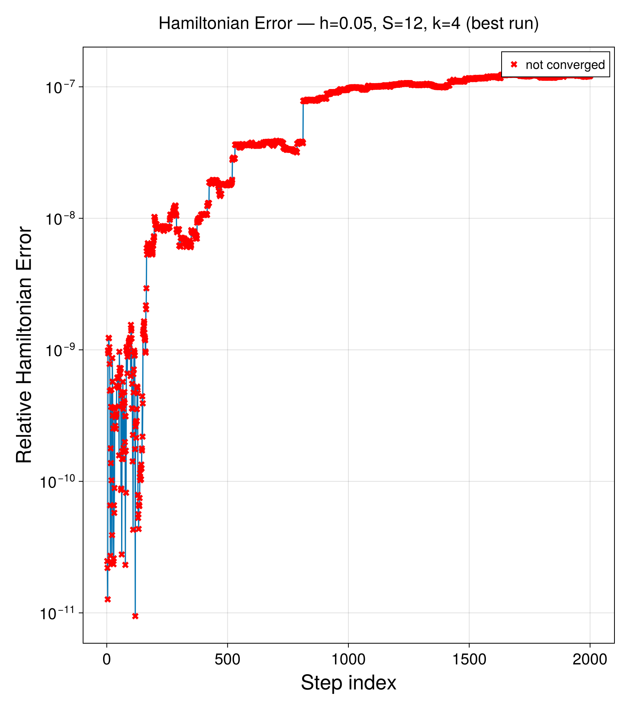<br/><small>S=12 · R=4 · k=4 · λ=0.0 · f_abs=-2.220446049250313e-16 · x_suc=-2.220446049250313e-16 · backtracking · Float64<br/>Unconverged: 100.0%</small></td><td style="text-align:center;vertical-align:top;width:50%"><strong>Fewest Unconverged Run — Error: 1.248e-07</strong><br/>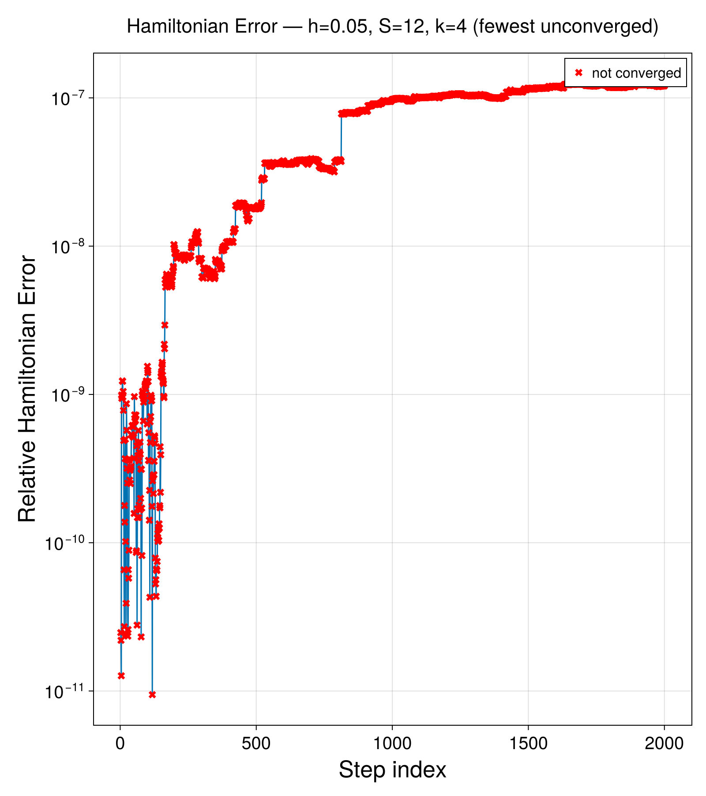<br/><small>S=12 · R=4 · k=4 · λ=0.0 · f_abs=-2.220446049250313e-16 · x_suc=-2.220446049250313e-16 · backtracking · Float64<br/>Unconverged: 100.0%</small></td></tr></table></td><td><table style="width:100%"><tr><td style="text-align:center;vertical-align:top;width:50%"><strong>Min-Max Error: 1.374e-08</strong><br/>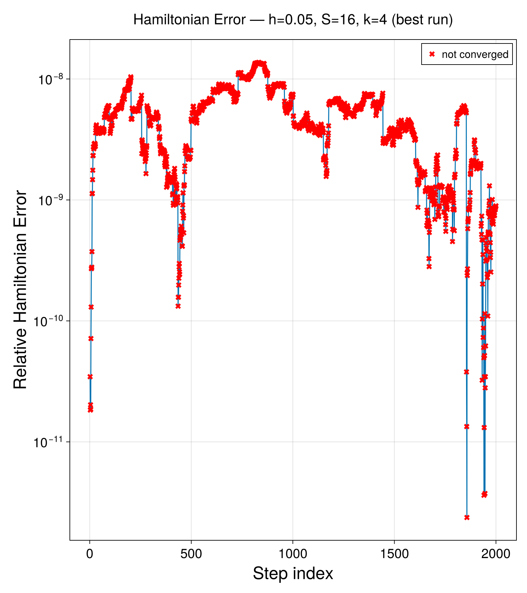<br/><small>S=16 · R=4 · k=4 · λ=0.0 · f_abs=-2.220446049250313e-16 · x_suc=-2.220446049250313e-16 · backtracking · Float64<br/>Unconverged: 100.0%</small></td><td style="text-align:center;vertical-align:top;width:50%"><strong>Fewest Unconverged Run — Error: 1.374e-08</strong><br/>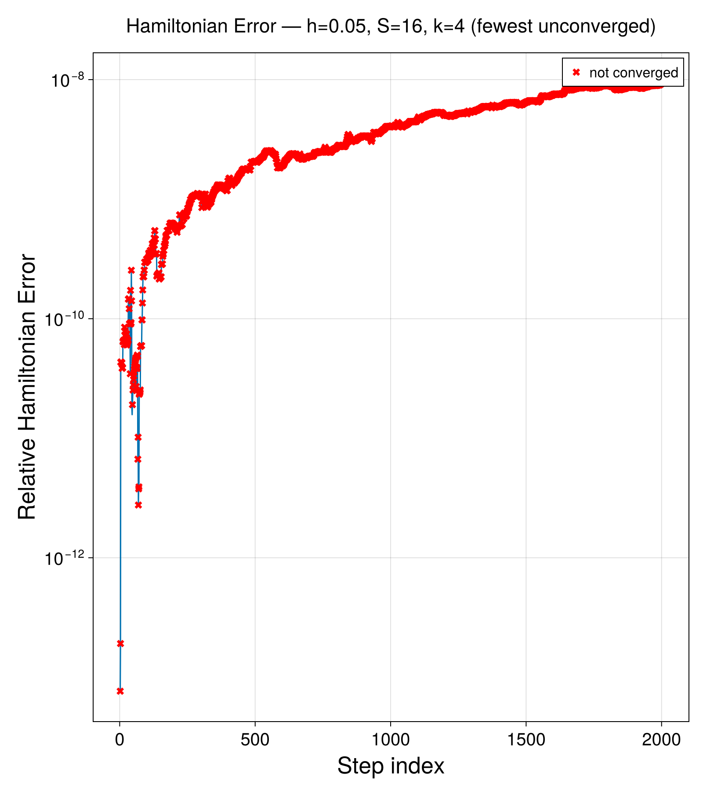<br/><small>S=16 · R=4 · k=4 · λ=0.0 · f_abs=-2.220446049250313e-16 · x_suc=-2.220446049250313e-16 · backtracking · Float64<br/>Unconverged: 100.0%</small></td></tr></table></td></tr>
</tbody></table>

### h = 0.1

<table>
<thead><tr><th></th><th>S = 4</th><th>S = 6</th><th>S = 8</th><th>S = 10</th><th>S = 12</th><th>S = 16</th></tr></thead>
<tbody>
<tr><th>k = 2</th><td><table style="width:100%"><tr><td style="text-align:center;vertical-align:top;width:50%"><strong>Min-Max Error: 1.722e-07</strong><br/>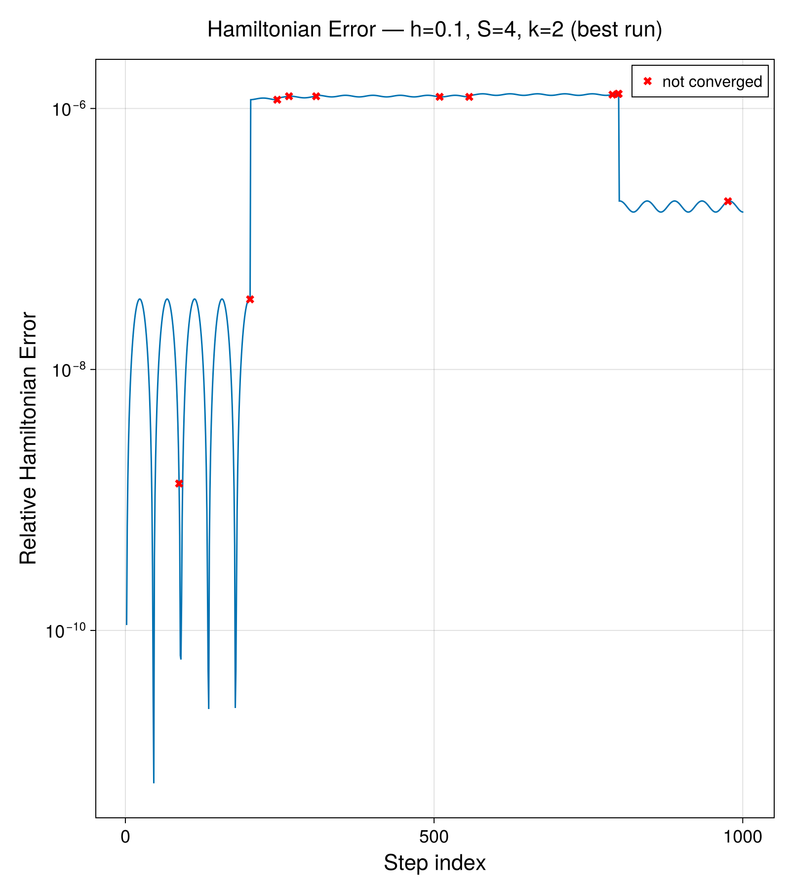<br/><small>S=4 · R=4 · k=2 · λ=1.0e-7 · f_abs=-2.220446049250313e-16 · x_suc=-2.220446049250313e-16 · backtracking · Float64<br/>Unconverged: 0.4%</small></td><td style="text-align:center;vertical-align:top;width:50%"><strong>Fewest Unconverged Run — Error: 1.722e-07</strong><br/>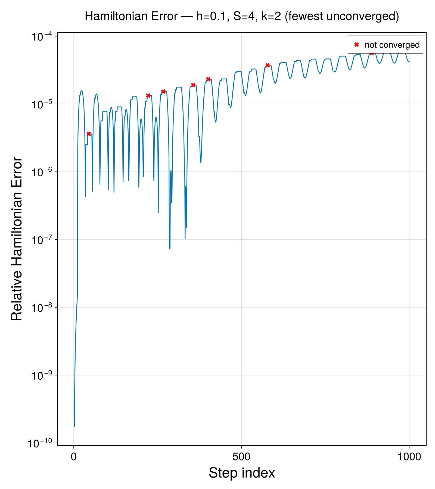<br/><small>S=4 · R=4 · k=2 · λ=1.0e-7 · f_abs=-2.220446049250313e-16 · x_suc=-2.220446049250313e-16 · backtracking · Float64<br/>Unconverged: 0.4%</small></td></tr></table></td><td><table style="width:100%"><tr><td style="text-align:center;vertical-align:top;width:50%"><strong>Min-Max Error: 1.316e-05</strong><br/>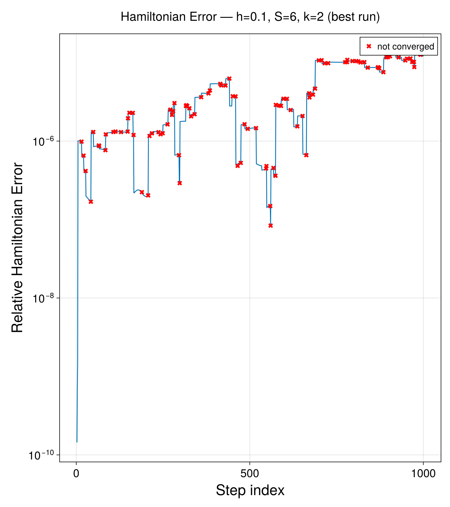<br/><small>S=6 · R=16 · k=2 · λ=1.0e-7 · f_abs=-2.220446049250313e-16 · x_suc=-2.220446049250313e-16 · backtracking · Float64<br/>Unconverged: 10.1%</small></td><td style="text-align:center;vertical-align:top;width:50%"><strong>Fewest Unconverged Run — Error: 1.202e-03</strong><br/>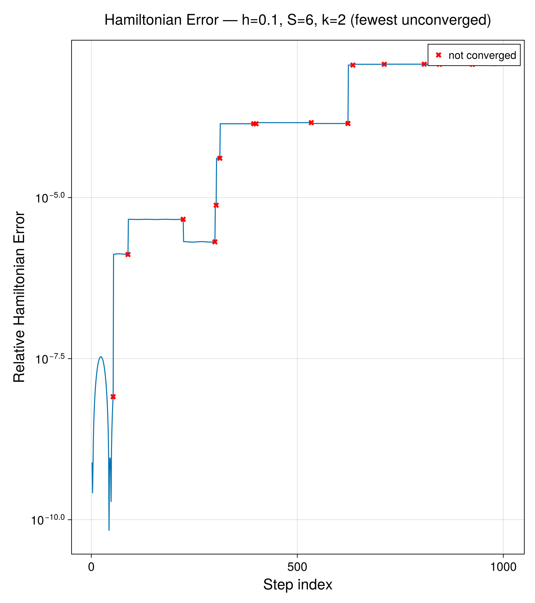<br/><small>S=6 · R=4 · k=2 · λ=1.0e-5 · f_abs=0.0 · x_suc=4.440892098500626e-16 · dogleg · Float64<br/>Unconverged: 1.6%</small></td></tr></table></td><td><table style="width:100%"><tr><td style="text-align:center;vertical-align:top;width:50%"><strong>Min-Max Error: 1.040e-05</strong><br/>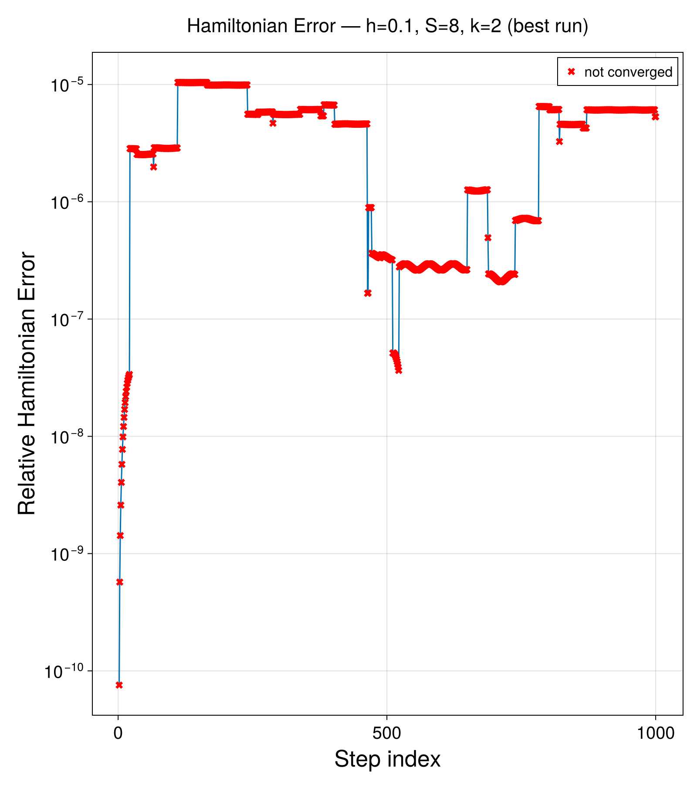<br/><small>S=8 · R=16 · k=2 · λ=0.0 · f_abs=-2.220446049250313e-16 · x_suc=-2.220446049250313e-16 · dogleg · Float64<br/>Unconverged: 99.8%</small></td><td style="text-align:center;vertical-align:top;width:50%"><strong>Fewest Unconverged Run — Error: 8.729e-04</strong><br/>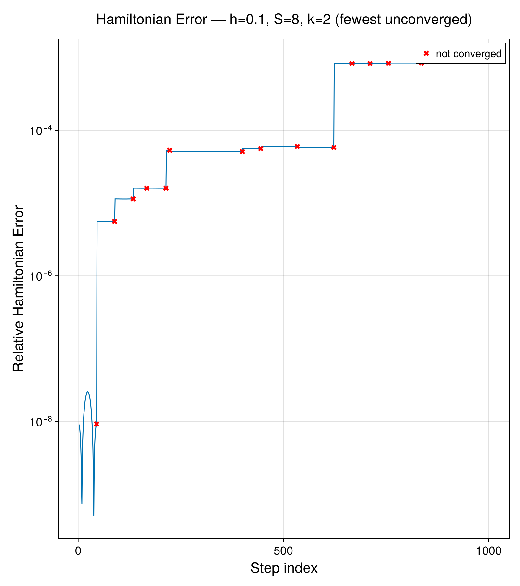<br/><small>S=8 · R=4 · k=2 · λ=1.0e-5 · f_abs=0.0 · x_suc=4.440892098500626e-16 · dogleg · Float64<br/>Unconverged: 1.5%</small></td></tr></table></td><td><table style="width:100%"><tr><td style="text-align:center;vertical-align:top;width:50%"><strong>Min-Max Error: 6.973e-06</strong><br/>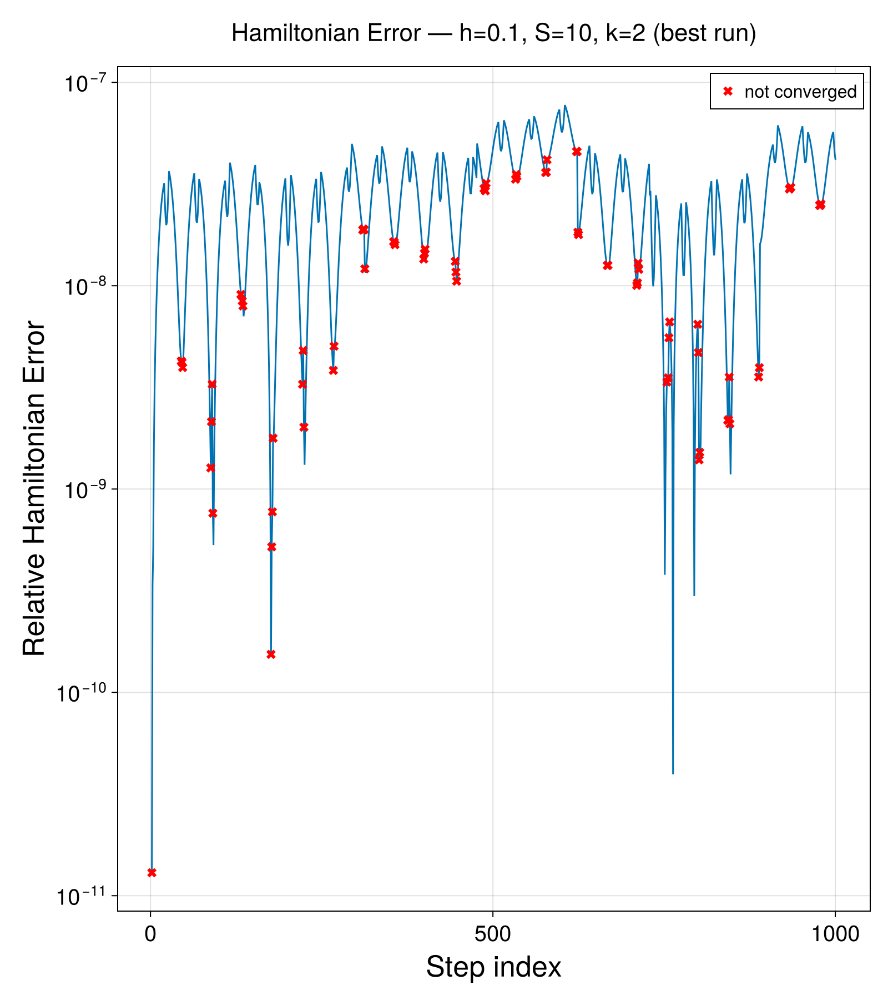<br/><small>S=10 · R=8 · k=2 · λ=1.0e-7 · f_abs=-2.220446049250313e-16 · x_suc=-2.220446049250313e-16 · backtracking · Float64<br/>Unconverged: 10.6%</small></td><td style="text-align:center;vertical-align:top;width:50%"><strong>Fewest Unconverged Run — Error: 6.605e-04</strong><br/>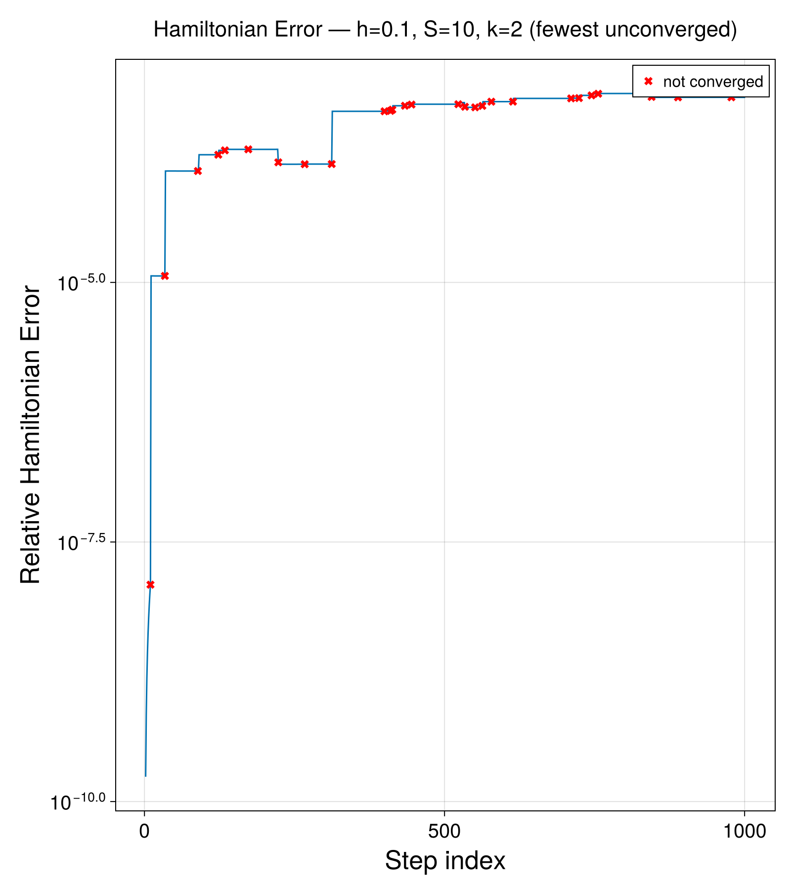<br/><small>S=10 · R=4 · k=2 · λ=1.0e-5 · f_abs=-2.220446049250313e-16 · x_suc=-2.220446049250313e-16 · dogleg · Float64<br/>Unconverged: 2.7%</small></td></tr></table></td><td><table style="width:100%"><tr><td style="text-align:center;vertical-align:top;width:50%"><strong>Min-Max Error: 5.471e-06</strong><br/>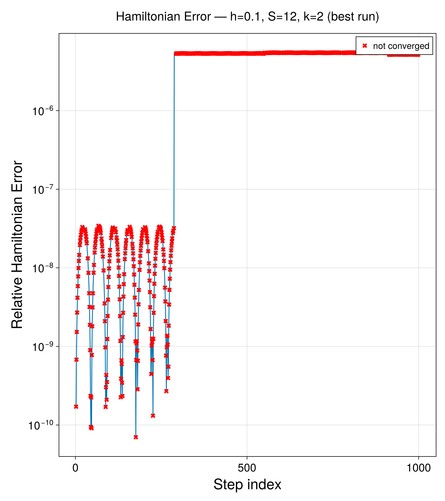<br/><small>S=12 · R=4 · k=2 · λ=0.0 · f_abs=-2.220446049250313e-16 · x_suc=-2.220446049250313e-16 · dogleg · Float64<br/>Unconverged: 77.5%</small></td><td style="text-align:center;vertical-align:top;width:50%"><strong>Fewest Unconverged Run — Error: 2.744e-04</strong><br/>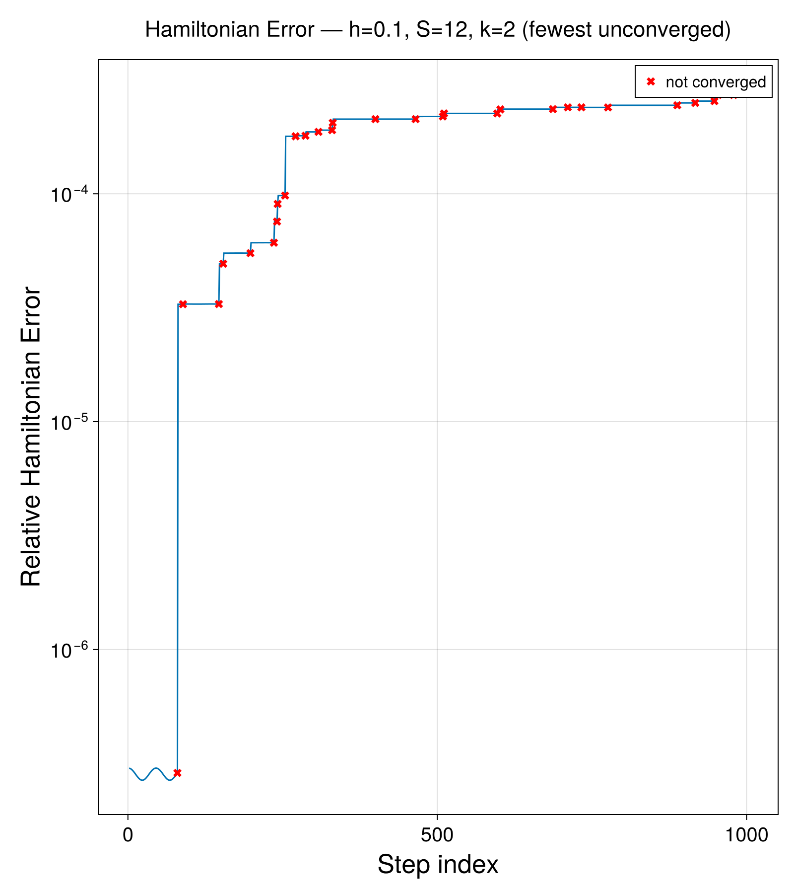<br/><small>S=12 · R=4 · k=2 · λ=1.0e-7 · f_abs=-2.220446049250313e-16 · x_suc=-2.220446049250313e-16 · dogleg · Float64<br/>Unconverged: 2.9%</small></td></tr></table></td><td><table style="width:100%"><tr><td style="text-align:center;vertical-align:top;width:50%"><strong>Min-Max Error: 2.073e-05</strong><br/>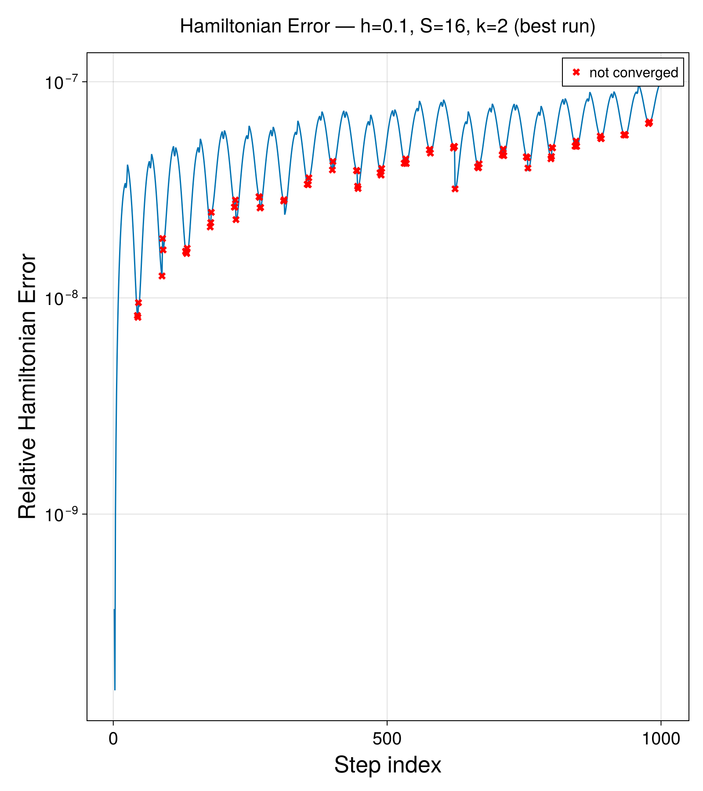<br/><small>S=16 · R=4 · k=2 · λ=0.0 · f_abs=-2.220446049250313e-16 · x_suc=-2.220446049250313e-16 · dogleg · Float64<br/>Unconverged: 89.0%</small></td><td style="text-align:center;vertical-align:top;width:50%"><strong>Fewest Unconverged Run — Error: 1.125e-04</strong><br/>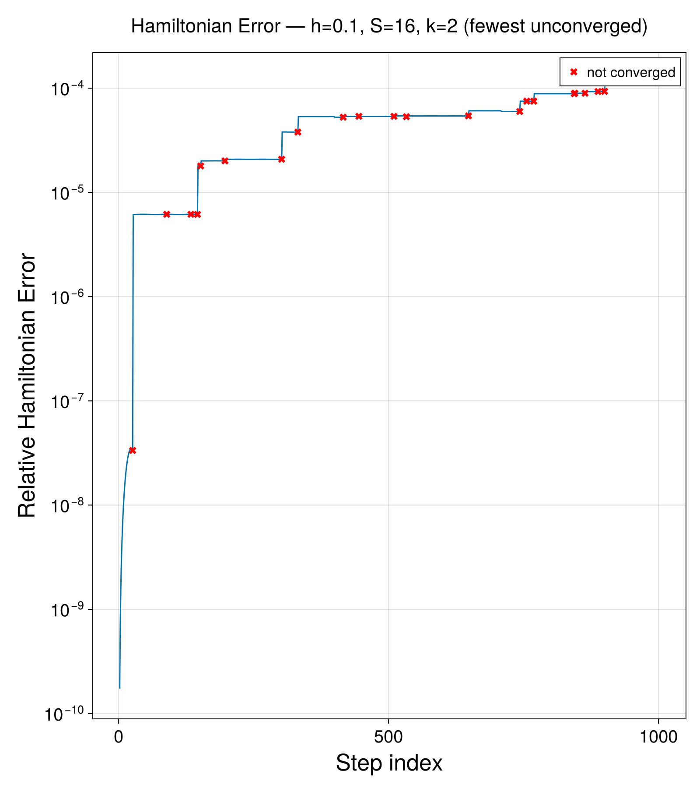<br/><small>S=16 · R=16 · k=2 · λ=1.0e-7 · f_abs=-2.220446049250313e-16 · x_suc=-2.220446049250313e-16 · dogleg · Float64<br/>Unconverged: 2.2%</small></td></tr></table></td></tr>
<tr><th>k = 3</th><td><table style="width:100%"><tr><td style="text-align:center;vertical-align:top;width:50%"><strong>Min-Max Error: 1.232e-12</strong><br/><br/><small>S=4 · R=8 · k=3 · λ=1.0e-5 · f_abs=0.0 · x_suc=4.440892098500626e-16 · backtracking · Float64<br/>Unconverged: 0.0%</small></td><td style="text-align:center;vertical-align:top;width:50%"><strong>Fewest Unconverged Run — Error: 1.232e-12</strong><br/>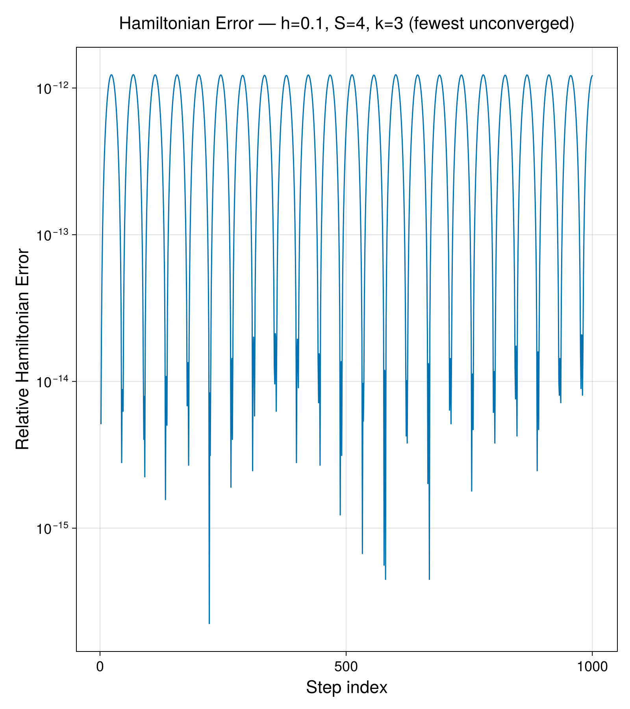<br/><small>S=4 · R=8 · k=3 · λ=1.0e-5 · f_abs=0.0 · x_suc=4.440892098500626e-16 · backtracking · Float64<br/>Unconverged: 0.0%</small></td></tr></table></td><td><table style="width:100%"><tr><td style="text-align:center;vertical-align:top;width:50%"><strong>Min-Max Error: 1.327e-12</strong><br/><br/><small>S=6 · R=4 · k=3 · λ=1.0e-7 · f_abs=-2.220446049250313e-16 · x_suc=-2.220446049250313e-16 · dogleg · Float64<br/>Unconverged: 0.0%</small></td><td style="text-align:center;vertical-align:top;width:50%"><strong>Fewest Unconverged Run — Error: 1.327e-12</strong><br/>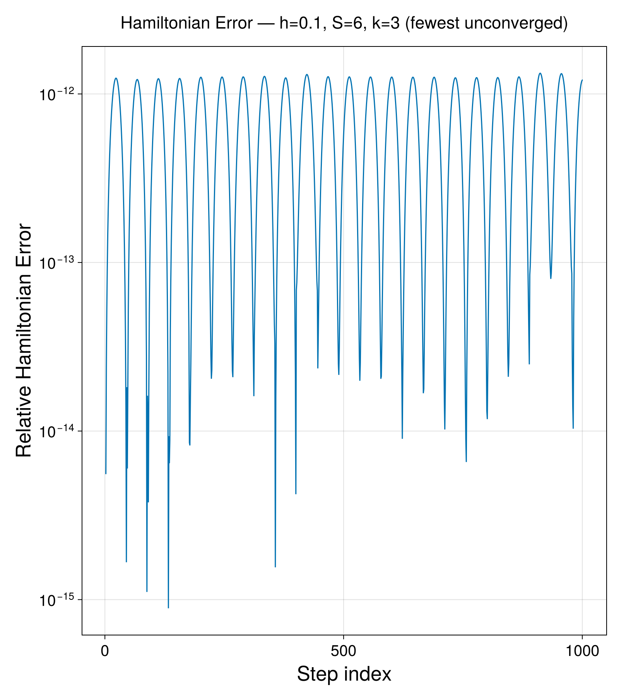<br/><small>S=6 · R=4 · k=3 · λ=1.0e-7 · f_abs=-2.220446049250313e-16 · x_suc=-2.220446049250313e-16 · dogleg · Float64<br/>Unconverged: 0.0%</small></td></tr></table></td><td><table style="width:100%"><tr><td style="text-align:center;vertical-align:top;width:50%"><strong>Min-Max Error: 2.078e-09</strong><br/><br/><small>S=8 · R=4 · k=3 · λ=0.0 · f_abs=-2.220446049250313e-16 · x_suc=-2.220446049250313e-16 · dogleg · Float64<br/>Unconverged: 100.0%</small></td><td style="text-align:center;vertical-align:top;width:50%"><strong>Fewest Unconverged Run — Error: 2.532e-08</strong><br/>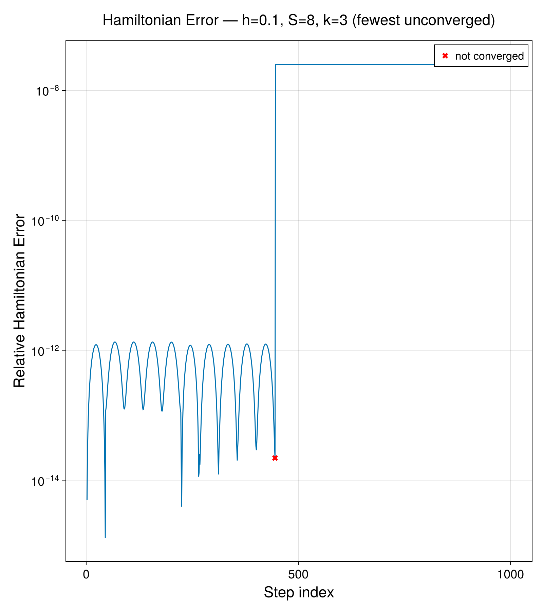<br/><small>S=8 · R=4 · k=3 · λ=1.0e-7 · f_abs=0.0 · x_suc=4.440892098500626e-16 · dogleg · Float64<br/>Unconverged: 0.1%</small></td></tr></table></td><td><table style="width:100%"><tr><td style="text-align:center;vertical-align:top;width:50%"><strong>Min-Max Error: 6.561e-09</strong><br/>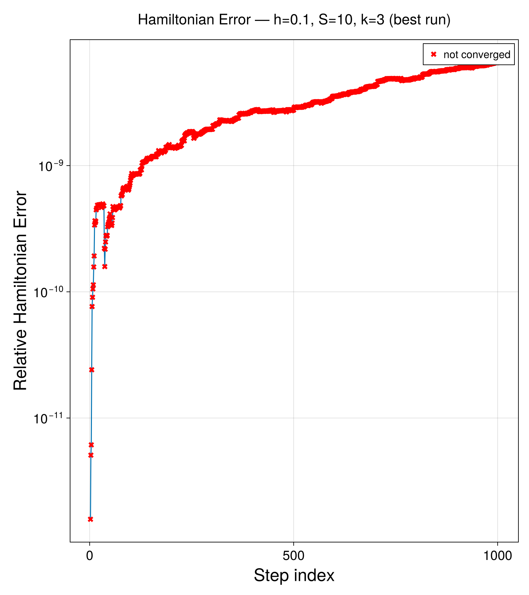<br/><small>S=10 · R=4 · k=3 · λ=0.0 · f_abs=-2.220446049250313e-16 · x_suc=-2.220446049250313e-16 · backtracking · Float64<br/>Unconverged: 100.0%</small></td><td style="text-align:center;vertical-align:top;width:50%"><strong>Fewest Unconverged Run — Error: 1.496e-06</strong><br/>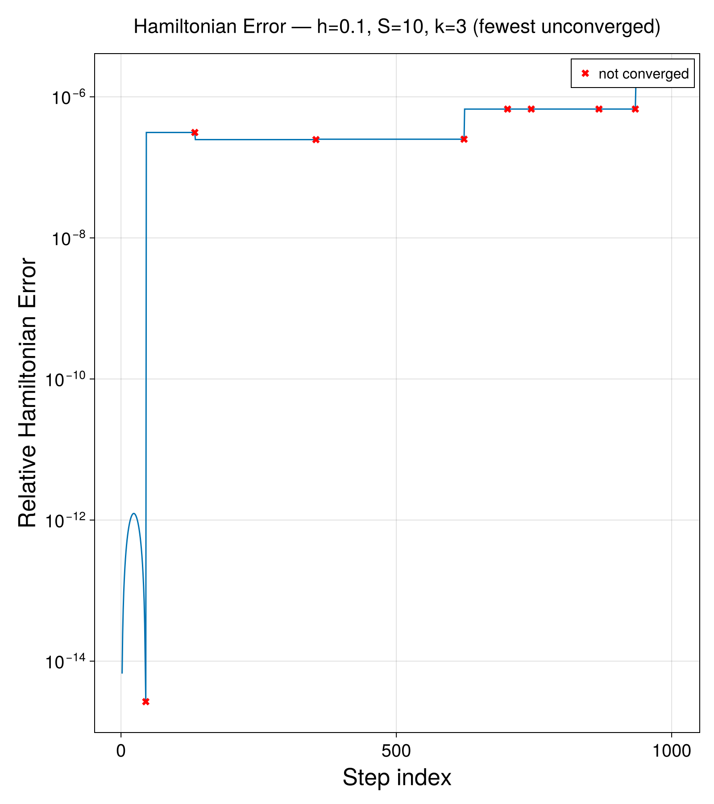<br/><small>S=10 · R=4 · k=3 · λ=1.0e-7 · f_abs=-2.220446049250313e-16 · x_suc=-2.220446049250313e-16 · dogleg · Float64<br/>Unconverged: 0.8%</small></td></tr></table></td><td><table style="width:100%"><tr><td style="text-align:center;vertical-align:top;width:50%"><strong>Min-Max Error: 7.469e-09</strong><br/>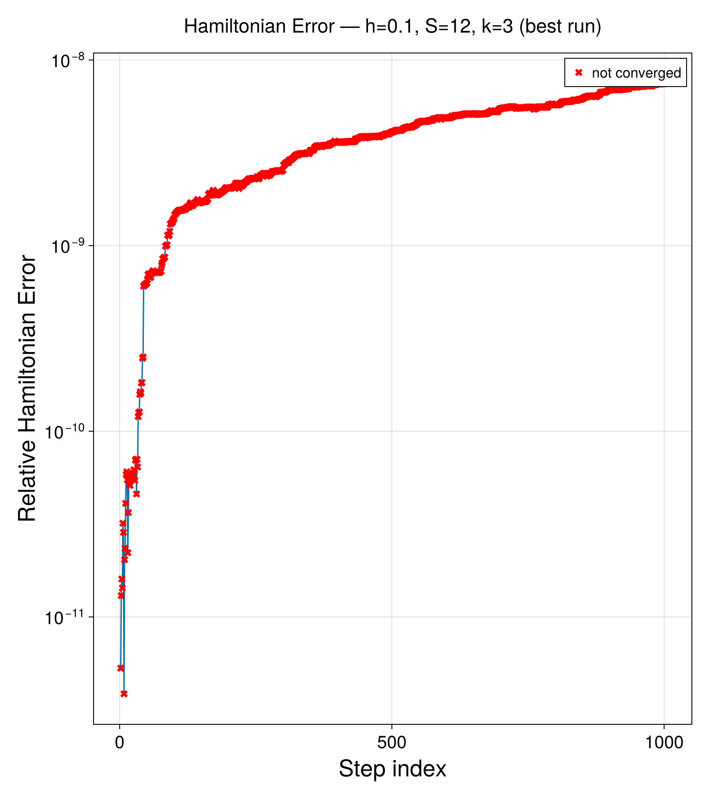<br/><small>S=12 · R=4 · k=3 · λ=0.0 · f_abs=-2.220446049250313e-16 · x_suc=-2.220446049250313e-16 · backtracking · Float64<br/>Unconverged: 100.0%</small></td><td style="text-align:center;vertical-align:top;width:50%"><strong>Fewest Unconverged Run — Error: 2.209e-07</strong><br/>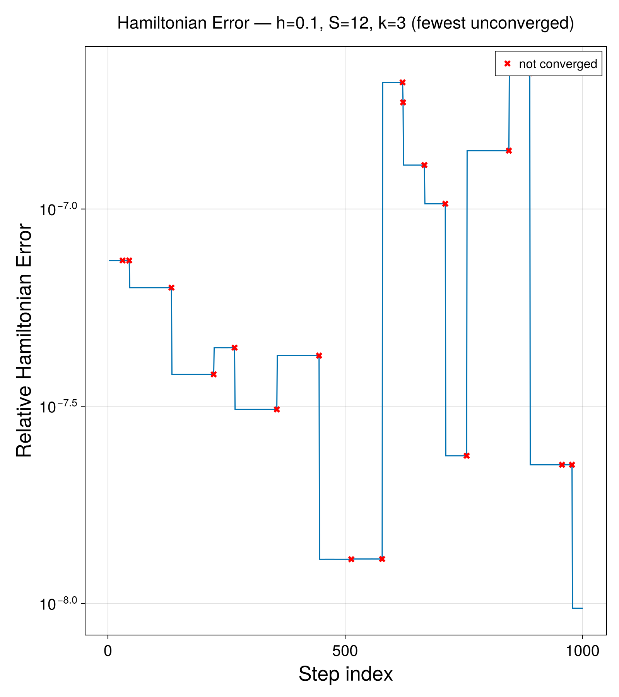<br/><small>S=12 · R=4 · k=3 · λ=1.0e-7 · f_abs=-2.220446049250313e-16 · x_suc=-2.220446049250313e-16 · backtracking · Float64<br/>Unconverged: 1.8%</small></td></tr></table></td><td><table style="width:100%"><tr><td style="text-align:center;vertical-align:top;width:50%"><strong>Min-Max Error: 7.925e-09</strong><br/>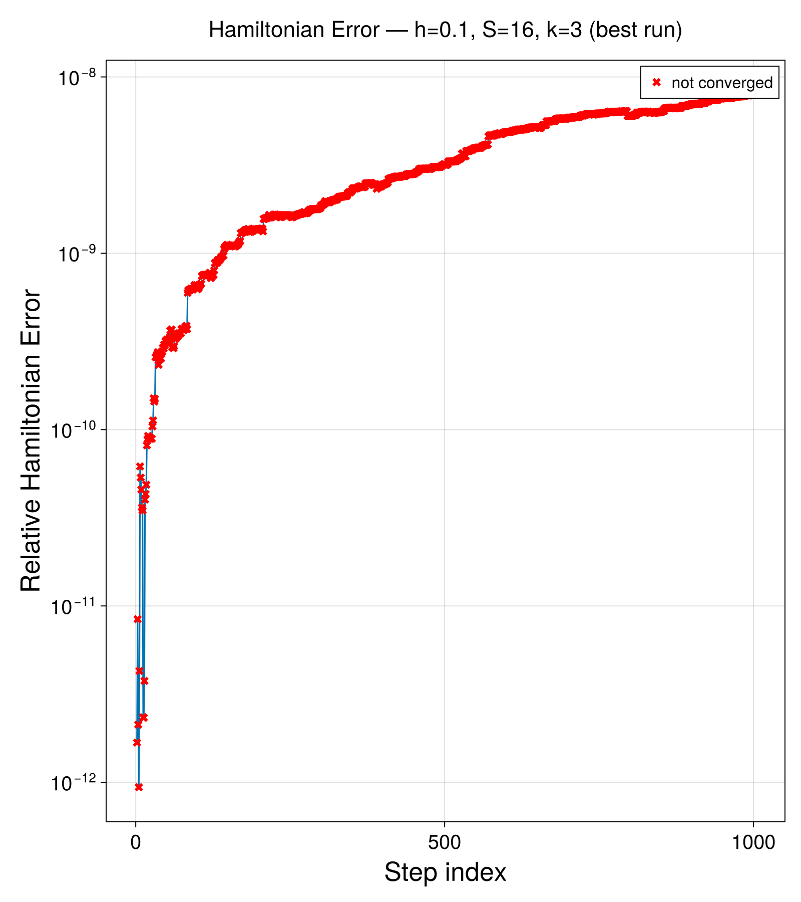<br/><small>S=16 · R=4 · k=3 · λ=0.0 · f_abs=-2.220446049250313e-16 · x_suc=-2.220446049250313e-16 · dogleg · Float64<br/>Unconverged: 100.0%</small></td><td style="text-align:center;vertical-align:top;width:50%"><strong>Fewest Unconverged Run — Error: 9.497e-07</strong><br/>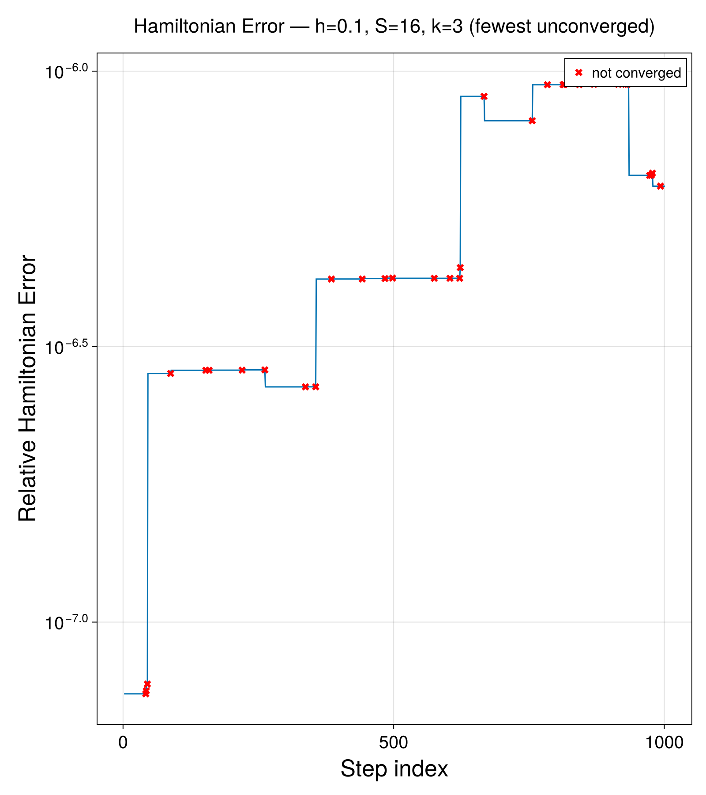<br/><small>S=16 · R=4 · k=3 · λ=1.0e-7 · f_abs=-2.220446049250313e-16 · x_suc=-2.220446049250313e-16 · dogleg · Float64<br/>Unconverged: 3.3%</small></td></tr></table></td></tr>
<tr><th>k = 4</th><td><table style="width:100%"><tr><td style="text-align:center;vertical-align:top;width:50%"><strong>Min-Max Error: 9.013e-04</strong><br/><br/><small>S=4 · R=16 · k=4 · λ=0.001 · f_abs=-2.220446049250313e-16 · x_suc=-2.220446049250313e-16 · dogleg · Float64<br/>Unconverged: 100.0%</small></td><td style="text-align:center;vertical-align:top;width:50%"><strong>Fewest Unconverged Run — Error: 5.150e-03</strong><br/>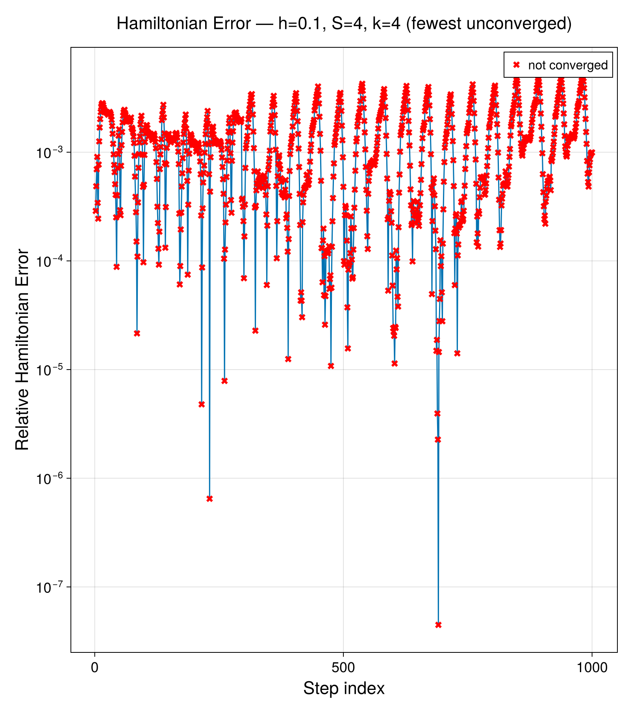<br/><small>S=4 · R=4 · k=4 · λ=0.0 · f_abs=-2.220446049250313e-16 · x_suc=-2.220446049250313e-16 · dogleg · Float64<br/>Unconverged: 99.8%</small></td></tr></table></td><td><table style="width:100%"><tr><td style="text-align:center;vertical-align:top;width:50%"><strong>Min-Max Error: 1.150e-06</strong><br/><br/><small>S=6 · R=16 · k=4 · λ=1.0e-5 · f_abs=-2.220446049250313e-16 · x_suc=-2.220446049250313e-16 · backtracking · Float64<br/>Unconverged: 99.9%</small></td><td style="text-align:center;vertical-align:top;width:50%"><strong>Fewest Unconverged Run — Error: 3.385e-06</strong><br/>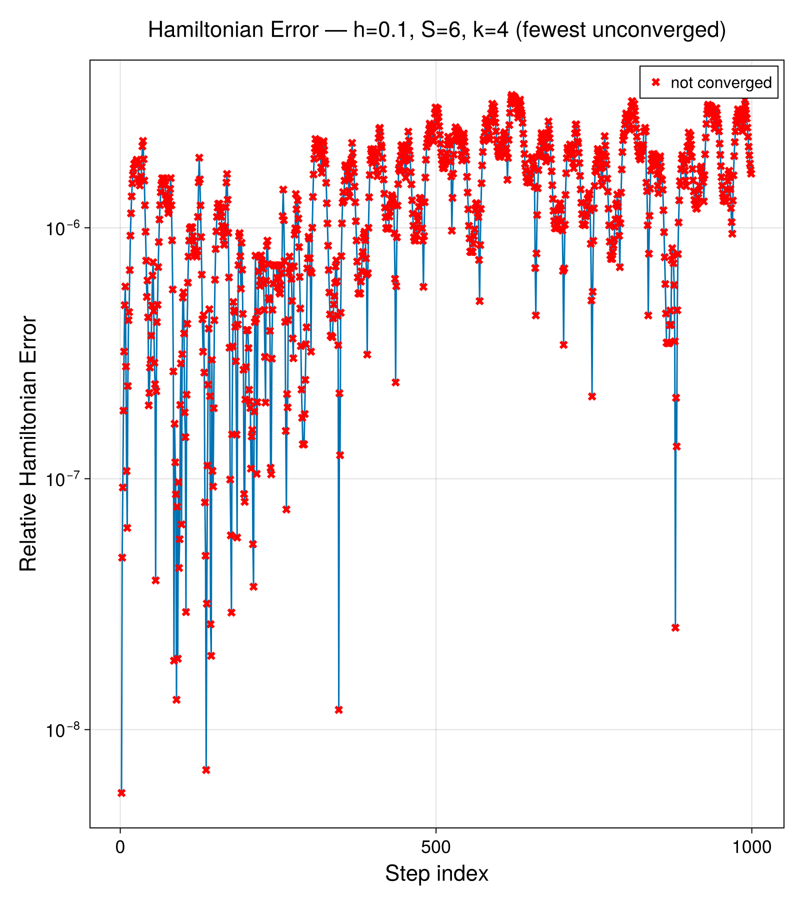<br/><small>S=6 · R=8 · k=4 · λ=0.0 · f_abs=0.0 · x_suc=4.440892098500626e-16 · dogleg · Float64<br/>Unconverged: 99.3%</small></td></tr></table></td><td><table style="width:100%"><tr><td style="text-align:center;vertical-align:top;width:50%"><strong>Min-Max Error: 6.589e-07</strong><br/><br/><small>S=8 · R=16 · k=4 · λ=0.001 · f_abs=-2.220446049250313e-16 · x_suc=-2.220446049250313e-16 · backtracking · Float64<br/>Unconverged: 100.0%</small></td><td style="text-align:center;vertical-align:top;width:50%"><strong>Fewest Unconverged Run — Error: 6.589e-07</strong><br/>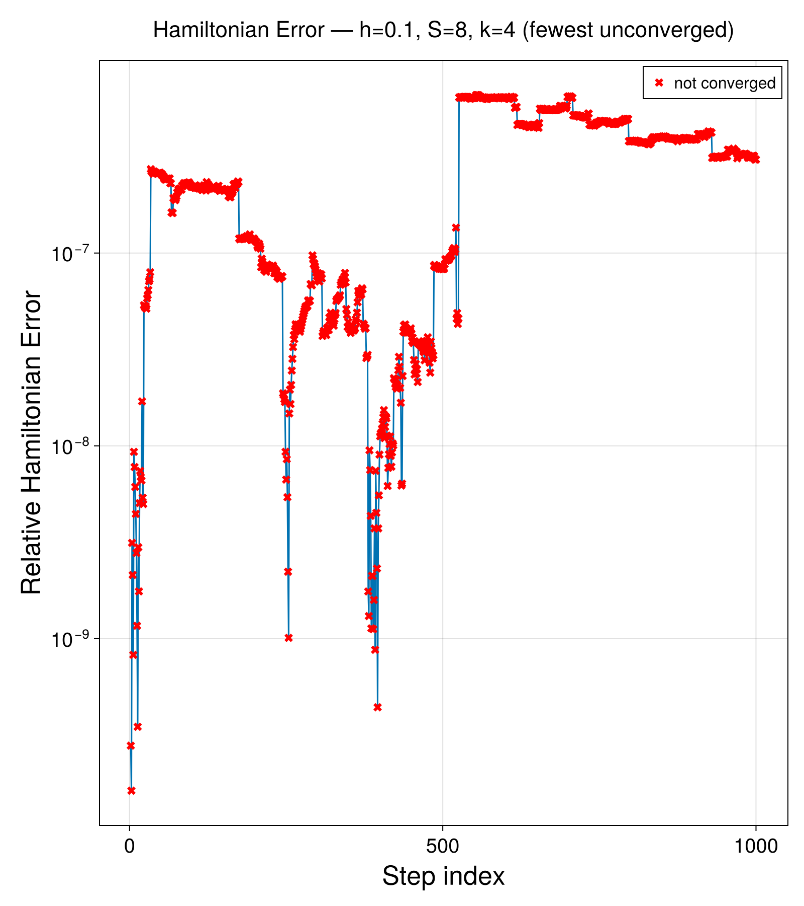<br/><small>S=8 · R=16 · k=4 · λ=0.001 · f_abs=-2.220446049250313e-16 · x_suc=-2.220446049250313e-16 · backtracking · Float64<br/>Unconverged: 100.0%</small></td></tr></table></td><td><table style="width:100%"><tr><td style="text-align:center;vertical-align:top;width:50%"><strong>Min-Max Error: 1.509e-07</strong><br/>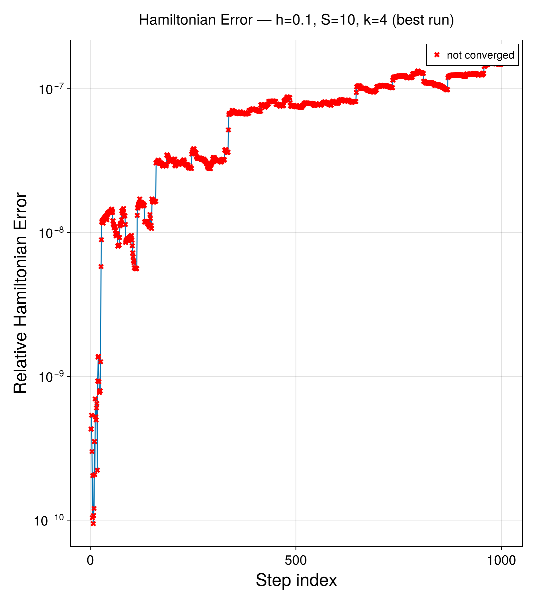<br/><small>S=10 · R=4 · k=4 · λ=0.0 · f_abs=-2.220446049250313e-16 · x_suc=-2.220446049250313e-16 · dogleg · Float64<br/>Unconverged: 100.0%</small></td><td style="text-align:center;vertical-align:top;width:50%"><strong>Fewest Unconverged Run — Error: 1.431e-05</strong><br/>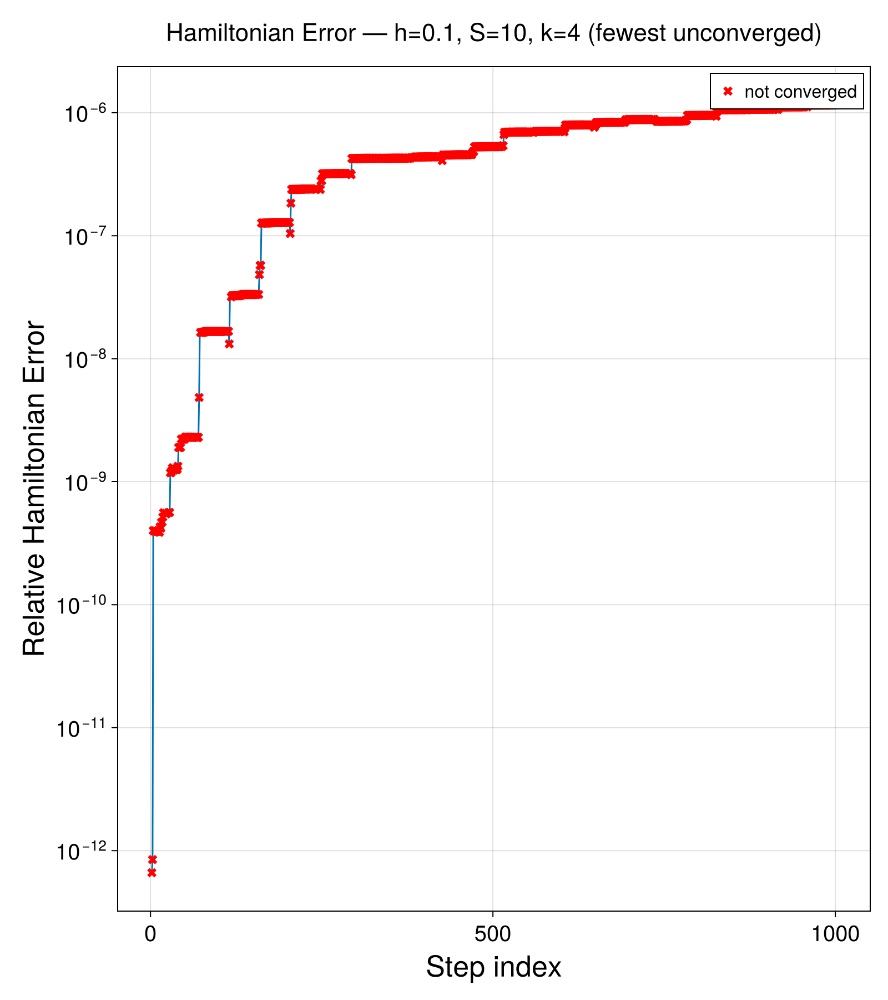<br/><small>S=10 · R=8 · k=4 · λ=1.0e-7 · f_abs=-2.220446049250313e-16 · x_suc=-2.220446049250313e-16 · backtracking · Float64<br/>Unconverged: 99.9%</small></td></tr></table></td><td><table style="width:100%"><tr><td style="text-align:center;vertical-align:top;width:50%"><strong>Min-Max Error: 1.458e-07</strong><br/><br/><small>S=12 · R=4 · k=4 · λ=0.0 · f_abs=-2.220446049250313e-16 · x_suc=-2.220446049250313e-16 · dogleg · Float64<br/>Unconverged: 100.0%</small></td><td style="text-align:center;vertical-align:top;width:50%"><strong>Fewest Unconverged Run — Error: 1.458e-07</strong><br/>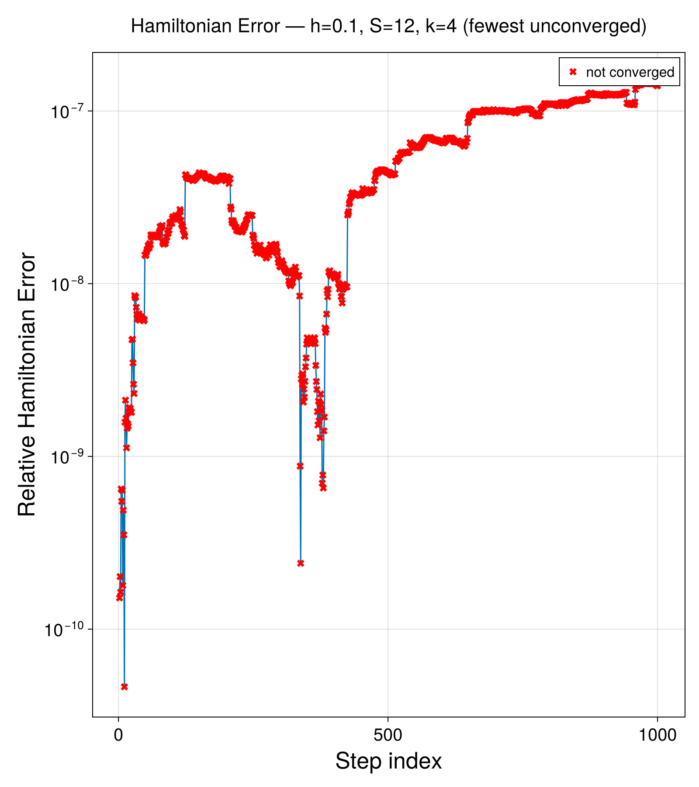<br/><small>S=12 · R=4 · k=4 · λ=0.0 · f_abs=-2.220446049250313e-16 · x_suc=-2.220446049250313e-16 · dogleg · Float64<br/>Unconverged: 100.0%</small></td></tr></table></td><td><table style="width:100%"><tr><td style="text-align:center;vertical-align:top;width:50%"><strong>Min-Max Error: 1.651e-07</strong><br/>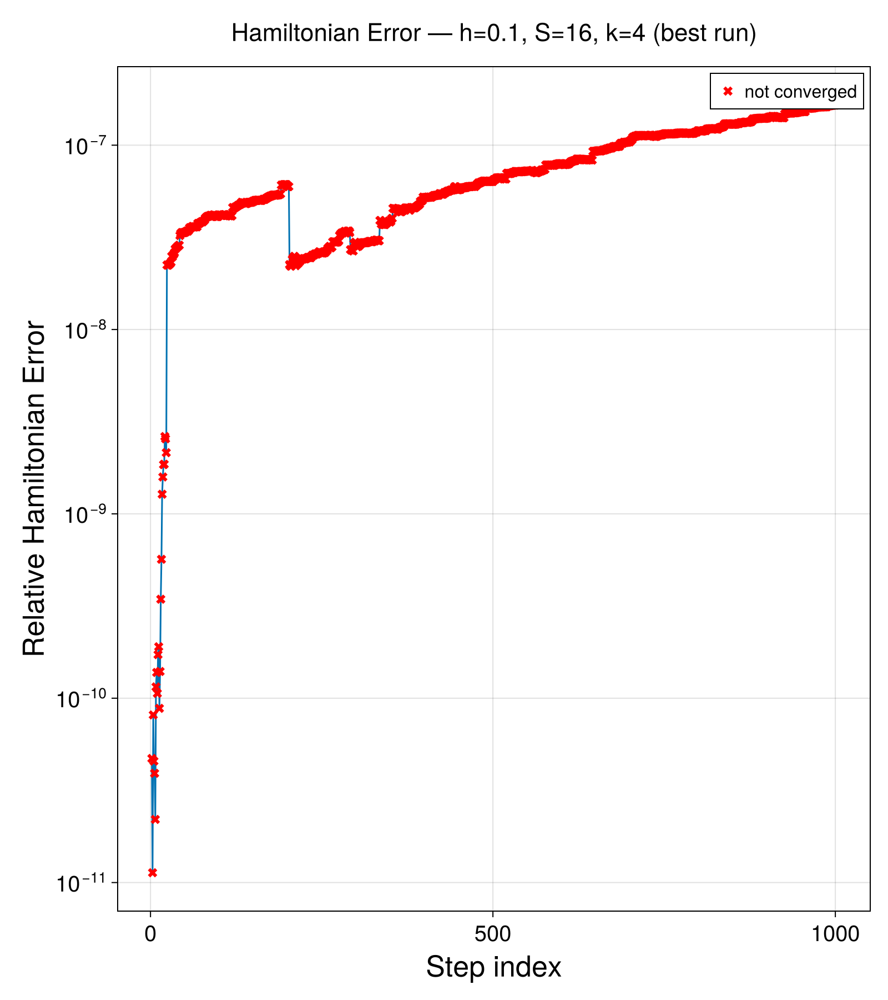<br/><small>S=16 · R=8 · k=4 · λ=0.0 · f_abs=-2.220446049250313e-16 · x_suc=-2.220446049250313e-16 · backtracking · Float64<br/>Unconverged: 100.0%</small></td><td style="text-align:center;vertical-align:top;width:50%"><strong>Fewest Unconverged Run — Error: 1.651e-07</strong><br/>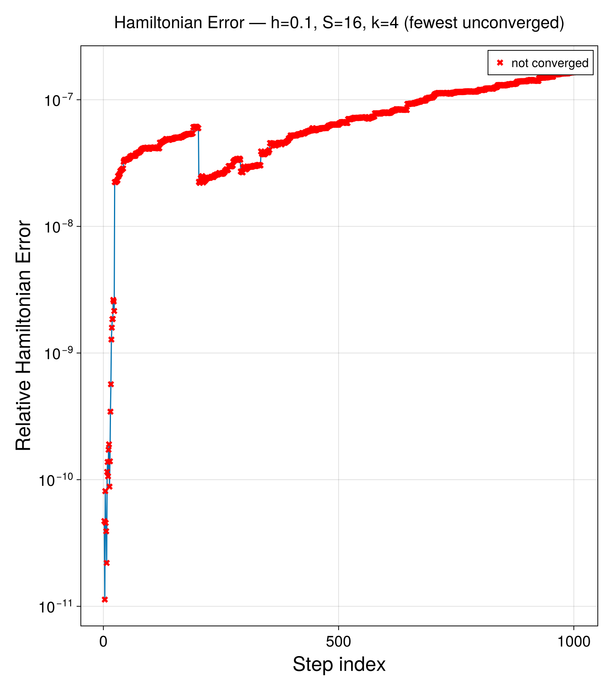<br/><small>S=16 · R=8 · k=4 · λ=0.0 · f_abs=-2.220446049250313e-16 · x_suc=-2.220446049250313e-16 · backtracking · Float64<br/>Unconverged: 100.0%</small></td></tr></table></td></tr>
</tbody></table>

### h = 0.2

<table>
<thead><tr><th></th><th>S = 4</th><th>S = 6</th><th>S = 8</th><th>S = 10</th><th>S = 12</th><th>S = 16</th></tr></thead>
<tbody>
<tr><th>k = 2</th><td><table style="width:100%"><tr><td style="text-align:center;vertical-align:top;width:50%"><strong>Min-Max Error: 7.558e-06</strong><br/>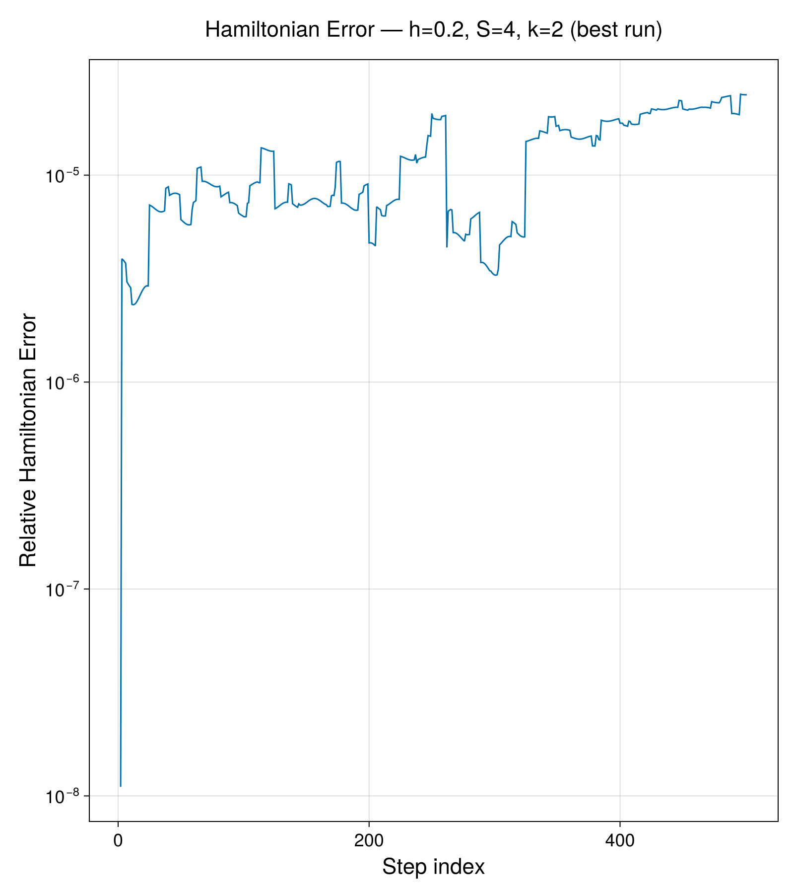<br/><small>S=4 · R=4 · k=2 · λ=1.0e-5 · f_abs=-2.220446049250313e-16 · x_suc=-2.220446049250313e-16 · dogleg · Float64<br/>Unconverged: 0.8%</small></td><td style="text-align:center;vertical-align:top;width:50%"><strong>Fewest Unconverged Run — Error: 3.411e-05</strong><br/>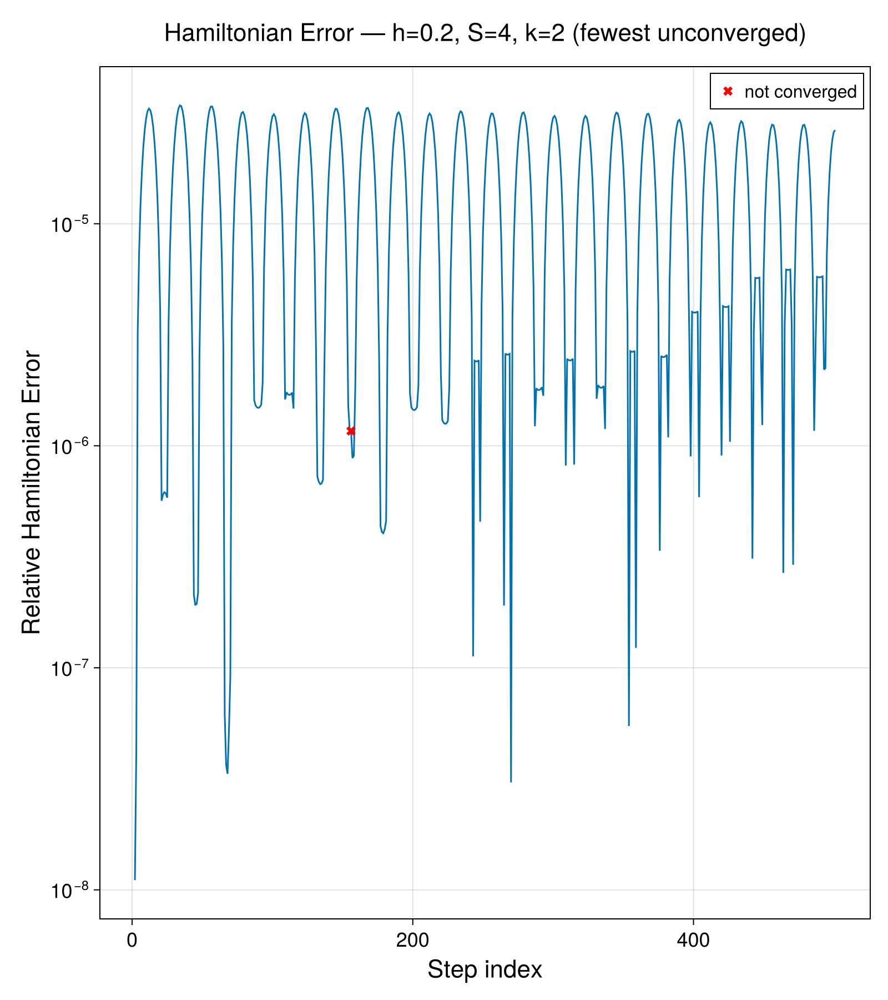<br/><small>S=4 · R=16 · k=2 · λ=1.0e-5 · f_abs=0.0 · x_suc=4.440892098500626e-16 · backtracking · Float64<br/>Unconverged: 0.2%</small></td></tr></table></td><td><table style="width:100%"><tr><td style="text-align:center;vertical-align:top;width:50%"><strong>Min-Max Error: 2.967e-05</strong><br/>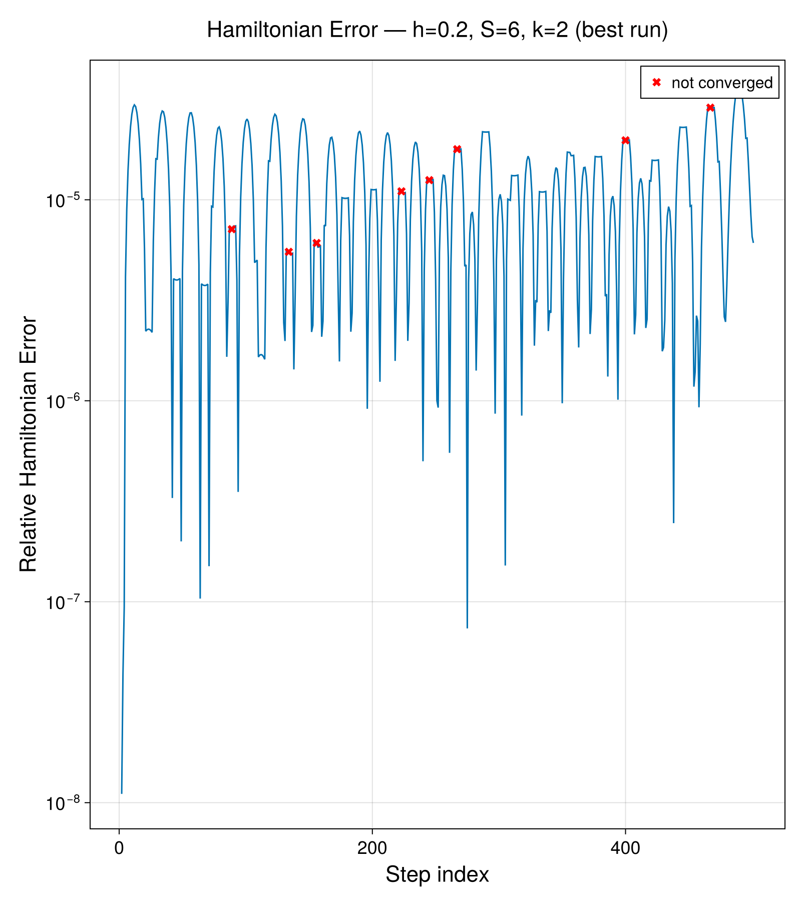<br/><small>S=6 · R=16 · k=2 · λ=1.0e-5 · f_abs=-2.220446049250313e-16 · x_suc=-2.220446049250313e-16 · dogleg · Float64<br/>Unconverged: 1.8%</small></td><td style="text-align:center;vertical-align:top;width:50%"><strong>Fewest Unconverged Run — Error: 3.319e-05</strong><br/>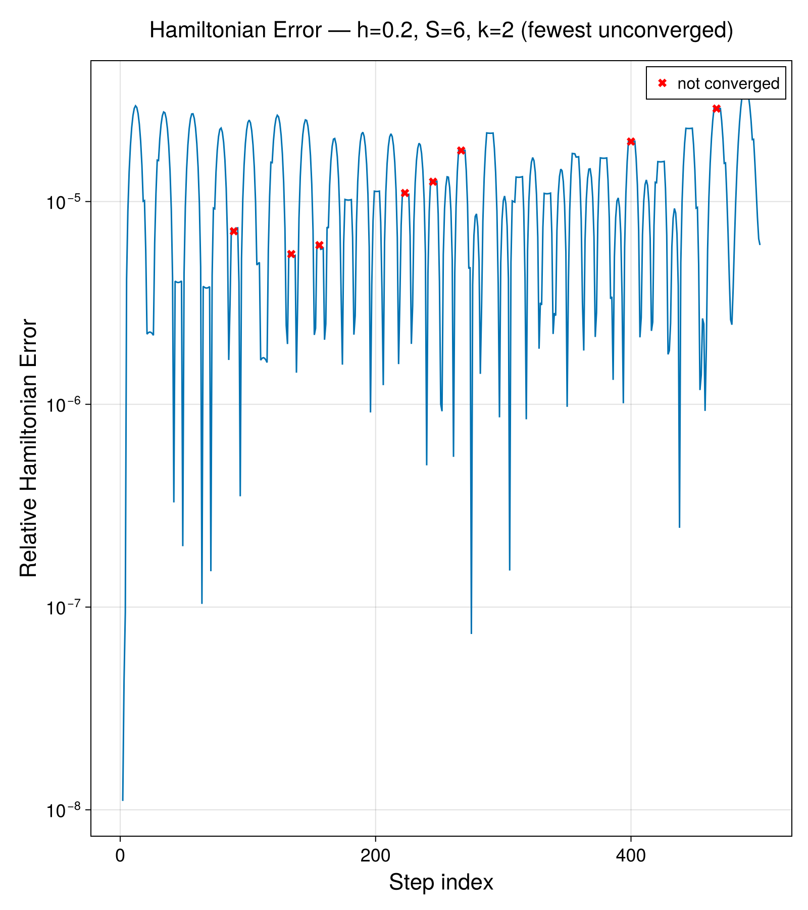<br/><small>S=6 · R=16 · k=2 · λ=1.0e-5 · f_abs=0.0 · x_suc=4.440892098500626e-16 · dogleg · Float64<br/>Unconverged: 1.6%</small></td></tr></table></td><td><table style="width:100%"><tr><td style="text-align:center;vertical-align:top;width:50%"><strong>Min-Max Error: 2.088e-05</strong><br/>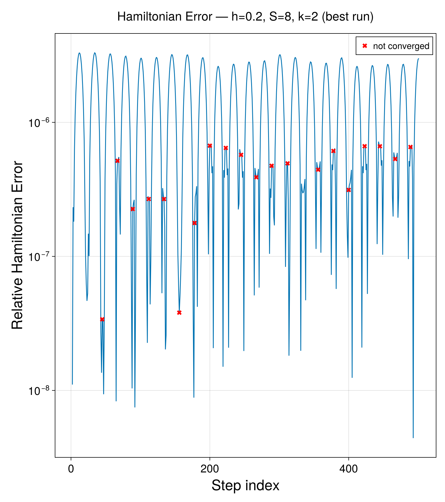<br/><small>S=8 · R=16 · k=2 · λ=0.001 · f_abs=0.0 · x_suc=4.440892098500626e-16 · backtracking · Float64<br/>Unconverged: 12.0%</small></td><td style="text-align:center;vertical-align:top;width:50%"><strong>Fewest Unconverged Run — Error: 3.300e-05</strong><br/>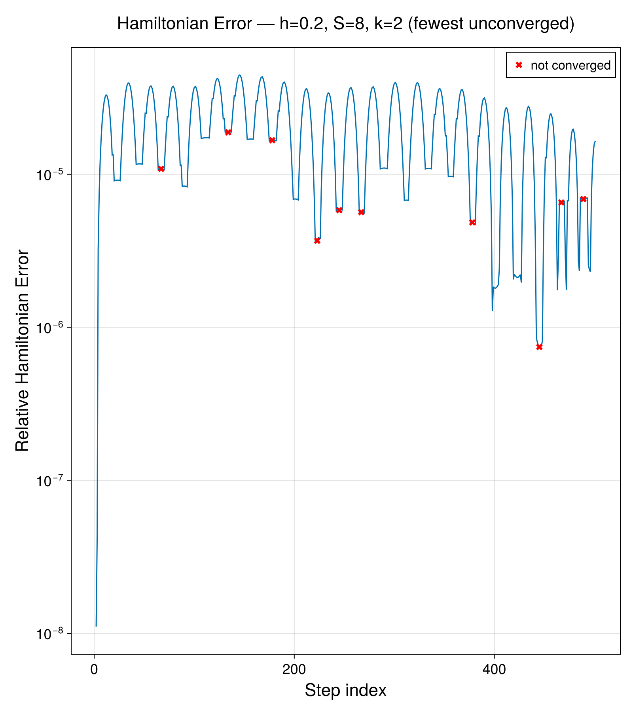<br/><small>S=8 · R=16 · k=2 · λ=1.0e-5 · f_abs=-2.220446049250313e-16 · x_suc=-2.220446049250313e-16 · dogleg · Float64<br/>Unconverged: 1.8%</small></td></tr></table></td><td><table style="width:100%"><tr><td style="text-align:center;vertical-align:top;width:50%"><strong>Min-Max Error: 3.212e-05</strong><br/>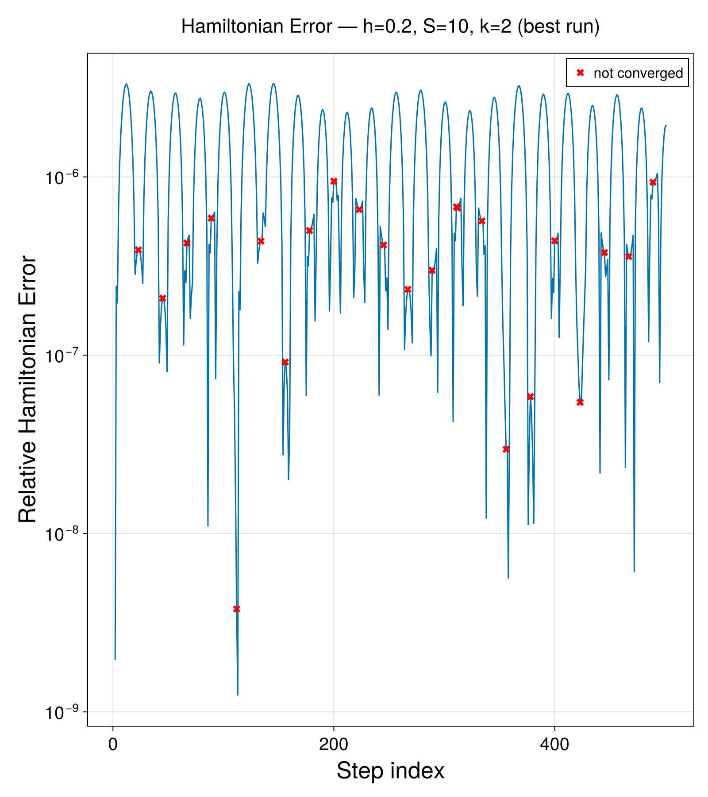<br/><small>S=10 · R=16 · k=2 · λ=1.0e-5 · f_abs=-2.220446049250313e-16 · x_suc=-2.220446049250313e-16 · backtracking · Float64<br/>Unconverged: 3.8%</small></td><td style="text-align:center;vertical-align:top;width:50%"><strong>Fewest Unconverged Run — Error: 2.350e-04</strong><br/>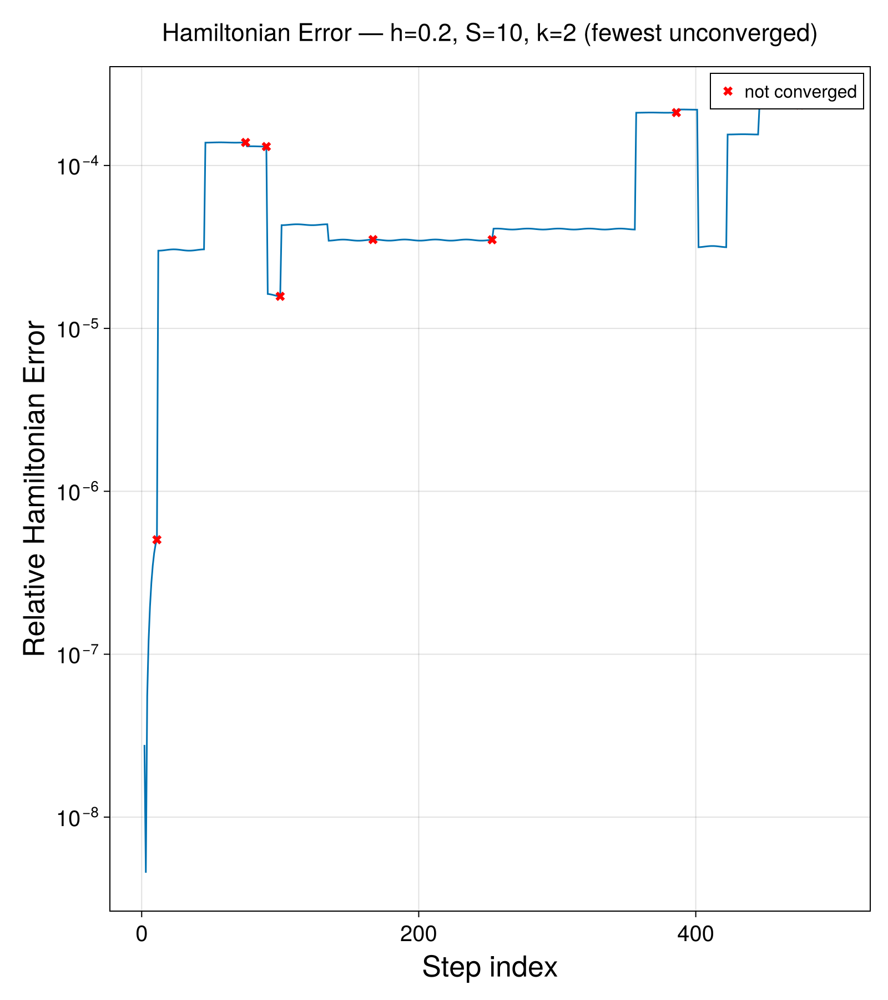<br/><small>S=10 · R=4 · k=2 · λ=1.0e-5 · f_abs=-2.220446049250313e-16 · x_suc=-2.220446049250313e-16 · dogleg · Float64<br/>Unconverged: 1.6%</small></td></tr></table></td><td><table style="width:100%"><tr><td style="text-align:center;vertical-align:top;width:50%"><strong>Min-Max Error: 3.615e-05</strong><br/>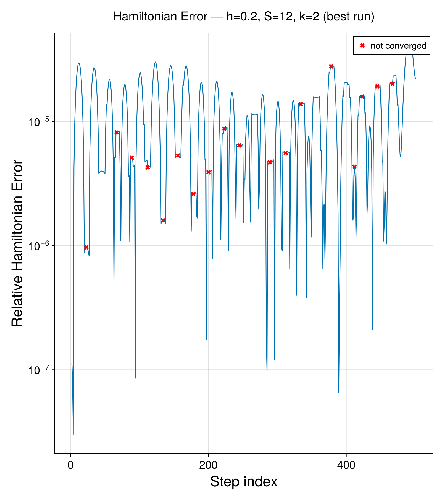<br/><small>S=12 · R=16 · k=2 · λ=1.0e-5 · f_abs=-2.220446049250313e-16 · x_suc=-2.220446049250313e-16 · backtracking · Float64<br/>Unconverged: 4.0%</small></td><td style="text-align:center;vertical-align:top;width:50%"><strong>Fewest Unconverged Run — Error: 1.296e-04</strong><br/>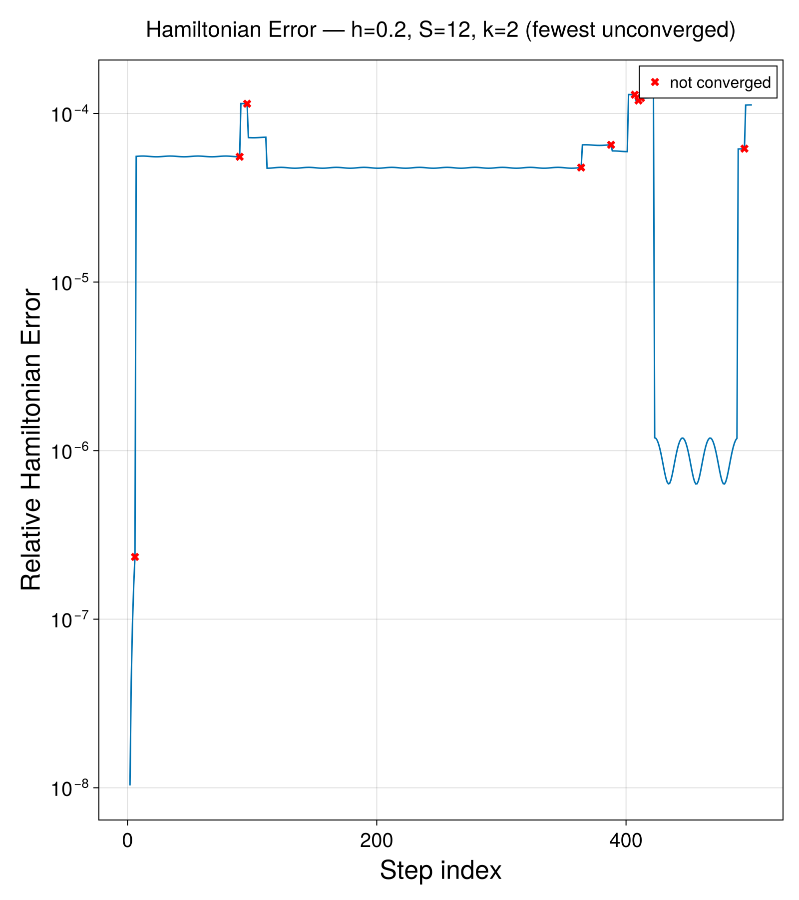<br/><small>S=12 · R=4 · k=2 · λ=1.0e-5 · f_abs=-2.220446049250313e-16 · x_suc=-2.220446049250313e-16 · dogleg · Float64<br/>Unconverged: 1.8%</small></td></tr></table></td><td><table style="width:100%"><tr><td style="text-align:center;vertical-align:top;width:50%"><strong>Min-Max Error: 1.620e-05</strong><br/>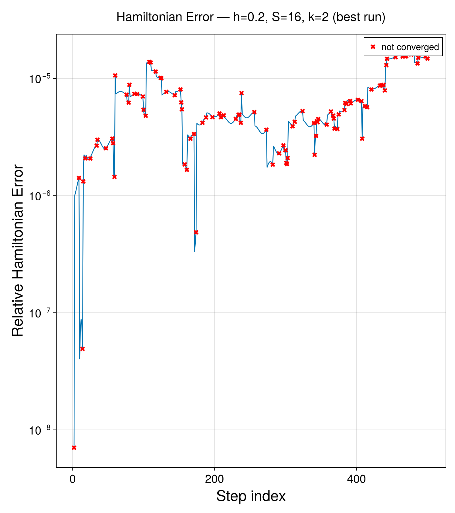<br/><small>S=16 · R=16 · k=2 · λ=1.0e-7 · f_abs=-2.220446049250313e-16 · x_suc=-2.220446049250313e-16 · backtracking · Float64<br/>Unconverged: 19.8%</small></td><td style="text-align:center;vertical-align:top;width:50%"><strong>Fewest Unconverged Run — Error: 1.834e-04</strong><br/>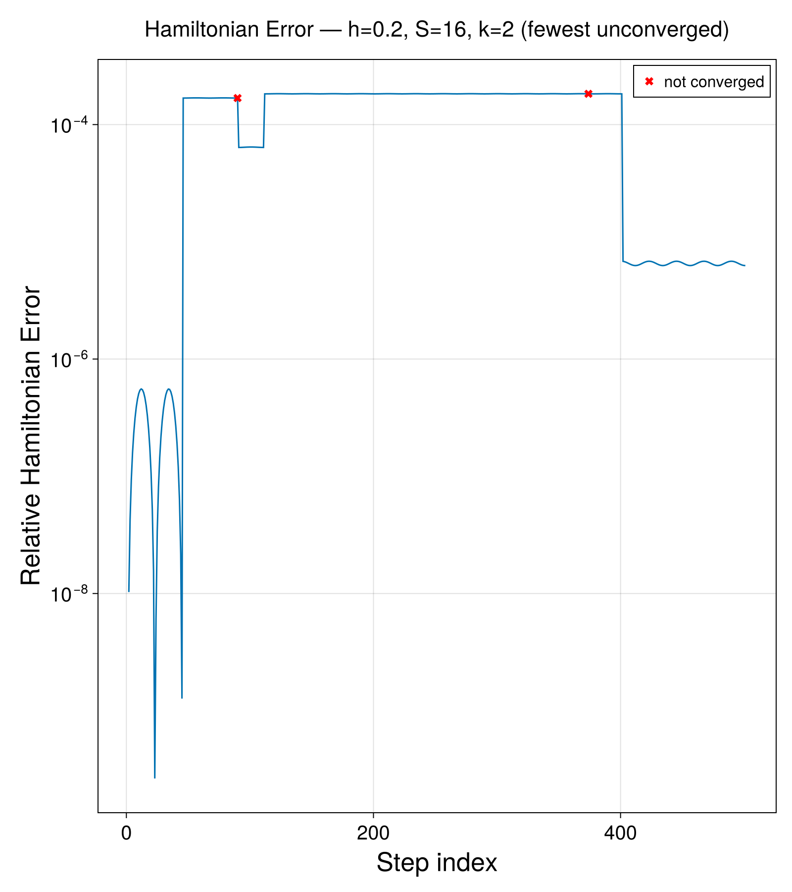<br/><small>S=16 · R=4 · k=2 · λ=1.0e-5 · f_abs=-2.220446049250313e-16 · x_suc=-2.220446049250313e-16 · dogleg · Float64<br/>Unconverged: 0.4%</small></td></tr></table></td></tr>
<tr><th>k = 3</th><td><table style="width:100%"><tr><td style="text-align:center;vertical-align:top;width:50%"><strong>Min-Max Error: 7.955e-11</strong><br/><br/><small>S=4 · R=4 · k=3 · λ=0.001 · f_abs=0.0 · x_suc=4.440892098500626e-16 · dogleg · Float64<br/>Unconverged: 0.2%</small></td><td style="text-align:center;vertical-align:top;width:50%"><strong>Fewest Unconverged Run — Error: 7.955e-11</strong><br/>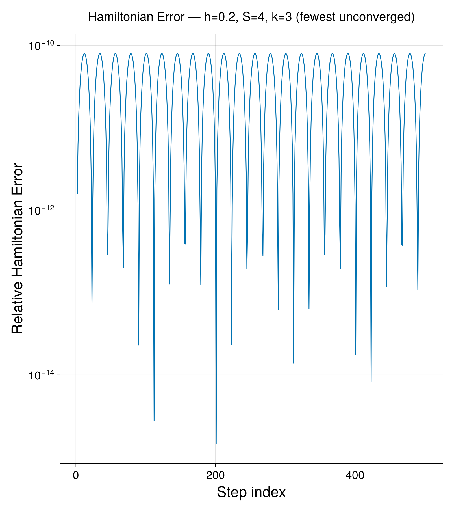<br/><small>S=4 · R=4 · k=3 · λ=1.0e-5 · f_abs=-2.220446049250313e-16 · x_suc=-2.220446049250313e-16 · backtracking · Float64<br/>Unconverged: 0.0%</small></td></tr></table></td><td><table style="width:100%"><tr><td style="text-align:center;vertical-align:top;width:50%"><strong>Min-Max Error: 2.140e-09</strong><br/><br/><small>S=6 · R=4 · k=3 · λ=0.0 · f_abs=-2.220446049250313e-16 · x_suc=-2.220446049250313e-16 · backtracking · Float64<br/>Unconverged: 100.0%</small></td><td style="text-align:center;vertical-align:top;width:50%"><strong>Fewest Unconverged Run — Error: 1.999e-06</strong><br/>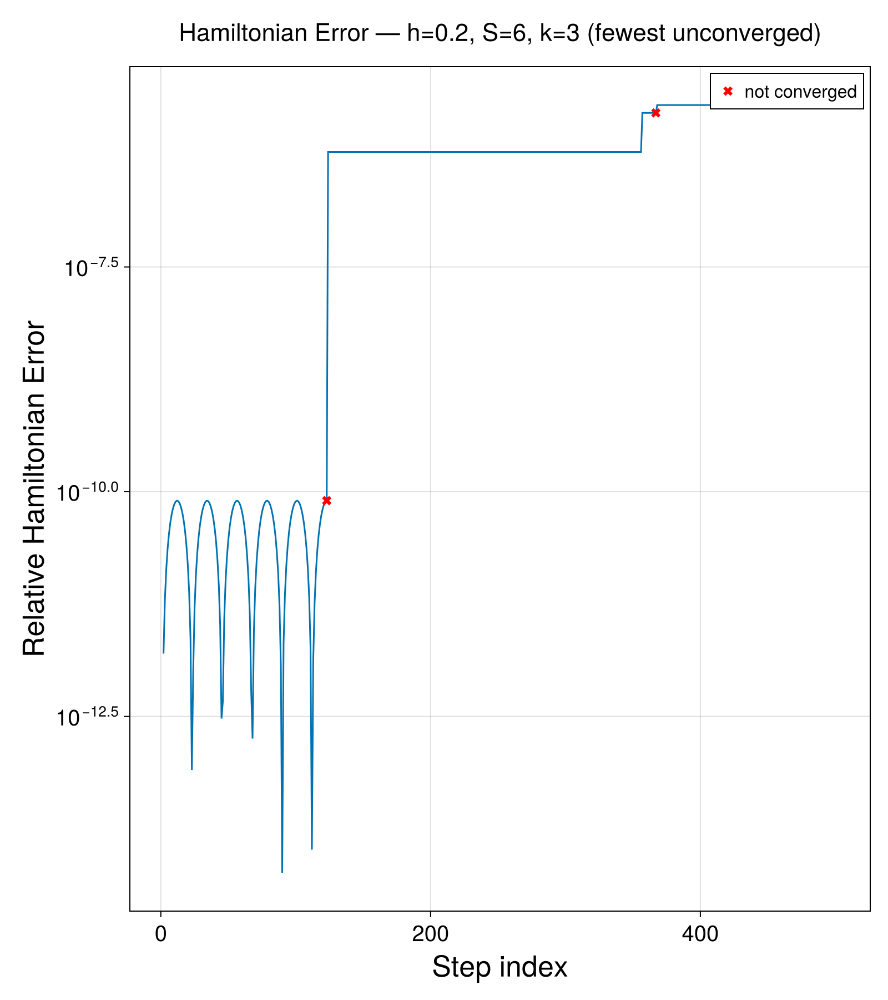<br/><small>S=6 · R=8 · k=3 · λ=1.0e-7 · f_abs=0.0 · x_suc=4.440892098500626e-16 · dogleg · Float64<br/>Unconverged: 0.4%</small></td></tr></table></td><td><table style="width:100%"><tr><td style="text-align:center;vertical-align:top;width:50%"><strong>Min-Max Error: 2.845e-09</strong><br/><br/><small>S=8 · R=4 · k=3 · λ=0.0 · f_abs=-2.220446049250313e-16 · x_suc=-2.220446049250313e-16 · backtracking · Float64<br/>Unconverged: 100.0%</small></td><td style="text-align:center;vertical-align:top;width:50%"><strong>Fewest Unconverged Run — Error: 8.989e-07</strong><br/>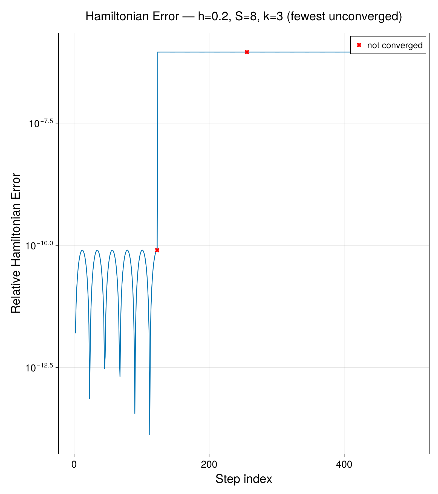<br/><small>S=8 · R=4 · k=3 · λ=1.0e-7 · f_abs=0.0 · x_suc=4.440892098500626e-16 · dogleg · Float64<br/>Unconverged: 0.4%</small></td></tr></table></td><td><table style="width:100%"><tr><td style="text-align:center;vertical-align:top;width:50%"><strong>Min-Max Error: 3.054e-09</strong><br/>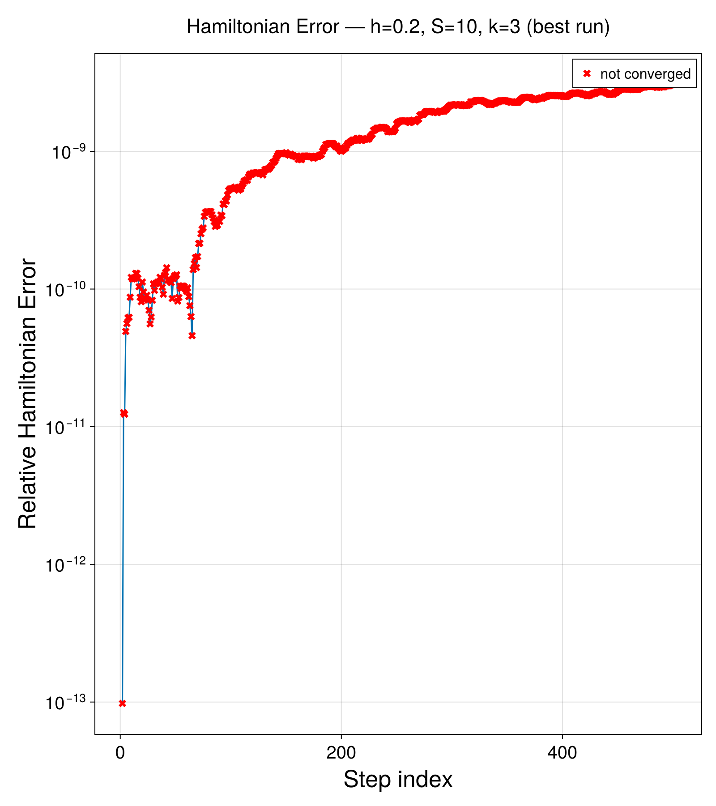<br/><small>S=10 · R=4 · k=3 · λ=0.0 · f_abs=-2.220446049250313e-16 · x_suc=-2.220446049250313e-16 · backtracking · Float64<br/>Unconverged: 100.0%</small></td><td style="text-align:center;vertical-align:top;width:50%"><strong>Fewest Unconverged Run — Error: 4.713e-06</strong><br/>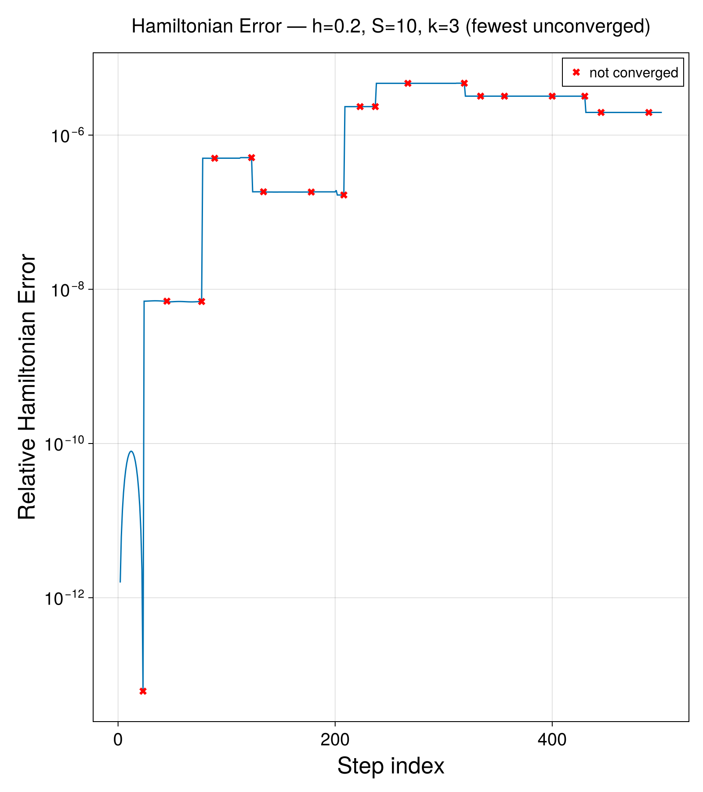<br/><small>S=10 · R=16 · k=3 · λ=1.0e-7 · f_abs=-2.220446049250313e-16 · x_suc=-2.220446049250313e-16 · dogleg · Float64<br/>Unconverged: 3.6%</small></td></tr></table></td><td><table style="width:100%"><tr><td style="text-align:center;vertical-align:top;width:50%"><strong>Min-Max Error: 9.549e-10</strong><br/>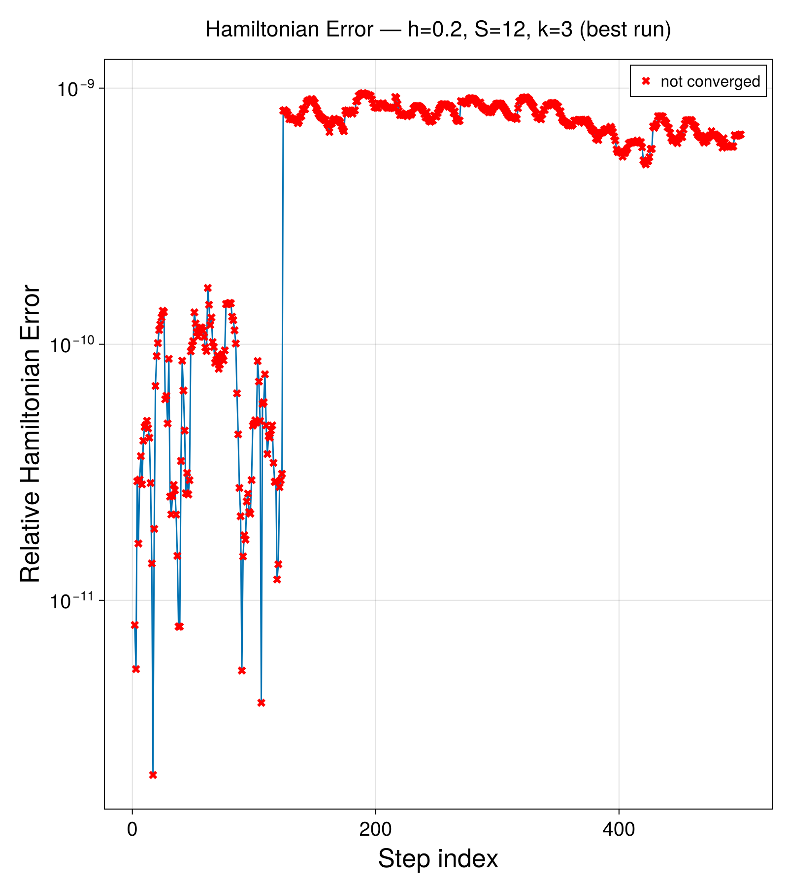<br/><small>S=12 · R=4 · k=3 · λ=0.0 · f_abs=-2.220446049250313e-16 · x_suc=-2.220446049250313e-16 · backtracking · Float64<br/>Unconverged: 100.0%</small></td><td style="text-align:center;vertical-align:top;width:50%"><strong>Fewest Unconverged Run — Error: 4.146e-06</strong><br/>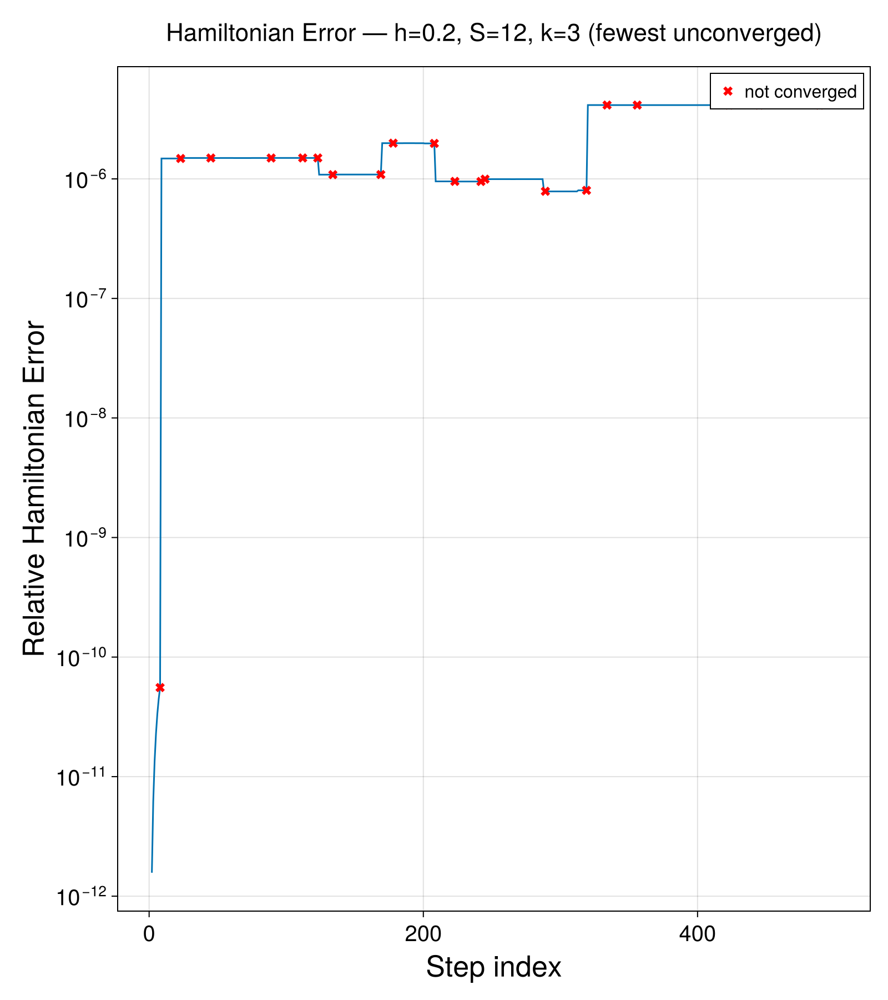<br/><small>S=12 · R=16 · k=3 · λ=1.0e-7 · f_abs=-2.220446049250313e-16 · x_suc=-2.220446049250313e-16 · dogleg · Float64<br/>Unconverged: 4.0%</small></td></tr></table></td><td><table style="width:100%"><tr><td style="text-align:center;vertical-align:top;width:50%"><strong>Min-Max Error: 4.359e-09</strong><br/>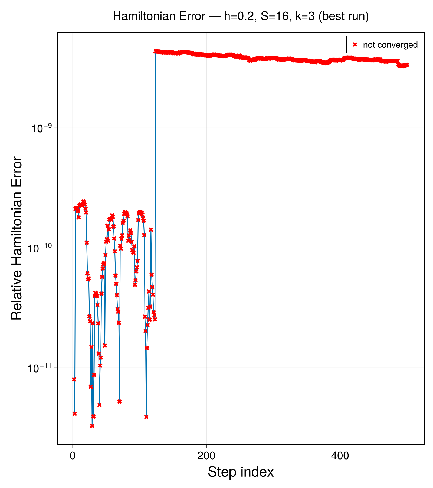<br/><small>S=16 · R=4 · k=3 · λ=0.0 · f_abs=-2.220446049250313e-16 · x_suc=-2.220446049250313e-16 · backtracking · Float64<br/>Unconverged: 100.0%</small></td><td style="text-align:center;vertical-align:top;width:50%"><strong>Fewest Unconverged Run — Error: 2.279e-06</strong><br/>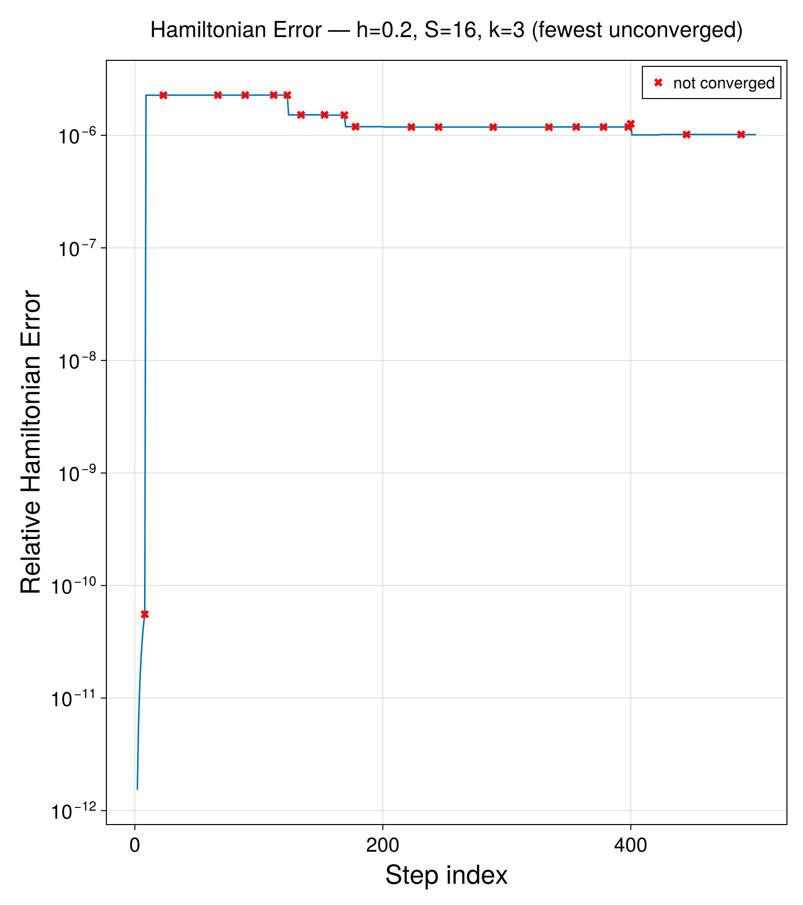<br/><small>S=16 · R=16 · k=3 · λ=1.0e-7 · f_abs=-2.220446049250313e-16 · x_suc=-2.220446049250313e-16 · dogleg · Float64<br/>Unconverged: 4.0%</small></td></tr></table></td></tr>
<tr><th>k = 4</th><td><table style="width:100%"><tr><td style="text-align:center;vertical-align:top;width:50%"><strong>Min-Max Error: 1.963e-04</strong><br/><br/><small>S=4 · R=4 · k=4 · λ=0.001 · f_abs=-2.220446049250313e-16 · x_suc=-2.220446049250313e-16 · dogleg · Float64<br/>Unconverged: 100.0%</small></td><td style="text-align:center;vertical-align:top;width:50%"><strong>Fewest Unconverged Run — Error: 5.409e-02</strong><br/>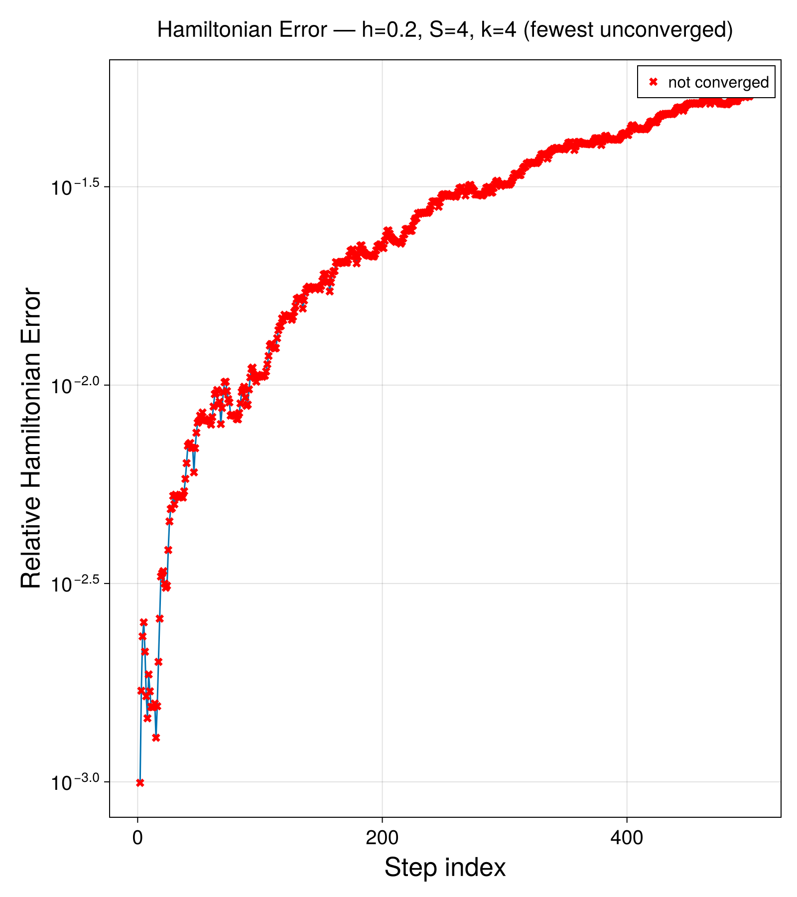<br/><small>S=4 · R=4 · k=4 · λ=1.0e-7 · f_abs=-2.220446049250313e-16 · x_suc=-2.220446049250313e-16 · dogleg · Float64<br/>Unconverged: 99.0%</small></td></tr></table></td><td><table style="width:100%"><tr><td style="text-align:center;vertical-align:top;width:50%"><strong>Min-Max Error: 1.681e-06</strong><br/><br/><small>S=6 · R=16 · k=4 · λ=1.0e-5 · f_abs=-2.220446049250313e-16 · x_suc=-2.220446049250313e-16 · dogleg · Float64<br/>Unconverged: 100.0%</small></td><td style="text-align:center;vertical-align:top;width:50%"><strong>Fewest Unconverged Run — Error: 2.759e-05</strong><br/>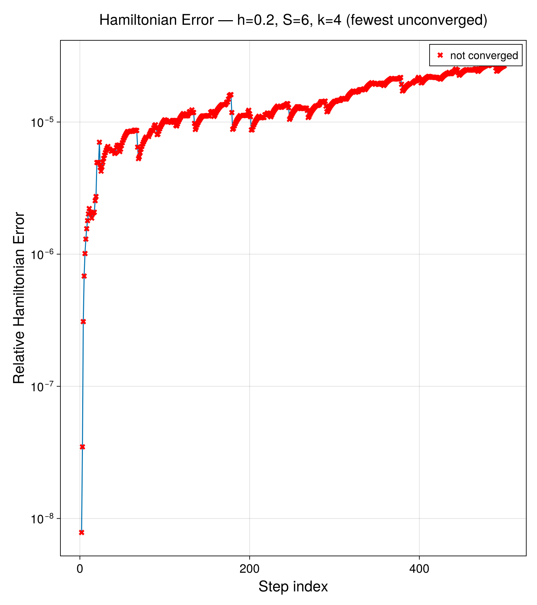<br/><small>S=6 · R=8 · k=4 · λ=1.0e-7 · f_abs=-2.220446049250313e-16 · x_suc=-2.220446049250313e-16 · backtracking · Float64<br/>Unconverged: 96.4%</small></td></tr></table></td><td><table style="width:100%"><tr><td style="text-align:center;vertical-align:top;width:50%"><strong>Min-Max Error: 1.239e-06</strong><br/><br/><small>S=8 · R=16 · k=4 · λ=1.0e-5 · f_abs=-2.220446049250313e-16 · x_suc=-2.220446049250313e-16 · backtracking · Float64<br/>Unconverged: 100.0%</small></td><td style="text-align:center;vertical-align:top;width:50%"><strong>Fewest Unconverged Run — Error: 1.191e-05</strong><br/>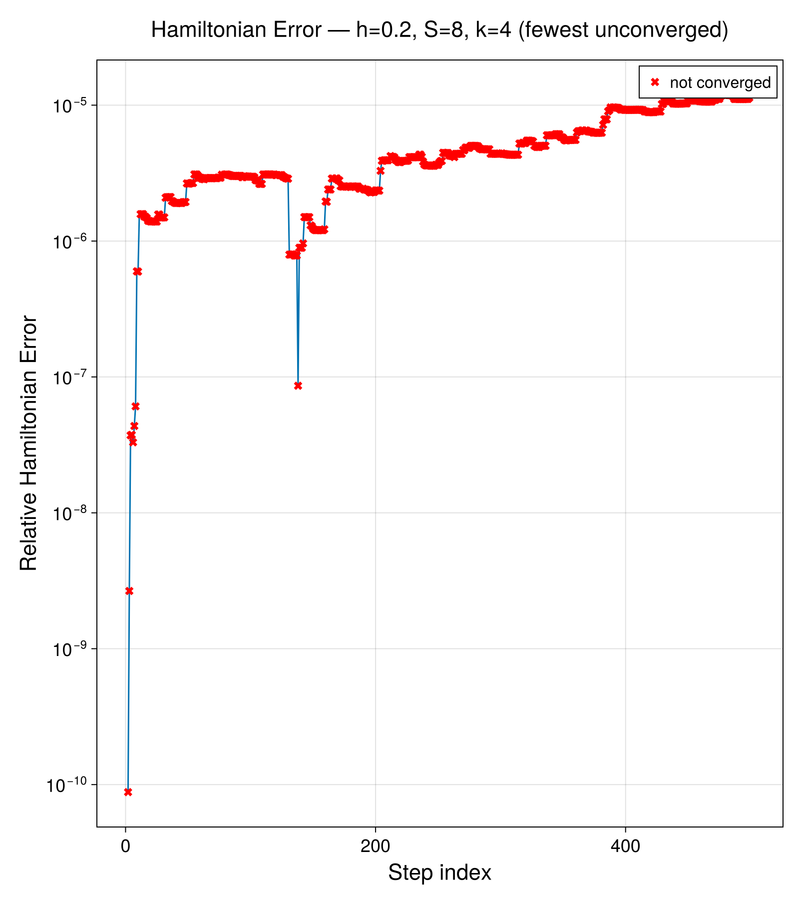<br/><small>S=8 · R=8 · k=4 · λ=0.0 · f_abs=-2.220446049250313e-16 · x_suc=-2.220446049250313e-16 · dogleg · Float64<br/>Unconverged: 97.6%</small></td></tr></table></td><td><table style="width:100%"><tr><td style="text-align:center;vertical-align:top;width:50%"><strong>Min-Max Error: 3.895e-06</strong><br/>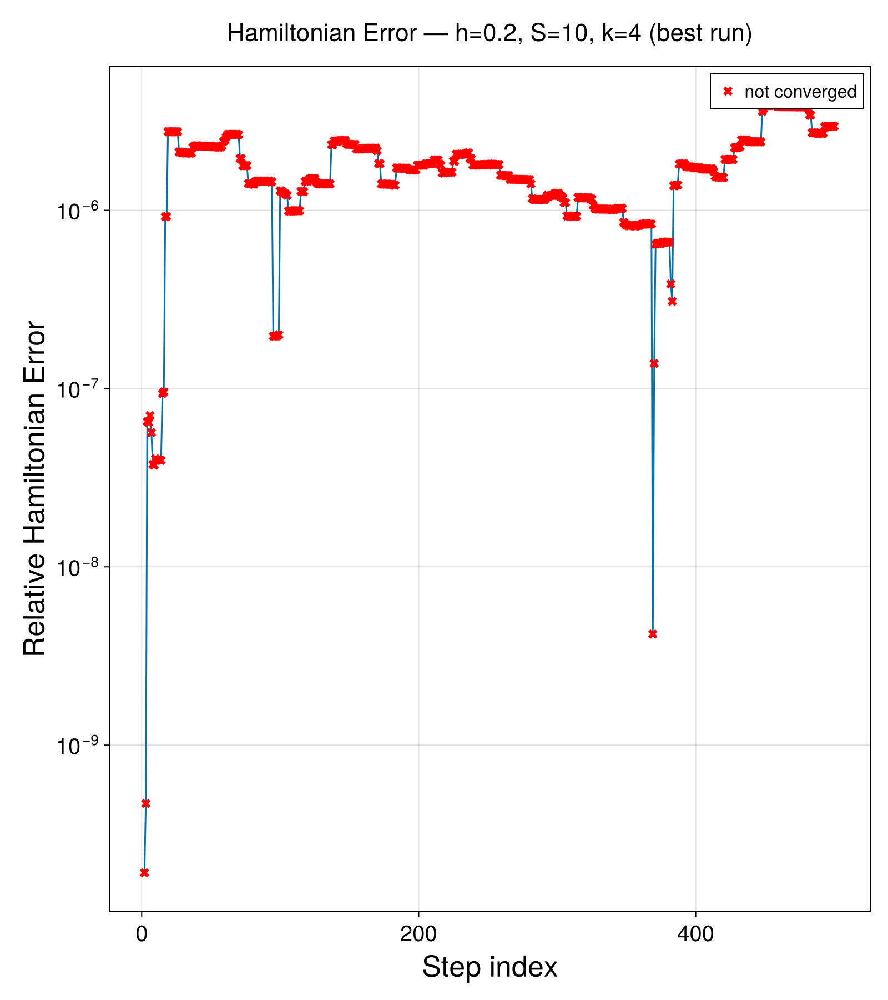<br/><small>S=10 · R=8 · k=4 · λ=0.0 · f_abs=-2.220446049250313e-16 · x_suc=-2.220446049250313e-16 · dogleg · Float64<br/>Unconverged: 100.0%</small></td><td style="text-align:center;vertical-align:top;width:50%"><strong>Fewest Unconverged Run — Error: 5.672e-05</strong><br/>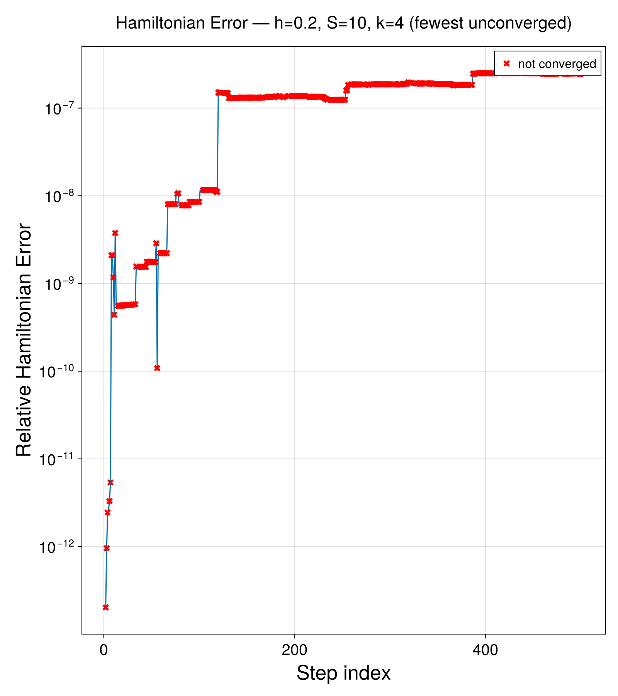<br/><small>S=10 · R=8 · k=4 · λ=1.0e-7 · f_abs=-2.220446049250313e-16 · x_suc=-2.220446049250313e-16 · backtracking · Float64<br/>Unconverged: 99.6%</small></td></tr></table></td><td><table style="width:100%"><tr><td style="text-align:center;vertical-align:top;width:50%"><strong>Min-Max Error: 1.718e-06</strong><br/>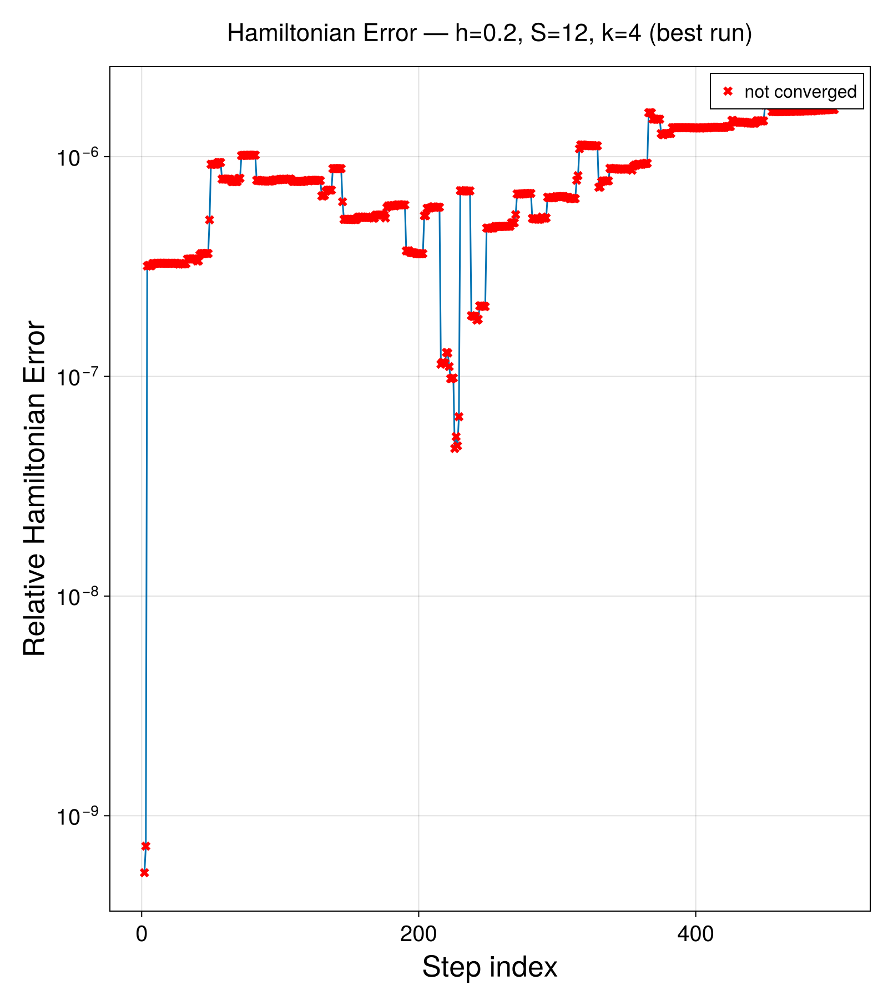<br/><small>S=12 · R=4 · k=4 · λ=0.0 · f_abs=-2.220446049250313e-16 · x_suc=-2.220446049250313e-16 · dogleg · Float64<br/>Unconverged: 100.0%</small></td><td style="text-align:center;vertical-align:top;width:50%"><strong>Fewest Unconverged Run — Error: 2.978e-05</strong><br/>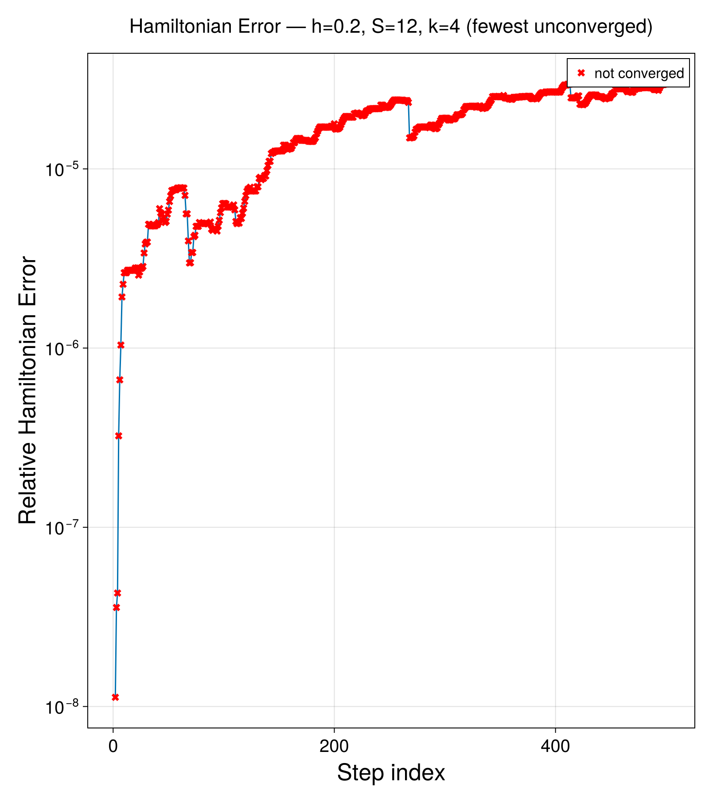<br/><small>S=12 · R=8 · k=4 · λ=1.0e-7 · f_abs=-2.220446049250313e-16 · x_suc=-2.220446049250313e-16 · backtracking · Float64<br/>Unconverged: 99.8%</small></td></tr></table></td><td><table style="width:100%"><tr><td style="text-align:center;vertical-align:top;width:50%"><strong>Min-Max Error: 2.847e-06</strong><br/>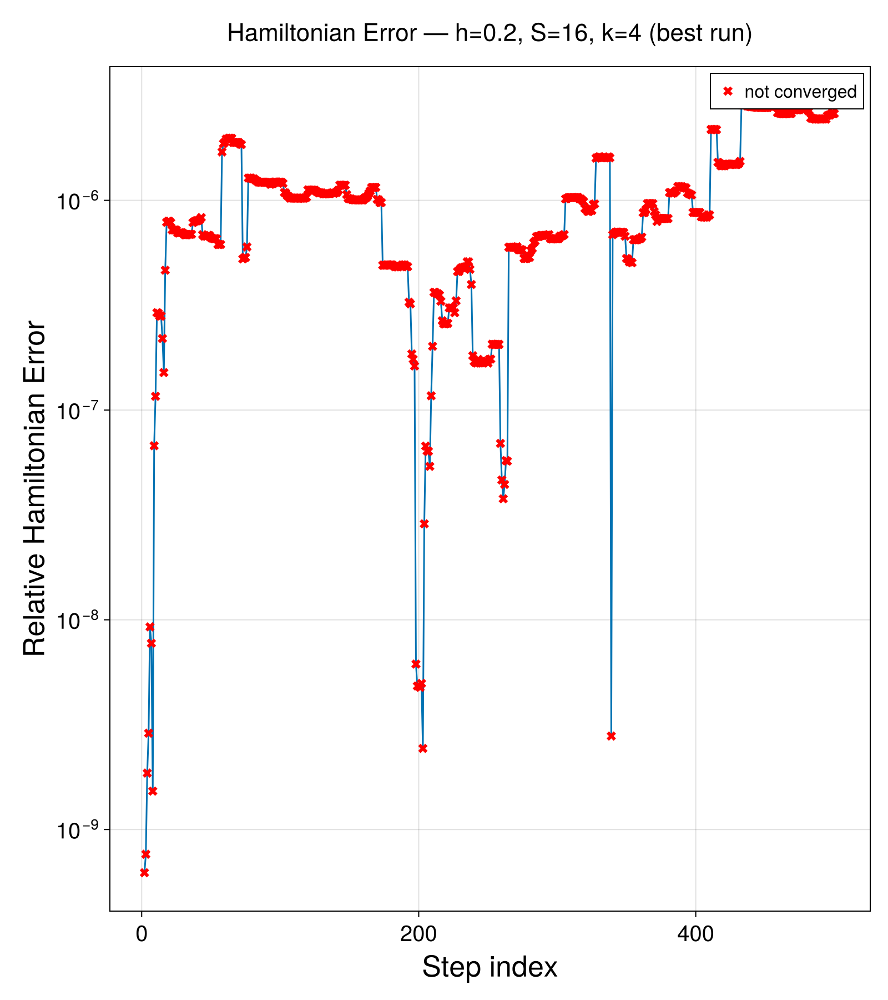<br/><small>S=16 · R=8 · k=4 · λ=0.0 · f_abs=-2.220446049250313e-16 · x_suc=-2.220446049250313e-16 · dogleg · Float64<br/>Unconverged: 100.0%</small></td><td style="text-align:center;vertical-align:top;width:50%"><strong>Fewest Unconverged Run — Error: 5.427e-05</strong><br/>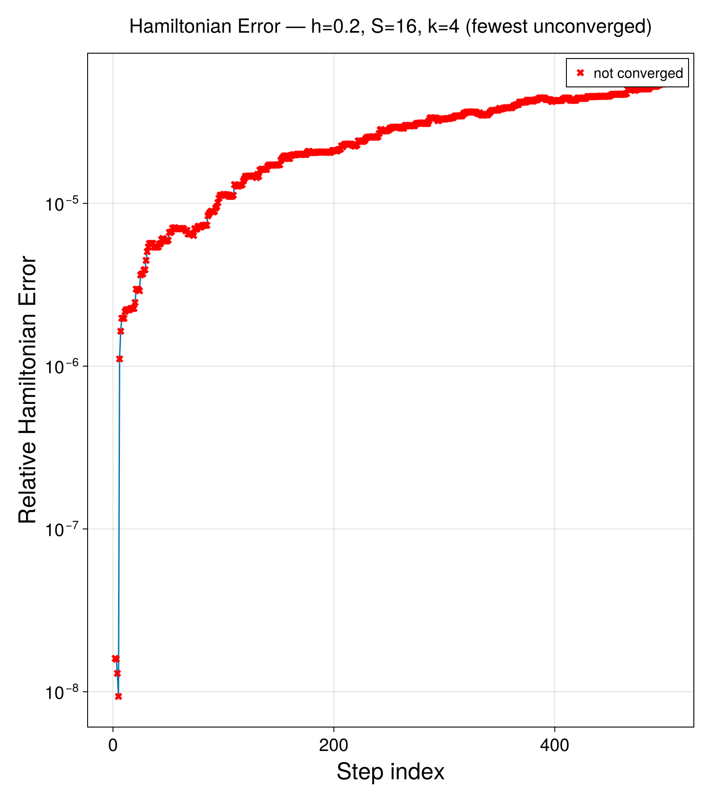<br/><small>S=16 · R=4 · k=4 · λ=1.0e-7 · f_abs=-2.220446049250313e-16 · x_suc=-2.220446049250313e-16 · backtracking · Float64<br/>Unconverged: 99.4%</small></td></tr></table></td></tr>
</tbody></table>

### h = 0.5

<table>
<thead><tr><th></th><th>S = 4</th><th>S = 6</th><th>S = 8</th><th>S = 10</th><th>S = 12</th><th>S = 16</th></tr></thead>
<tbody>
<tr><th>k = 2</th><td><table style="width:100%"><tr><td style="text-align:center;vertical-align:top;width:50%"><strong>Min-Max Error: 2.198e-05</strong><br/>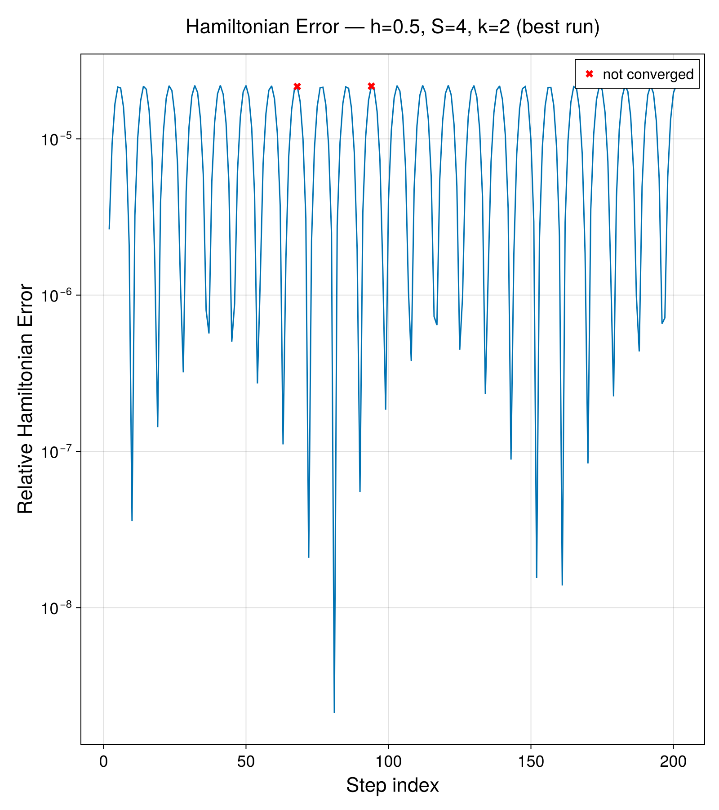<br/><small>S=4 · R=4 · k=2 · λ=1.0e-5 · f_abs=0.0 · x_suc=4.440892098500626e-16 · dogleg · Float64<br/>Unconverged: 1.0%</small></td><td style="text-align:center;vertical-align:top;width:50%"><strong>Fewest Unconverged Run — Error: 2.198e-05</strong><br/>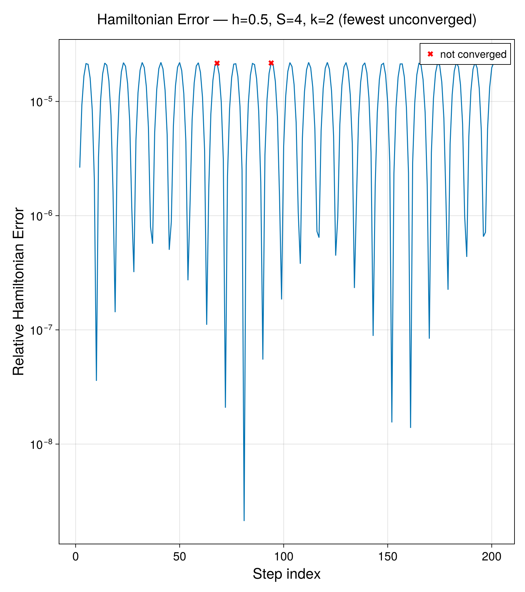<br/><small>S=4 · R=4 · k=2 · λ=1.0e-5 · f_abs=0.0 · x_suc=4.440892098500626e-16 · dogleg · Float64<br/>Unconverged: 1.0%</small></td></tr></table></td><td><table style="width:100%"><tr><td style="text-align:center;vertical-align:top;width:50%"><strong>Min-Max Error: 2.286e-05</strong><br/>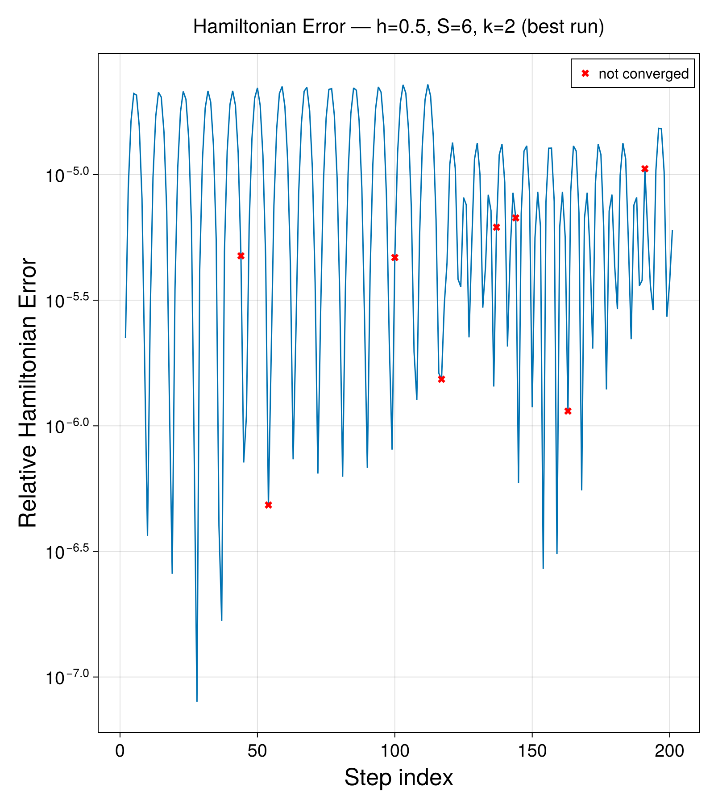<br/><small>S=6 · R=8 · k=2 · λ=1.0e-7 · f_abs=-2.220446049250313e-16 · x_suc=-2.220446049250313e-16 · dogleg · Float64<br/>Unconverged: 4.0%</small></td><td style="text-align:center;vertical-align:top;width:50%"><strong>Fewest Unconverged Run — Error: 5.245e-04</strong><br/>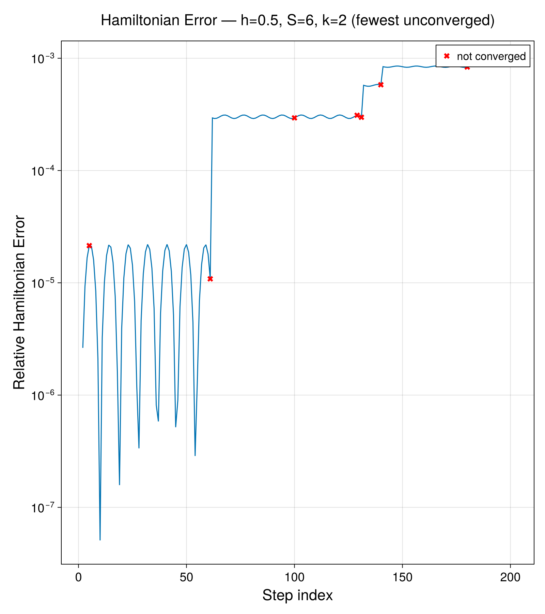<br/><small>S=6 · R=4 · k=2 · λ=1.0e-5 · f_abs=-2.220446049250313e-16 · x_suc=-2.220446049250313e-16 · dogleg · Float64<br/>Unconverged: 2.0%</small></td></tr></table></td><td><table style="width:100%"><tr><td style="text-align:center;vertical-align:top;width:50%"><strong>Min-Max Error: 2.004e-05</strong><br/>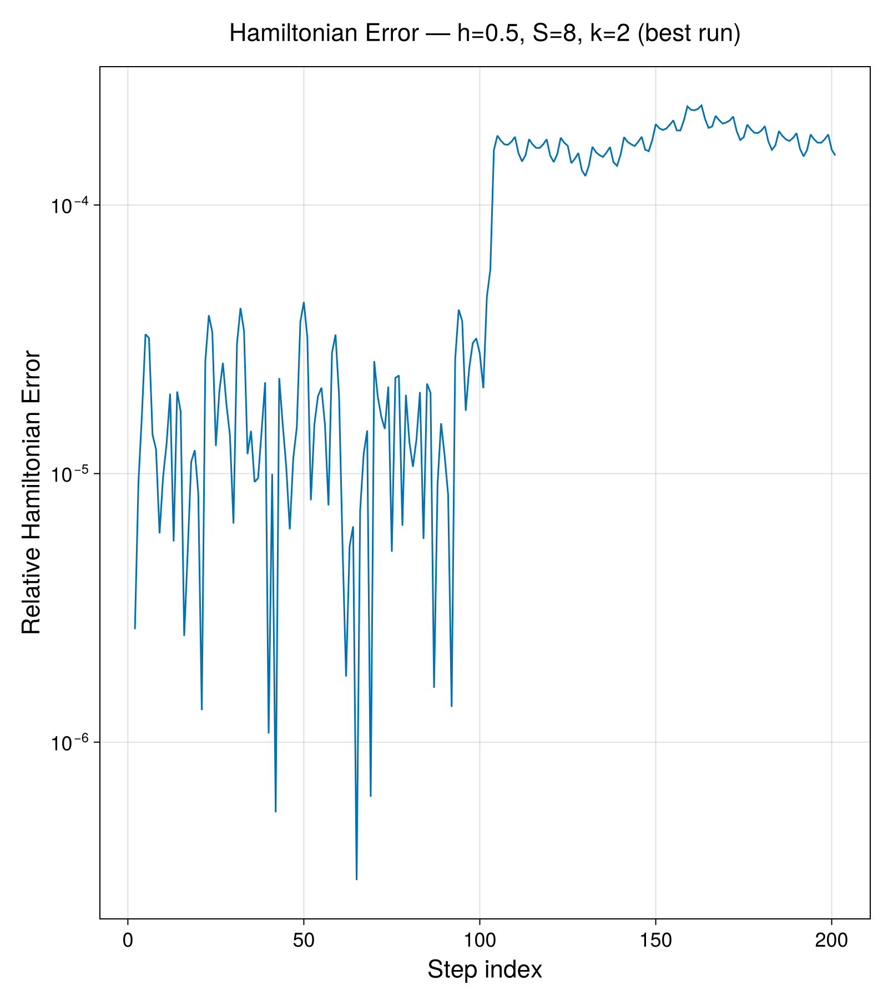<br/><small>S=8 · R=4 · k=2 · λ=1.0e-7 · f_abs=0.0 · x_suc=4.440892098500626e-16 · backtracking · Float64<br/>Unconverged: 1.5%</small></td><td style="text-align:center;vertical-align:top;width:50%"><strong>Fewest Unconverged Run — Error: 2.198e-05</strong><br/>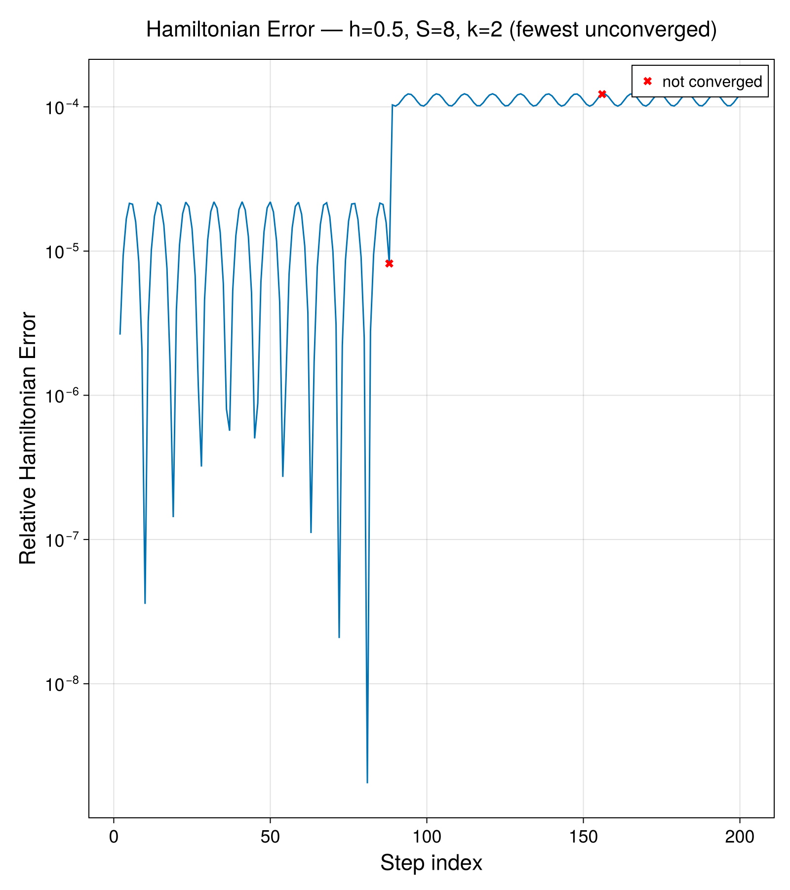<br/><small>S=8 · R=4 · k=2 · λ=1.0e-5 · f_abs=-2.220446049250313e-16 · x_suc=-2.220446049250313e-16 · dogleg · Float64<br/>Unconverged: 0.5%</small></td></tr></table></td><td><table style="width:100%"><tr><td style="text-align:center;vertical-align:top;width:50%"><strong>Min-Max Error: 2.665e-05</strong><br/>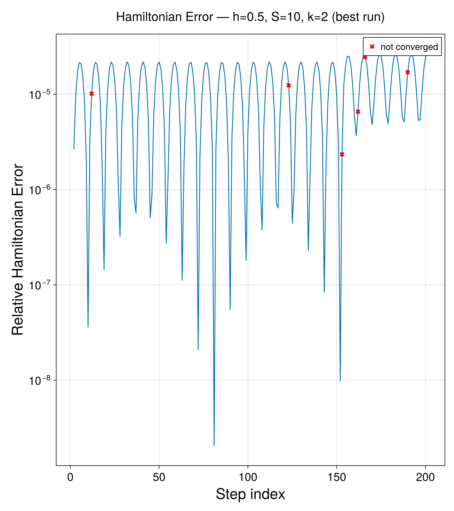<br/><small>S=10 · R=4 · k=2 · λ=1.0e-7 · f_abs=-2.220446049250313e-16 · x_suc=-2.220446049250313e-16 · dogleg · Float64<br/>Unconverged: 3.0%</small></td><td style="text-align:center;vertical-align:top;width:50%"><strong>Fewest Unconverged Run — Error: 6.066e-05</strong><br/>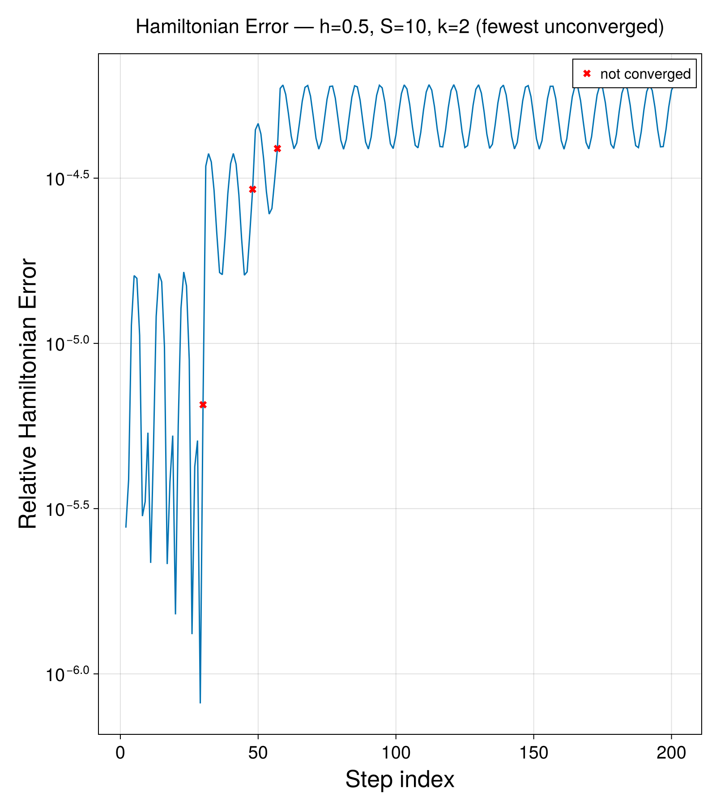<br/><small>S=10 · R=4 · k=2 · λ=1.0e-5 · f_abs=-2.220446049250313e-16 · x_suc=-2.220446049250313e-16 · dogleg · Float64<br/>Unconverged: 1.5%</small></td></tr></table></td><td><table style="width:100%"><tr><td style="text-align:center;vertical-align:top;width:50%"><strong>Min-Max Error: 5.036e-05</strong><br/>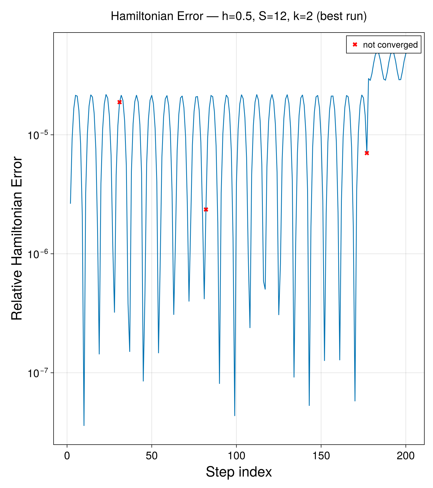<br/><small>S=12 · R=4 · k=2 · λ=1.0e-7 · f_abs=-2.220446049250313e-16 · x_suc=-2.220446049250313e-16 · dogleg · Float64<br/>Unconverged: 1.5%</small></td><td style="text-align:center;vertical-align:top;width:50%"><strong>Fewest Unconverged Run — Error: 5.036e-05</strong><br/>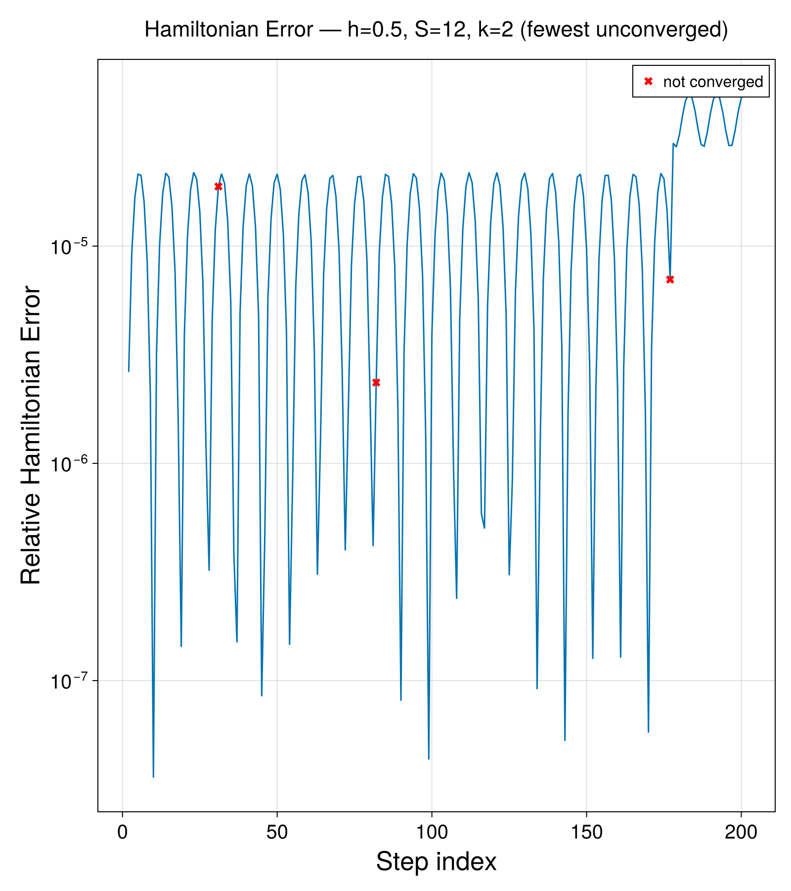<br/><small>S=12 · R=4 · k=2 · λ=1.0e-7 · f_abs=-2.220446049250313e-16 · x_suc=-2.220446049250313e-16 · dogleg · Float64<br/>Unconverged: 1.5%</small></td></tr></table></td><td><table style="width:100%"><tr><td style="text-align:center;vertical-align:top;width:50%"><strong>Min-Max Error: 1.459e-04</strong><br/>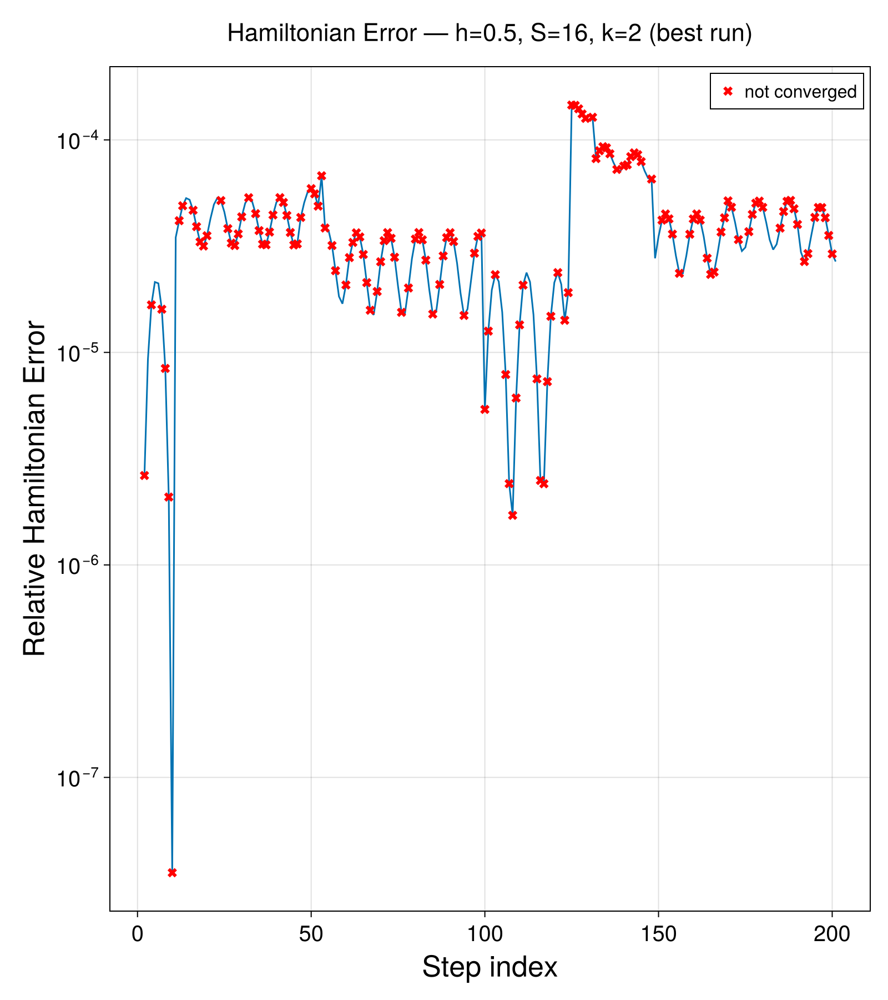<br/><small>S=16 · R=4 · k=2 · λ=0.0 · f_abs=-2.220446049250313e-16 · x_suc=-2.220446049250313e-16 · dogleg · Float64<br/>Unconverged: 71.5%</small></td><td style="text-align:center;vertical-align:top;width:50%"><strong>Fewest Unconverged Run — Error: 2.647e-04</strong><br/>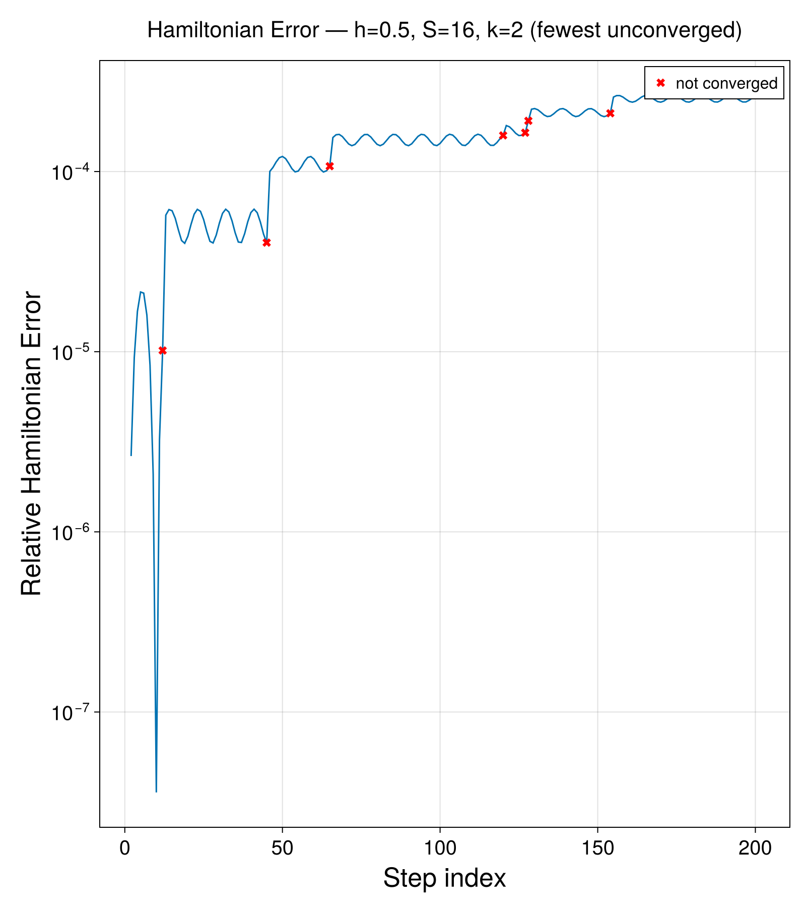<br/><small>S=16 · R=4 · k=2 · λ=1.0e-5 · f_abs=-2.220446049250313e-16 · x_suc=-2.220446049250313e-16 · dogleg · Float64<br/>Unconverged: 3.5%</small></td></tr></table></td></tr>
<tr><th>k = 3</th><td><table style="width:100%"><tr><td style="text-align:center;vertical-align:top;width:50%"><strong>Min-Max Error: 1.965e-08</strong><br/><br/><small>S=4 · R=8 · k=3 · λ=0.0 · f_abs=-2.220446049250313e-16 · x_suc=-2.220446049250313e-16 · dogleg · Float64<br/>Unconverged: 13.5%</small></td><td style="text-align:center;vertical-align:top;width:50%"><strong>Fewest Unconverged Run — Error: 1.968e-08</strong><br/>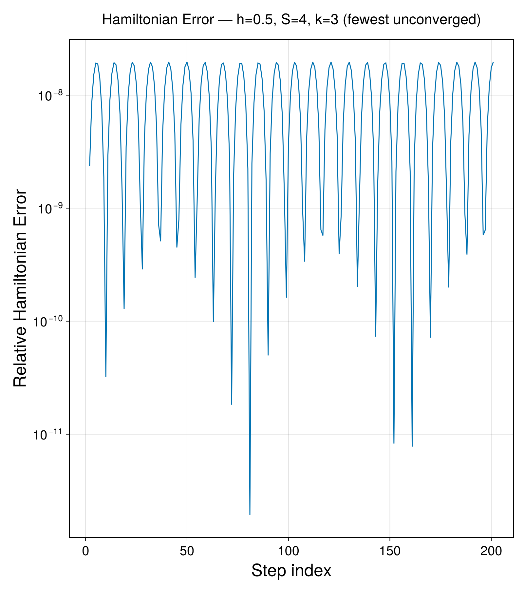<br/><small>S=4 · R=4 · k=3 · λ=1.0e-5 · f_abs=-2.220446049250313e-16 · x_suc=-2.220446049250313e-16 · dogleg · Float64<br/>Unconverged: 0.0%</small></td></tr></table></td><td><table style="width:100%"><tr><td style="text-align:center;vertical-align:top;width:50%"><strong>Min-Max Error: 1.919e-07</strong><br/><br/><small>S=6 · R=4 · k=3 · λ=1.0e-7 · f_abs=-2.220446049250313e-16 · x_suc=-2.220446049250313e-16 · dogleg · Float64<br/>Unconverged: 6.5%</small></td><td style="text-align:center;vertical-align:top;width:50%"><strong>Fewest Unconverged Run — Error: 5.692e-05</strong><br/>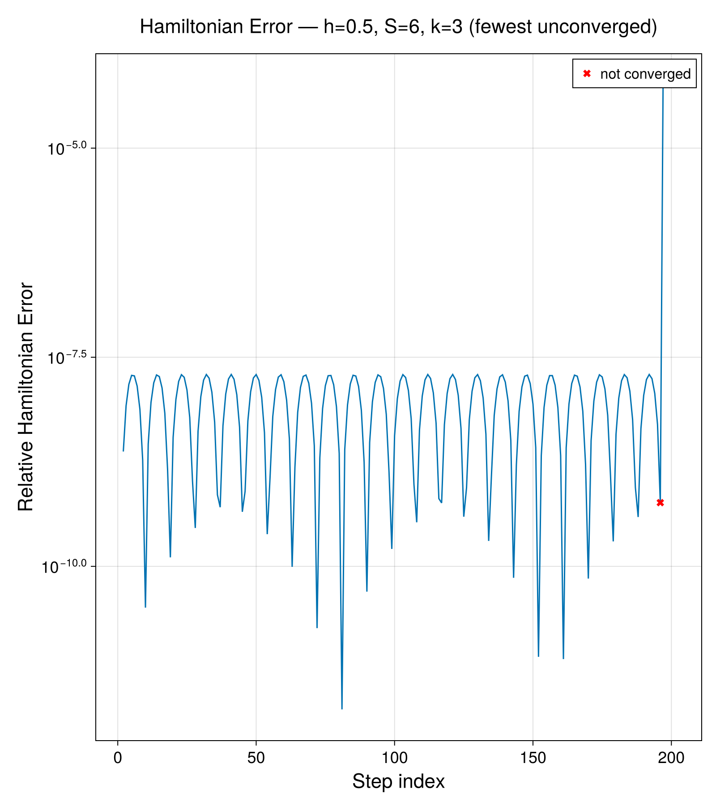<br/><small>S=6 · R=4 · k=3 · λ=1.0e-5 · f_abs=0.0 · x_suc=4.440892098500626e-16 · dogleg · Float64<br/>Unconverged: 0.5%</small></td></tr></table></td><td><table style="width:100%"><tr><td style="text-align:center;vertical-align:top;width:50%"><strong>Min-Max Error: 1.056e-06</strong><br/><br/><small>S=8 · R=4 · k=3 · λ=1.0e-5 · f_abs=-2.220446049250313e-16 · x_suc=-2.220446049250313e-16 · dogleg · Float64<br/>Unconverged: 0.5%</small></td><td style="text-align:center;vertical-align:top;width:50%"><strong>Fewest Unconverged Run — Error: 1.056e-06</strong><br/>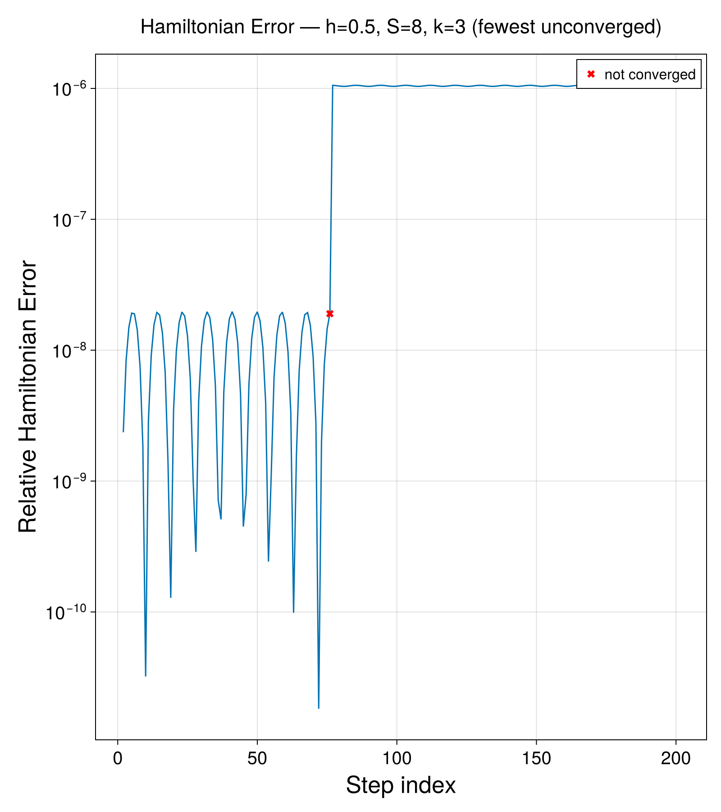<br/><small>S=8 · R=4 · k=3 · λ=1.0e-5 · f_abs=-2.220446049250313e-16 · x_suc=-2.220446049250313e-16 · dogleg · Float64<br/>Unconverged: 0.5%</small></td></tr></table></td><td><table style="width:100%"><tr><td style="text-align:center;vertical-align:top;width:50%"><strong>Min-Max Error: 1.445e-06</strong><br/>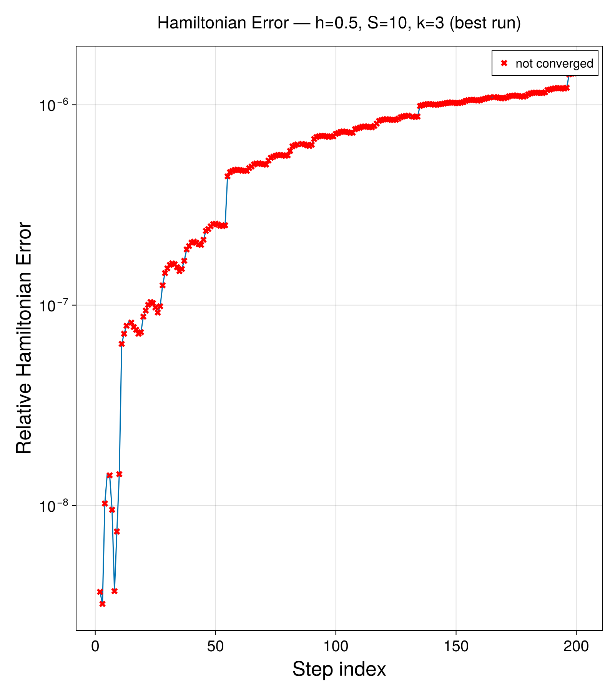<br/><small>S=10 · R=4 · k=3 · λ=1.0e-7 · f_abs=-2.220446049250313e-16 · x_suc=-2.220446049250313e-16 · dogleg · Float64<br/>Unconverged: 97.5%</small></td><td style="text-align:center;vertical-align:top;width:50%"><strong>Fewest Unconverged Run — Error: 1.642e-04</strong><br/>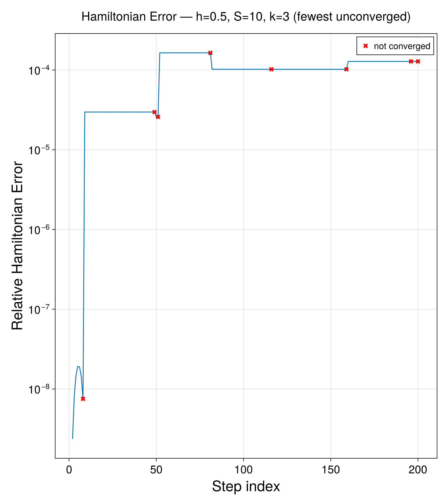<br/><small>S=10 · R=8 · k=3 · λ=1.0e-5 · f_abs=-2.220446049250313e-16 · x_suc=-2.220446049250313e-16 · dogleg · Float64<br/>Unconverged: 4.0%</small></td></tr></table></td><td><table style="width:100%"><tr><td style="text-align:center;vertical-align:top;width:50%"><strong>Min-Max Error: 1.759e-06</strong><br/>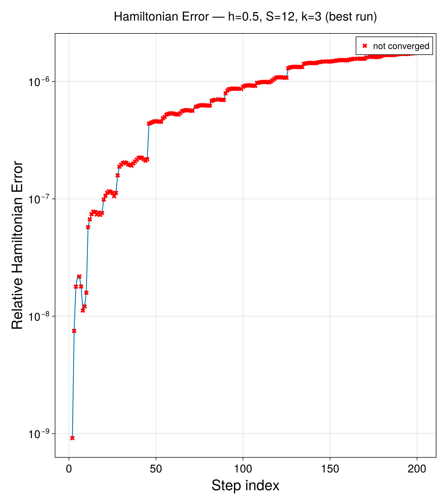<br/><small>S=12 · R=4 · k=3 · λ=1.0e-7 · f_abs=-2.220446049250313e-16 · x_suc=-2.220446049250313e-16 · dogleg · Float64<br/>Unconverged: 96.5%</small></td><td style="text-align:center;vertical-align:top;width:50%"><strong>Fewest Unconverged Run — Error: 2.955e-04</strong><br/>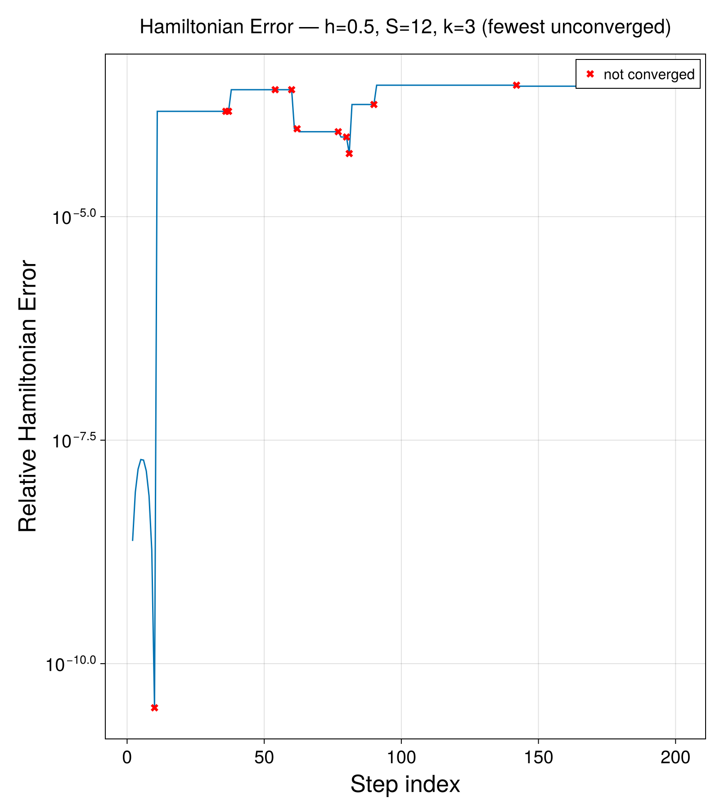<br/><small>S=12 · R=8 · k=3 · λ=1.0e-5 · f_abs=-2.220446049250313e-16 · x_suc=-2.220446049250313e-16 · dogleg · Float64<br/>Unconverged: 5.5%</small></td></tr></table></td><td><table style="width:100%"><tr><td style="text-align:center;vertical-align:top;width:50%"><strong>Min-Max Error: 1.311e-05</strong><br/>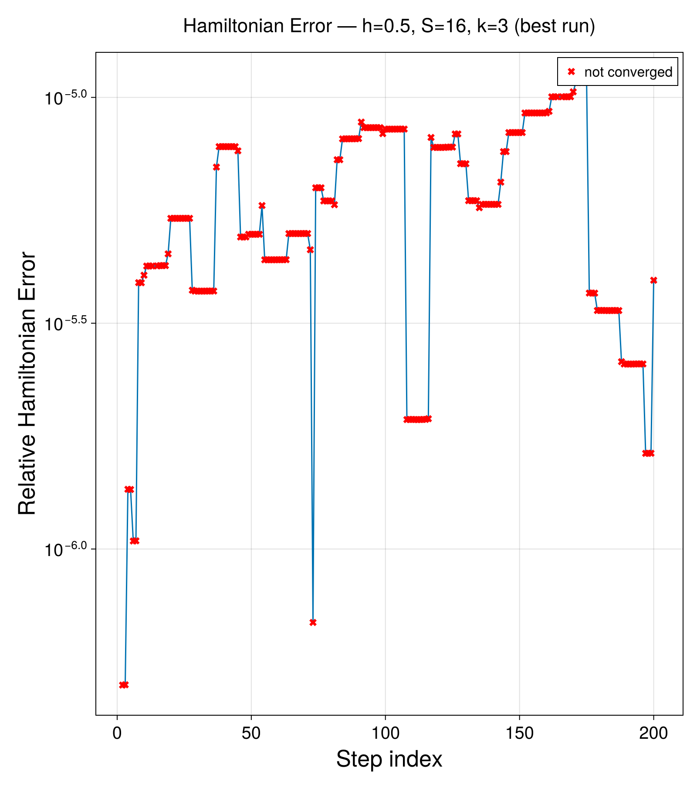<br/><small>S=16 · R=4 · k=3 · λ=1.0e-7 · f_abs=-2.220446049250313e-16 · x_suc=-2.220446049250313e-16 · dogleg · Float64<br/>Unconverged: 98.0%</small></td><td style="text-align:center;vertical-align:top;width:50%"><strong>Fewest Unconverged Run — Error: 5.670e-04</strong><br/>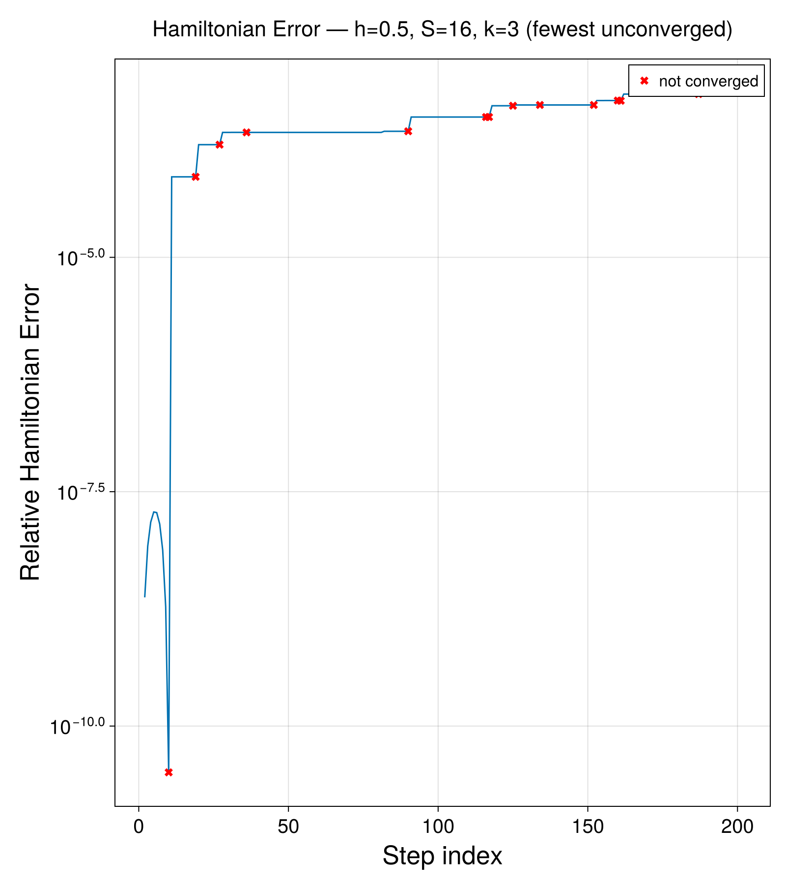<br/><small>S=16 · R=8 · k=3 · λ=1.0e-5 · f_abs=-2.220446049250313e-16 · x_suc=-2.220446049250313e-16 · dogleg · Float64<br/>Unconverged: 6.5%</small></td></tr></table></td></tr>
<tr><th>k = 4</th><td><table style="width:100%"><tr><td style="text-align:center;vertical-align:top;width:50%"><strong>Min-Max Error: 3.988e-05</strong><br/><br/><small>S=4 · R=4 · k=4 · λ=0.001 · f_abs=-2.220446049250313e-16 · x_suc=-2.220446049250313e-16 · dogleg · Float64<br/>Unconverged: 100.0%</small></td><td style="text-align:center;vertical-align:top;width:50%"><strong>Fewest Unconverged Run — Error: 4.897e-02</strong><br/>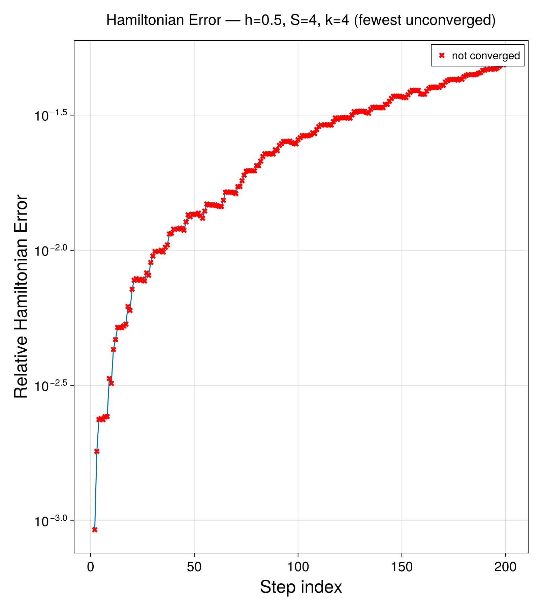<br/><small>S=4 · R=16 · k=4 · λ=1.0e-7 · f_abs=-2.220446049250313e-16 · x_suc=-2.220446049250313e-16 · dogleg · Float64<br/>Unconverged: 97.5%</small></td></tr></table></td><td><table style="width:100%"><tr><td style="text-align:center;vertical-align:top;width:50%"><strong>Min-Max Error: 1.165e-05</strong><br/><br/><small>S=6 · R=16 · k=4 · λ=1.0e-7 · f_abs=-2.220446049250313e-16 · x_suc=-2.220446049250313e-16 · dogleg · Float64<br/>Unconverged: 97.0%</small></td><td style="text-align:center;vertical-align:top;width:50%"><strong>Fewest Unconverged Run — Error: 1.511e-05</strong><br/>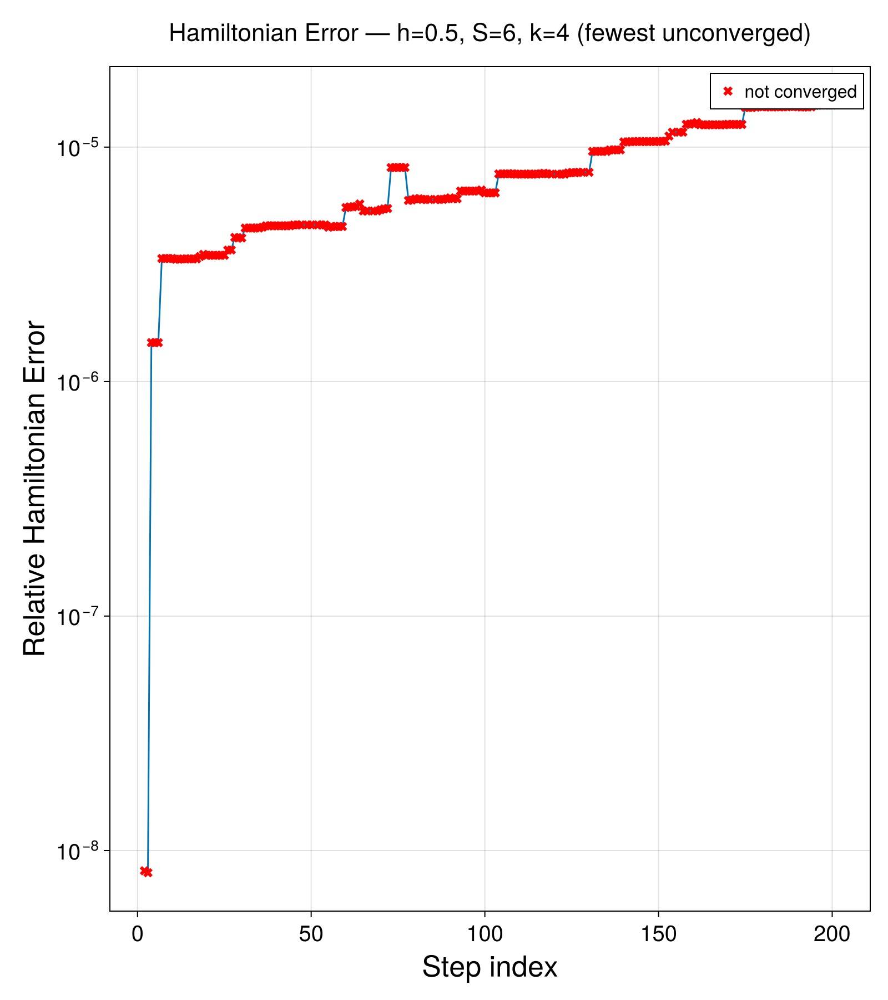<br/><small>S=6 · R=8 · k=4 · λ=0.0 · f_abs=-2.220446049250313e-16 · x_suc=-2.220446049250313e-16 · dogleg · Float64<br/>Unconverged: 96.5%</small></td></tr></table></td><td><table style="width:100%"><tr><td style="text-align:center;vertical-align:top;width:50%"><strong>Min-Max Error: 2.387e-05</strong><br/><br/><small>S=8 · R=16 · k=4 · λ=1.0e-7 · f_abs=-2.220446049250313e-16 · x_suc=-2.220446049250313e-16 · dogleg · Float64<br/>Unconverged: 98.0%</small></td><td style="text-align:center;vertical-align:top;width:50%"><strong>Fewest Unconverged Run — Error: 1.339e-03</strong><br/>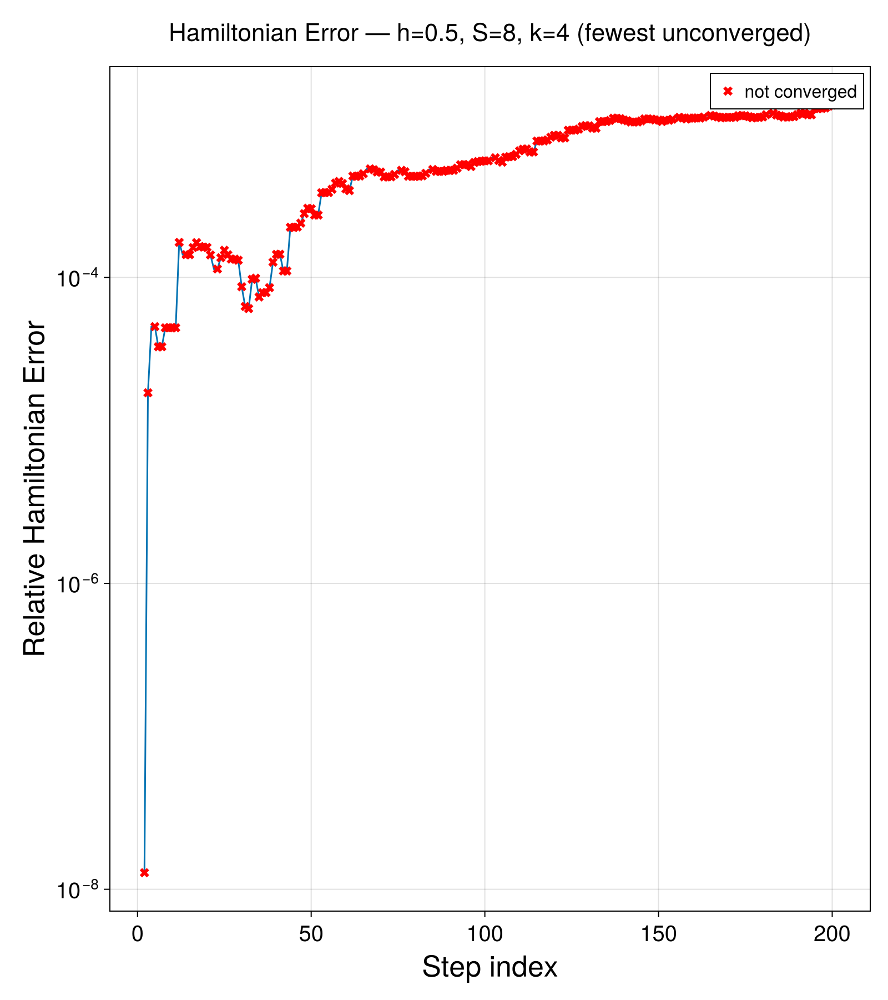<br/><small>S=8 · R=4 · k=4 · λ=1.0e-5 · f_abs=-2.220446049250313e-16 · x_suc=-2.220446049250313e-16 · dogleg · Float64<br/>Unconverged: 94.5%</small></td></tr></table></td><td><table style="width:100%"><tr><td style="text-align:center;vertical-align:top;width:50%"><strong>Min-Max Error: 1.816e-05</strong><br/>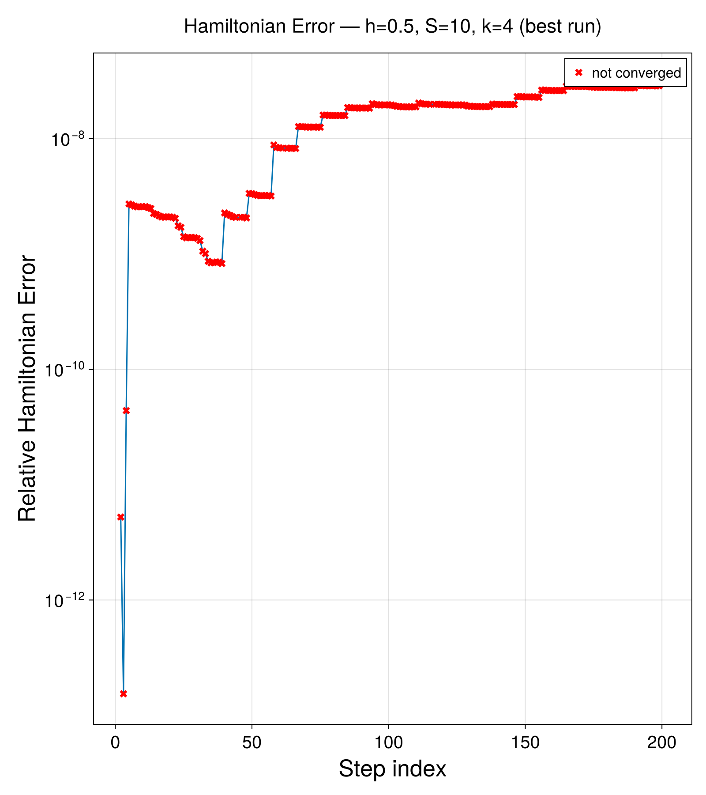<br/><small>S=10 · R=16 · k=4 · λ=0.001 · f_abs=-2.220446049250313e-16 · x_suc=-2.220446049250313e-16 · dogleg · Float64<br/>Unconverged: 100.0%</small></td><td style="text-align:center;vertical-align:top;width:50%"><strong>Fewest Unconverged Run — Error: 2.783e-04</strong><br/>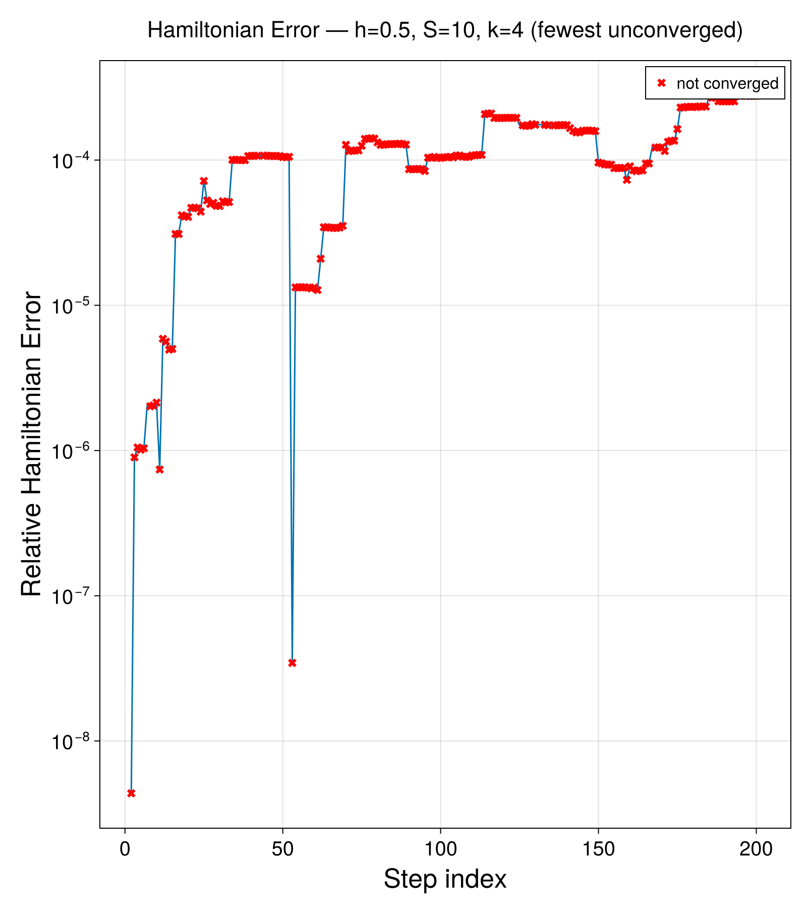<br/><small>S=10 · R=8 · k=4 · λ=1.0e-7 · f_abs=-2.220446049250313e-16 · x_suc=-2.220446049250313e-16 · backtracking · Float64<br/>Unconverged: 95.5%</small></td></tr></table></td><td><table style="width:100%"><tr><td style="text-align:center;vertical-align:top;width:50%"><strong>Min-Max Error: 2.235e-05</strong><br/>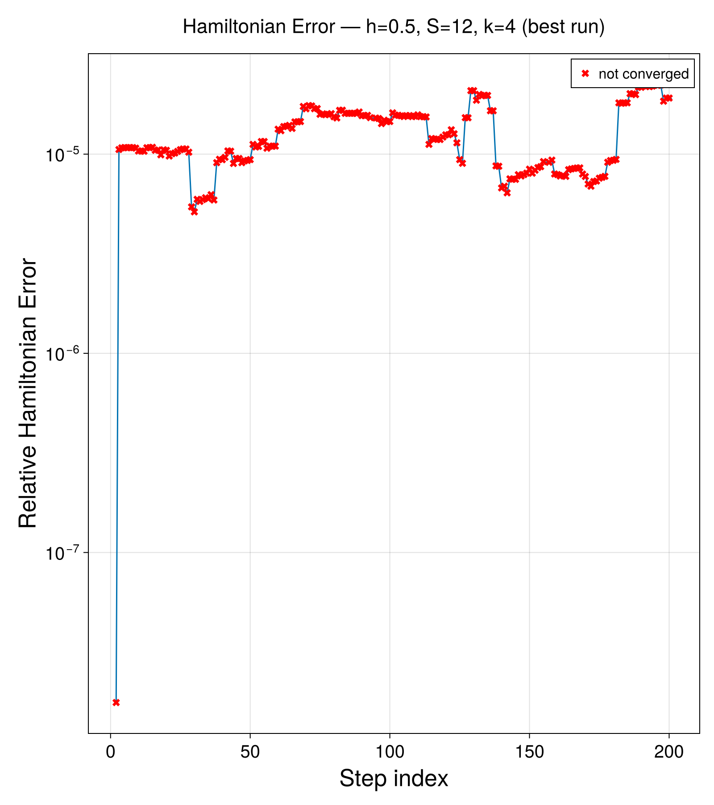<br/><small>S=12 · R=16 · k=4 · λ=1.0e-7 · f_abs=-2.220446049250313e-16 · x_suc=-2.220446049250313e-16 · backtracking · Float64<br/>Unconverged: 99.0%</small></td><td style="text-align:center;vertical-align:top;width:50%"><strong>Fewest Unconverged Run — Error: 2.396e-04</strong><br/>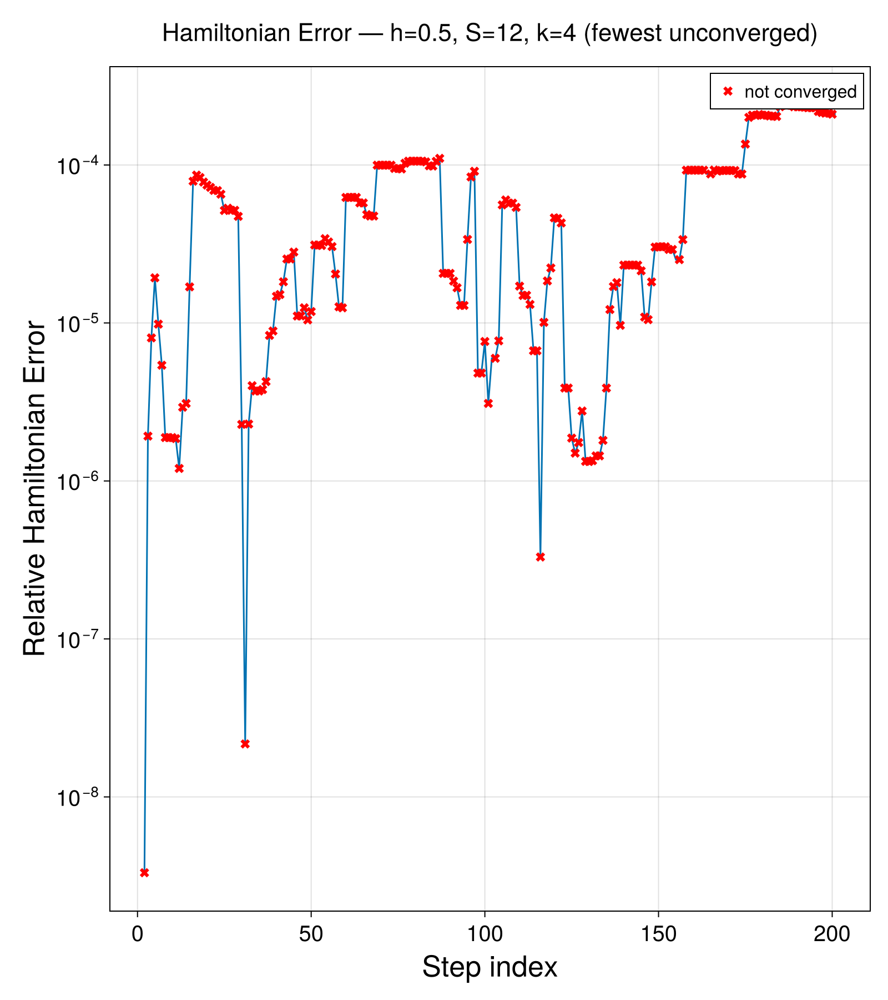<br/><small>S=12 · R=4 · k=4 · λ=1.0e-5 · f_abs=-2.220446049250313e-16 · x_suc=-2.220446049250313e-16 · dogleg · Float64<br/>Unconverged: 98.0%</small></td></tr></table></td><td><table style="width:100%"><tr><td style="text-align:center;vertical-align:top;width:50%"><strong>Min-Max Error: 1.018e-05</strong><br/>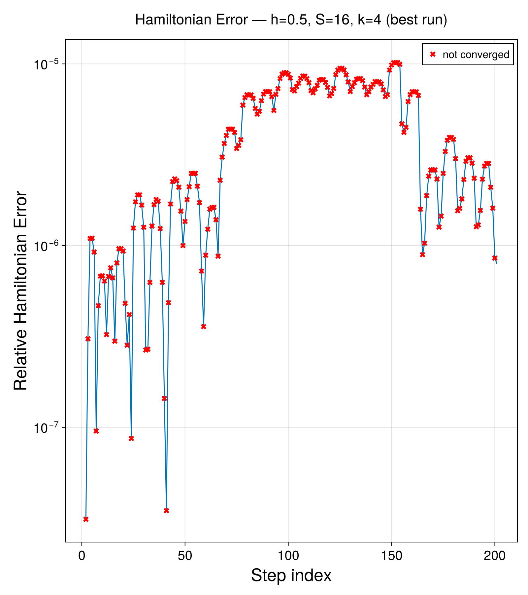<br/><small>S=16 · R=16 · k=4 · λ=0.001 · f_abs=-2.220446049250313e-16 · x_suc=-2.220446049250313e-16 · dogleg · Float64<br/>Unconverged: 100.0%</small></td><td style="text-align:center;vertical-align:top;width:50%"><strong>Fewest Unconverged Run — Error: 7.024e-04</strong><br/>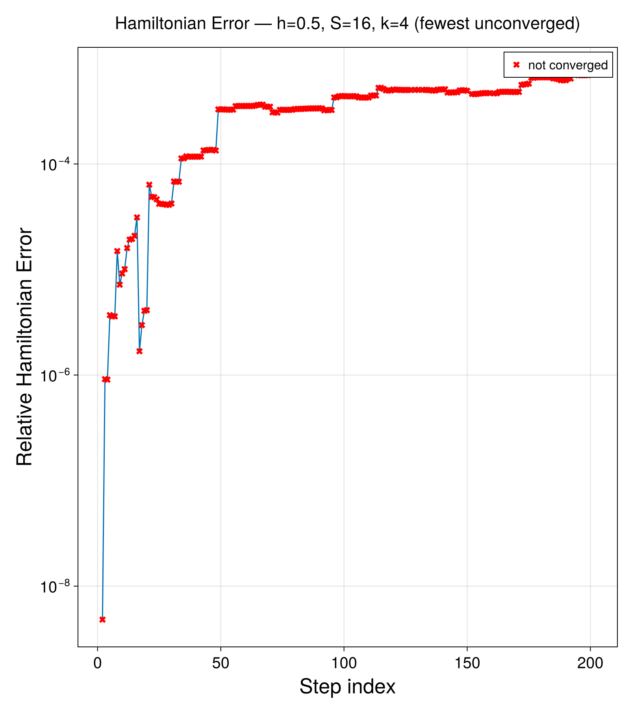<br/><small>S=16 · R=8 · k=4 · λ=1.0e-7 · f_abs=-2.220446049250313e-16 · x_suc=-2.220446049250313e-16 · backtracking · Float64<br/>Unconverged: 98.0%</small></td></tr></table></td></tr>
</tbody></table>

### h = 1.0

<table>
<thead><tr><th></th><th>S = 4</th><th>S = 6</th><th>S = 8</th><th>S = 10</th><th>S = 12</th><th>S = 16</th></tr></thead>
<tbody>
<tr><th>k = 2</th><td><table style="width:100%"><tr><td style="text-align:center;vertical-align:top;width:50%"><strong>Min-Max Error: 3.655e-04</strong><br/>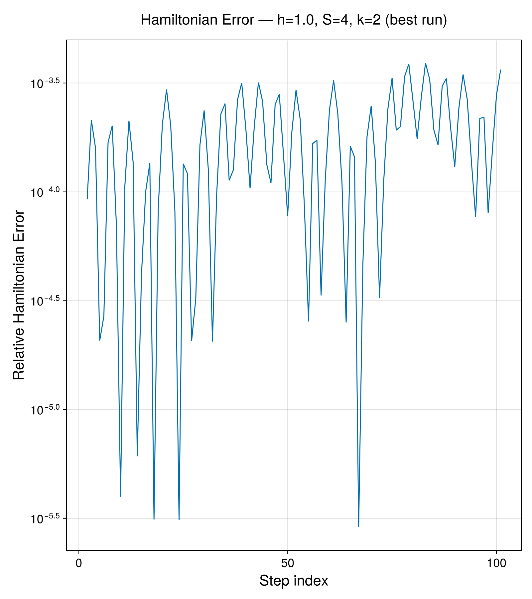<br/><small>S=4 · R=4 · k=2 · λ=0.0 · f_abs=-2.220446049250313e-16 · x_suc=-2.220446049250313e-16 · dogleg · Float64<br/>Unconverged: 46.0%</small></td><td style="text-align:center;vertical-align:top;width:50%"><strong>Fewest Unconverged Run — Error: 3.655e-04</strong><br/>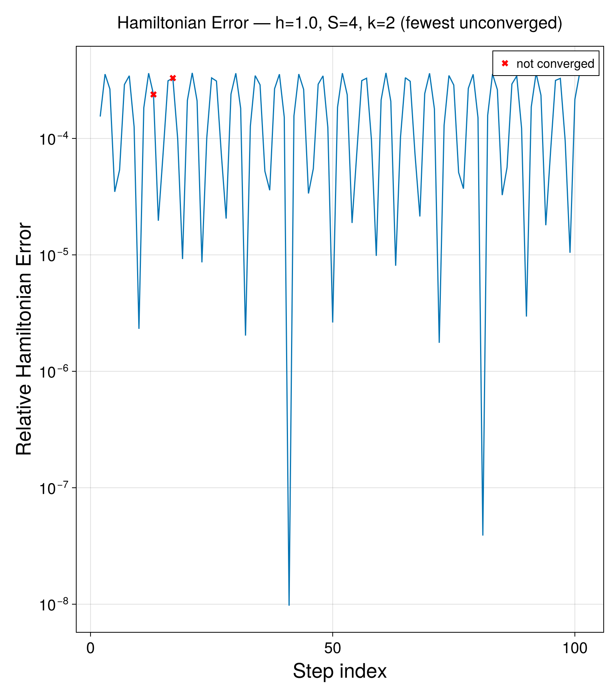<br/><small>S=4 · R=4 · k=2 · λ=1.0e-7 · f_abs=-2.220446049250313e-16 · x_suc=-2.220446049250313e-16 · dogleg · Float64<br/>Unconverged: 2.0%</small></td></tr></table></td><td><table style="width:100%"><tr><td style="text-align:center;vertical-align:top;width:50%"><strong>Min-Max Error: 3.352e-04</strong><br/>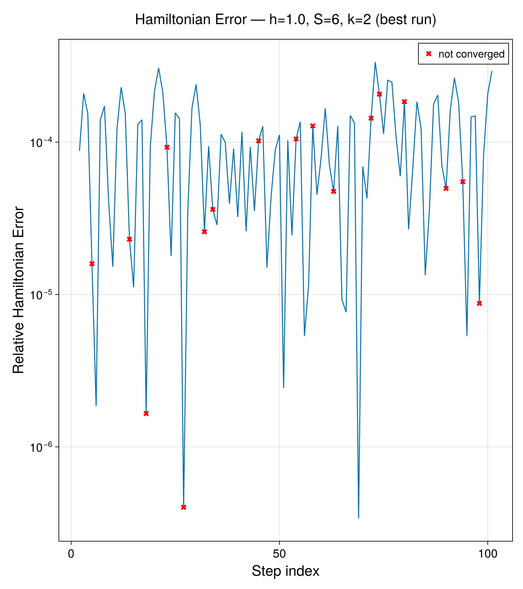<br/><small>S=6 · R=16 · k=2 · λ=0.001 · f_abs=0.0 · x_suc=4.440892098500626e-16 · backtracking · Float64<br/>Unconverged: 17.0%</small></td><td style="text-align:center;vertical-align:top;width:50%"><strong>Fewest Unconverged Run — Error: 1.216e-03</strong><br/>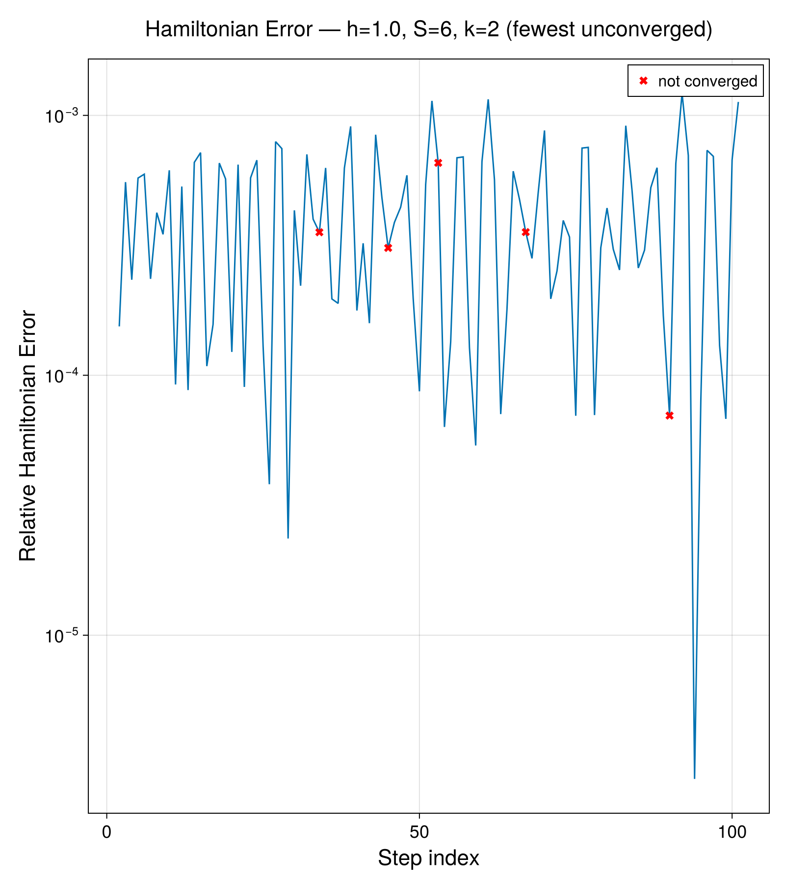<br/><small>S=6 · R=8 · k=2 · λ=0.001 · f_abs=0.0 · x_suc=4.440892098500626e-16 · dogleg · Float64<br/>Unconverged: 5.0%</small></td></tr></table></td><td><table style="width:100%"><tr><td style="text-align:center;vertical-align:top;width:50%"><strong>Min-Max Error: 4.526e-04</strong><br/>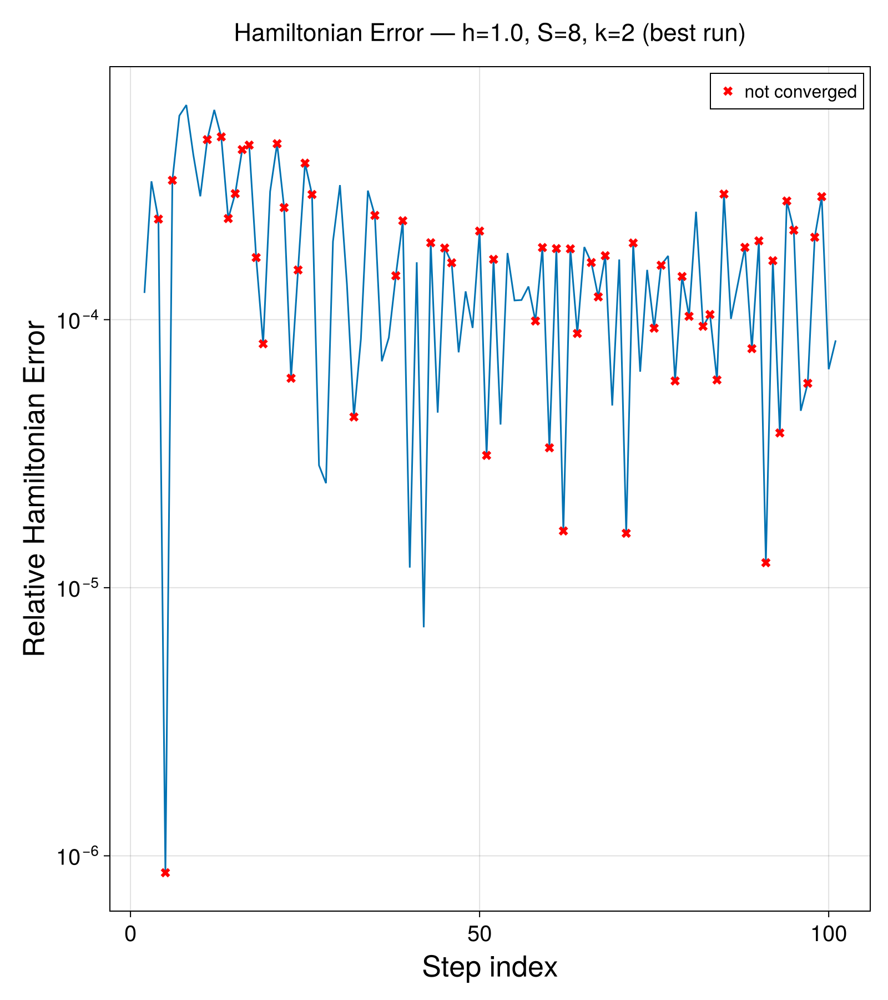<br/><small>S=8 · R=4 · k=2 · λ=1.0e-5 · f_abs=-2.220446049250313e-16 · x_suc=-2.220446049250313e-16 · dogleg · Float64<br/>Unconverged: 5.0%</small></td><td style="text-align:center;vertical-align:top;width:50%"><strong>Fewest Unconverged Run — Error: 4.526e-04</strong><br/>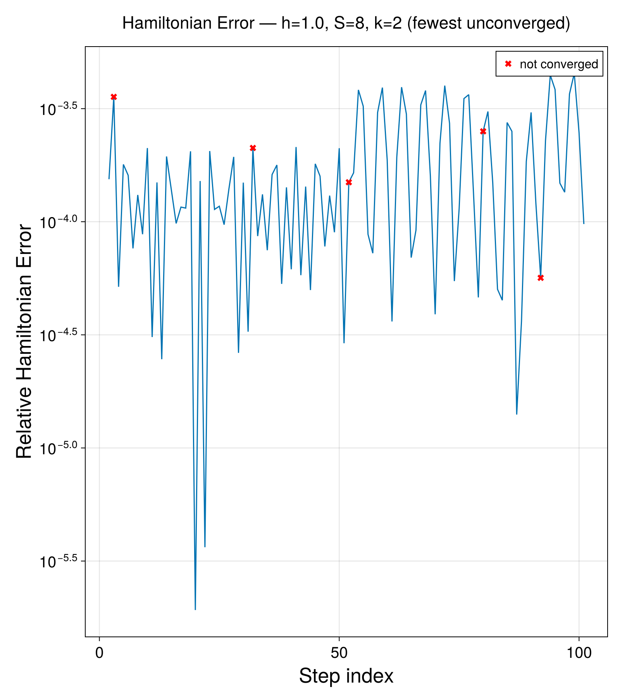<br/><small>S=8 · R=4 · k=2 · λ=1.0e-5 · f_abs=-2.220446049250313e-16 · x_suc=-2.220446049250313e-16 · dogleg · Float64<br/>Unconverged: 5.0%</small></td></tr></table></td><td><table style="width:100%"><tr><td style="text-align:center;vertical-align:top;width:50%"><strong>Min-Max Error: 3.005e-04</strong><br/>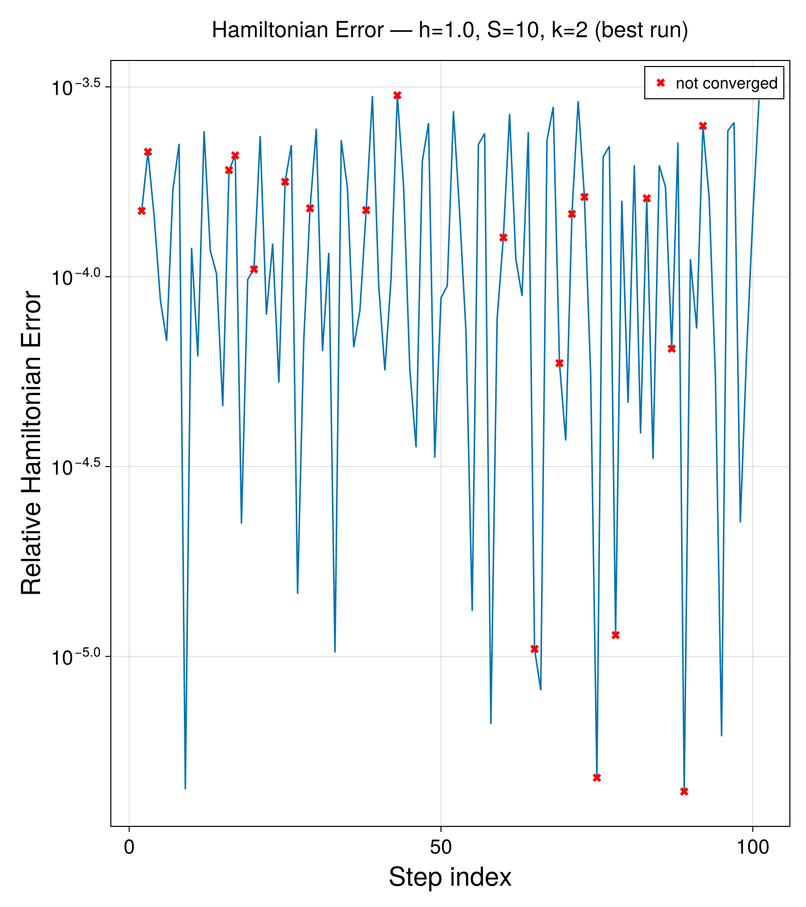<br/><small>S=10 · R=8 · k=2 · λ=1.0e-5 · f_abs=-2.220446049250313e-16 · x_suc=-2.220446049250313e-16 · dogleg · Float64<br/>Unconverged: 20.0%</small></td><td style="text-align:center;vertical-align:top;width:50%"><strong>Fewest Unconverged Run — Error: 3.599e-04</strong><br/>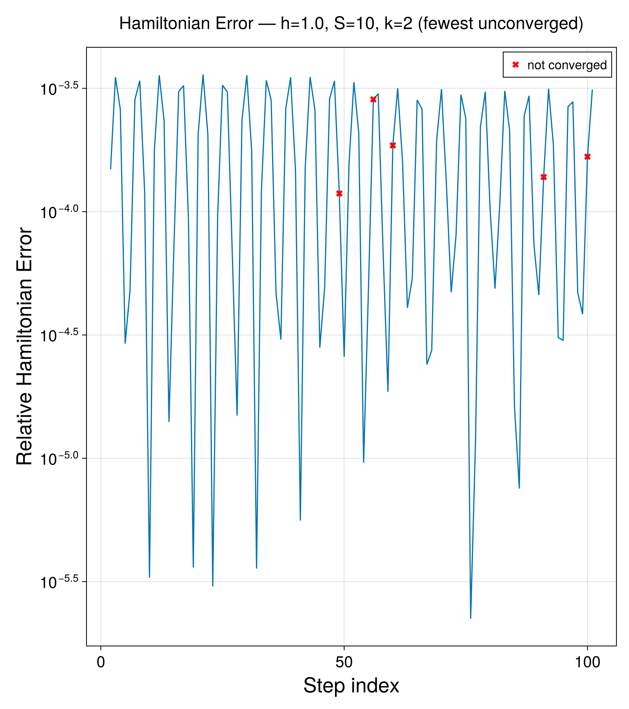<br/><small>S=10 · R=4 · k=2 · λ=1.0e-5 · f_abs=-2.220446049250313e-16 · x_suc=-2.220446049250313e-16 · dogleg · Float64<br/>Unconverged: 5.0%</small></td></tr></table></td><td><table style="width:100%"><tr><td style="text-align:center;vertical-align:top;width:50%"><strong>Min-Max Error: 4.601e-04</strong><br/>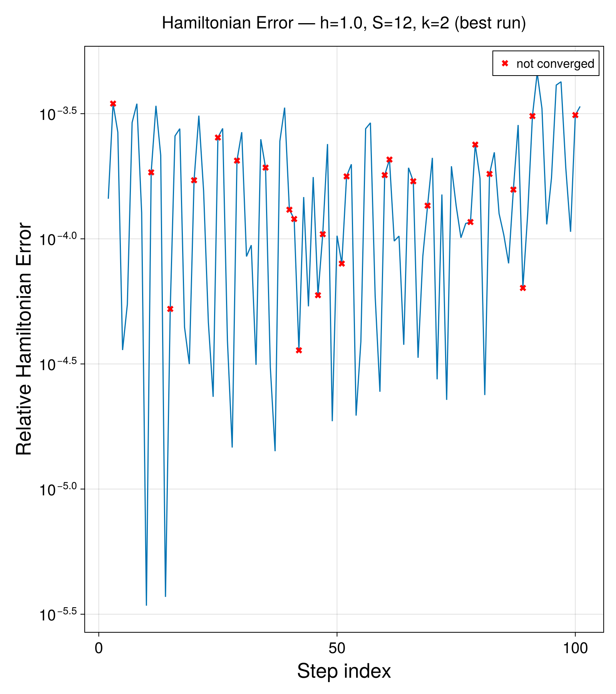<br/><small>S=12 · R=8 · k=2 · λ=1.0e-5 · f_abs=-2.220446049250313e-16 · x_suc=-2.220446049250313e-16 · dogleg · Float64<br/>Unconverged: 25.0%</small></td><td style="text-align:center;vertical-align:top;width:50%"><strong>Fewest Unconverged Run — Error: 5.174e-04</strong><br/>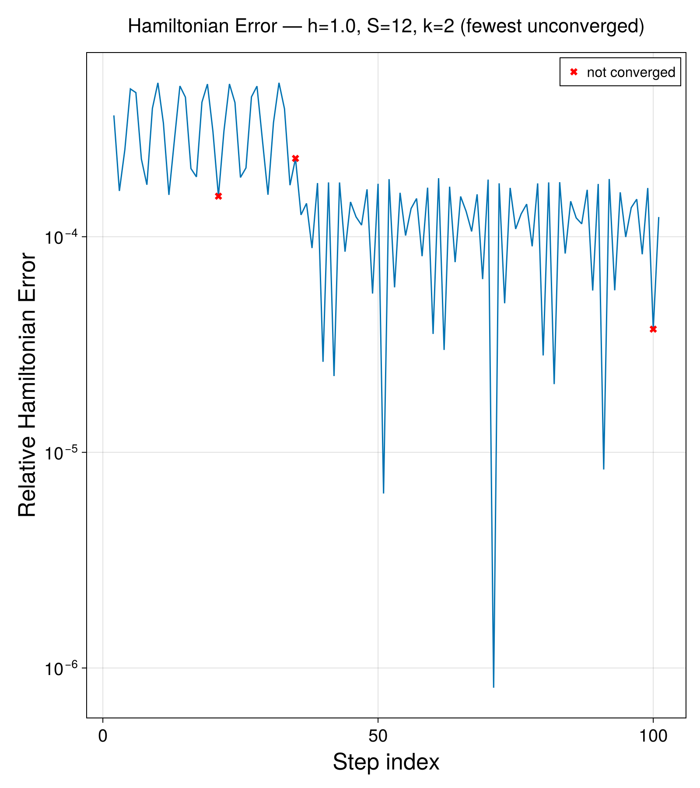<br/><small>S=12 · R=4 · k=2 · λ=1.0e-5 · f_abs=-2.220446049250313e-16 · x_suc=-2.220446049250313e-16 · dogleg · Float64<br/>Unconverged: 3.0%</small></td></tr></table></td><td><table style="width:100%"><tr><td style="text-align:center;vertical-align:top;width:50%"><strong>Min-Max Error: 5.820e-04</strong><br/>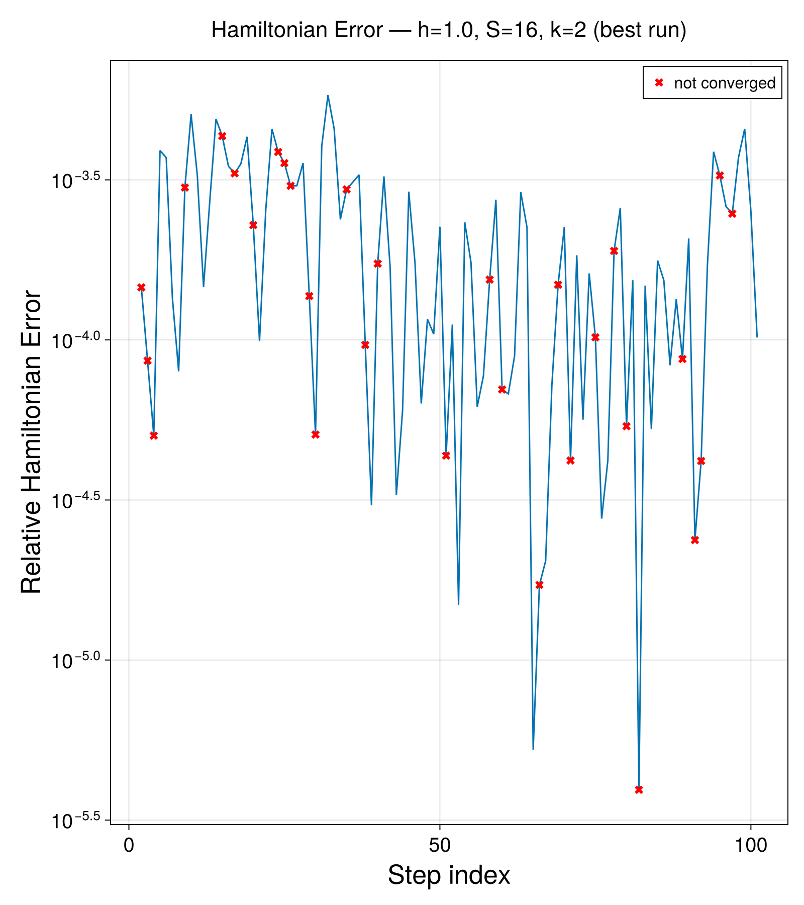<br/><small>S=16 · R=8 · k=2 · λ=1.0e-5 · f_abs=-2.220446049250313e-16 · x_suc=-2.220446049250313e-16 · dogleg · Float64<br/>Unconverged: 30.0%</small></td><td style="text-align:center;vertical-align:top;width:50%"><strong>Fewest Unconverged Run — Error: 7.654e-04</strong><br/>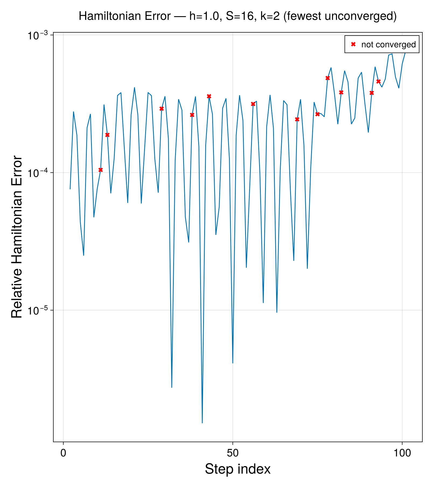<br/><small>S=16 · R=4 · k=2 · λ=1.0e-5 · f_abs=-2.220446049250313e-16 · x_suc=-2.220446049250313e-16 · dogleg · Float64<br/>Unconverged: 12.0%</small></td></tr></table></td></tr>
<tr><th>k = 3</th><td><table style="width:100%"><tr><td style="text-align:center;vertical-align:top;width:50%"><strong>Min-Max Error: 1.321e-06</strong><br/><br/><small>S=4 · R=16 · k=3 · λ=0.0 · f_abs=-2.220446049250313e-16 · x_suc=-2.220446049250313e-16 · dogleg · Float64<br/>Unconverged: 0.0%</small></td><td style="text-align:center;vertical-align:top;width:50%"><strong>Fewest Unconverged Run — Error: 1.321e-06</strong><br/>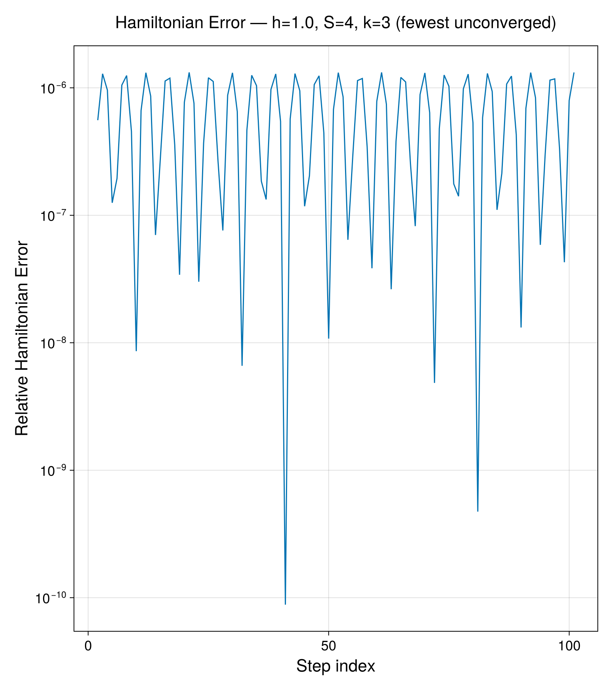<br/><small>S=4 · R=16 · k=3 · λ=0.0 · f_abs=-2.220446049250313e-16 · x_suc=-2.220446049250313e-16 · dogleg · Float64<br/>Unconverged: 0.0%</small></td></tr></table></td><td><table style="width:100%"><tr><td style="text-align:center;vertical-align:top;width:50%"><strong>Min-Max Error: 7.854e-05</strong><br/><br/><small>S=6 · R=16 · k=3 · λ=0.001 · f_abs=-2.220446049250313e-16 · x_suc=-2.220446049250313e-16 · dogleg · Float64<br/>Unconverged: 100.0%</small></td><td style="text-align:center;vertical-align:top;width:50%"><strong>Fewest Unconverged Run — Error: 1.469e-03</strong><br/>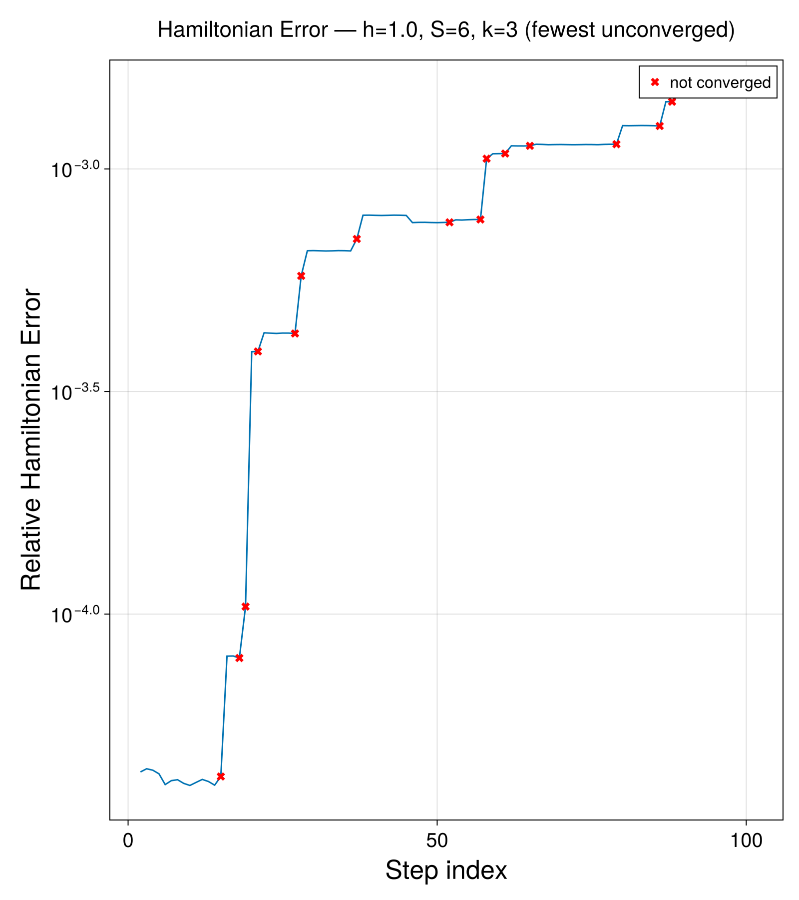<br/><small>S=6 · R=8 · k=3 · λ=1.0e-5 · f_abs=-2.220446049250313e-16 · x_suc=-2.220446049250313e-16 · dogleg · Float64<br/>Unconverged: 16.0%</small></td></tr></table></td><td><table style="width:100%"><tr><td style="text-align:center;vertical-align:top;width:50%"><strong>Min-Max Error: 7.483e-04</strong><br/><br/><small>S=8 · R=8 · k=3 · λ=1.0e-7 · f_abs=-2.220446049250313e-16 · x_suc=-2.220446049250313e-16 · backtracking · Float64<br/>Unconverged: 81.0%</small></td><td style="text-align:center;vertical-align:top;width:50%"><strong>Fewest Unconverged Run — Error: 9.654e-03</strong><br/>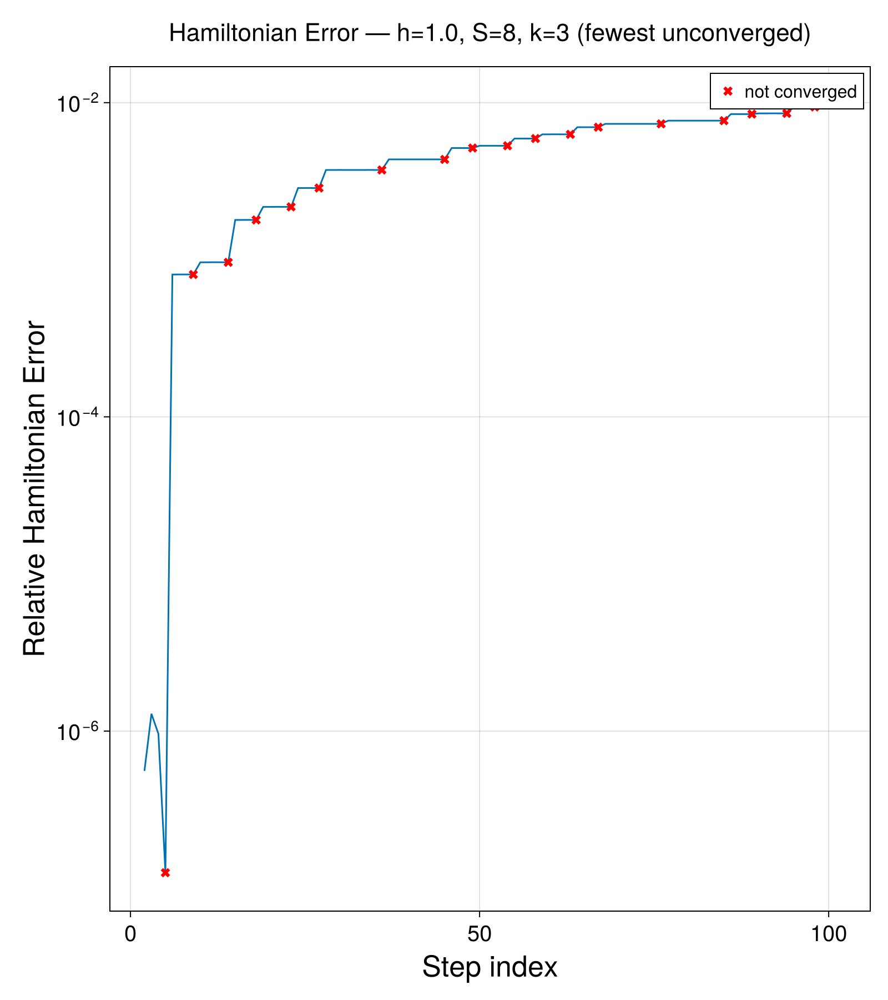<br/><small>S=8 · R=4 · k=3 · λ=0.001 · f_abs=0.0 · x_suc=4.440892098500626e-16 · dogleg · Float64<br/>Unconverged: 18.0%</small></td></tr></table></td><td><table style="width:100%"><tr><td style="text-align:center;vertical-align:top;width:50%"><strong>Min-Max Error: 1.324e-03</strong><br/>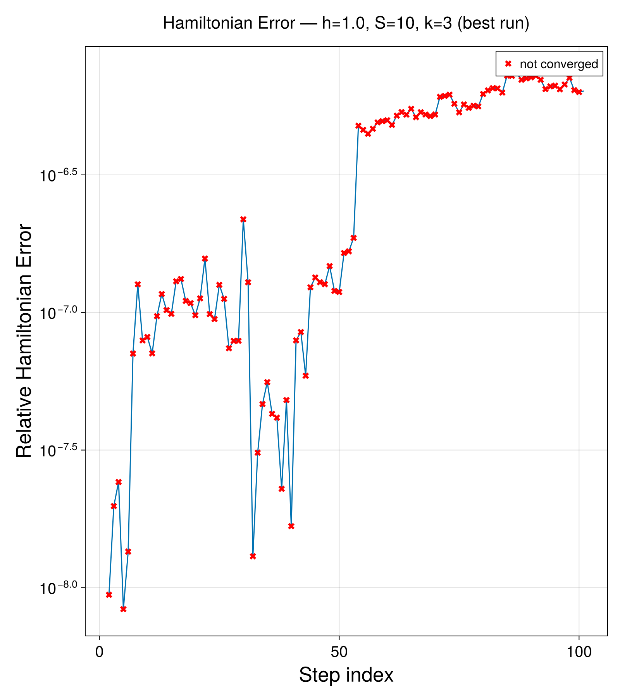<br/><small>S=10 · R=8 · k=3 · λ=1.0e-7 · f_abs=-2.220446049250313e-16 · x_suc=-2.220446049250313e-16 · backtracking · Float64<br/>Unconverged: 92.0%</small></td><td style="text-align:center;vertical-align:top;width:50%"><strong>Fewest Unconverged Run — Error: 1.097e-02</strong><br/>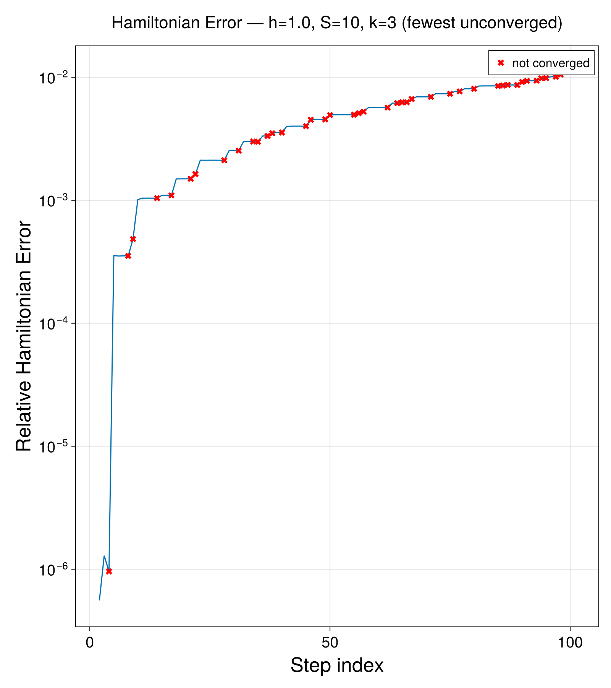<br/><small>S=10 · R=8 · k=3 · λ=1.0e-5 · f_abs=-2.220446049250313e-16 · x_suc=-2.220446049250313e-16 · dogleg · Float64<br/>Unconverged: 41.0%</small></td></tr></table></td><td><table style="width:100%"><tr><td style="text-align:center;vertical-align:top;width:50%"><strong>Min-Max Error: 1.866e-03</strong><br/>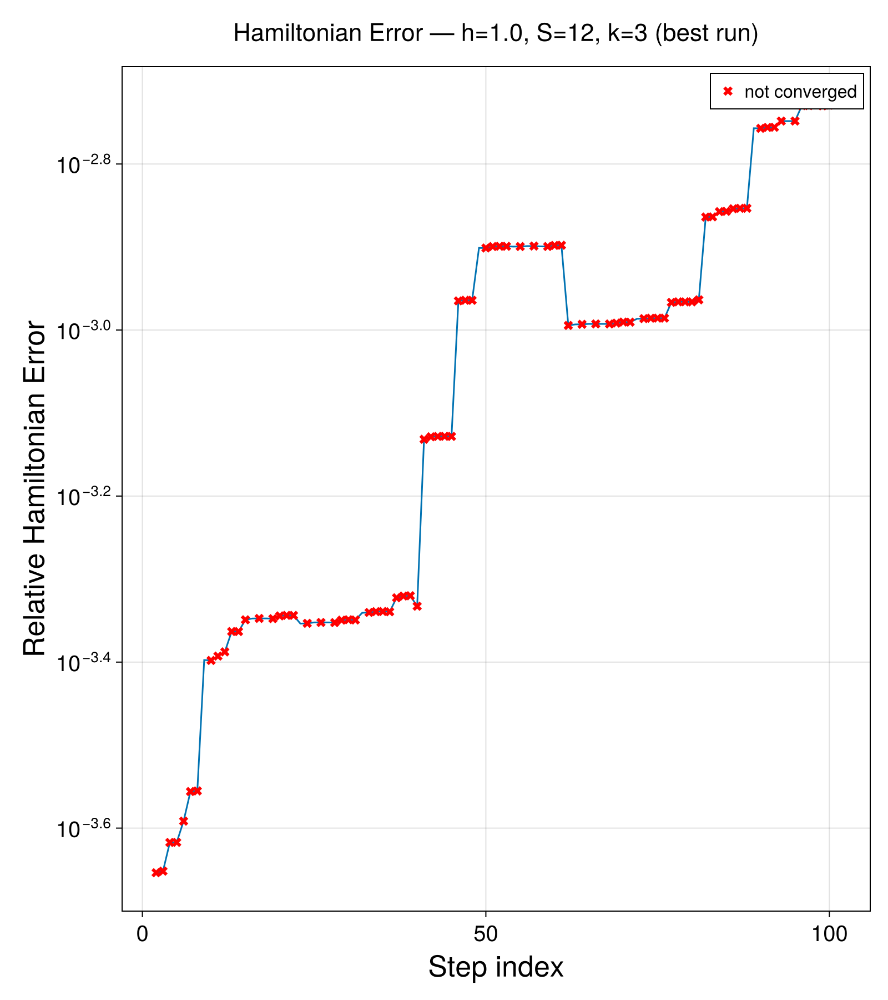<br/><small>S=12 · R=4 · k=3 · λ=1.0e-5 · f_abs=-2.220446049250313e-16 · x_suc=-2.220446049250313e-16 · dogleg · Float64<br/>Unconverged: 82.0%</small></td><td style="text-align:center;vertical-align:top;width:50%"><strong>Fewest Unconverged Run — Error: 6.423e-03</strong><br/>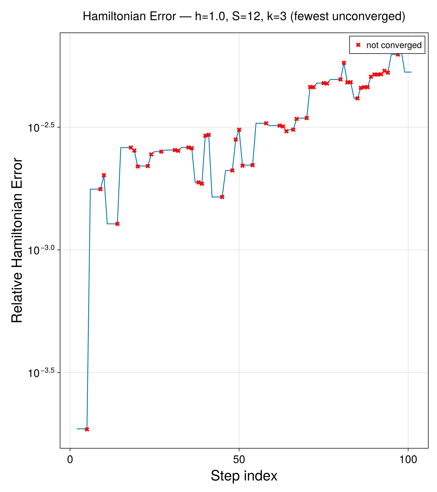<br/><small>S=12 · R=4 · k=3 · λ=0.001 · f_abs=-2.220446049250313e-16 · x_suc=-2.220446049250313e-16 · backtracking · Float64<br/>Unconverged: 52.0%</small></td></tr></table></td><td><table style="width:100%"><tr><td style="text-align:center;vertical-align:top;width:50%"><strong>Min-Max Error: 3.206e-03</strong><br/>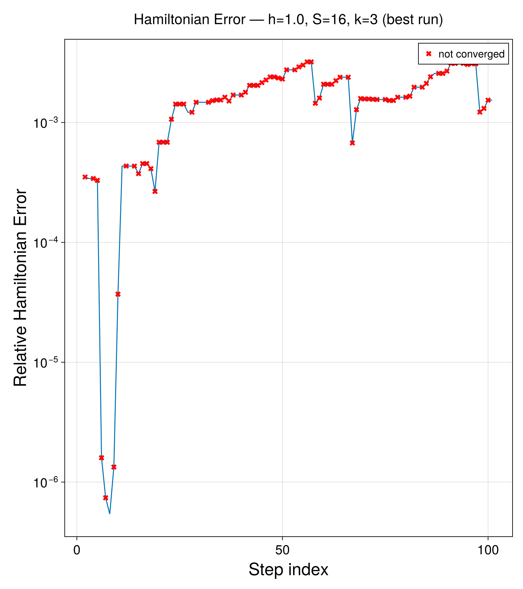<br/><small>S=16 · R=4 · k=3 · λ=0.0 · f_abs=-2.220446049250313e-16 · x_suc=-2.220446049250313e-16 · dogleg · Float64<br/>Unconverged: 85.0%</small></td><td style="text-align:center;vertical-align:top;width:50%"><strong>Fewest Unconverged Run — Error: 1.440e-02</strong><br/>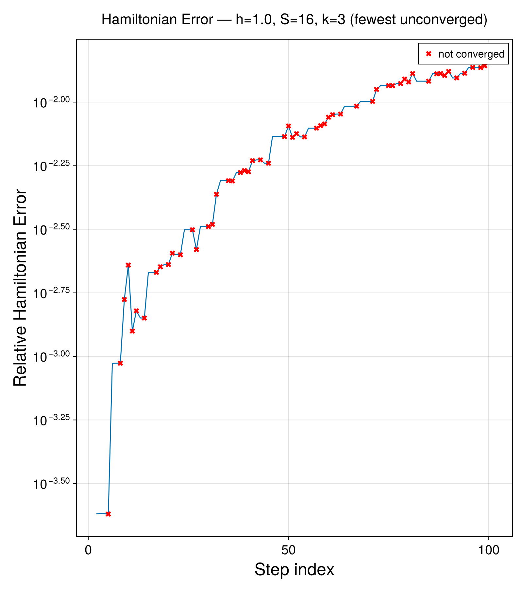<br/><small>S=16 · R=4 · k=3 · λ=0.001 · f_abs=-2.220446049250313e-16 · x_suc=-2.220446049250313e-16 · dogleg · Float64<br/>Unconverged: 56.0%</small></td></tr></table></td></tr>
<tr><th>k = 4</th><td><table style="width:100%"><tr><td style="text-align:center;vertical-align:top;width:50%"><strong>Min-Max Error: 2.875e-05</strong><br/><br/><small>S=4 · R=8 · k=4 · λ=0.001 · f_abs=-2.220446049250313e-16 · x_suc=-2.220446049250313e-16 · backtracking · Float64<br/>Unconverged: 100.0%</small></td><td style="text-align:center;vertical-align:top;width:50%"><strong>Fewest Unconverged Run — Error: 3.571e-02</strong><br/>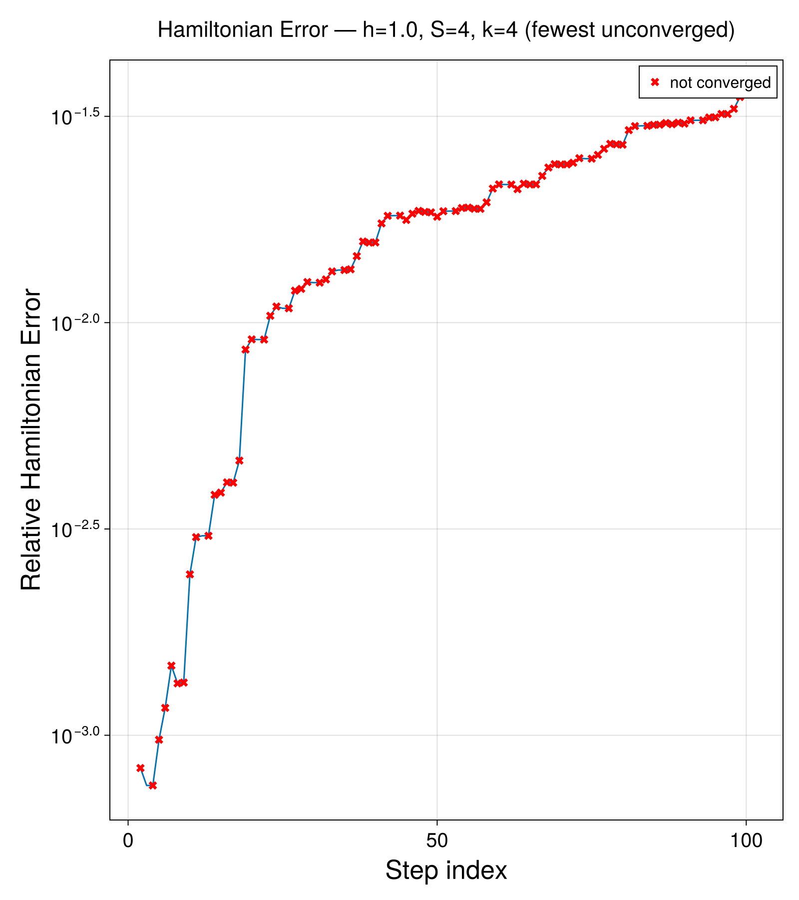<br/><small>S=4 · R=4 · k=4 · λ=1.0e-7 · f_abs=-2.220446049250313e-16 · x_suc=-2.220446049250313e-16 · backtracking · Float64<br/>Unconverged: 88.0%</small></td></tr></table></td><td><table style="width:100%"><tr><td style="text-align:center;vertical-align:top;width:50%"><strong>Min-Max Error: 3.572e-06</strong><br/><br/><small>S=6 · R=16 · k=4 · λ=0.001 · f_abs=-2.220446049250313e-16 · x_suc=-2.220446049250313e-16 · dogleg · Float64<br/>Unconverged: 100.0%</small></td><td style="text-align:center;vertical-align:top;width:50%"><strong>Fewest Unconverged Run — Error: 1.987e-04</strong><br/>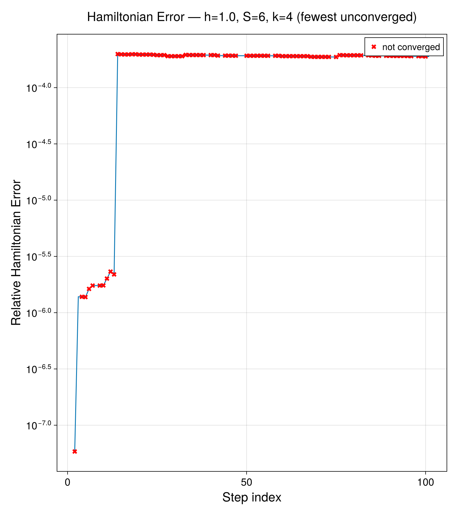<br/><small>S=6 · R=4 · k=4 · λ=0.0 · f_abs=-2.220446049250313e-16 · x_suc=-2.220446049250313e-16 · dogleg · Float64<br/>Unconverged: 89.0%</small></td></tr></table></td><td><table style="width:100%"><tr><td style="text-align:center;vertical-align:top;width:50%"><strong>Min-Max Error: 1.268e-05</strong><br/><br/><small>S=8 · R=16 · k=4 · λ=0.001 · f_abs=-2.220446049250313e-16 · x_suc=-2.220446049250313e-16 · dogleg · Float64<br/>Unconverged: 100.0%</small></td><td style="text-align:center;vertical-align:top;width:50%"><strong>Fewest Unconverged Run — Error: 3.799e-04</strong><br/>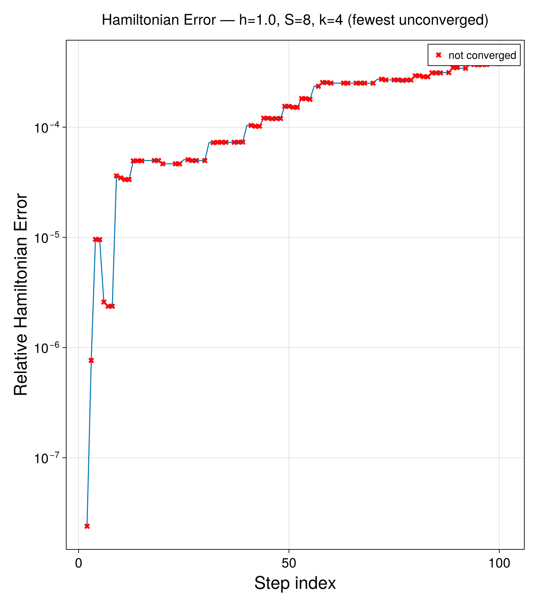<br/><small>S=8 · R=4 · k=4 · λ=0.0 · f_abs=-2.220446049250313e-16 · x_suc=-2.220446049250313e-16 · dogleg · Float64<br/>Unconverged: 81.0%</small></td></tr></table></td><td><table style="width:100%"><tr><td style="text-align:center;vertical-align:top;width:50%"><strong>Min-Max Error: 6.597e-06</strong><br/>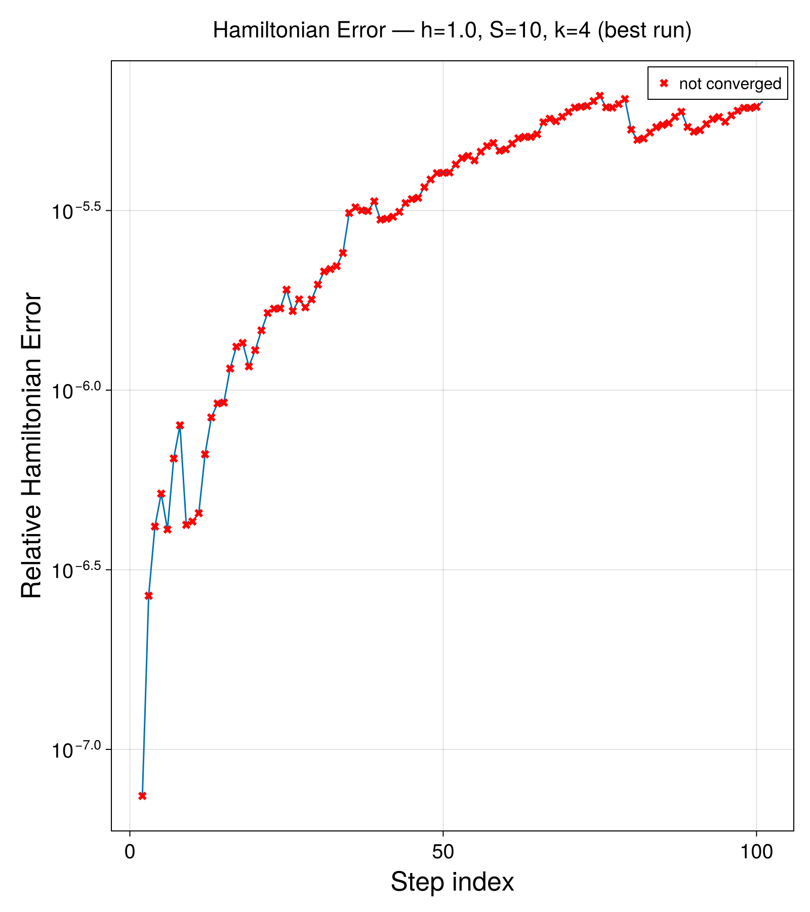<br/><small>S=10 · R=16 · k=4 · λ=0.001 · f_abs=-2.220446049250313e-16 · x_suc=-2.220446049250313e-16 · dogleg · Float64<br/>Unconverged: 100.0%</small></td><td style="text-align:center;vertical-align:top;width:50%"><strong>Fewest Unconverged Run — Error: 2.967e-03</strong><br/>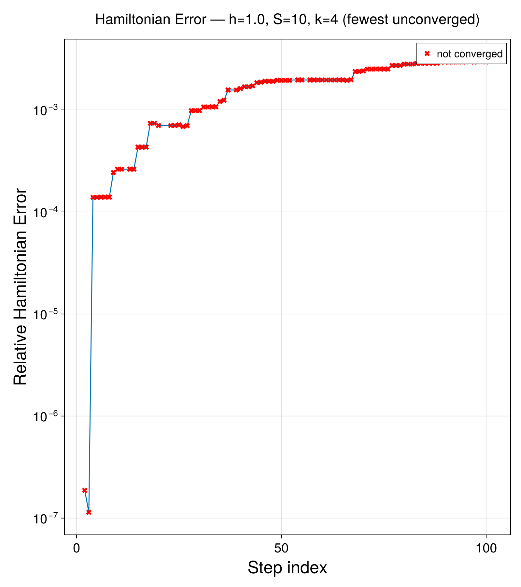<br/><small>S=10 · R=4 · k=4 · λ=0.0 · f_abs=-2.220446049250313e-16 · x_suc=-2.220446049250313e-16 · dogleg · Float64<br/>Unconverged: 93.0%</small></td></tr></table></td><td><table style="width:100%"><tr><td style="text-align:center;vertical-align:top;width:50%"><strong>Min-Max Error: 2.455e-06</strong><br/>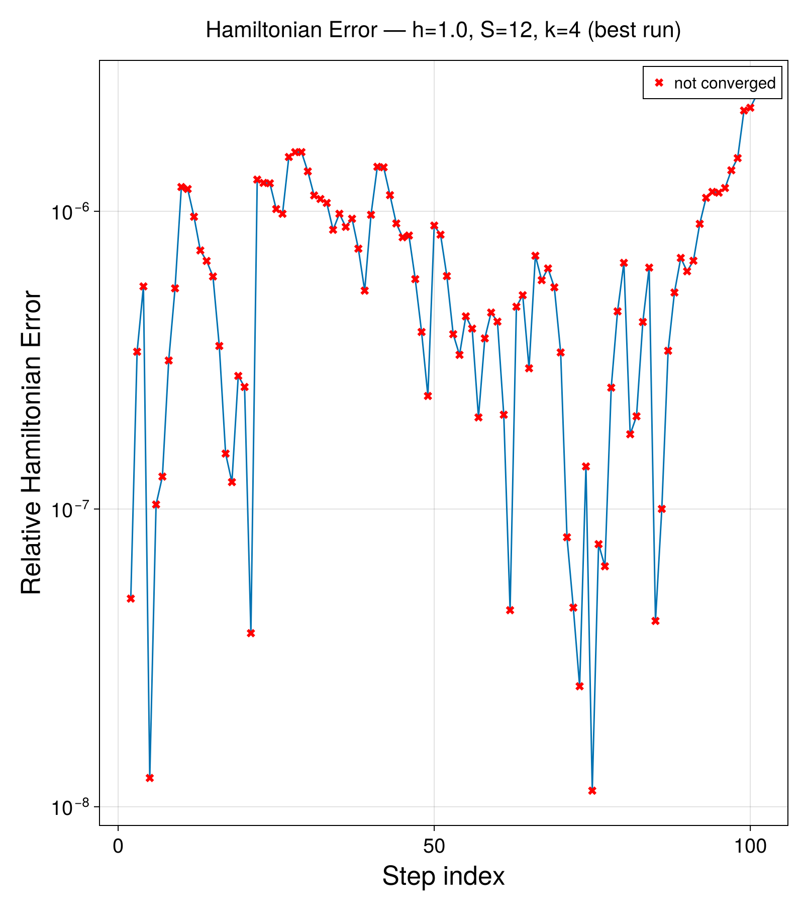<br/><small>S=12 · R=16 · k=4 · λ=0.001 · f_abs=-2.220446049250313e-16 · x_suc=-2.220446049250313e-16 · dogleg · Float64<br/>Unconverged: 100.0%</small></td><td style="text-align:center;vertical-align:top;width:50%"><strong>Fewest Unconverged Run — Error: 2.009e-03</strong><br/>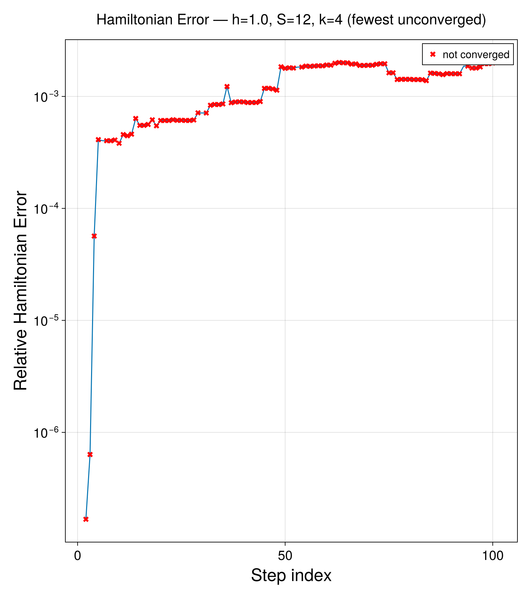<br/><small>S=12 · R=4 · k=4 · λ=1.0e-5 · f_abs=-2.220446049250313e-16 · x_suc=-2.220446049250313e-16 · backtracking · Float64<br/>Unconverged: 96.0%</small></td></tr></table></td><td><table style="width:100%"><tr><td style="text-align:center;vertical-align:top;width:50%"><strong>Min-Max Error: 3.385e-04</strong><br/>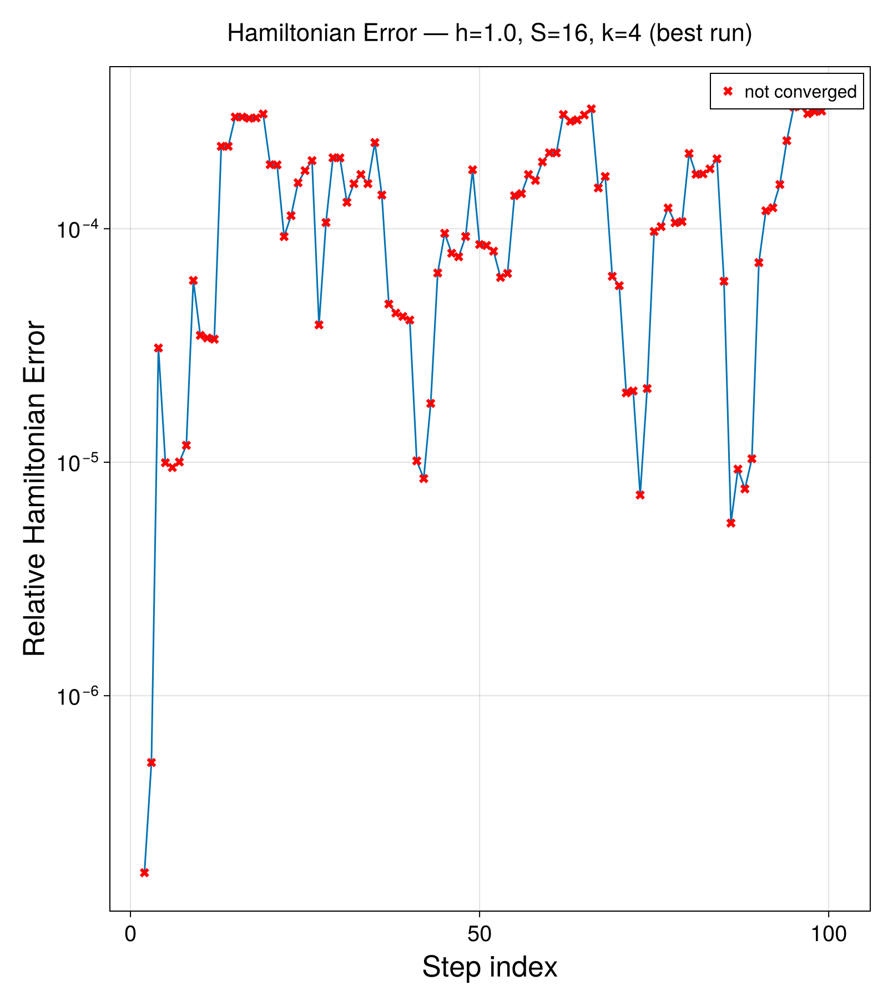<br/><small>S=16 · R=4 · k=4 · λ=1.0e-5 · f_abs=-2.220446049250313e-16 · x_suc=-2.220446049250313e-16 · backtracking · Float64<br/>Unconverged: 99.0%</small></td><td style="text-align:center;vertical-align:top;width:50%"><strong>Fewest Unconverged Run — Error: 3.549e-03</strong><br/>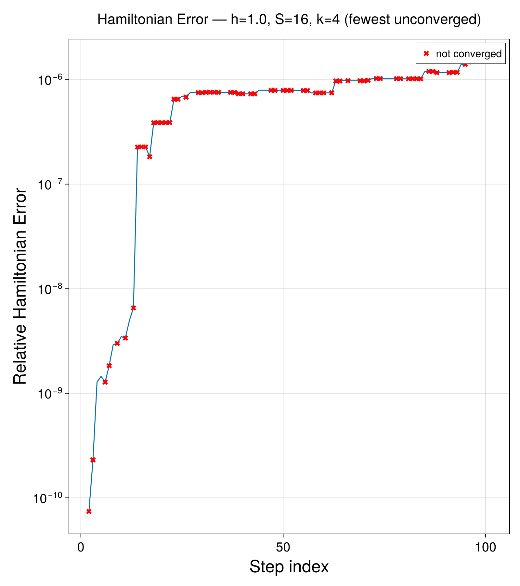<br/><small>S=16 · R=4 · k=4 · λ=1.0e-7 · f_abs=-2.220446049250313e-16 · x_suc=-2.220446049250313e-16 · backtracking · Float64<br/>Unconverged: 98.0%</small></td></tr></table></td></tr>
</tbody></table>

### h = 2.0

<table>
<thead><tr><th></th><th>S = 4</th><th>S = 6</th><th>S = 8</th><th>S = 10</th><th>S = 12</th><th>S = 16</th></tr></thead>
<tbody>
<tr><th>k = 2</th><td><table style="width:100%"><tr><td style="text-align:center;vertical-align:top;width:50%"><strong>Min-Max Error: 2.381e-03</strong><br/>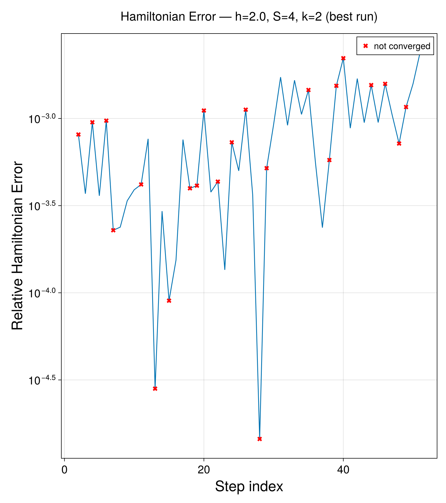<br/><small>S=4 · R=16 · k=2 · λ=1.0e-7 · f_abs=-2.220446049250313e-16 · x_suc=-2.220446049250313e-16 · dogleg · Float64<br/>Unconverged: 46.0%</small></td><td style="text-align:center;vertical-align:top;width:50%"><strong>Fewest Unconverged Run — Error: 7.064e-03</strong><br/>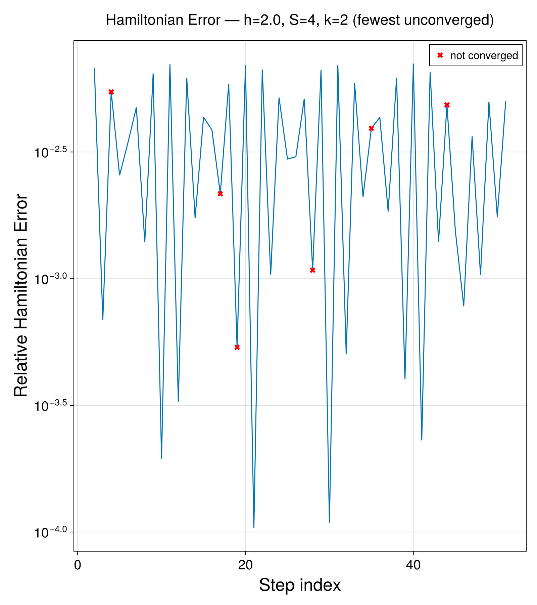<br/><small>S=4 · R=4 · k=2 · λ=0.001 · f_abs=-2.220446049250313e-16 · x_suc=-2.220446049250313e-16 · dogleg · Float64<br/>Unconverged: 12.0%</small></td></tr></table></td><td><table style="width:100%"><tr><td style="text-align:center;vertical-align:top;width:50%"><strong>Min-Max Error: 5.633e-03</strong><br/>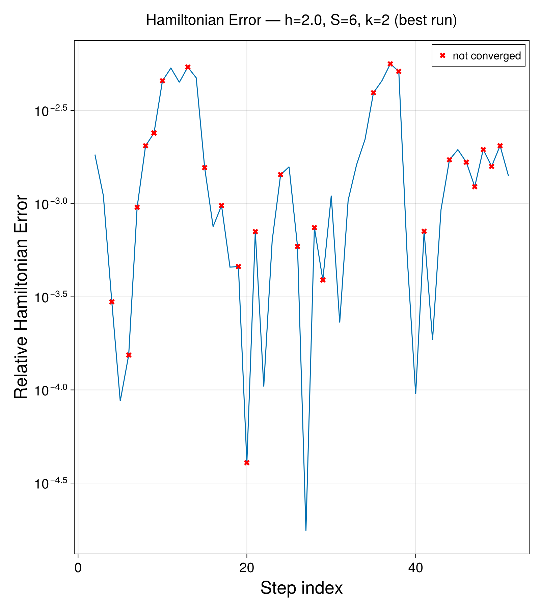<br/><small>S=6 · R=16 · k=2 · λ=1.0e-7 · f_abs=-2.220446049250313e-16 · x_suc=-2.220446049250313e-16 · backtracking · Float64<br/>Unconverged: 54.0%</small></td><td style="text-align:center;vertical-align:top;width:50%"><strong>Fewest Unconverged Run — Error: 1.523e-02</strong><br/>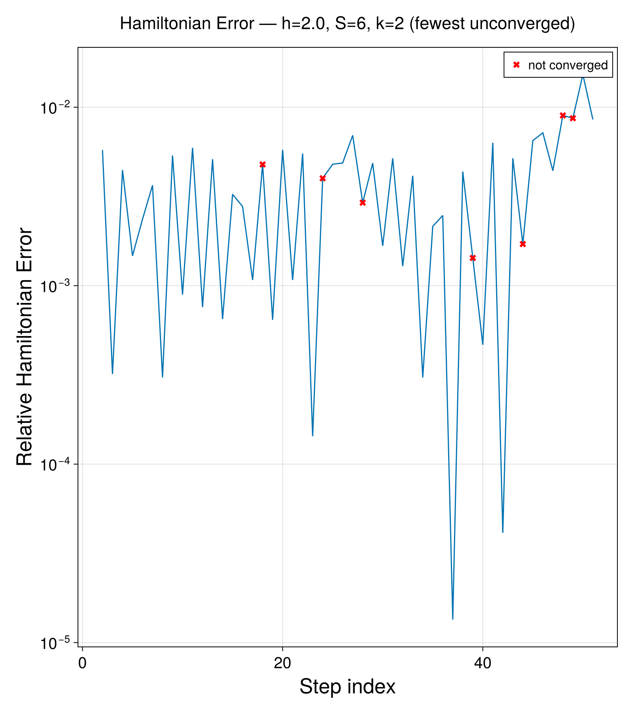<br/><small>S=6 · R=4 · k=2 · λ=0.001 · f_abs=-2.220446049250313e-16 · x_suc=-2.220446049250313e-16 · dogleg · Float64<br/>Unconverged: 14.0%</small></td></tr></table></td><td><table style="width:100%"><tr><td style="text-align:center;vertical-align:top;width:50%"><strong>Min-Max Error: 2.192e-03</strong><br/>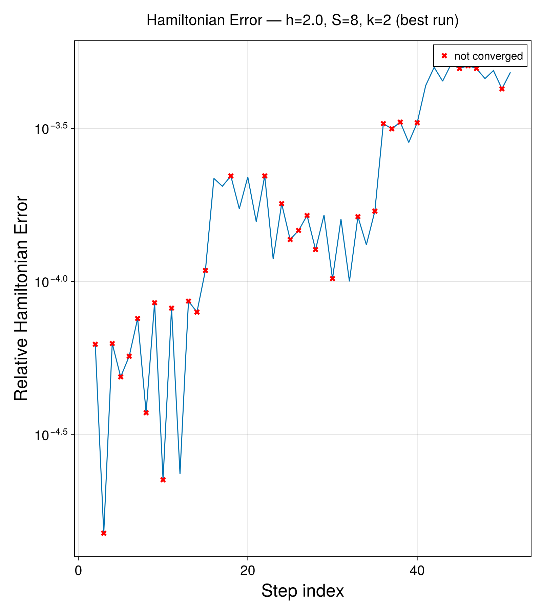<br/><small>S=8 · R=16 · k=2 · λ=0.001 · f_abs=-2.220446049250313e-16 · x_suc=-2.220446049250313e-16 · dogleg · Float64<br/>Unconverged: 84.0%</small></td><td style="text-align:center;vertical-align:top;width:50%"><strong>Fewest Unconverged Run — Error: 1.876e-02</strong><br/>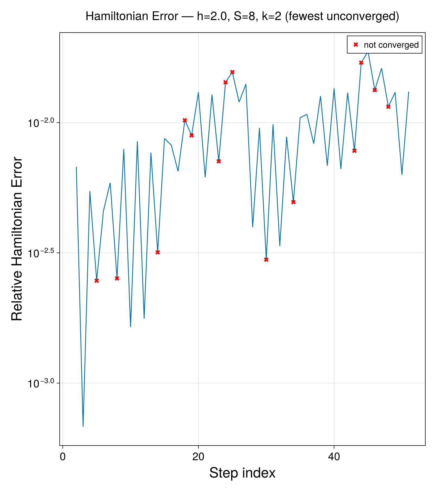<br/><small>S=8 · R=4 · k=2 · λ=0.001 · f_abs=-2.220446049250313e-16 · x_suc=-2.220446049250313e-16 · dogleg · Float64<br/>Unconverged: 30.0%</small></td></tr></table></td><td><table style="width:100%"><tr><td style="text-align:center;vertical-align:top;width:50%"><strong>Min-Max Error: 1.737e-03</strong><br/>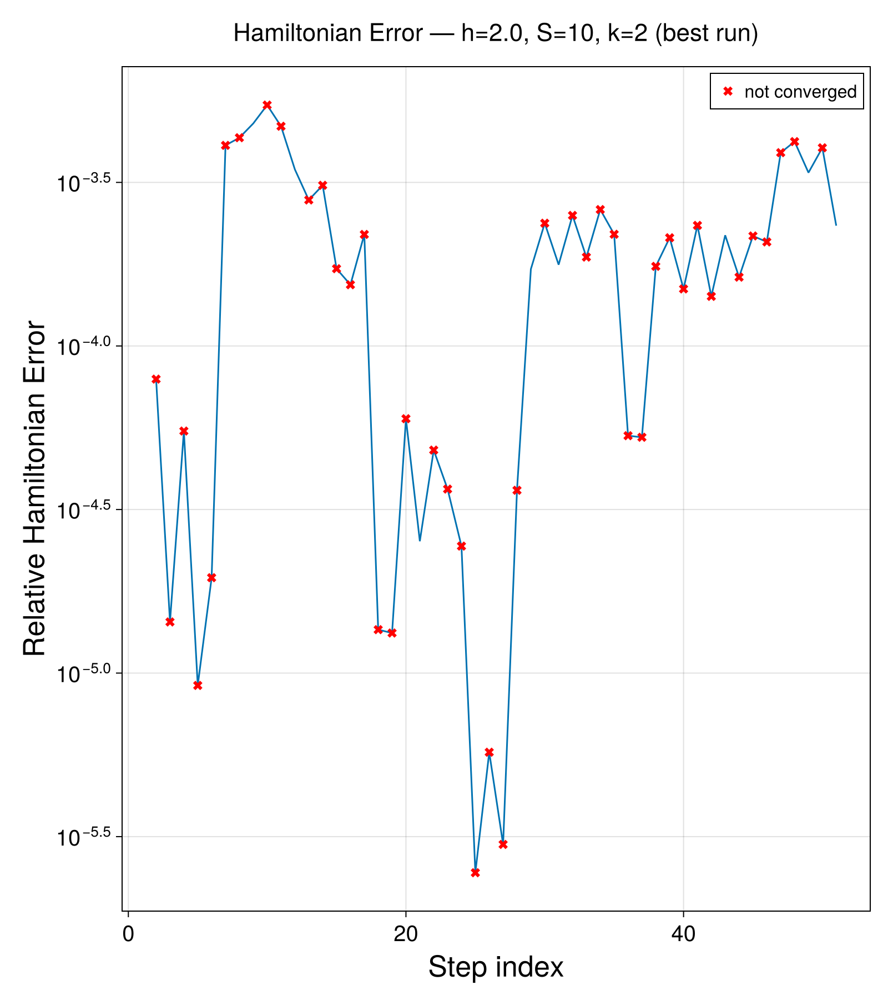<br/><small>S=10 · R=16 · k=2 · λ=0.001 · f_abs=-2.220446049250313e-16 · x_suc=-2.220446049250313e-16 · dogleg · Float64<br/>Unconverged: 100.0%</small></td><td style="text-align:center;vertical-align:top;width:50%"><strong>Fewest Unconverged Run — Error: 2.704e-02</strong><br/>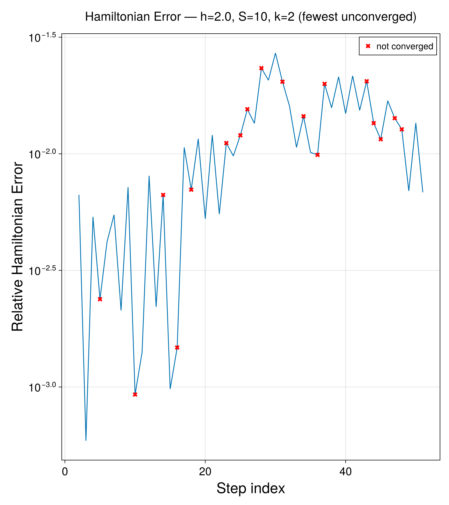<br/><small>S=10 · R=4 · k=2 · λ=0.001 · f_abs=-2.220446049250313e-16 · x_suc=-2.220446049250313e-16 · dogleg · Float64<br/>Unconverged: 36.0%</small></td></tr></table></td><td><table style="width:100%"><tr><td style="text-align:center;vertical-align:top;width:50%"><strong>Min-Max Error: 3.757e-03</strong><br/>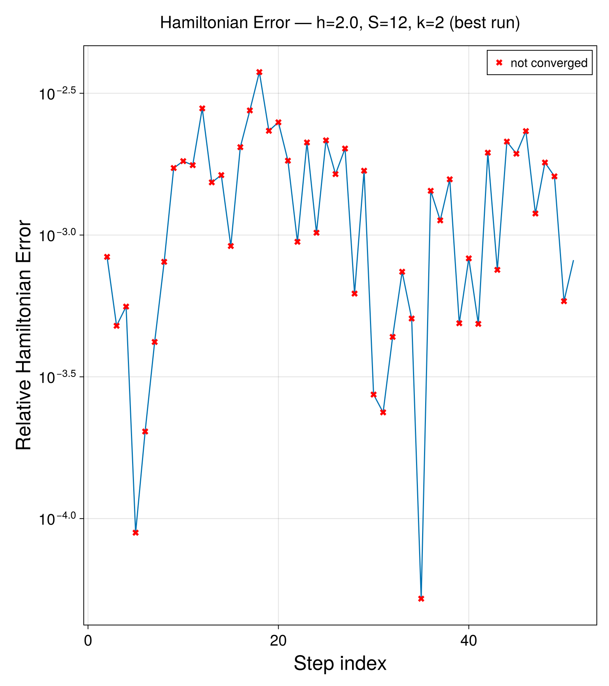<br/><small>S=12 · R=16 · k=2 · λ=1.0e-7 · f_abs=-2.220446049250313e-16 · x_suc=-2.220446049250313e-16 · dogleg · Float64<br/>Unconverged: 100.0%</small></td><td style="text-align:center;vertical-align:top;width:50%"><strong>Fewest Unconverged Run — Error: 2.003e-02</strong><br/>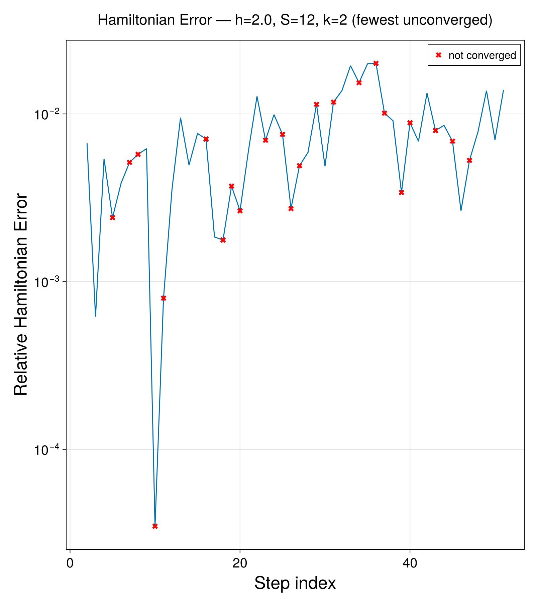<br/><small>S=12 · R=4 · k=2 · λ=0.001 · f_abs=-2.220446049250313e-16 · x_suc=-2.220446049250313e-16 · dogleg · Float64<br/>Unconverged: 46.0%</small></td></tr></table></td><td><table style="width:100%"><tr><td style="text-align:center;vertical-align:top;width:50%"><strong>Min-Max Error: 7.959e-03</strong><br/>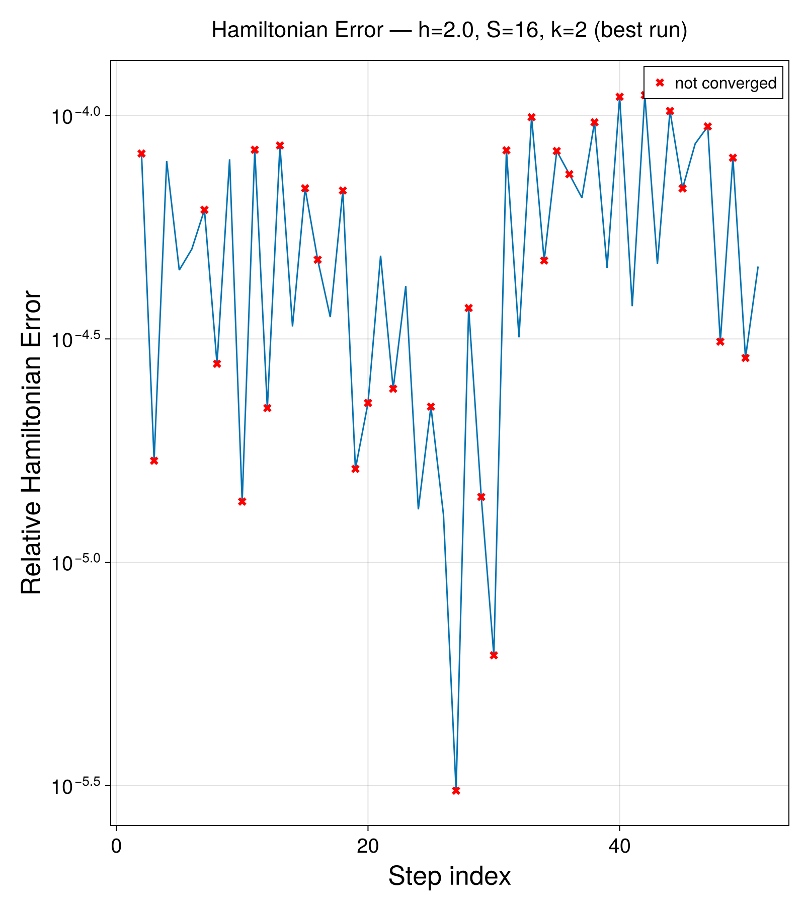<br/><small>S=16 · R=16 · k=2 · λ=1.0e-5 · f_abs=-2.220446049250313e-16 · x_suc=-2.220446049250313e-16 · dogleg · Float64<br/>Unconverged: 92.0%</small></td><td style="text-align:center;vertical-align:top;width:50%"><strong>Fewest Unconverged Run — Error: 2.390e-02</strong><br/>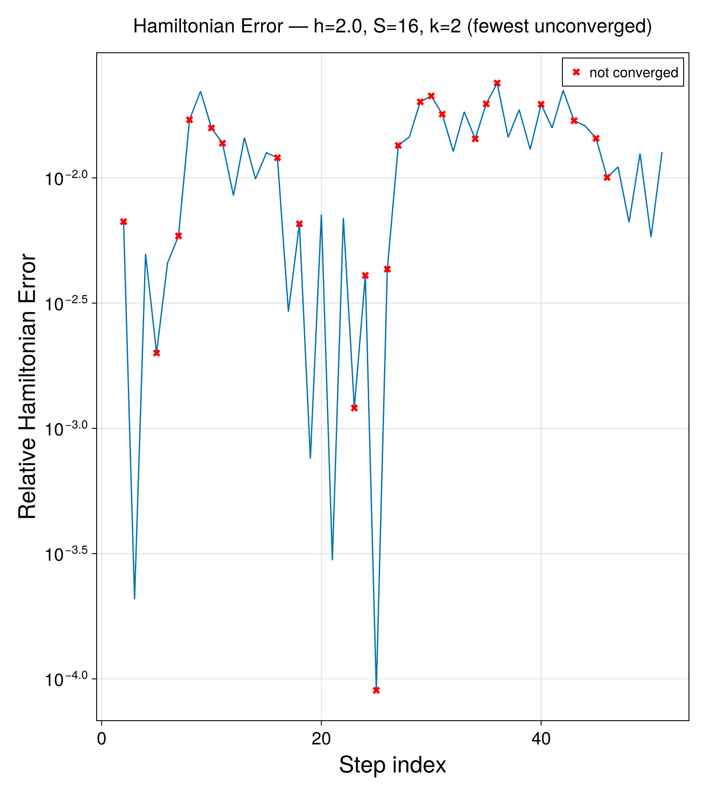<br/><small>S=16 · R=4 · k=2 · λ=0.001 · f_abs=-2.220446049250313e-16 · x_suc=-2.220446049250313e-16 · dogleg · Float64<br/>Unconverged: 46.0%</small></td></tr></table></td></tr>
<tr><th>k = 3</th><td><table style="width:100%"><tr><td style="text-align:center;vertical-align:top;width:50%"><strong>Min-Max Error: 1.042e-04</strong><br/>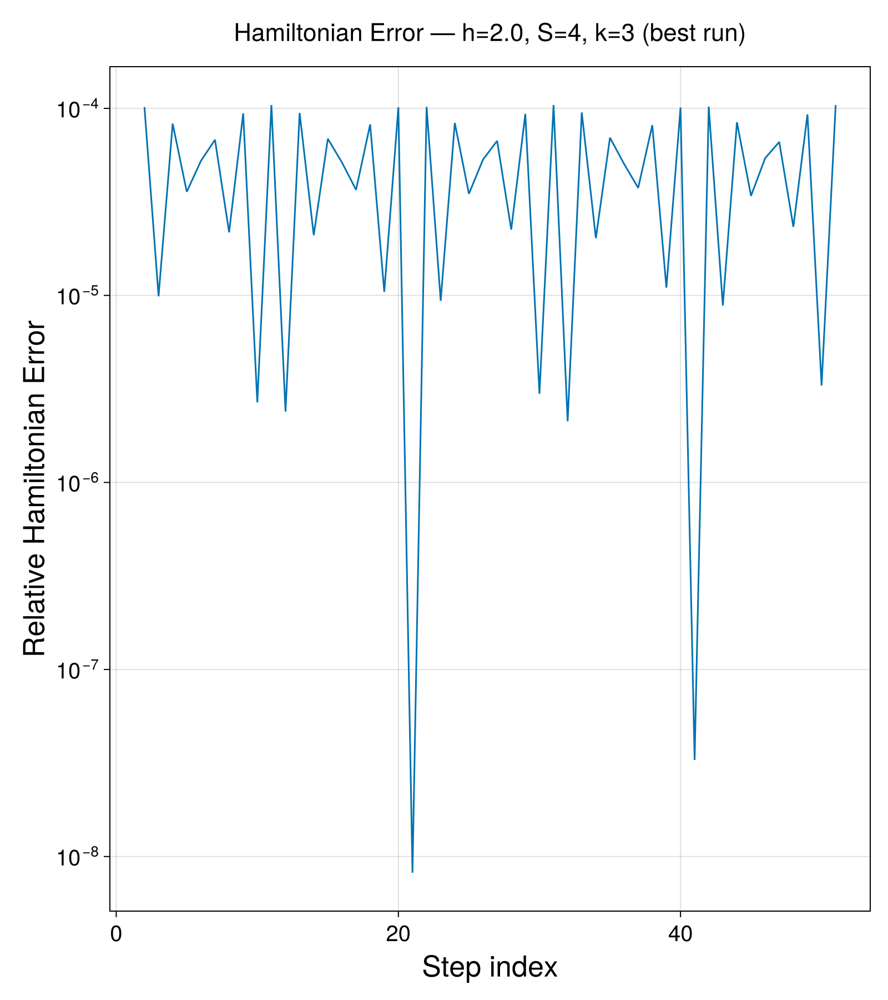<br/><small>S=4 · R=16 · k=3 · λ=0.0 · f_abs=-2.220446049250313e-16 · x_suc=-2.220446049250313e-16 · dogleg · Float64<br/>Unconverged: 0.0%</small></td><td style="text-align:center;vertical-align:top;width:50%"><strong>Fewest Unconverged Run — Error: 1.042e-04</strong><br/>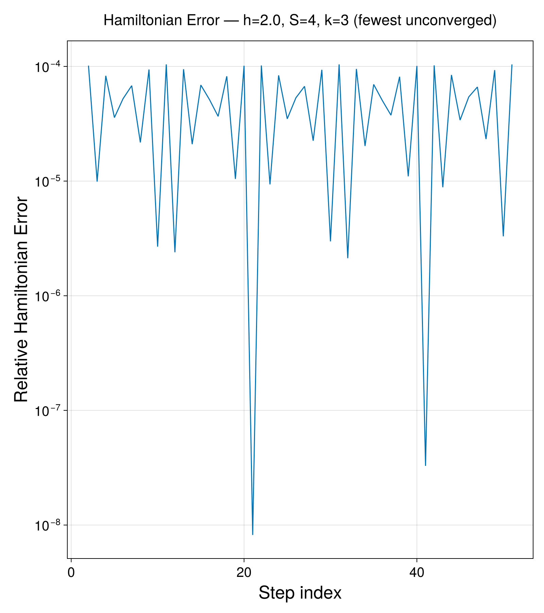<br/><small>S=4 · R=16 · k=3 · λ=0.0 · f_abs=-2.220446049250313e-16 · x_suc=-2.220446049250313e-16 · dogleg · Float64<br/>Unconverged: 0.0%</small></td></tr></table></td><td><table style="width:100%"><tr><td style="text-align:center;vertical-align:top;width:50%"><strong>Min-Max Error: 3.484e-04</strong><br/>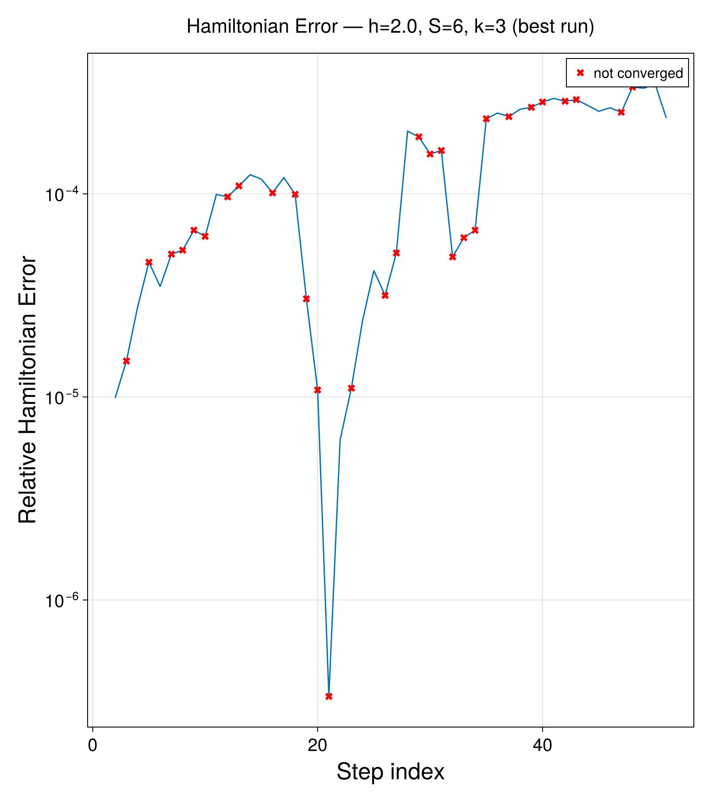<br/><small>S=6 · R=16 · k=3 · λ=1.0e-7 · f_abs=-2.220446049250313e-16 · x_suc=-2.220446049250313e-16 · backtracking · Float64<br/>Unconverged: 62.0%</small></td><td style="text-align:center;vertical-align:top;width:50%"><strong>Fewest Unconverged Run — Error: 6.606e-03</strong><br/>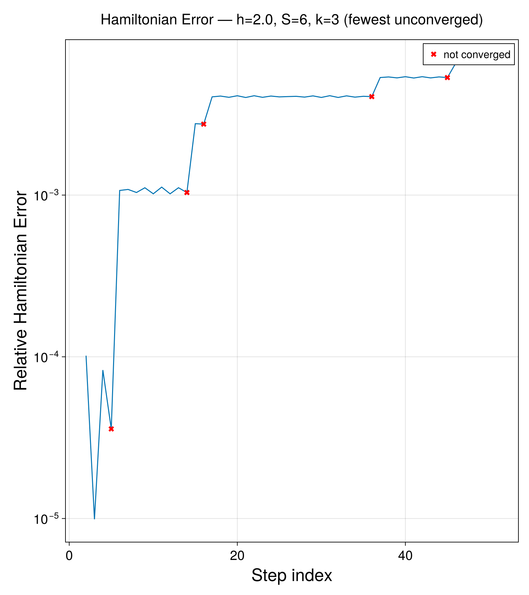<br/><small>S=6 · R=4 · k=3 · λ=0.001 · f_abs=-2.220446049250313e-16 · x_suc=-2.220446049250313e-16 · dogleg · Float64<br/>Unconverged: 10.0%</small></td></tr></table></td><td><table style="width:100%"><tr><td style="text-align:center;vertical-align:top;width:50%"><strong>Min-Max Error: 4.594e-04</strong><br/>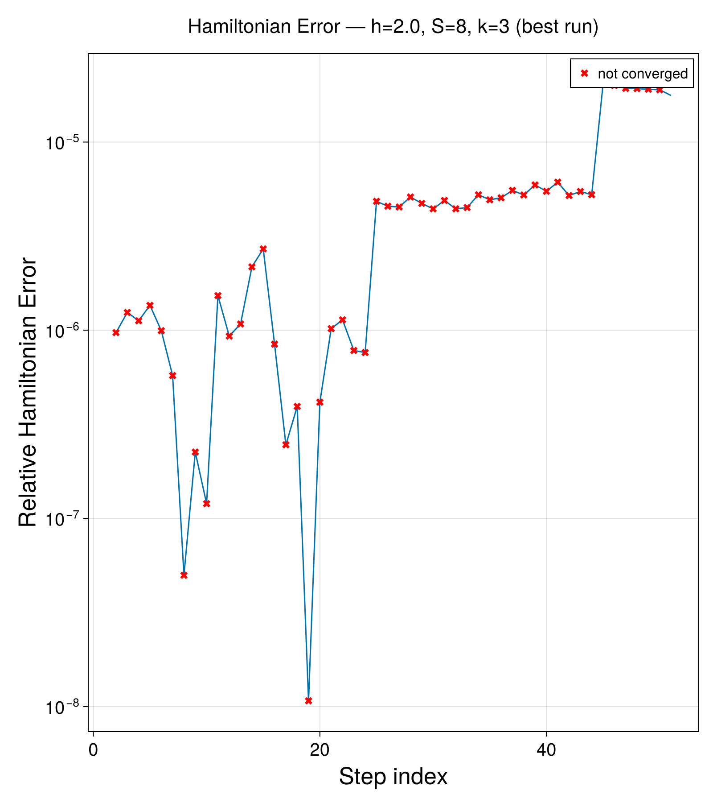<br/><small>S=8 · R=16 · k=3 · λ=0.0 · f_abs=-2.220446049250313e-16 · x_suc=-2.220446049250313e-16 · dogleg · Float64<br/>Unconverged: 98.0%</small></td><td style="text-align:center;vertical-align:top;width:50%"><strong>Fewest Unconverged Run — Error: 8.400e-03</strong><br/>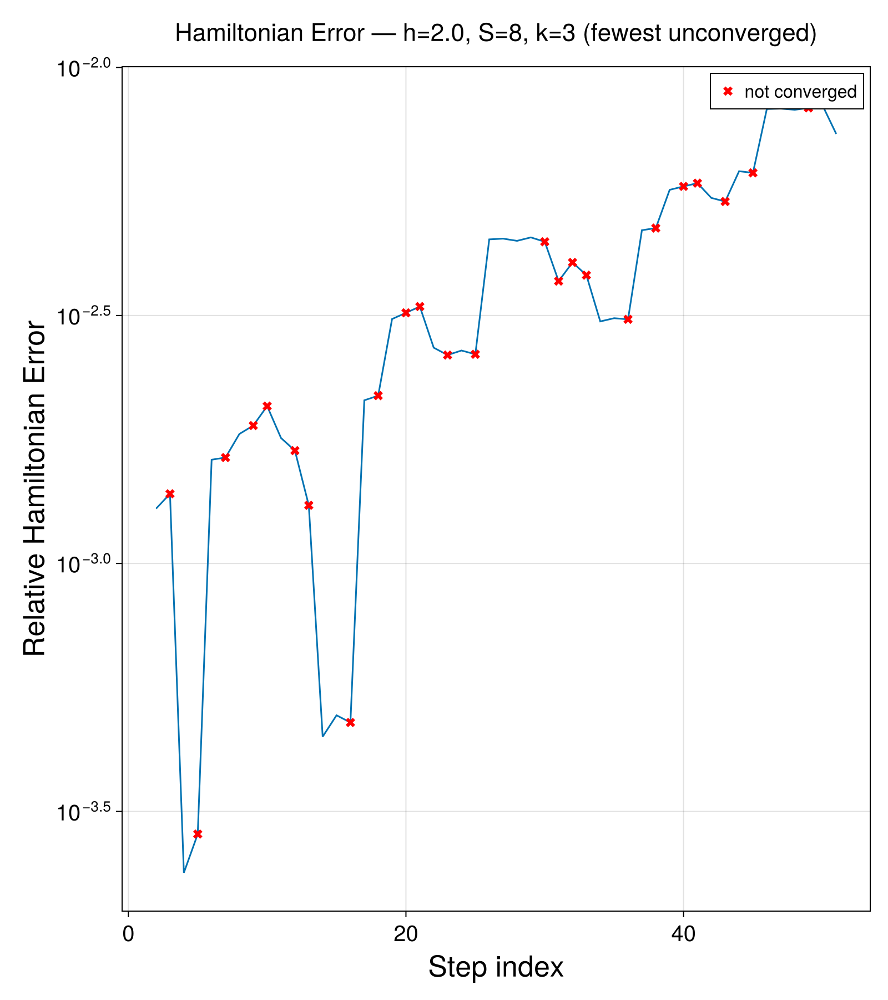<br/><small>S=8 · R=4 · k=3 · λ=0.001 · f_abs=-2.220446049250313e-16 · x_suc=-2.220446049250313e-16 · dogleg · Float64<br/>Unconverged: 52.0%</small></td></tr></table></td><td><table style="width:100%"><tr><td style="text-align:center;vertical-align:top;width:50%"><strong>Min-Max Error: 4.863e-04</strong><br/>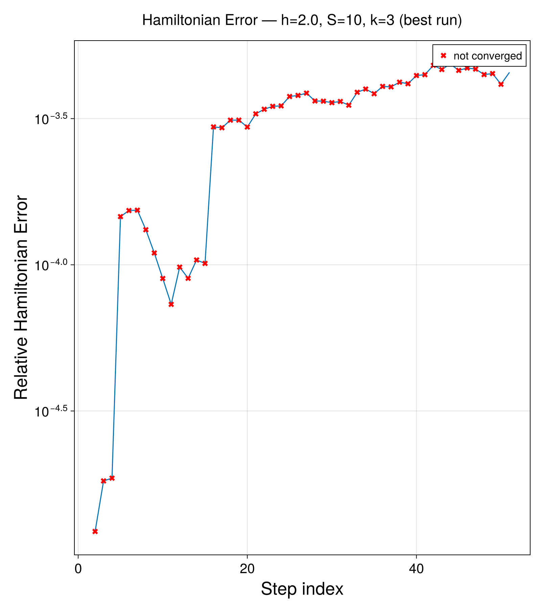<br/><small>S=10 · R=16 · k=3 · λ=0.001 · f_abs=-2.220446049250313e-16 · x_suc=-2.220446049250313e-16 · dogleg · Float64<br/>Unconverged: 100.0%</small></td><td style="text-align:center;vertical-align:top;width:50%"><strong>Fewest Unconverged Run — Error: 9.061e-03</strong><br/>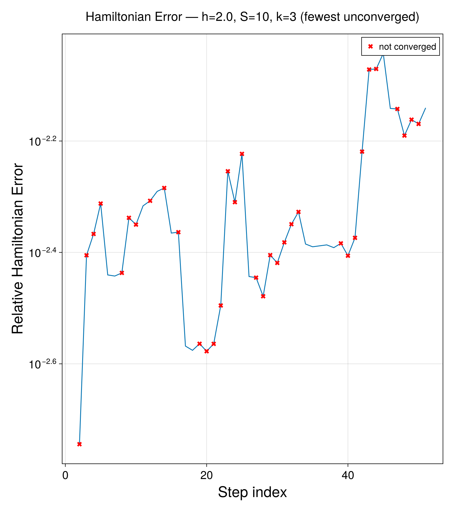<br/><small>S=10 · R=4 · k=3 · λ=0.001 · f_abs=-2.220446049250313e-16 · x_suc=-2.220446049250313e-16 · dogleg · Float64<br/>Unconverged: 72.0%</small></td></tr></table></td><td><table style="width:100%"><tr><td style="text-align:center;vertical-align:top;width:50%"><strong>Min-Max Error: 3.421e-04</strong><br/>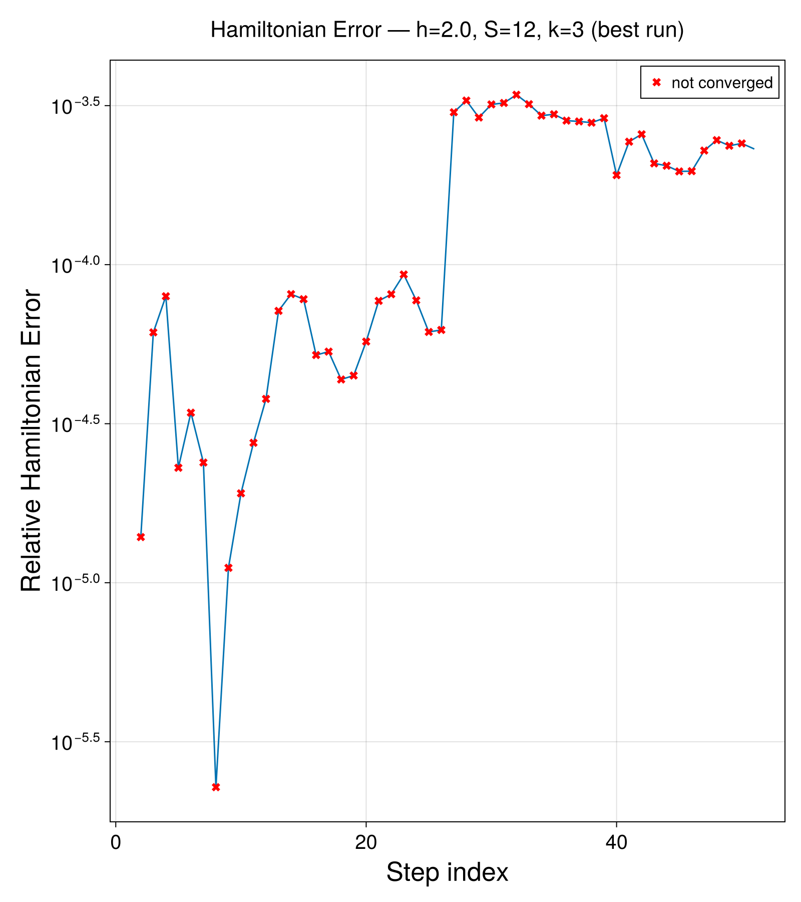<br/><small>S=12 · R=16 · k=3 · λ=0.001 · f_abs=-2.220446049250313e-16 · x_suc=-2.220446049250313e-16 · dogleg · Float64<br/>Unconverged: 100.0%</small></td><td style="text-align:center;vertical-align:top;width:50%"><strong>Fewest Unconverged Run — Error: 6.708e-03</strong><br/>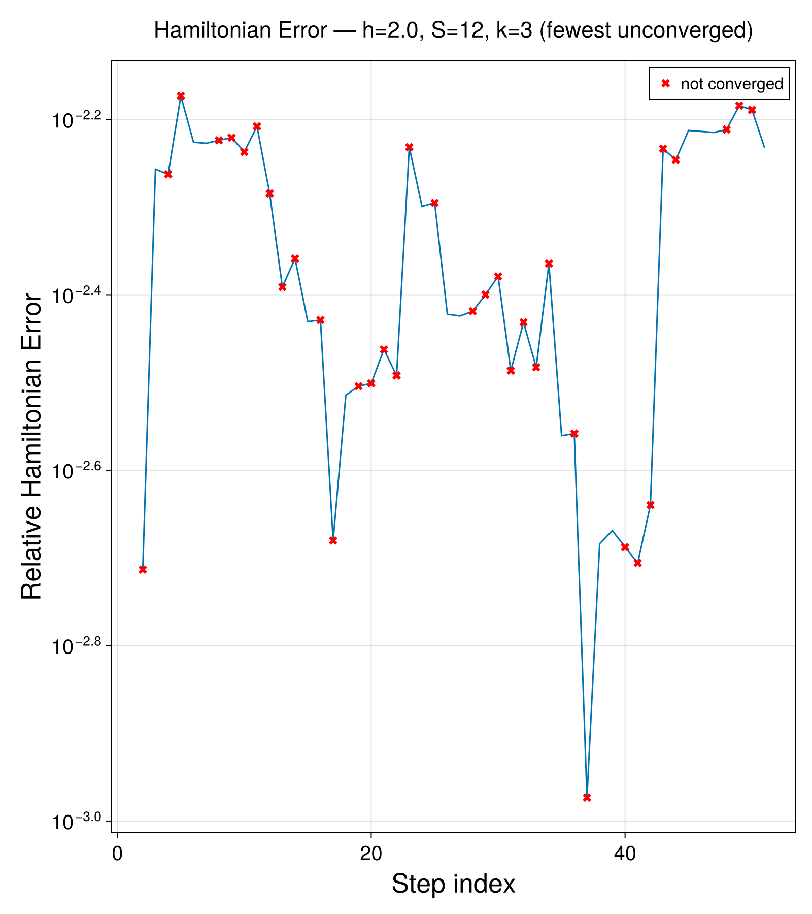<br/><small>S=12 · R=4 · k=3 · λ=0.001 · f_abs=-2.220446049250313e-16 · x_suc=-2.220446049250313e-16 · dogleg · Float64<br/>Unconverged: 72.0%</small></td></tr></table></td><td><table style="width:100%"><tr><td style="text-align:center;vertical-align:top;width:50%"><strong>Min-Max Error: 4.374e-04</strong><br/>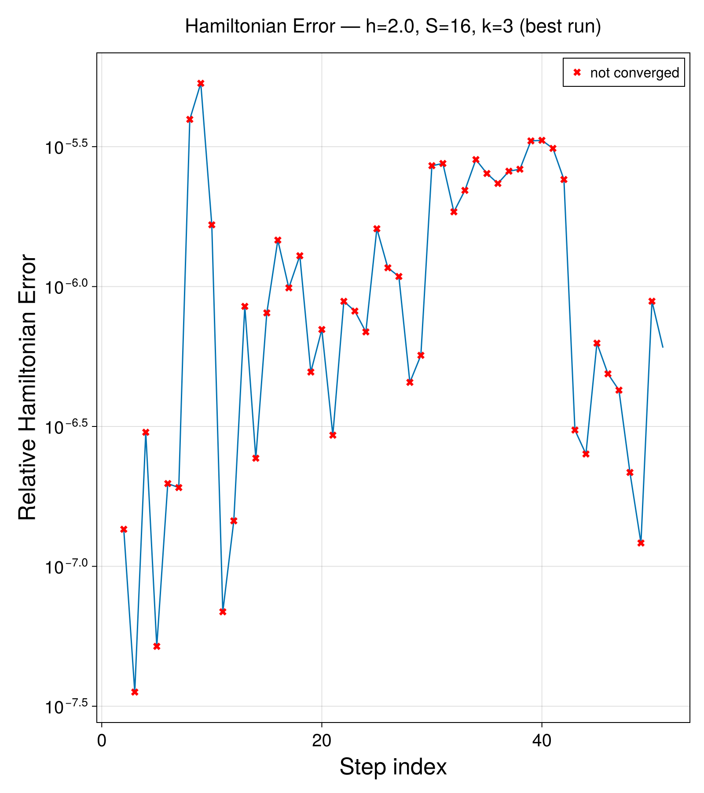<br/><small>S=16 · R=16 · k=3 · λ=1.0e-5 · f_abs=-2.220446049250313e-16 · x_suc=-2.220446049250313e-16 · dogleg · Float64<br/>Unconverged: 100.0%</small></td><td style="text-align:center;vertical-align:top;width:50%"><strong>Fewest Unconverged Run — Error: 1.122e-02</strong><br/>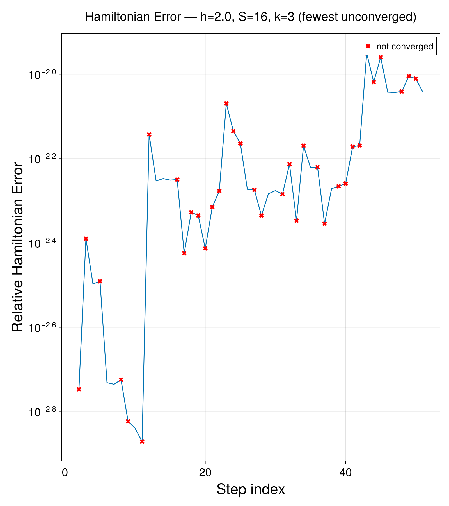<br/><small>S=16 · R=4 · k=3 · λ=0.001 · f_abs=-2.220446049250313e-16 · x_suc=-2.220446049250313e-16 · dogleg · Float64<br/>Unconverged: 72.0%</small></td></tr></table></td></tr>
<tr><th>k = 4</th><td><table style="width:100%"><tr><td style="text-align:center;vertical-align:top;width:50%"><strong>Min-Max Error: 4.201e-04</strong><br/>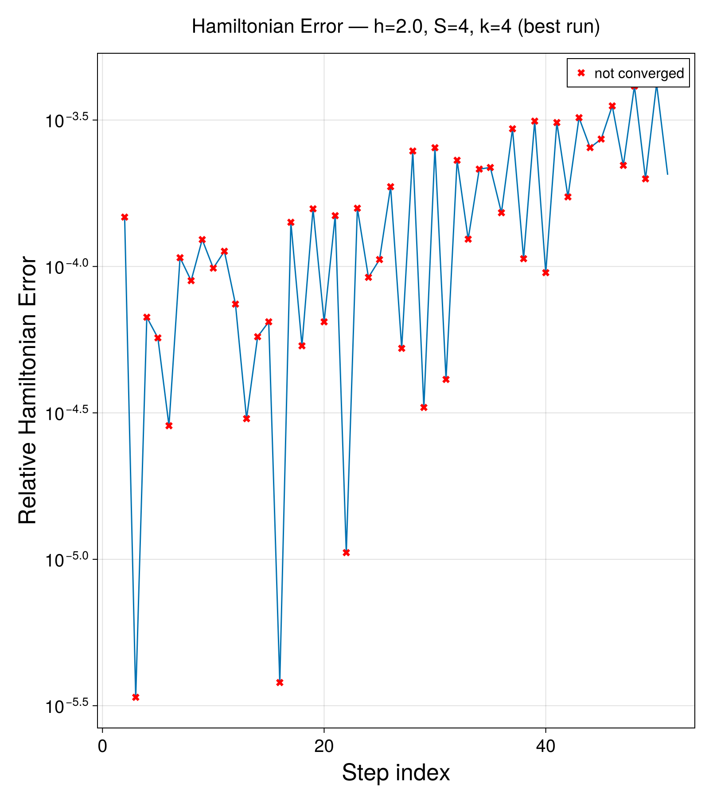<br/><small>S=4 · R=8 · k=4 · λ=0.001 · f_abs=-2.220446049250313e-16 · x_suc=-2.220446049250313e-16 · dogleg · Float64<br/>Unconverged: 100.0%</small></td><td style="text-align:center;vertical-align:top;width:50%"><strong>Fewest Unconverged Run — Error: 2.573e-02</strong><br/>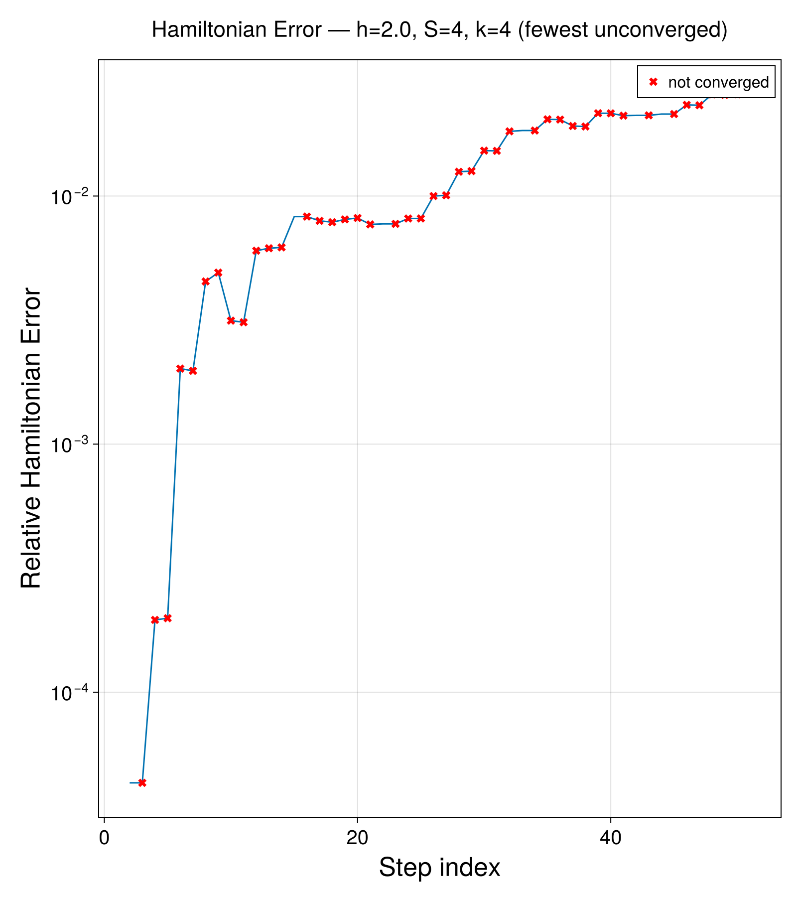<br/><small>S=4 · R=4 · k=4 · λ=1.0e-7 · f_abs=-2.220446049250313e-16 · x_suc=-2.220446049250313e-16 · backtracking · Float64<br/>Unconverged: 88.0%</small></td></tr></table></td><td><table style="width:100%"><tr><td style="text-align:center;vertical-align:top;width:50%"><strong>Min-Max Error: 1.297e-05</strong><br/>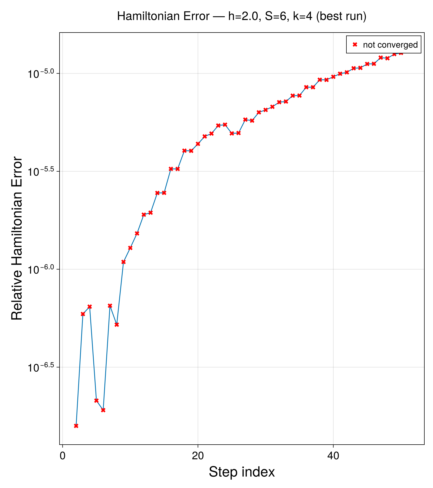<br/><small>S=6 · R=16 · k=4 · λ=0.001 · f_abs=-2.220446049250313e-16 · x_suc=-2.220446049250313e-16 · dogleg · Float64<br/>Unconverged: 100.0%</small></td><td style="text-align:center;vertical-align:top;width:50%"><strong>Fewest Unconverged Run — Error: 2.865e-04</strong><br/>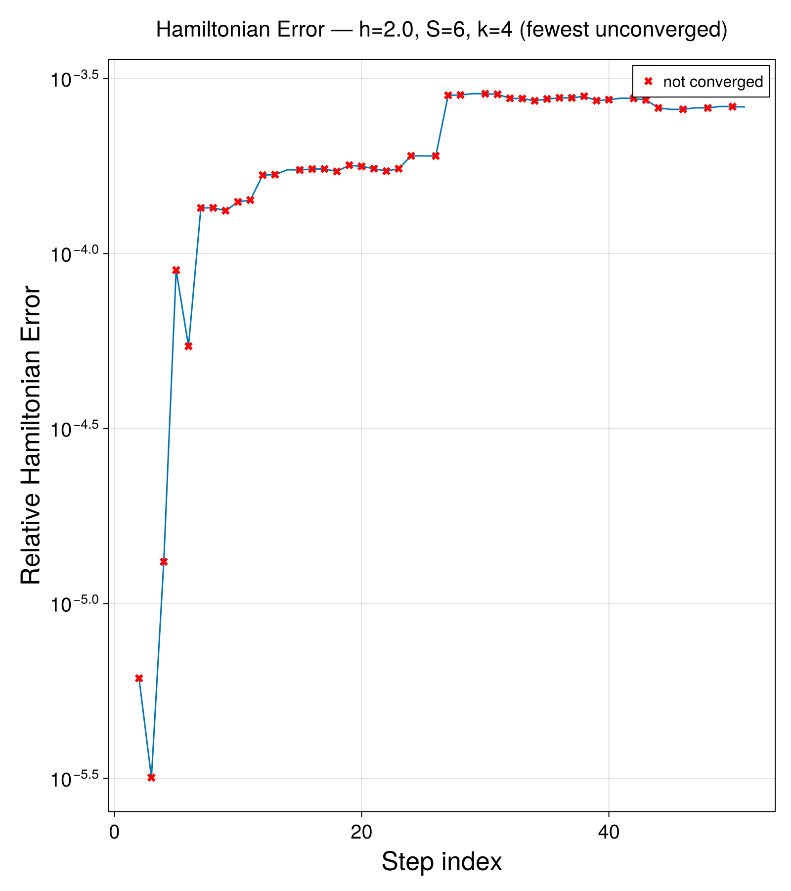<br/><small>S=6 · R=16 · k=4 · λ=1.0e-5 · f_abs=-2.220446049250313e-16 · x_suc=-2.220446049250313e-16 · dogleg · Float64<br/>Unconverged: 86.0%</small></td></tr></table></td><td><table style="width:100%"><tr><td style="text-align:center;vertical-align:top;width:50%"><strong>Min-Max Error: 1.922e-05</strong><br/>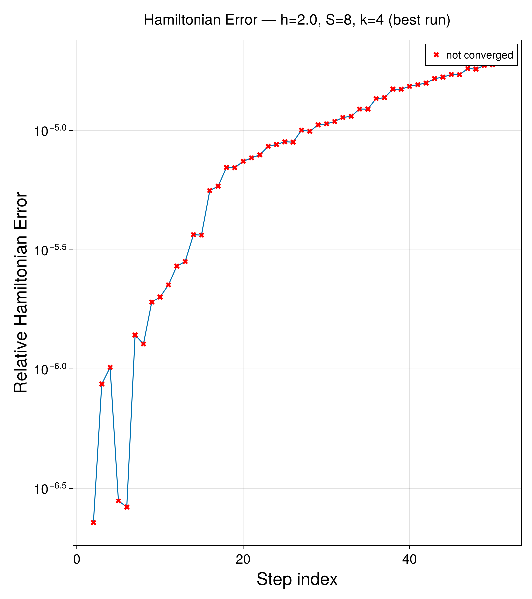<br/><small>S=8 · R=16 · k=4 · λ=0.001 · f_abs=-2.220446049250313e-16 · x_suc=-2.220446049250313e-16 · dogleg · Float64<br/>Unconverged: 100.0%</small></td><td style="text-align:center;vertical-align:top;width:50%"><strong>Fewest Unconverged Run — Error: 1.143e-02</strong><br/>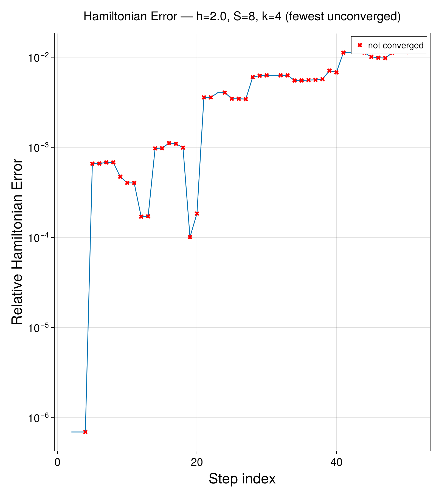<br/><small>S=8 · R=4 · k=4 · λ=0.0 · f_abs=-2.220446049250313e-16 · x_suc=-2.220446049250313e-16 · dogleg · Float64<br/>Unconverged: 84.0%</small></td></tr></table></td><td><table style="width:100%"><tr><td style="text-align:center;vertical-align:top;width:50%"><strong>Min-Max Error: 2.109e-05</strong><br/>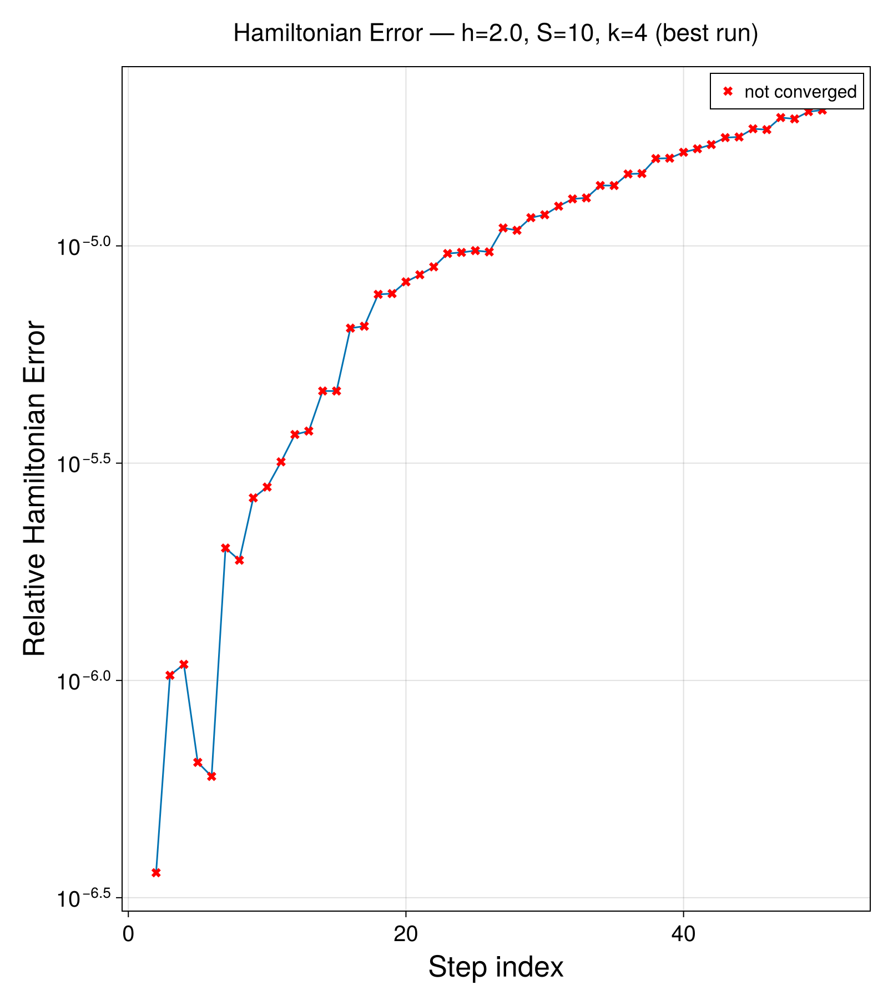<br/><small>S=10 · R=16 · k=4 · λ=0.001 · f_abs=-2.220446049250313e-16 · x_suc=-2.220446049250313e-16 · dogleg · Float64<br/>Unconverged: 100.0%</small></td><td style="text-align:center;vertical-align:top;width:50%"><strong>Fewest Unconverged Run — Error: 1.723e-02</strong><br/>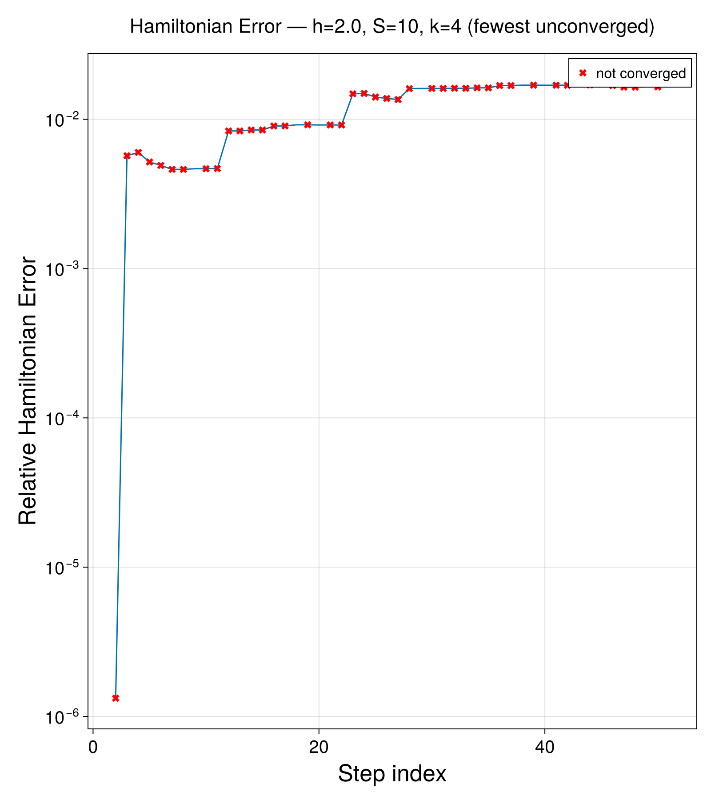<br/><small>S=10 · R=4 · k=4 · λ=0.0 · f_abs=-2.220446049250313e-16 · x_suc=-2.220446049250313e-16 · dogleg · Float64<br/>Unconverged: 82.0%</small></td></tr></table></td><td><table style="width:100%"><tr><td style="text-align:center;vertical-align:top;width:50%"><strong>Min-Max Error: 1.356e-05</strong><br/>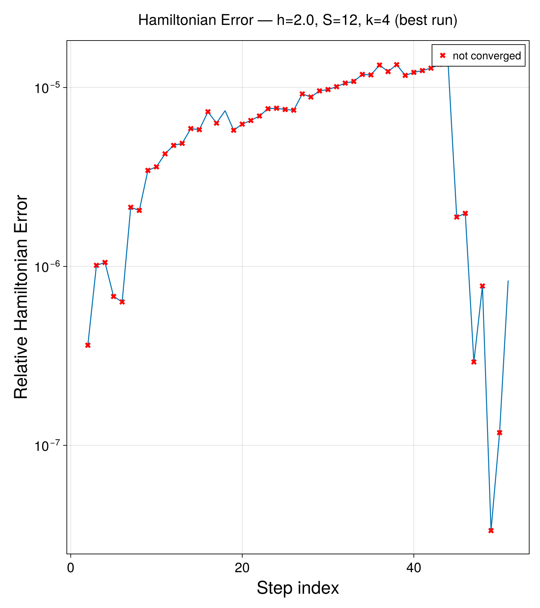<br/><small>S=12 · R=16 · k=4 · λ=0.001 · f_abs=-2.220446049250313e-16 · x_suc=-2.220446049250313e-16 · dogleg · Float64<br/>Unconverged: 98.0%</small></td><td style="text-align:center;vertical-align:top;width:50%"><strong>Fewest Unconverged Run — Error: 3.433e-02</strong><br/>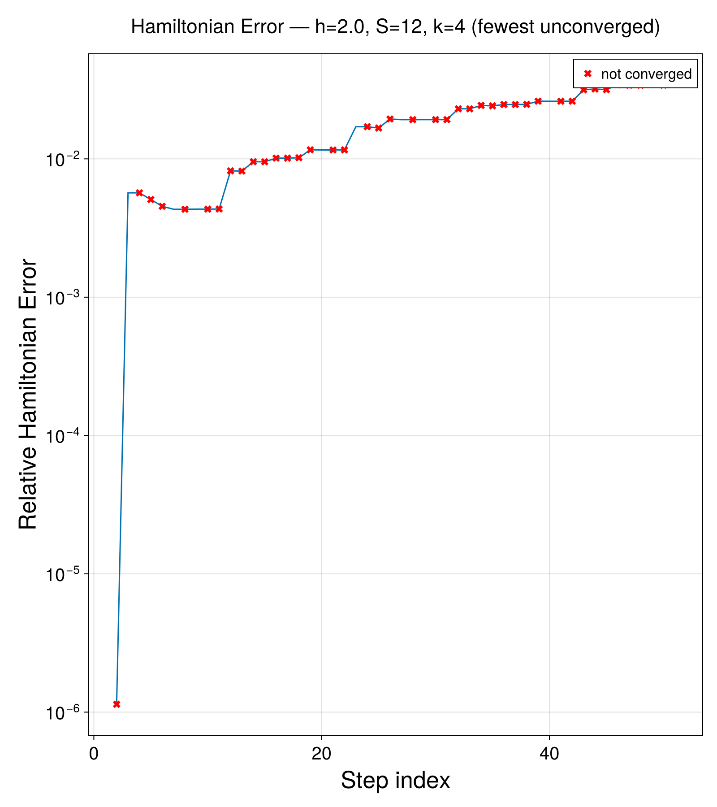<br/><small>S=12 · R=4 · k=4 · λ=0.0 · f_abs=-2.220446049250313e-16 · x_suc=-2.220446049250313e-16 · dogleg · Float64<br/>Unconverged: 80.0%</small></td></tr></table></td><td><table style="width:100%"><tr><td style="text-align:center;vertical-align:top;width:50%"><strong>Min-Max Error: 8.144e-05</strong><br/>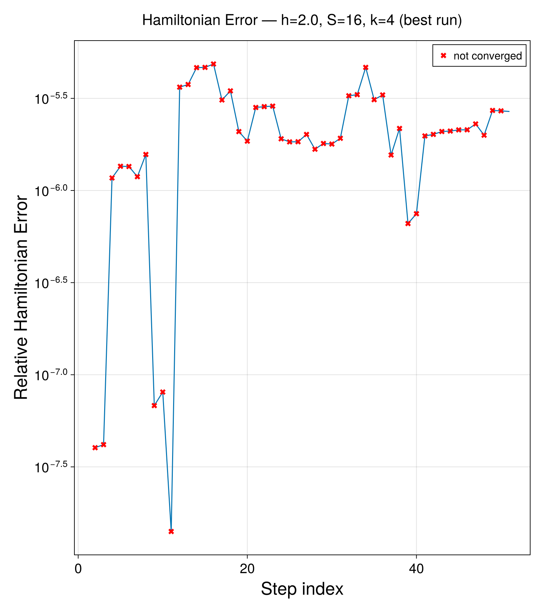<br/><small>S=16 · R=16 · k=4 · λ=0.001 · f_abs=-2.220446049250313e-16 · x_suc=-2.220446049250313e-16 · dogleg · Float64<br/>Unconverged: 98.0%</small></td><td style="text-align:center;vertical-align:top;width:50%"><strong>Fewest Unconverged Run — Error: 3.843e-03</strong><br/>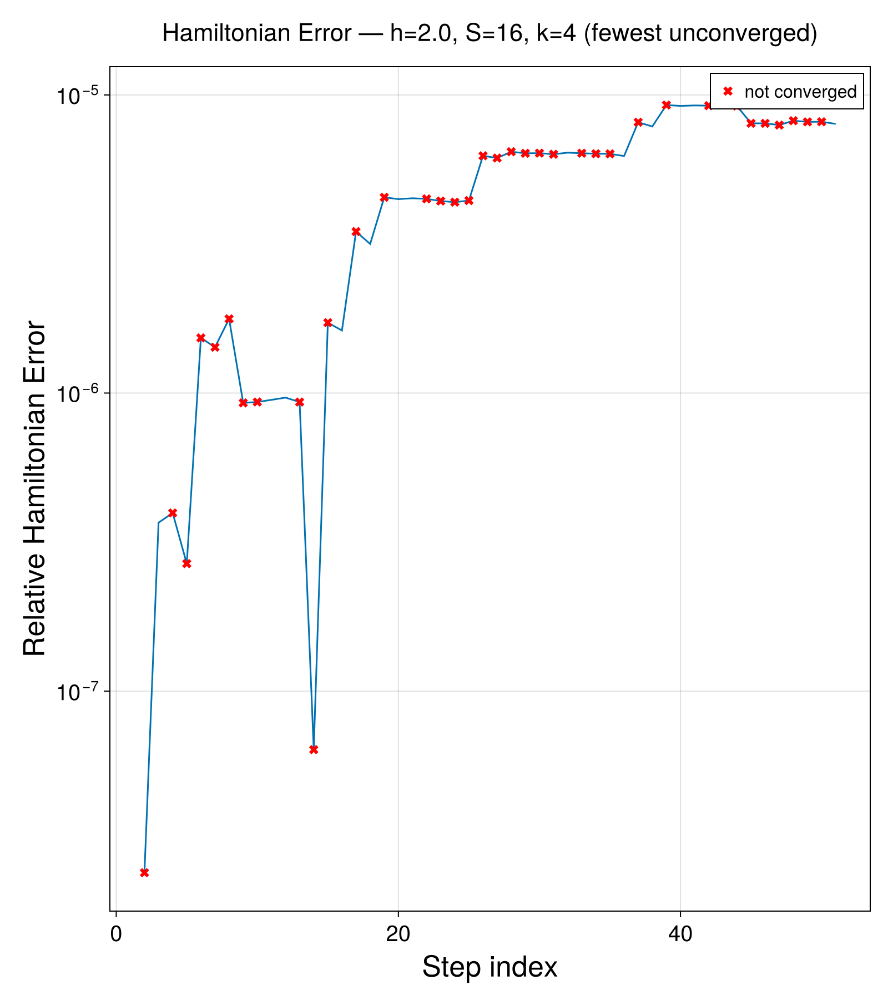<br/><small>S=16 · R=4 · k=4 · λ=0.0 · f_abs=-2.220446049250313e-16 · x_suc=-2.220446049250313e-16 · dogleg · Float64<br/>Unconverged: 96.0%</small></td></tr></table></td></tr>
</tbody></table>

### h = 5.0

<table>
<thead><tr><th></th><th>S = 4</th><th>S = 6</th><th>S = 8</th><th>S = 10</th><th>S = 12</th><th>S = 16</th></tr></thead>
<tbody>
<tr><th>k = 2</th><td><table style="width:100%"><tr><td style="text-align:center;vertical-align:top;width:50%"><strong>Min-Max Error: 1.372e-01</strong><br/>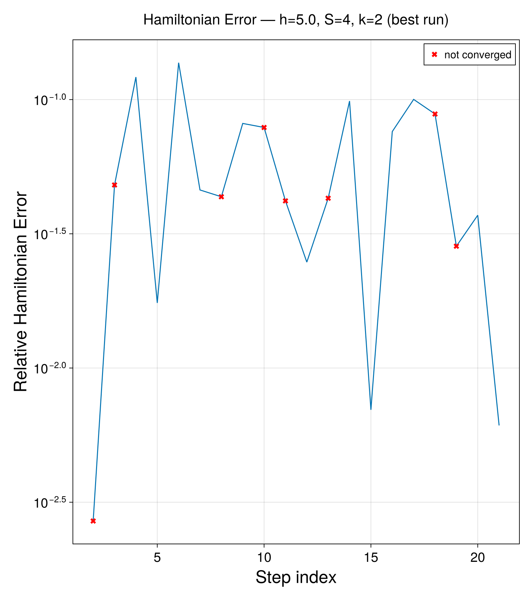<br/><small>S=4 · R=8 · k=2 · λ=1.0e-5 · f_abs=-2.220446049250313e-16 · x_suc=-2.220446049250313e-16 · dogleg · Float64<br/>Unconverged: 45.0%</small></td><td style="text-align:center;vertical-align:top;width:50%"><strong>Fewest Unconverged Run — Error: 1.834e-01</strong><br/>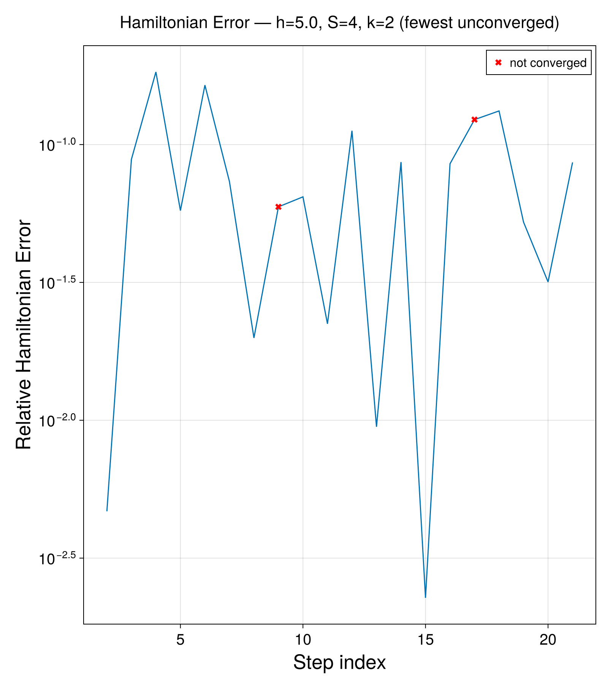<br/><small>S=4 · R=8 · k=2 · λ=1.0e-7 · f_abs=-2.220446049250313e-16 · x_suc=-2.220446049250313e-16 · backtracking · Float64<br/>Unconverged: 15.0%</small></td></tr></table></td><td><table style="width:100%"><tr><td style="text-align:center;vertical-align:top;width:50%"><strong>Min-Max Error: 2.518e-02</strong><br/>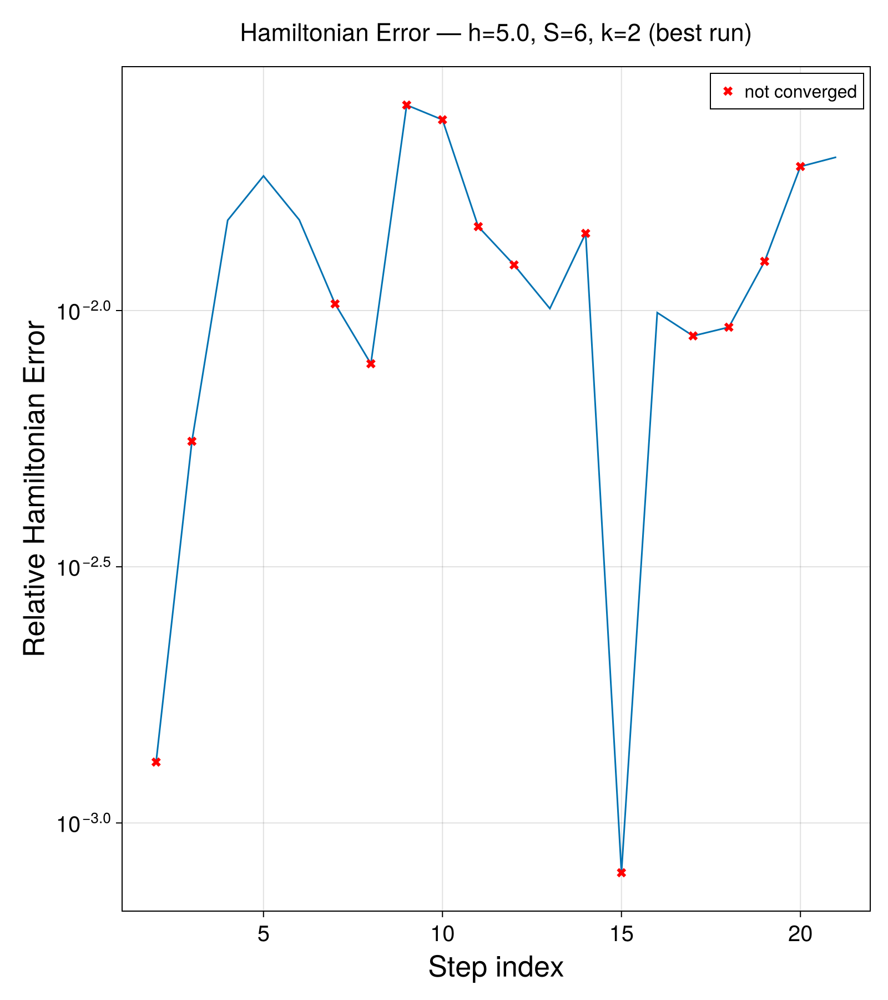<br/><small>S=6 · R=16 · k=2 · λ=1.0e-5 · f_abs=-2.220446049250313e-16 · x_suc=-2.220446049250313e-16 · backtracking · Float64<br/>Unconverged: 75.0%</small></td><td style="text-align:center;vertical-align:top;width:50%"><strong>Fewest Unconverged Run — Error: 1.893e-01</strong><br/>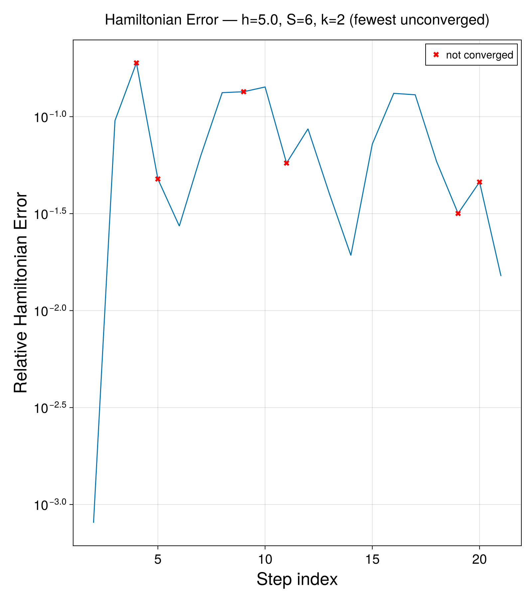<br/><small>S=6 · R=8 · k=2 · λ=0.0 · f_abs=-2.220446049250313e-16 · x_suc=-2.220446049250313e-16 · dogleg · Float64<br/>Unconverged: 35.0%</small></td></tr></table></td><td><table style="width:100%"><tr><td style="text-align:center;vertical-align:top;width:50%"><strong>Min-Max Error: 2.124e-02</strong><br/>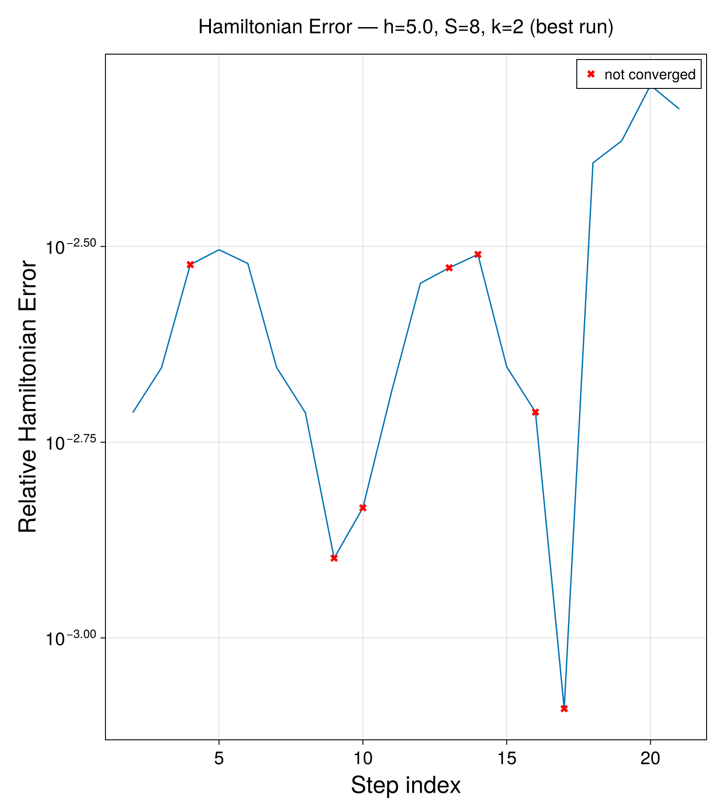<br/><small>S=8 · R=16 · k=2 · λ=1.0e-5 · f_abs=-2.220446049250313e-16 · x_suc=-2.220446049250313e-16 · dogleg · Float64<br/>Unconverged: 85.0%</small></td><td style="text-align:center;vertical-align:top;width:50%"><strong>Fewest Unconverged Run — Error: 4.154e-02</strong><br/>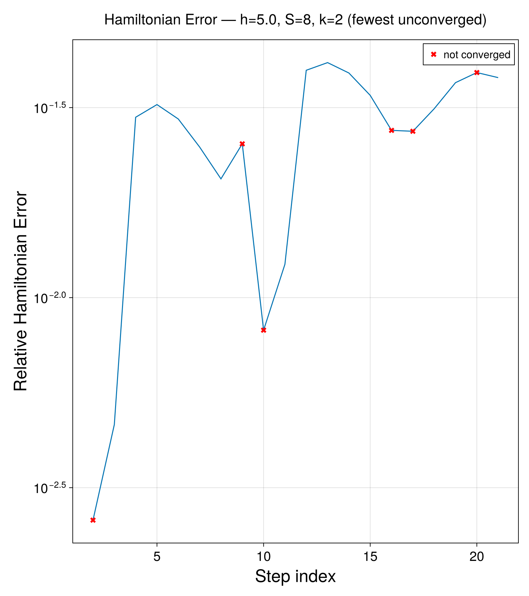<br/><small>S=8 · R=16 · k=2 · λ=1.0e-7 · f_abs=-2.220446049250313e-16 · x_suc=-2.220446049250313e-16 · dogleg · Float64<br/>Unconverged: 35.0%</small></td></tr></table></td><td><table style="width:100%"><tr><td style="text-align:center;vertical-align:top;width:50%"><strong>Min-Max Error: 2.932e-02</strong><br/>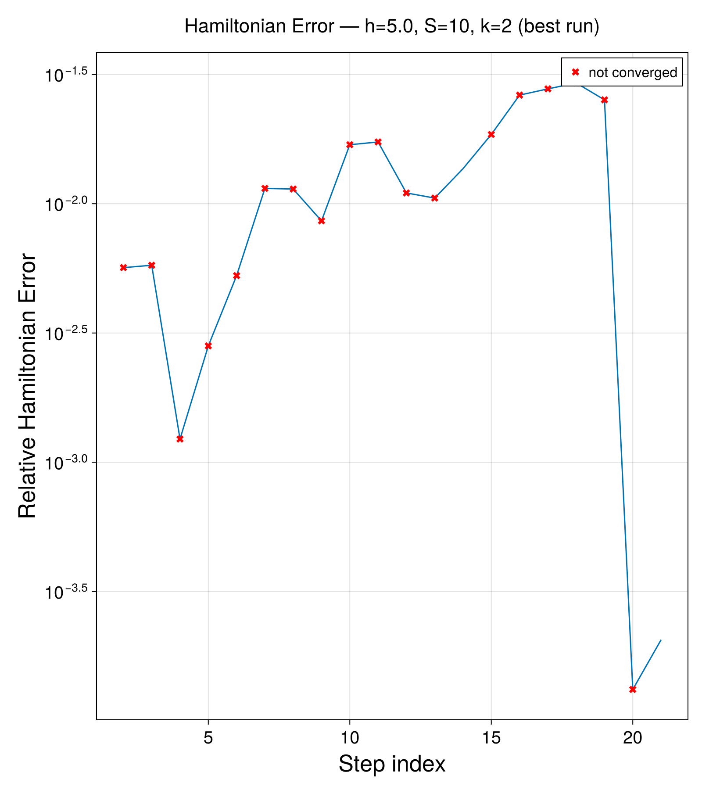<br/><small>S=10 · R=16 · k=2 · λ=1.0e-5 · f_abs=-2.220446049250313e-16 · x_suc=-2.220446049250313e-16 · dogleg · Float64<br/>Unconverged: 95.0%</small></td><td style="text-align:center;vertical-align:top;width:50%"><strong>Fewest Unconverged Run — Error: 3.495e-02</strong><br/>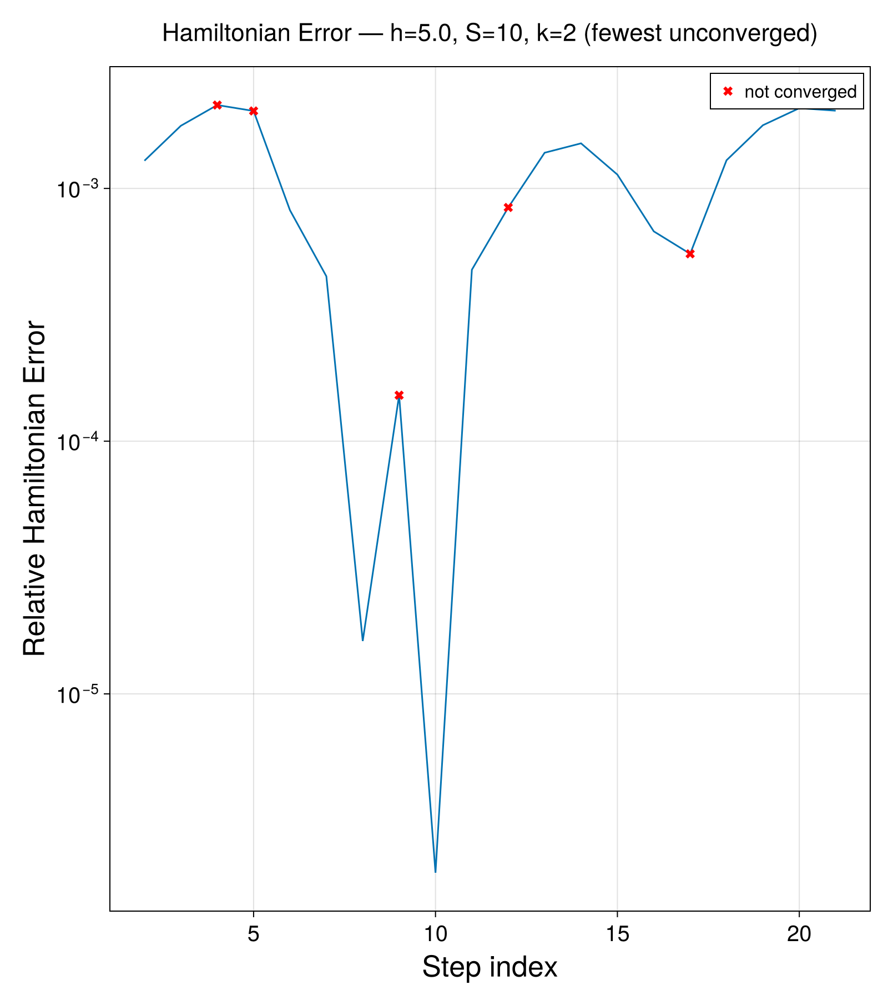<br/><small>S=10 · R=16 · k=2 · λ=0.0 · f_abs=-2.220446049250313e-16 · x_suc=-2.220446049250313e-16 · dogleg · Float64<br/>Unconverged: 75.0%</small></td></tr></table></td><td><table style="width:100%"><tr><td style="text-align:center;vertical-align:top;width:50%"><strong>Min-Max Error: 1.597e-02</strong><br/>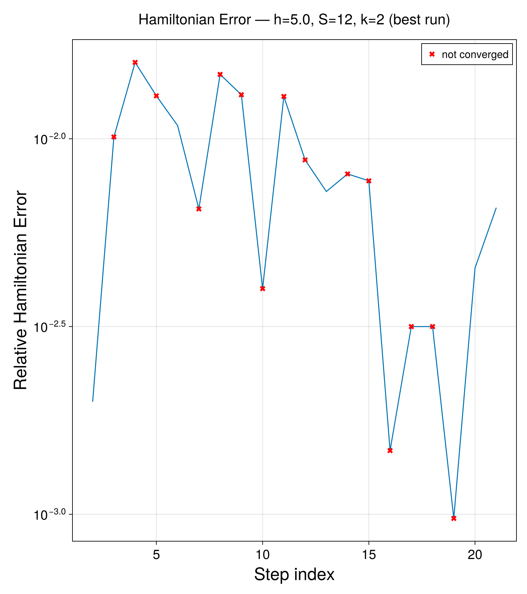<br/><small>S=12 · R=16 · k=2 · λ=1.0e-7 · f_abs=-2.220446049250313e-16 · x_suc=-2.220446049250313e-16 · backtracking · Float64<br/>Unconverged: 80.0%</small></td><td style="text-align:center;vertical-align:top;width:50%"><strong>Fewest Unconverged Run — Error: 1.597e-02</strong><br/>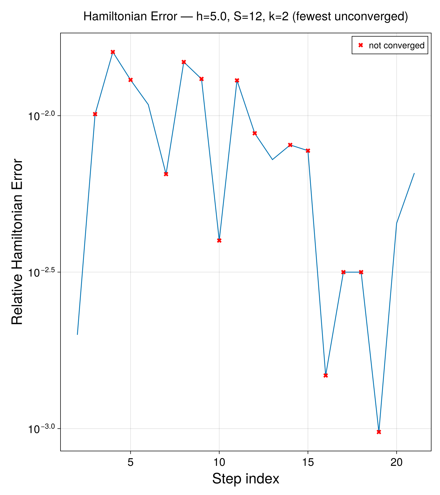<br/><small>S=12 · R=16 · k=2 · λ=1.0e-7 · f_abs=-2.220446049250313e-16 · x_suc=-2.220446049250313e-16 · backtracking · Float64<br/>Unconverged: 80.0%</small></td></tr></table></td><td><table style="width:100%"><tr><td style="text-align:center;vertical-align:top;width:50%"><strong>Min-Max Error: 2.304e-02</strong><br/>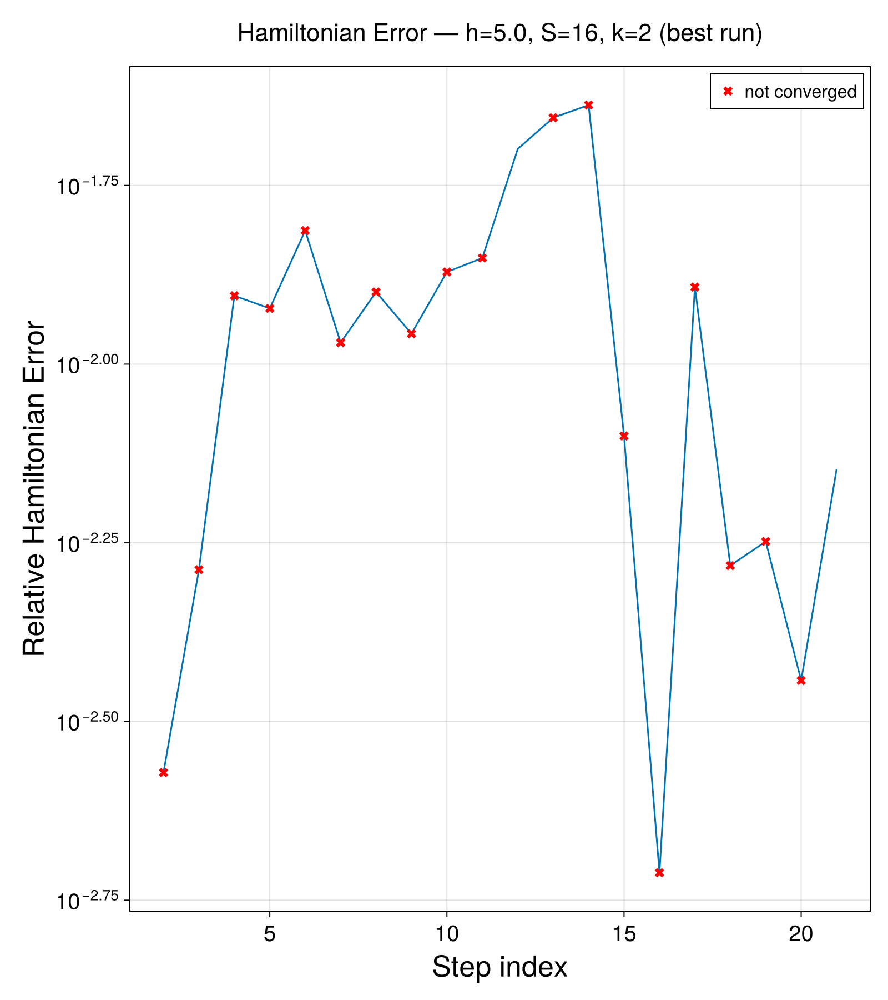<br/><small>S=16 · R=16 · k=2 · λ=1.0e-7 · f_abs=-2.220446049250313e-16 · x_suc=-2.220446049250313e-16 · dogleg · Float64<br/>Unconverged: 95.0%</small></td><td style="text-align:center;vertical-align:top;width:50%"><strong>Fewest Unconverged Run — Error: 2.960e-02</strong><br/>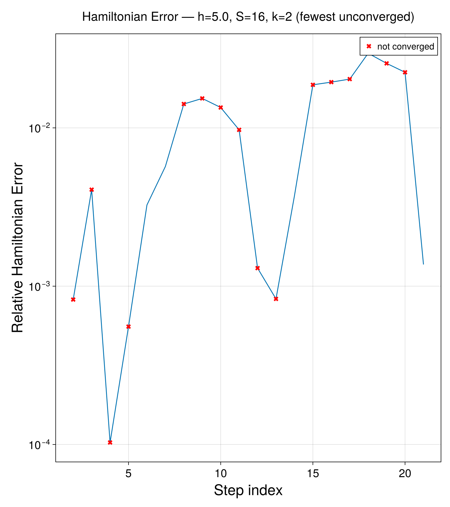<br/><small>S=16 · R=16 · k=2 · λ=0.0 · f_abs=-2.220446049250313e-16 · x_suc=-2.220446049250313e-16 · dogleg · Float64<br/>Unconverged: 80.0%</small></td></tr></table></td></tr>
<tr><th>k = 3</th><td><table style="width:100%"><tr><td style="text-align:center;vertical-align:top;width:50%"><strong>Min-Max Error: 6.742e-02</strong><br/>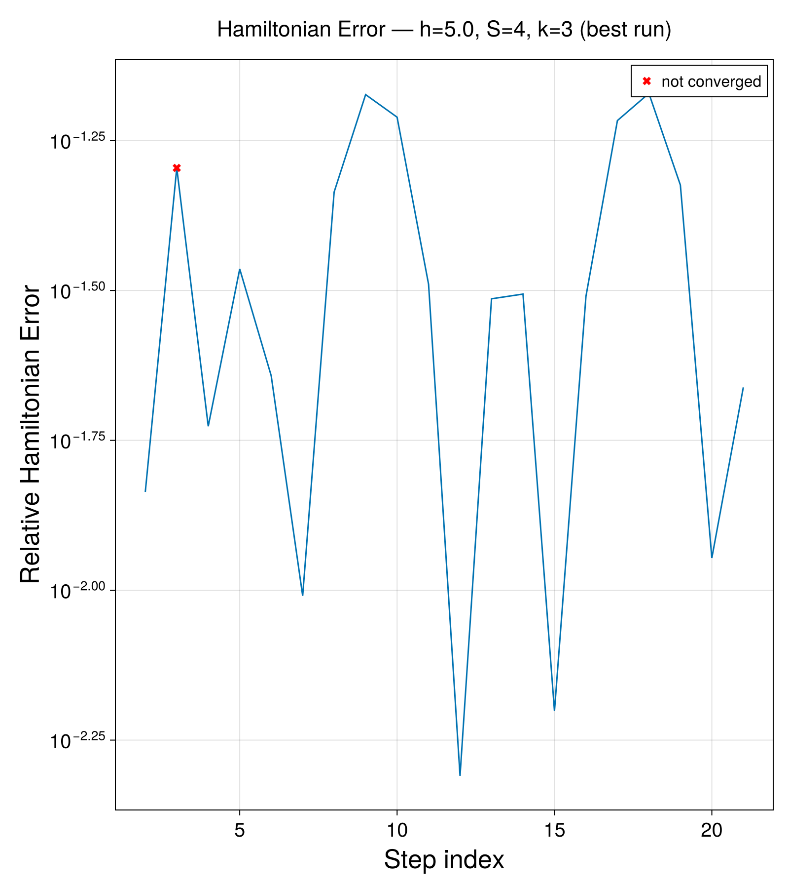<br/><small>S=4 · R=4 · k=3 · λ=0.001 · f_abs=-2.220446049250313e-16 · x_suc=-2.220446049250313e-16 · backtracking · Float64<br/>Unconverged: 5.0%</small></td><td style="text-align:center;vertical-align:top;width:50%"><strong>Fewest Unconverged Run — Error: 6.742e-02</strong><br/>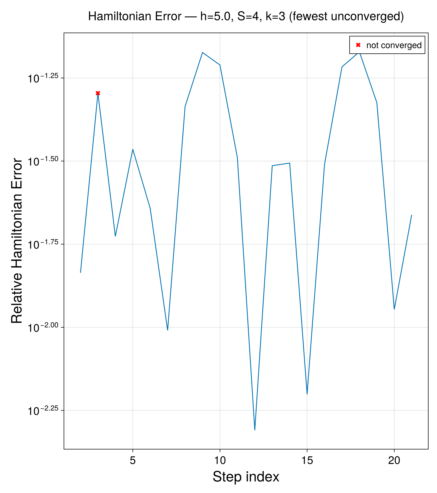<br/><small>S=4 · R=4 · k=3 · λ=0.001 · f_abs=-2.220446049250313e-16 · x_suc=-2.220446049250313e-16 · backtracking · Float64<br/>Unconverged: 5.0%</small></td></tr></table></td><td><table style="width:100%"><tr><td style="text-align:center;vertical-align:top;width:50%"><strong>Min-Max Error: 3.554e-03</strong><br/>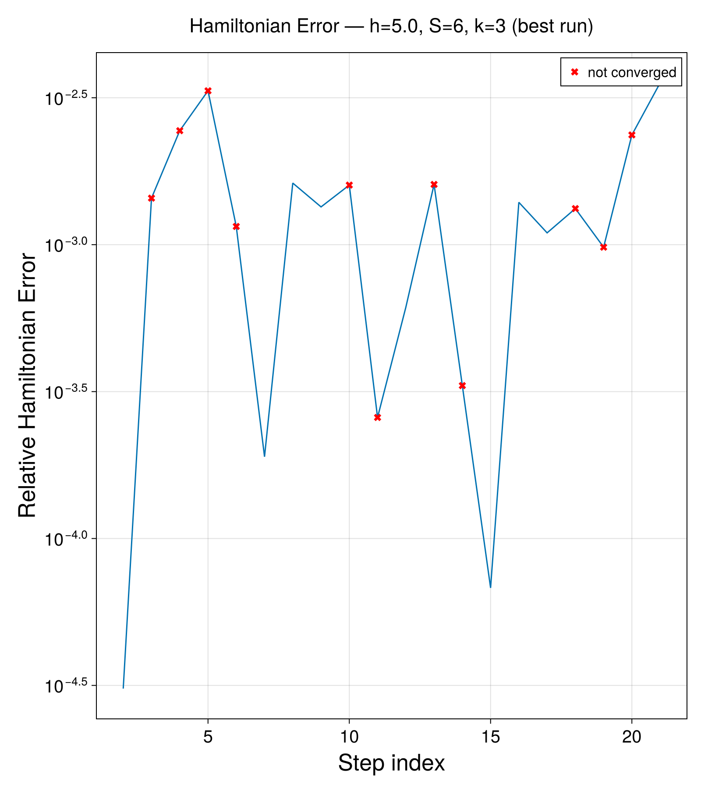<br/><small>S=6 · R=16 · k=3 · λ=1.0e-5 · f_abs=-2.220446049250313e-16 · x_suc=-2.220446049250313e-16 · dogleg · Float64<br/>Unconverged: 60.0%</small></td><td style="text-align:center;vertical-align:top;width:50%"><strong>Fewest Unconverged Run — Error: 5.282e-03</strong><br/>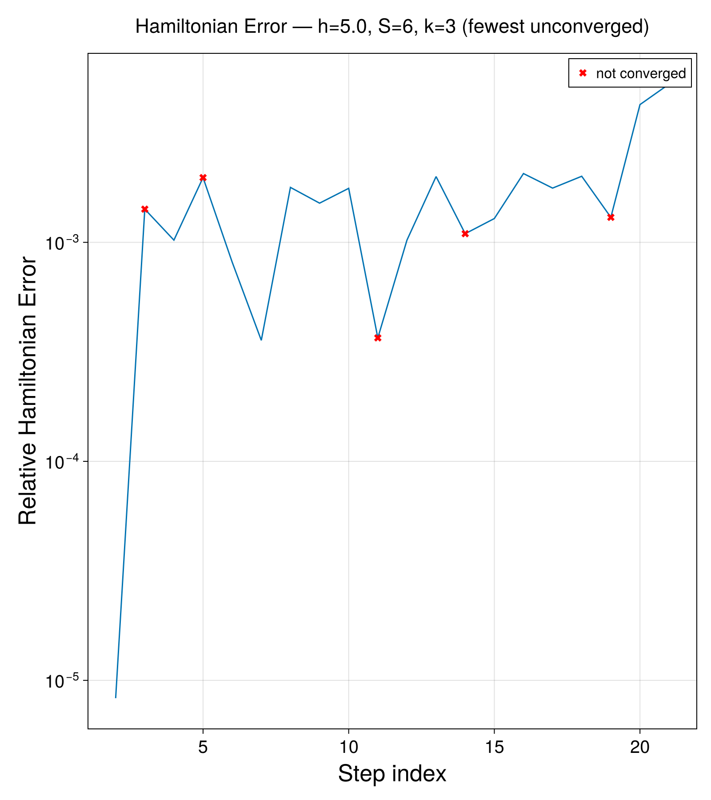<br/><small>S=6 · R=16 · k=3 · λ=1.0e-7 · f_abs=-2.220446049250313e-16 · x_suc=-2.220446049250313e-16 · dogleg · Float64<br/>Unconverged: 30.0%</small></td></tr></table></td><td><table style="width:100%"><tr><td style="text-align:center;vertical-align:top;width:50%"><strong>Min-Max Error: 3.104e-03</strong><br/>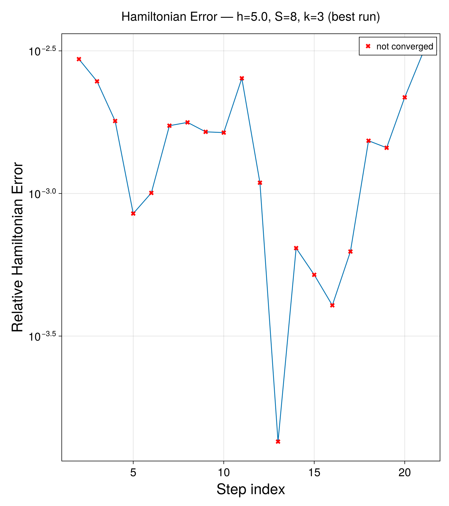<br/><small>S=8 · R=16 · k=3 · λ=1.0e-7 · f_abs=-2.220446049250313e-16 · x_suc=-2.220446049250313e-16 · dogleg · Float64<br/>Unconverged: 100.0%</small></td><td style="text-align:center;vertical-align:top;width:50%"><strong>Fewest Unconverged Run — Error: 5.828e-03</strong><br/>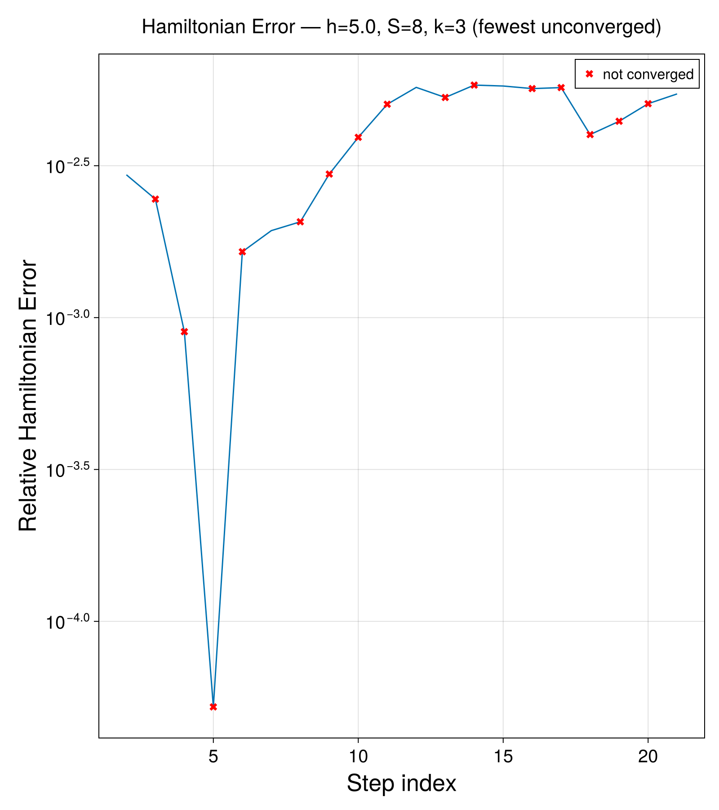<br/><small>S=8 · R=16 · k=3 · λ=0.0 · f_abs=-2.220446049250313e-16 · x_suc=-2.220446049250313e-16 · dogleg · Float64<br/>Unconverged: 80.0%</small></td></tr></table></td><td><table style="width:100%"><tr><td style="text-align:center;vertical-align:top;width:50%"><strong>Min-Max Error: 8.882e-03</strong><br/>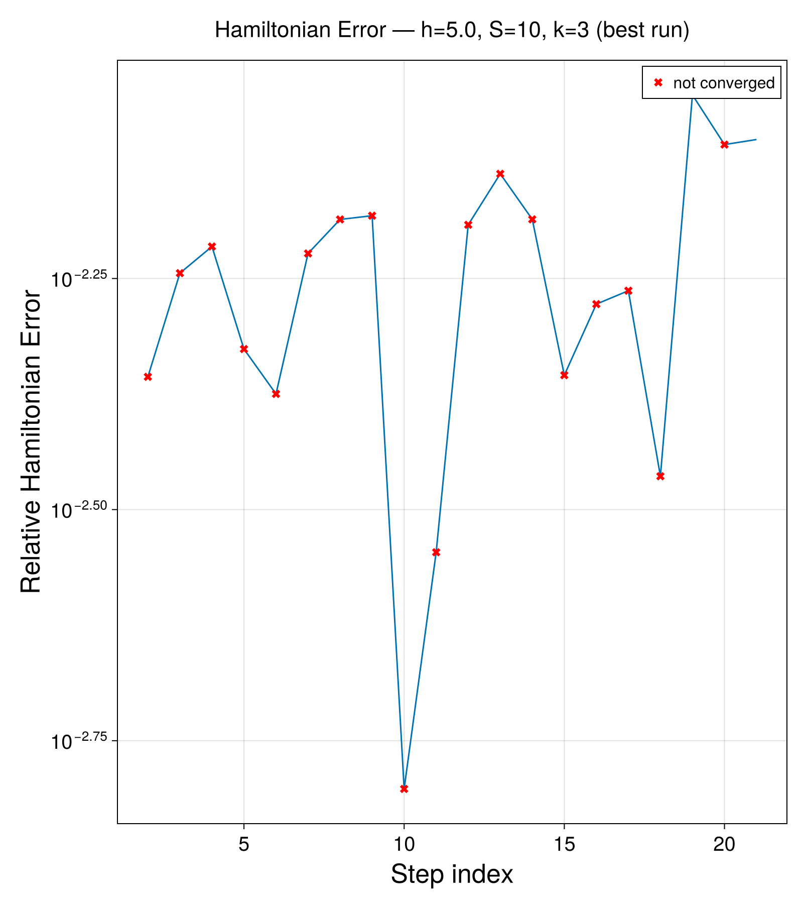<br/><small>S=10 · R=16 · k=3 · λ=0.001 · f_abs=-2.220446049250313e-16 · x_suc=-2.220446049250313e-16 · backtracking · Float64<br/>Unconverged: 100.0%</small></td><td style="text-align:center;vertical-align:top;width:50%"><strong>Fewest Unconverged Run — Error: 1.432e-01</strong><br/>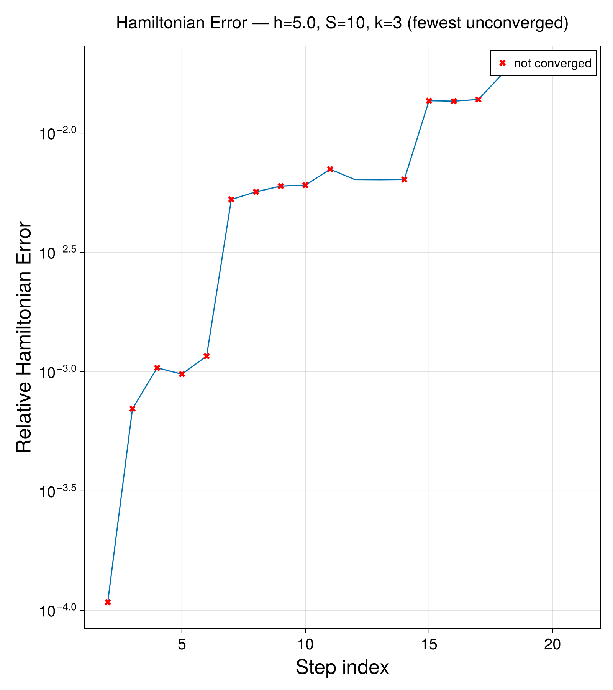<br/><small>S=10 · R=4 · k=3 · λ=1.0e-7 · f_abs=-2.220446049250313e-16 · x_suc=-2.220446049250313e-16 · dogleg · Float64<br/>Unconverged: 90.0%</small></td></tr></table></td><td><table style="width:100%"><tr><td style="text-align:center;vertical-align:top;width:50%"><strong>Min-Max Error: 8.261e-03</strong><br/>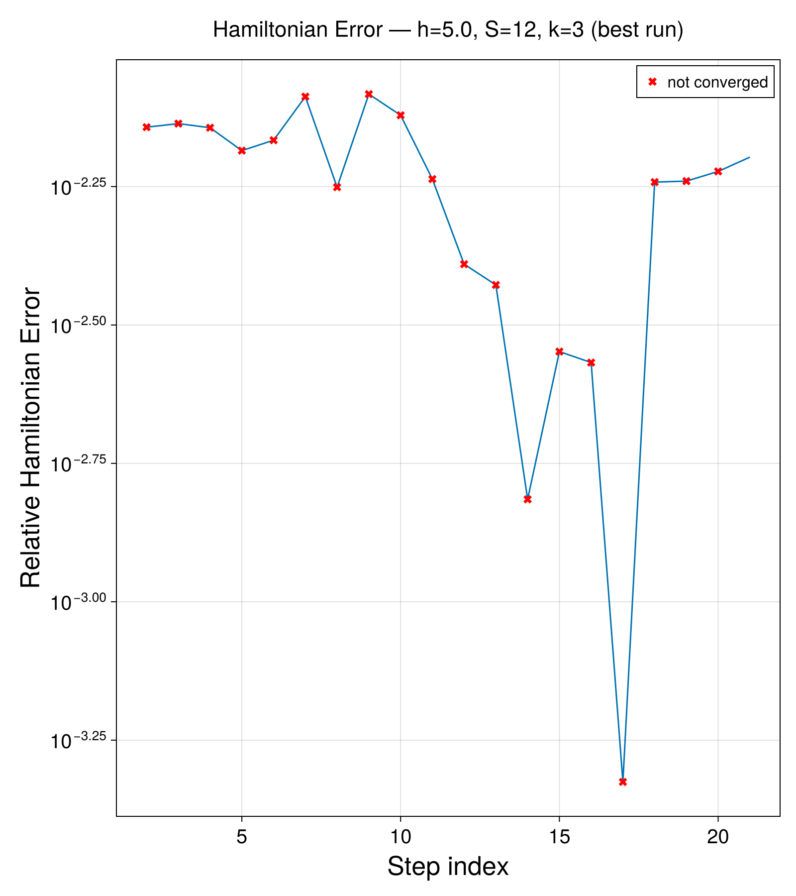<br/><small>S=12 · R=16 · k=3 · λ=1.0e-7 · f_abs=-2.220446049250313e-16 · x_suc=-2.220446049250313e-16 · backtracking · Float64<br/>Unconverged: 100.0%</small></td><td style="text-align:center;vertical-align:top;width:50%"><strong>Fewest Unconverged Run — Error: 3.375e-02</strong><br/>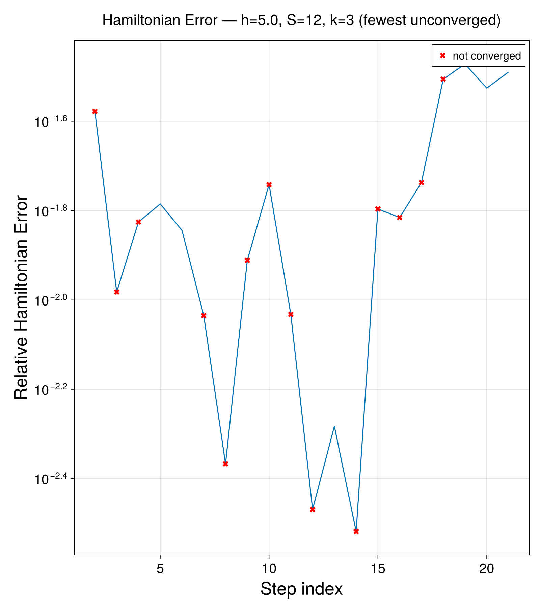<br/><small>S=12 · R=8 · k=3 · λ=1.0e-7 · f_abs=-2.220446049250313e-16 · x_suc=-2.220446049250313e-16 · backtracking · Float64<br/>Unconverged: 80.0%</small></td></tr></table></td><td><table style="width:100%"><tr><td style="text-align:center;vertical-align:top;width:50%"><strong>Min-Max Error: 6.173e-03</strong><br/>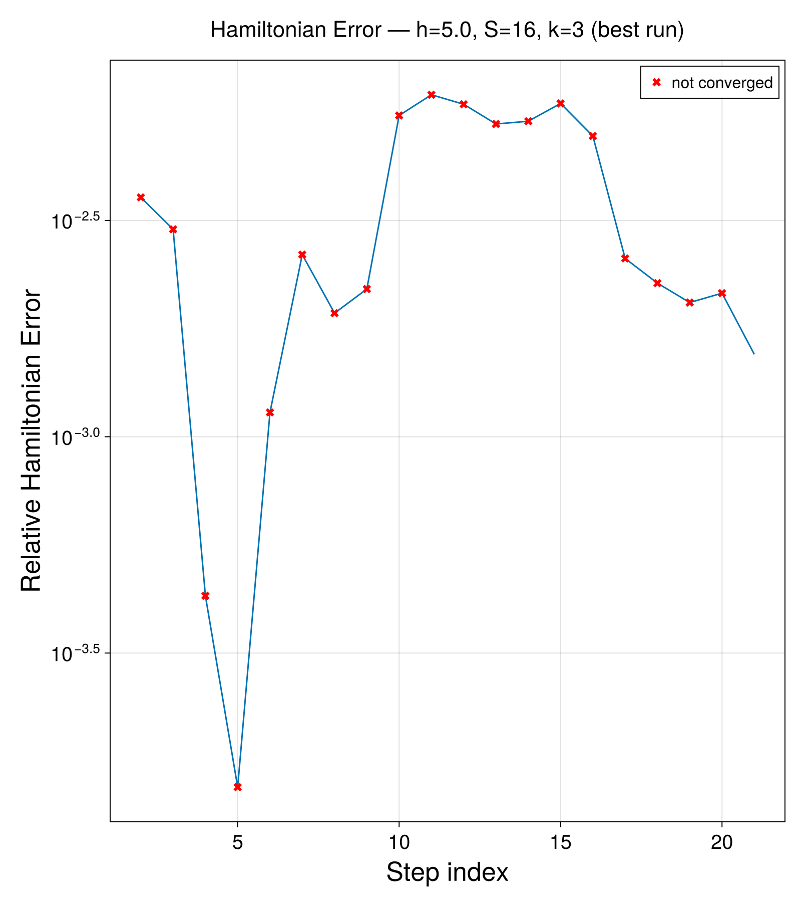<br/><small>S=16 · R=16 · k=3 · λ=0.0 · f_abs=-2.220446049250313e-16 · x_suc=-2.220446049250313e-16 · dogleg · Float64<br/>Unconverged: 100.0%</small></td><td style="text-align:center;vertical-align:top;width:50%"><strong>Fewest Unconverged Run — Error: 1.258e-01</strong><br/>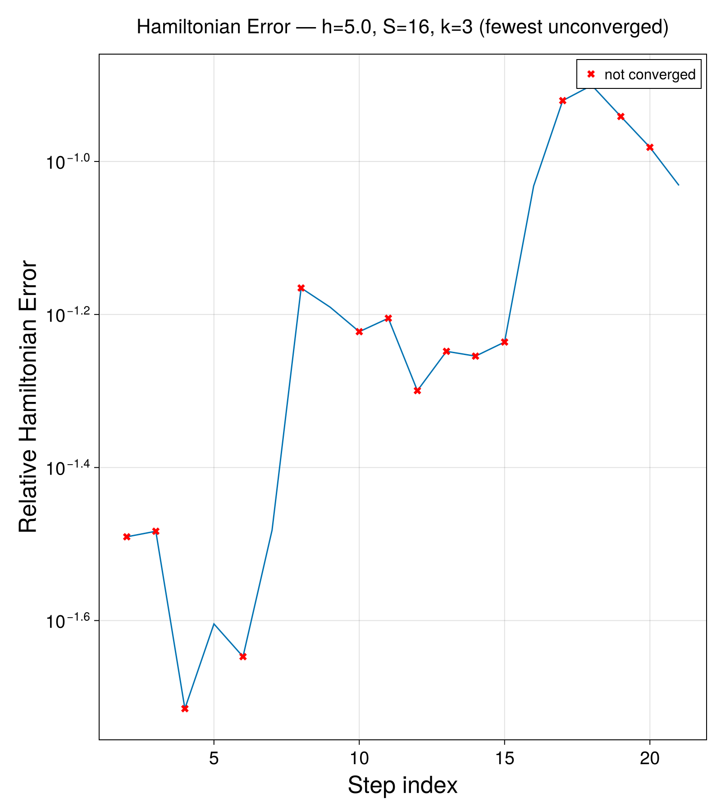<br/><small>S=16 · R=4 · k=3 · λ=1.0e-7 · f_abs=-2.220446049250313e-16 · x_suc=-2.220446049250313e-16 · dogleg · Float64<br/>Unconverged: 80.0%</small></td></tr></table></td></tr>
<tr><th>k = 4</th><td><table style="width:100%"><tr><td style="text-align:center;vertical-align:top;width:50%"><strong>Min-Max Error: 8.535e-02</strong><br/>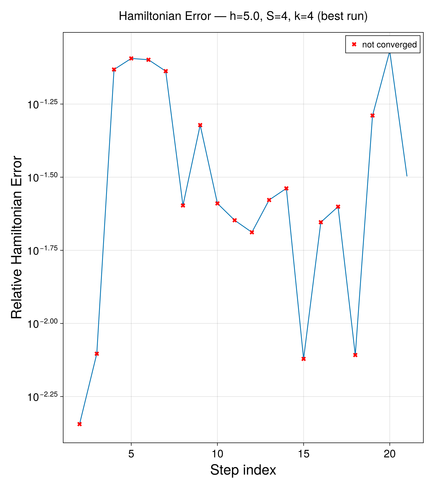<br/><small>S=4 · R=16 · k=4 · λ=1.0e-7 · f_abs=-2.220446049250313e-16 · x_suc=-2.220446049250313e-16 · backtracking · Float64<br/>Unconverged: 100.0%</small></td><td style="text-align:center;vertical-align:top;width:50%"><strong>Fewest Unconverged Run — Error: 9.688e-02</strong><br/>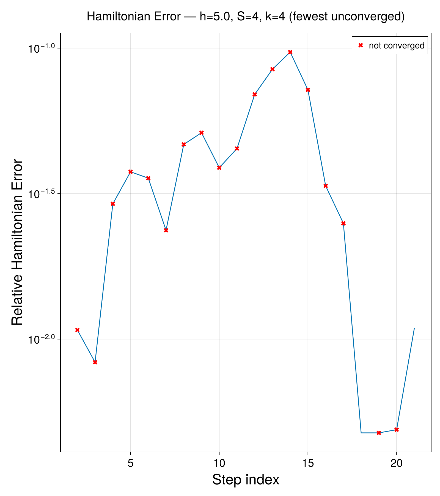<br/><small>S=4 · R=4 · k=4 · λ=1.0e-7 · f_abs=-2.220446049250313e-16 · x_suc=-2.220446049250313e-16 · dogleg · Float64<br/>Unconverged: 95.0%</small></td></tr></table></td><td><table style="width:100%"><tr><td style="text-align:center;vertical-align:top;width:50%"><strong>Min-Max Error: 9.338e-04</strong><br/>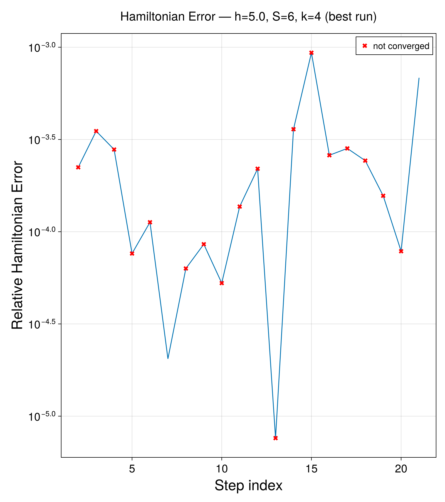<br/><small>S=6 · R=16 · k=4 · λ=1.0e-7 · f_abs=-2.220446049250313e-16 · x_suc=-2.220446049250313e-16 · dogleg · Float64<br/>Unconverged: 95.0%</small></td><td style="text-align:center;vertical-align:top;width:50%"><strong>Fewest Unconverged Run — Error: 7.314e-02</strong><br/>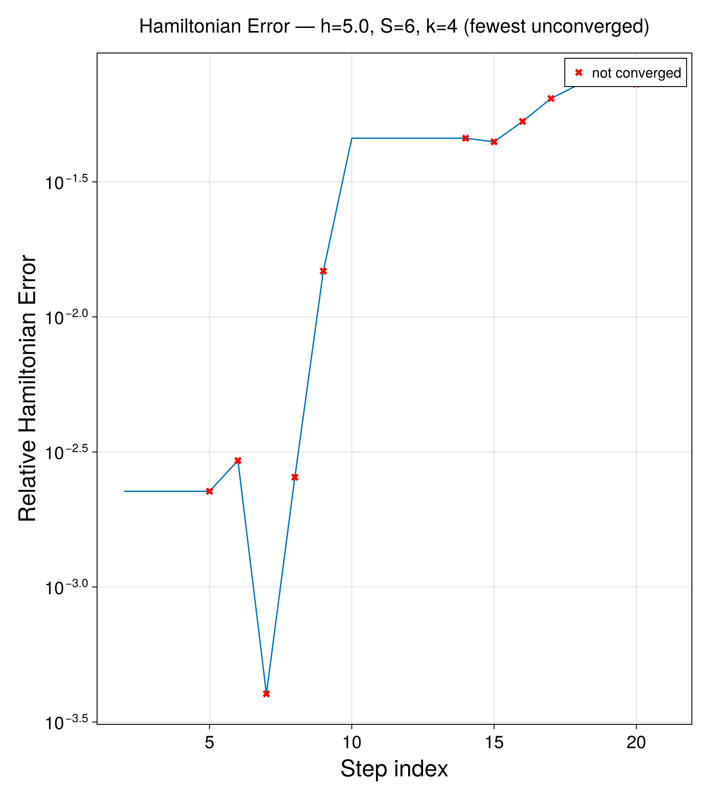<br/><small>S=6 · R=4 · k=4 · λ=0.0 · f_abs=-2.220446049250313e-16 · x_suc=-2.220446049250313e-16 · dogleg · Float64<br/>Unconverged: 55.0%</small></td></tr></table></td><td><table style="width:100%"><tr><td style="text-align:center;vertical-align:top;width:50%"><strong>Min-Max Error: 4.139e-03</strong><br/>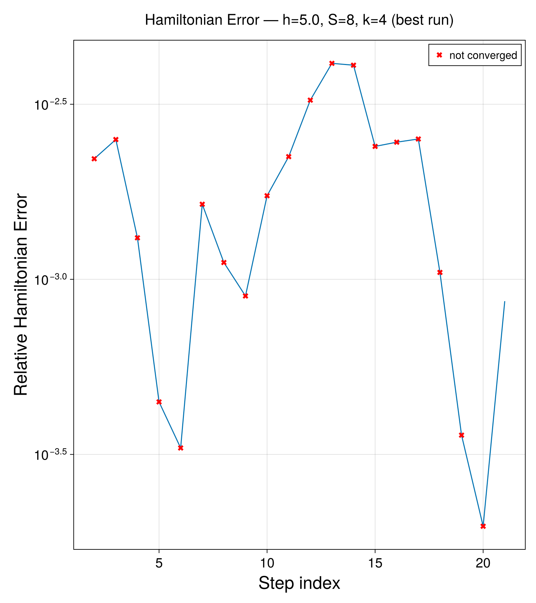<br/><small>S=8 · R=8 · k=4 · λ=1.0e-5 · f_abs=-2.220446049250313e-16 · x_suc=-2.220446049250313e-16 · dogleg · Float64<br/>Unconverged: 100.0%</small></td><td style="text-align:center;vertical-align:top;width:50%"><strong>Fewest Unconverged Run — Error: 1.723e-02</strong><br/>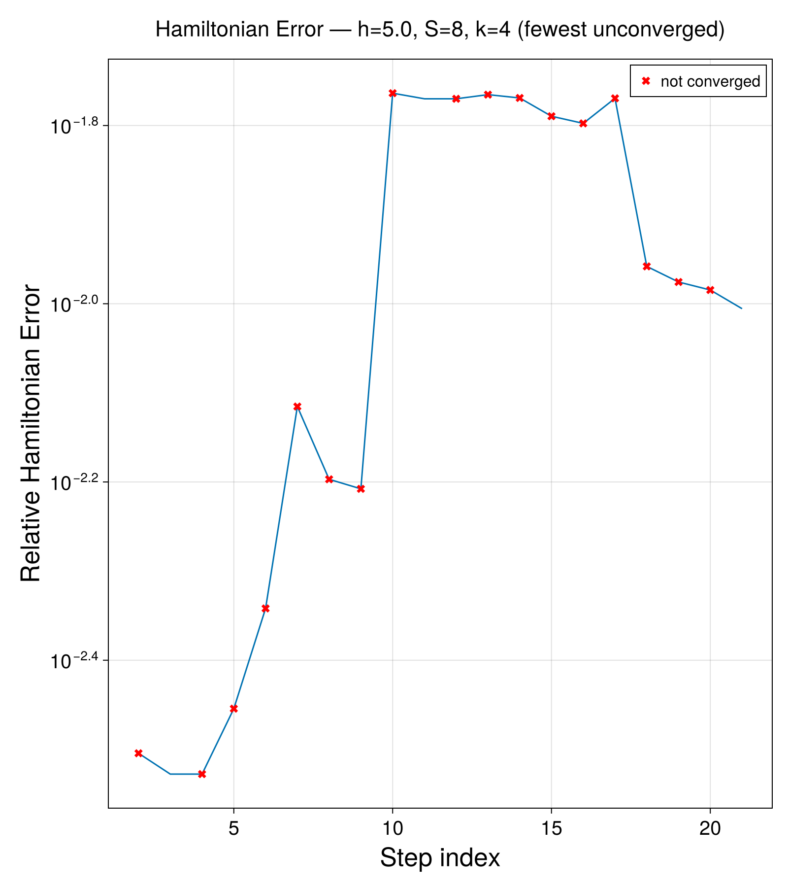<br/><small>S=8 · R=4 · k=4 · λ=0.0 · f_abs=-2.220446049250313e-16 · x_suc=-2.220446049250313e-16 · dogleg · Float64<br/>Unconverged: 90.0%</small></td></tr></table></td><td><table style="width:100%"><tr><td style="text-align:center;vertical-align:top;width:50%"><strong>Min-Max Error: 1.490e-03</strong><br/>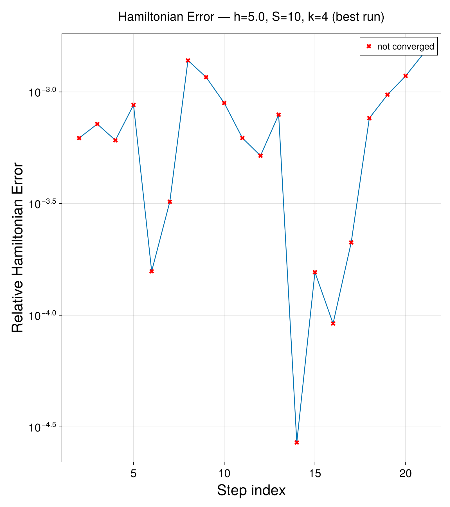<br/><small>S=10 · R=16 · k=4 · λ=1.0e-5 · f_abs=-2.220446049250313e-16 · x_suc=-2.220446049250313e-16 · dogleg · Float64<br/>Unconverged: 100.0%</small></td><td style="text-align:center;vertical-align:top;width:50%"><strong>Fewest Unconverged Run — Error: 7.337e-02</strong><br/>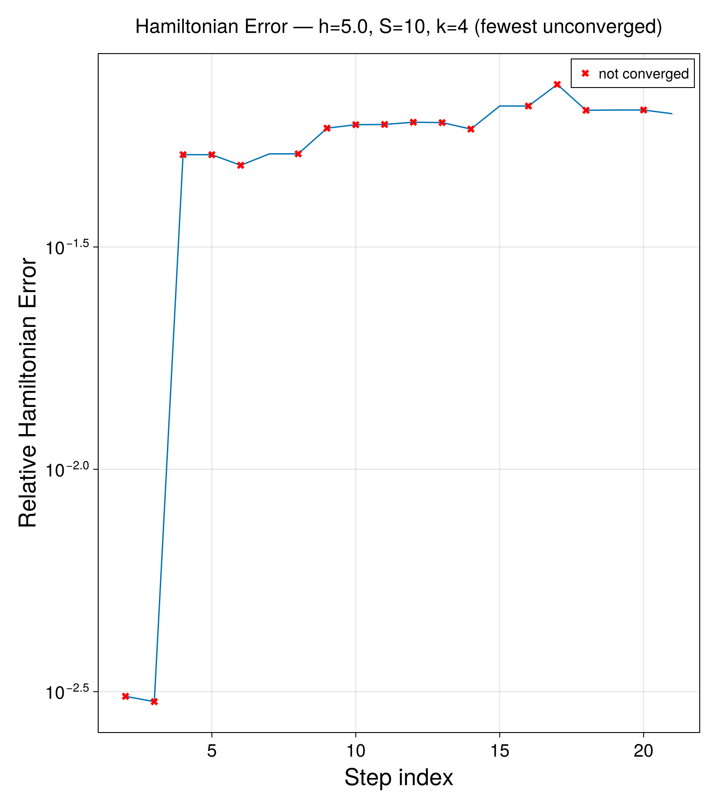<br/><small>S=10 · R=4 · k=4 · λ=0.0 · f_abs=-2.220446049250313e-16 · x_suc=-2.220446049250313e-16 · dogleg · Float64<br/>Unconverged: 85.0%</small></td></tr></table></td><td><table style="width:100%"><tr><td style="text-align:center;vertical-align:top;width:50%"><strong>Min-Max Error: 1.547e-03</strong><br/>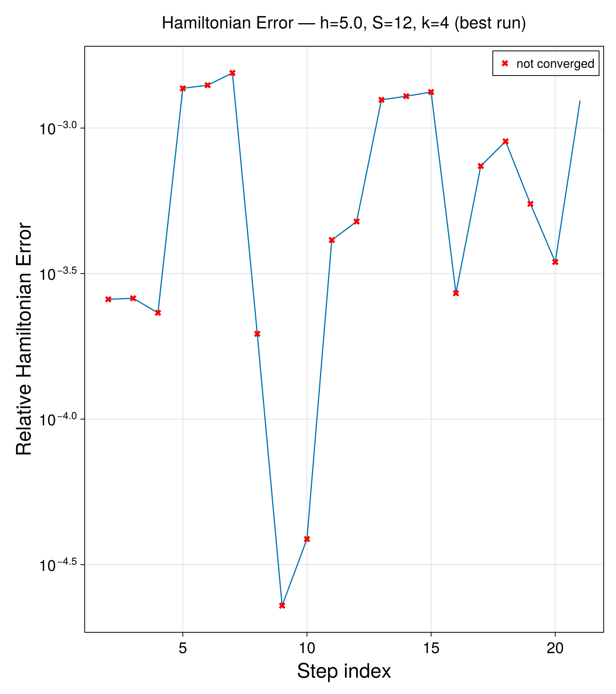<br/><small>S=12 · R=16 · k=4 · λ=0.0 · f_abs=-2.220446049250313e-16 · x_suc=-2.220446049250313e-16 · backtracking · Float64<br/>Unconverged: 100.0%</small></td><td style="text-align:center;vertical-align:top;width:50%"><strong>Fewest Unconverged Run — Error: 2.217e-02</strong><br/>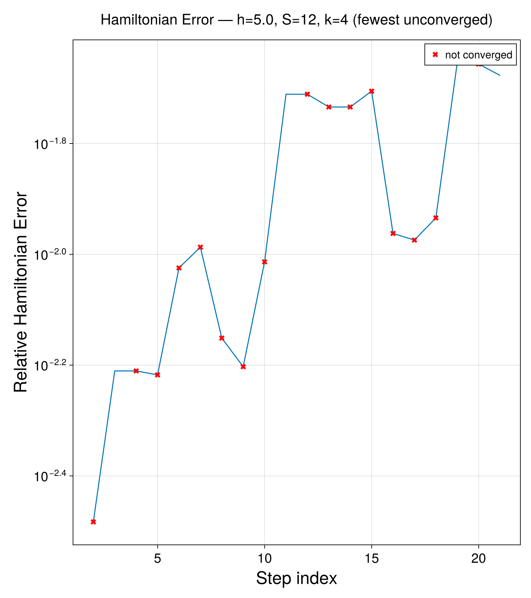<br/><small>S=12 · R=4 · k=4 · λ=0.0 · f_abs=-2.220446049250313e-16 · x_suc=-2.220446049250313e-16 · dogleg · Float64<br/>Unconverged: 90.0%</small></td></tr></table></td><td><table style="width:100%"><tr><td style="text-align:center;vertical-align:top;width:50%"><strong>Min-Max Error: 1.841e-03</strong><br/>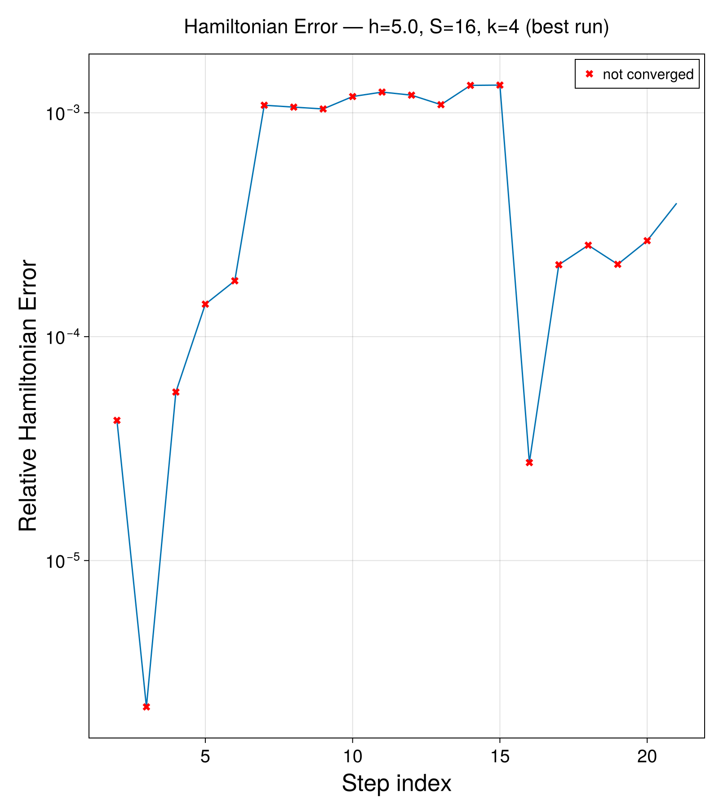<br/><small>S=16 · R=16 · k=4 · λ=0.001 · f_abs=-2.220446049250313e-16 · x_suc=-2.220446049250313e-16 · backtracking · Float64<br/>Unconverged: 100.0%</small></td><td style="text-align:center;vertical-align:top;width:50%"><strong>Fewest Unconverged Run — Error: 9.852e-03</strong><br/>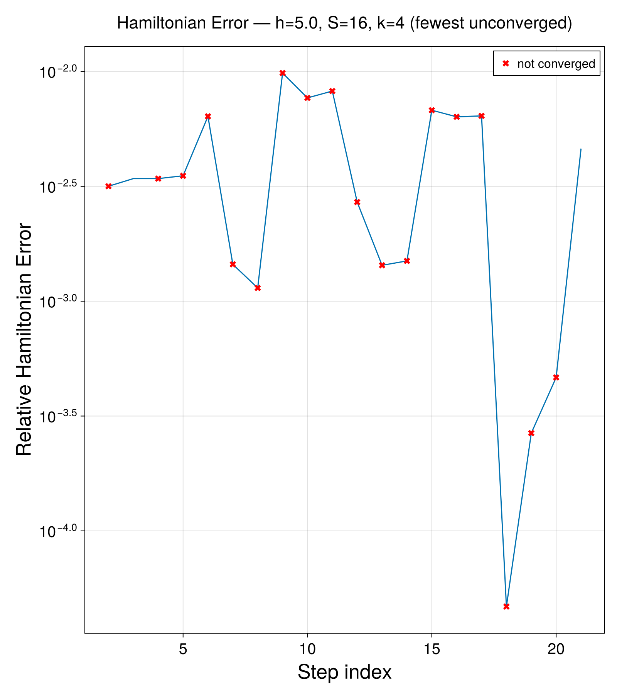<br/><small>S=16 · R=4 · k=4 · λ=1.0e-7 · f_abs=-2.220446049250313e-16 · x_suc=-2.220446049250313e-16 · dogleg · Float64<br/>Unconverged: 95.0%</small></td></tr></table></td></tr>
</tbody></table>


<!-- HO_RELU_TABLE_END -->

### tanh Activation


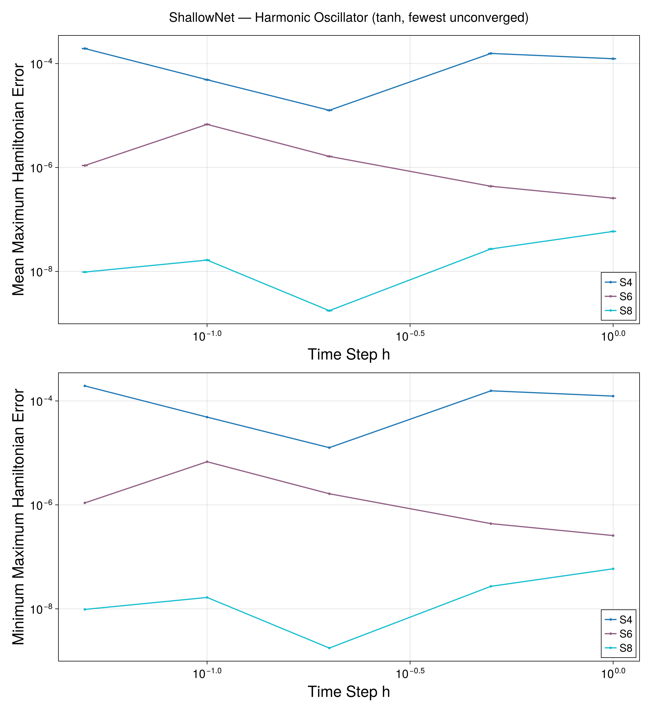

<!-- HO_TANH_TABLE_START -->

## ShallowNet HO — tanh

### h = 0.05

<table>
<thead><tr><th>S = 4</th><th>S = 6</th><th>S = 8</th><th>S = 10</th><th>S = 12</th><th>S = 16</th></tr></thead>
<tbody><tr>
<td><table style="width:100%"><tr><td style="text-align:center;vertical-align:top;width:50%"><strong>Min-Max Error: 1.944e-04</strong><br/><br/><small>S=4 · R=8 · λ=0.001 · f_abs=-2.220446049250313e-16 · x_suc=-2.220446049250313e-16 · dogleg · Float64<br/>Unconverged: 100.0%</small></td><td style="text-align:center;vertical-align:top;width:50%"><strong>Fewest Unconverged Run — Error: 1.944e-04</strong><br/>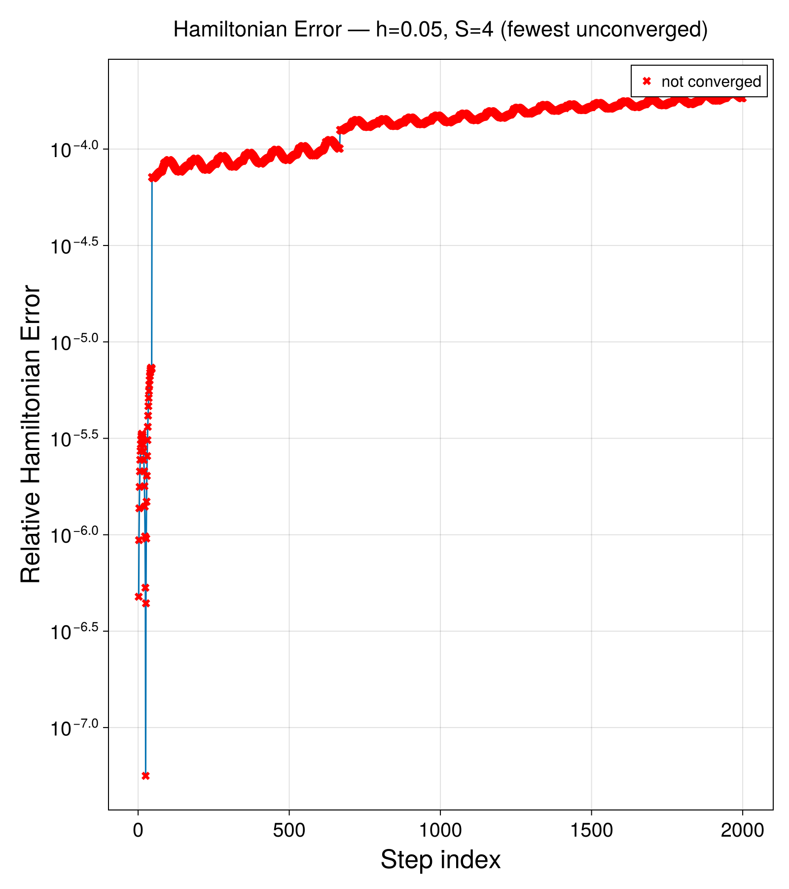<br/><small>S=4 · R=8 · λ=0.001 · f_abs=-2.220446049250313e-16 · x_suc=-2.220446049250313e-16 · dogleg · Float64<br/>Unconverged: 100.0%</small></td></tr></table></td><td><table style="width:100%"><tr><td style="text-align:center;vertical-align:top;width:50%"><strong>Min-Max Error: 1.093e-06</strong><br/><br/><small>S=6 · R=16 · λ=1.0e-5 · f_abs=-2.220446049250313e-16 · x_suc=-2.220446049250313e-16 · backtracking · Float64<br/>Unconverged: 100.0%</small></td><td style="text-align:center;vertical-align:top;width:50%"><strong>Fewest Unconverged Run — Error: 1.093e-06</strong><br/>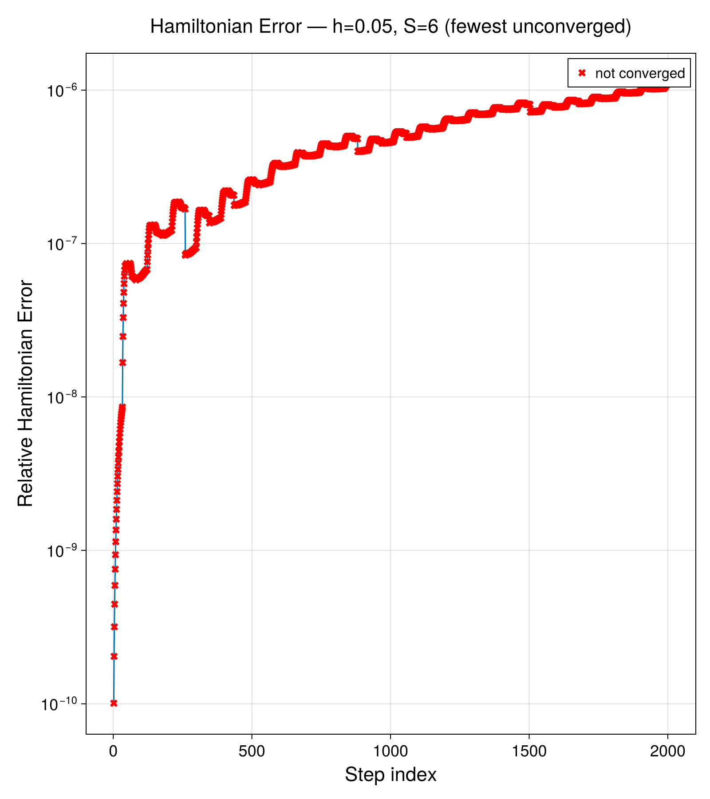<br/><small>S=6 · R=16 · λ=1.0e-5 · f_abs=-2.220446049250313e-16 · x_suc=-2.220446049250313e-16 · backtracking · Float64<br/>Unconverged: 100.0%</small></td></tr></table></td><td><table style="width:100%"><tr><td style="text-align:center;vertical-align:top;width:50%"><strong>Min-Max Error: 9.759e-09</strong><br/><br/><small>S=8 · R=8 · λ=1.0e-5 · f_abs=-2.220446049250313e-16 · x_suc=-2.220446049250313e-16 · dogleg · Float64<br/>Unconverged: 100.0%</small></td><td style="text-align:center;vertical-align:top;width:50%"><strong>Fewest Unconverged Run — Error: 9.759e-09</strong><br/>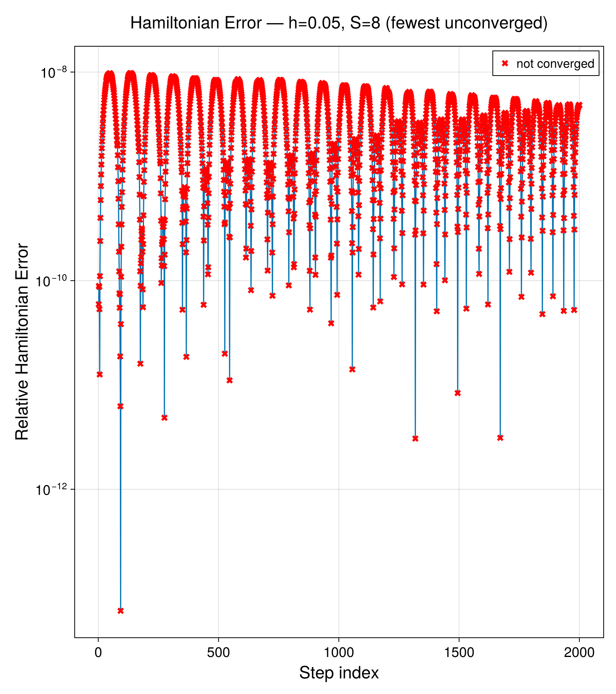<br/><small>S=8 · R=8 · λ=1.0e-5 · f_abs=-2.220446049250313e-16 · x_suc=-2.220446049250313e-16 · dogleg · Float64<br/>Unconverged: 100.0%</small></td></tr></table></td><td><table style="width:100%"><tr><td style="text-align:center;vertical-align:top;width:50%"><strong>Min-Max Error: 6.980e-10</strong><br/>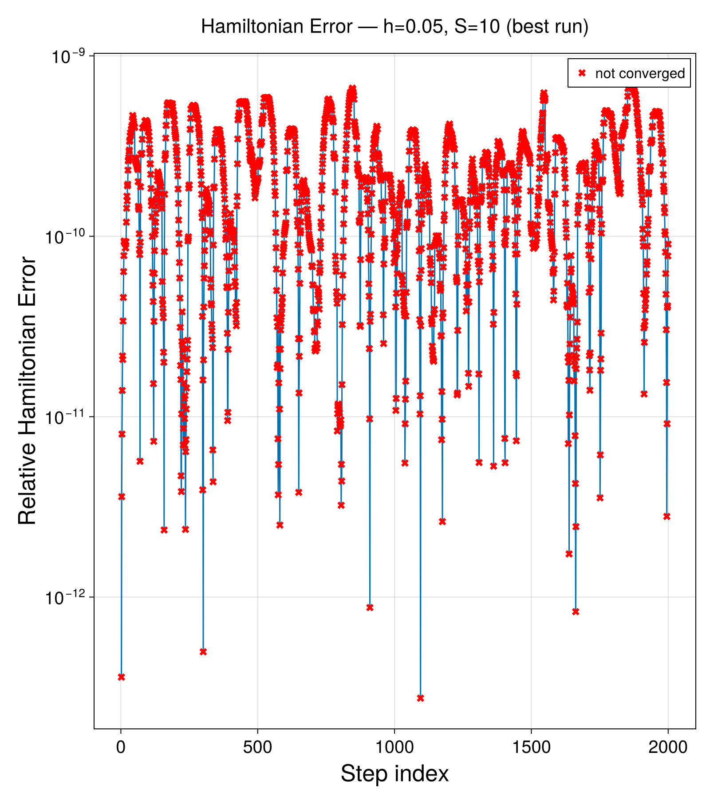<br/><small>S=10 · R=8 · λ=1.0e-5 · f_abs=-2.220446049250313e-16 · x_suc=-2.220446049250313e-16 · dogleg · Float64<br/>Unconverged: 100.0%</small></td><td style="text-align:center;vertical-align:top;width:50%"><strong>Fewest Unconverged Run — Error: 1.090e-07</strong><br/>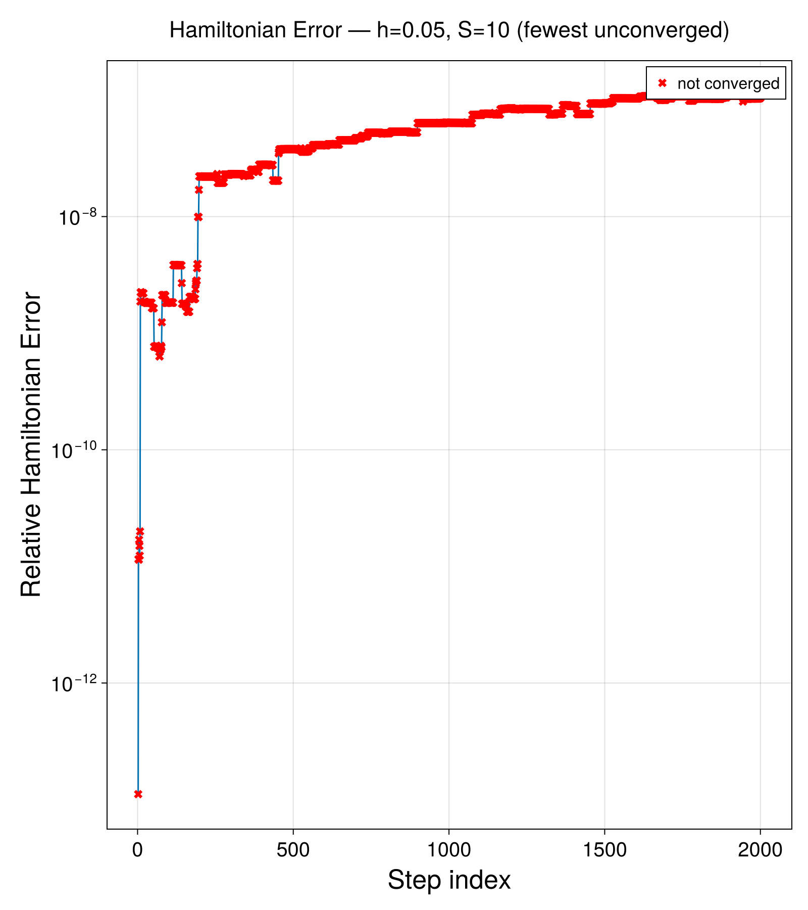<br/><small>S=10 · R=16 · λ=1.0e-7 · f_abs=-2.220446049250313e-16 · x_suc=-2.220446049250313e-16 · backtracking · Float64<br/>Unconverged: 99.9%</small></td></tr></table></td><td><table style="width:100%"><tr><td style="text-align:center;vertical-align:top;width:50%"><strong>Min-Max Error: 1.011e-09</strong><br/>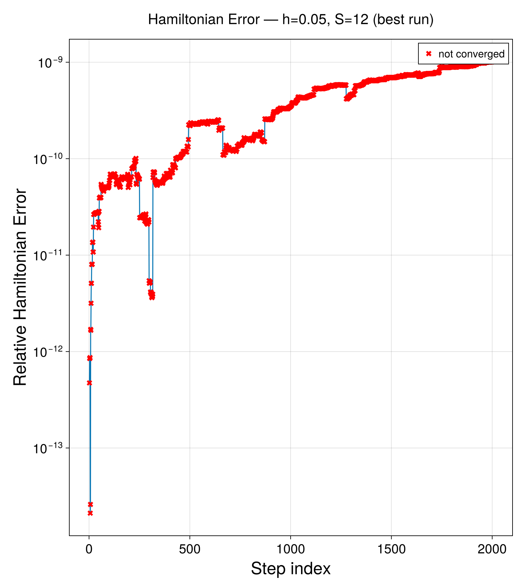<br/><small>S=12 · R=16 · λ=1.0e-5 · f_abs=-2.220446049250313e-16 · x_suc=-2.220446049250313e-16 · backtracking · Float64<br/>Unconverged: 99.7%</small></td><td style="text-align:center;vertical-align:top;width:50%"><strong>Fewest Unconverged Run — Error: 3.369e-08</strong><br/>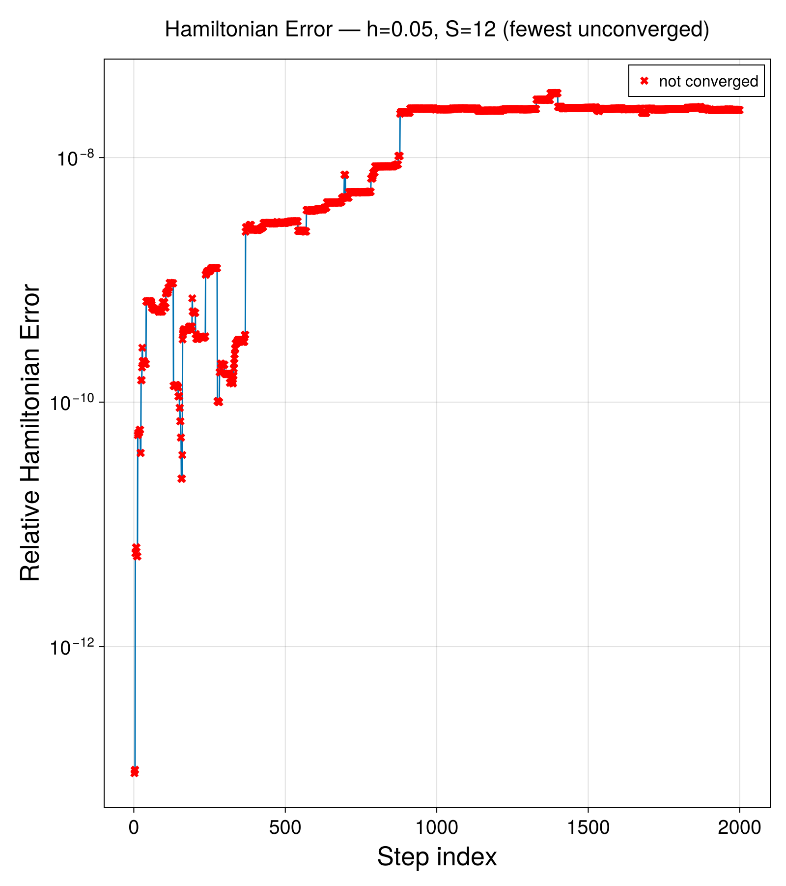<br/><small>S=12 · R=16 · λ=1.0e-7 · f_abs=-2.220446049250313e-16 · x_suc=-2.220446049250313e-16 · dogleg · Float64<br/>Unconverged: 97.0%</small></td></tr></table></td><td><table style="width:100%"><tr><td style="text-align:center;vertical-align:top;width:50%"><strong>Min-Max Error: 6.872e-09</strong><br/>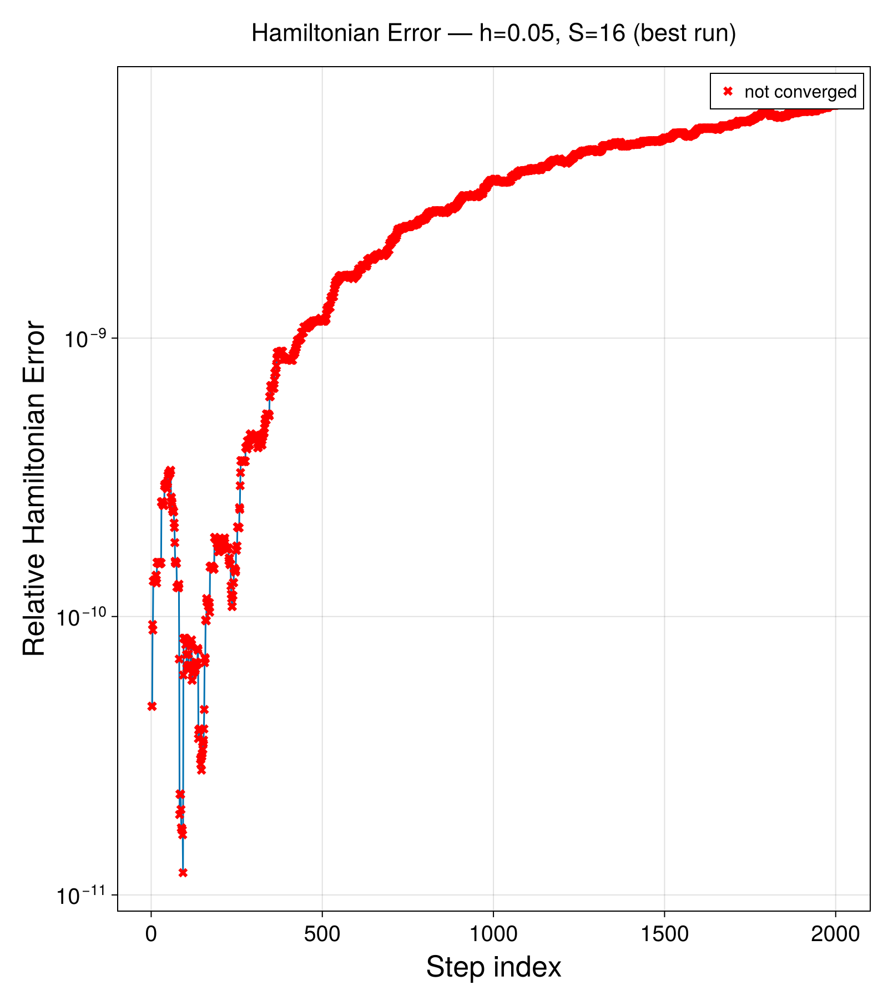<br/><small>S=16 · R=16 · λ=0.001 · f_abs=-2.220446049250313e-16 · x_suc=-2.220446049250313e-16 · backtracking · Float64<br/>Unconverged: 100.0%</small></td><td style="text-align:center;vertical-align:top;width:50%"><strong>Fewest Unconverged Run — Error: 8.360e-08</strong><br/>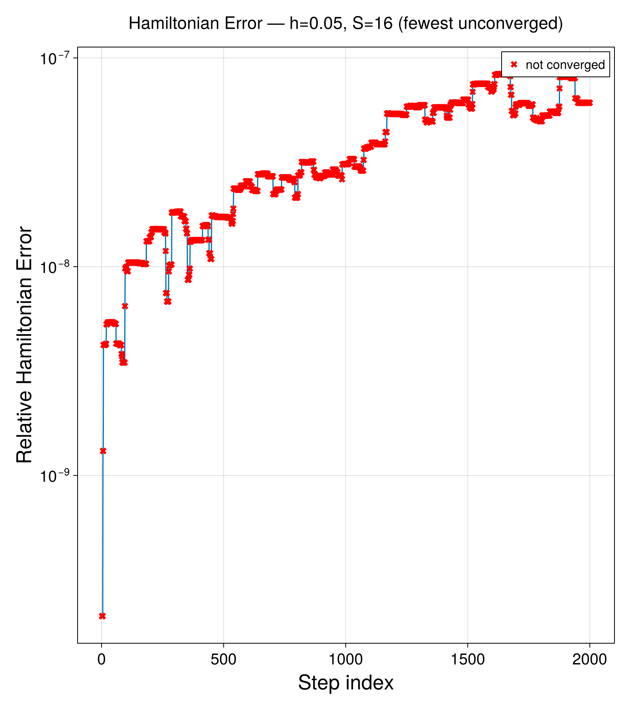<br/><small>S=16 · R=16 · λ=1.0e-7 · f_abs=-2.220446049250313e-16 · x_suc=-2.220446049250313e-16 · backtracking · Float64<br/>Unconverged: 97.5%</small></td></tr></table></td></tr></tbody></table>

### h = 0.1

<table>
<thead><tr><th>S = 4</th><th>S = 6</th><th>S = 8</th><th>S = 10</th><th>S = 12</th><th>S = 16</th></tr></thead>
<tbody><tr>
<td><table style="width:100%"><tr><td style="text-align:center;vertical-align:top;width:50%"><strong>Min-Max Error: 4.881e-05</strong><br/><br/><small>S=4 · R=4 · λ=0.001 · f_abs=-2.220446049250313e-16 · x_suc=-2.220446049250313e-16 · backtracking · Float64<br/>Unconverged: 100.0%</small></td><td style="text-align:center;vertical-align:top;width:50%"><strong>Fewest Unconverged Run — Error: 4.881e-05</strong><br/>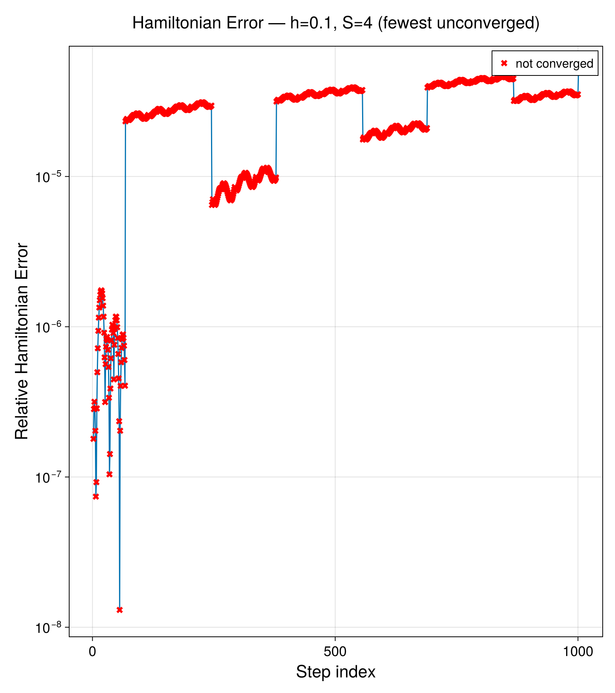<br/><small>S=4 · R=4 · λ=0.001 · f_abs=-2.220446049250313e-16 · x_suc=-2.220446049250313e-16 · backtracking · Float64<br/>Unconverged: 100.0%</small></td></tr></table></td><td><table style="width:100%"><tr><td style="text-align:center;vertical-align:top;width:50%"><strong>Min-Max Error: 6.767e-06</strong><br/><br/><small>S=6 · R=8 · λ=1.0e-5 · f_abs=-2.220446049250313e-16 · x_suc=-2.220446049250313e-16 · backtracking · Float64<br/>Unconverged: 100.0%</small></td><td style="text-align:center;vertical-align:top;width:50%"><strong>Fewest Unconverged Run — Error: 6.767e-06</strong><br/>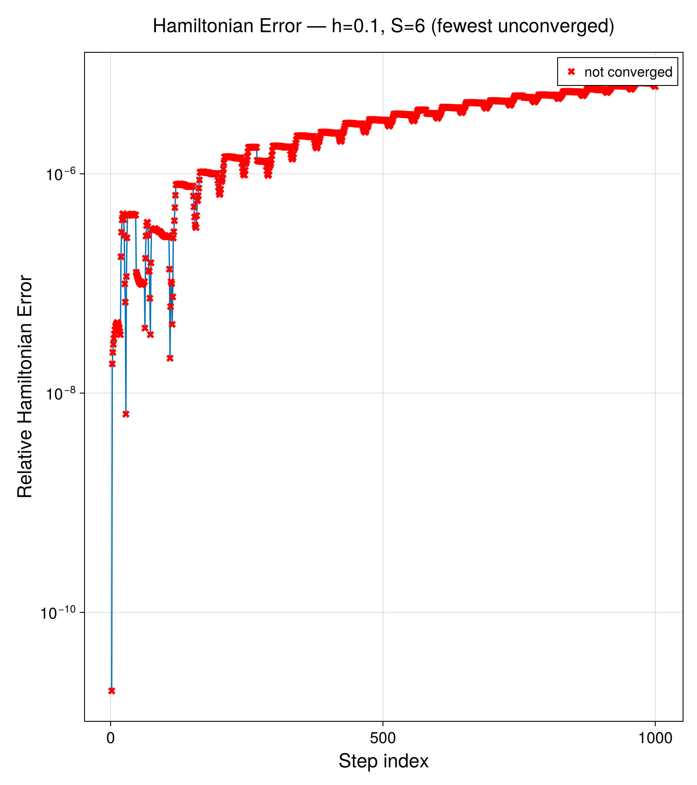<br/><small>S=6 · R=8 · λ=1.0e-5 · f_abs=-2.220446049250313e-16 · x_suc=-2.220446049250313e-16 · backtracking · Float64<br/>Unconverged: 100.0%</small></td></tr></table></td><td><table style="width:100%"><tr><td style="text-align:center;vertical-align:top;width:50%"><strong>Min-Max Error: 1.659e-08</strong><br/><br/><small>S=8 · R=8 · λ=1.0e-5 · f_abs=-2.220446049250313e-16 · x_suc=-2.220446049250313e-16 · backtracking · Float64<br/>Unconverged: 100.0%</small></td><td style="text-align:center;vertical-align:top;width:50%"><strong>Fewest Unconverged Run — Error: 1.659e-08</strong><br/>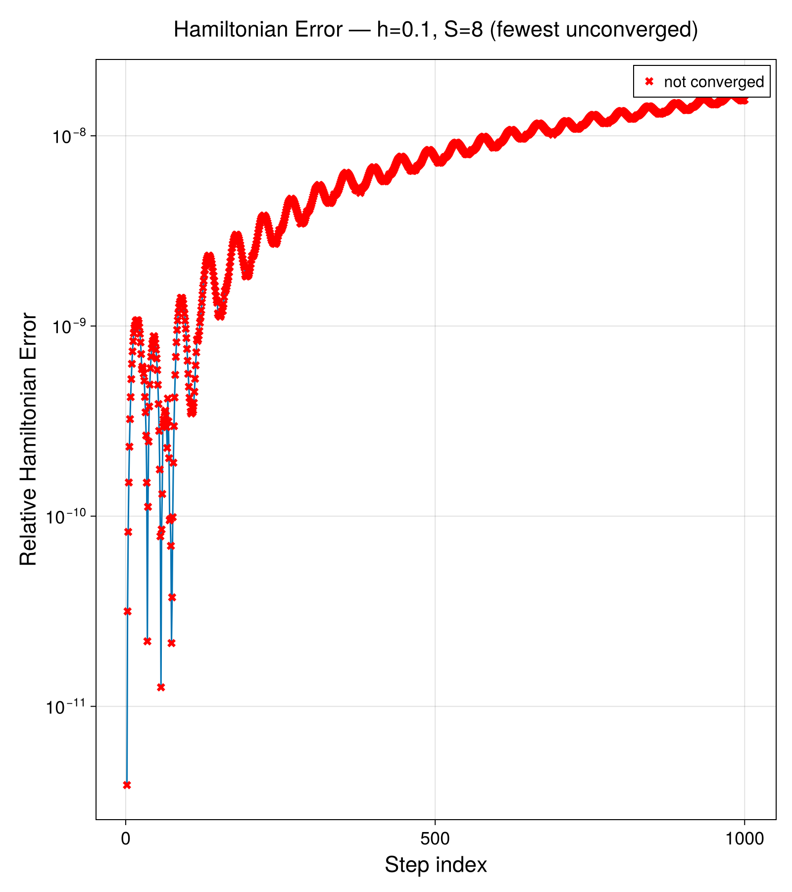<br/><small>S=8 · R=8 · λ=1.0e-5 · f_abs=-2.220446049250313e-16 · x_suc=-2.220446049250313e-16 · backtracking · Float64<br/>Unconverged: 100.0%</small></td></tr></table></td><td><table style="width:100%"><tr><td style="text-align:center;vertical-align:top;width:50%"><strong>Min-Max Error: 2.017e-10</strong><br/>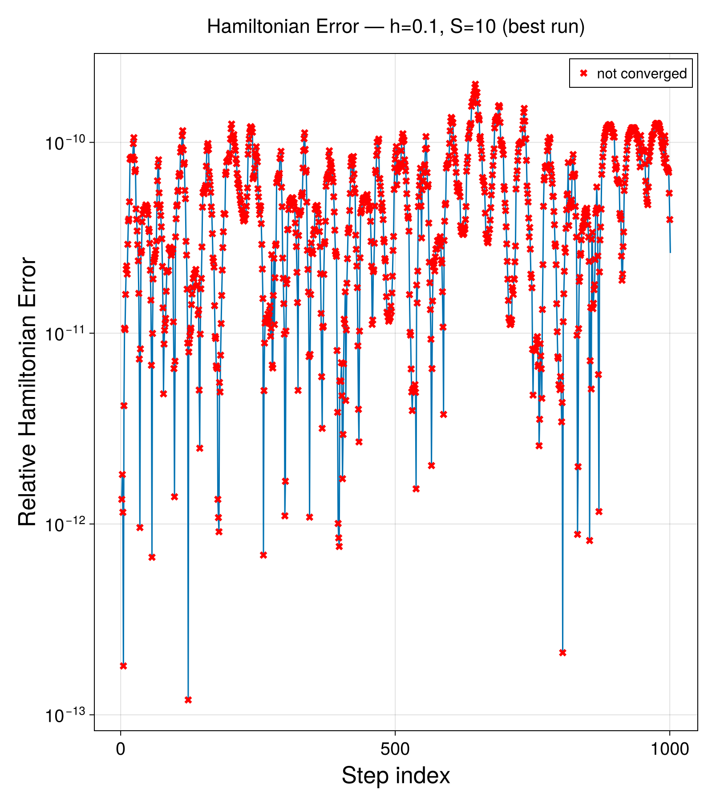<br/><small>S=10 · R=16 · λ=1.0e-5 · f_abs=-2.220446049250313e-16 · x_suc=-2.220446049250313e-16 · backtracking · Float64<br/>Unconverged: 100.0%</small></td><td style="text-align:center;vertical-align:top;width:50%"><strong>Fewest Unconverged Run — Error: 8.447e-09</strong><br/>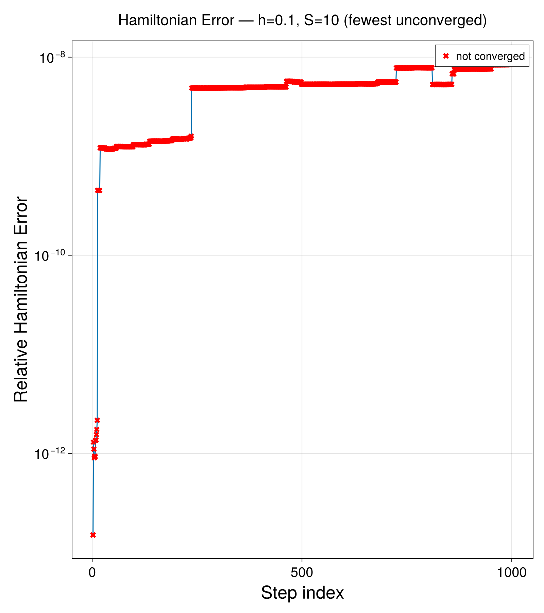<br/><small>S=10 · R=16 · λ=1.0e-7 · f_abs=-2.220446049250313e-16 · x_suc=-2.220446049250313e-16 · dogleg · Float64<br/>Unconverged: 97.9%</small></td></tr></table></td><td><table style="width:100%"><tr><td style="text-align:center;vertical-align:top;width:50%"><strong>Min-Max Error: 8.667e-10</strong><br/>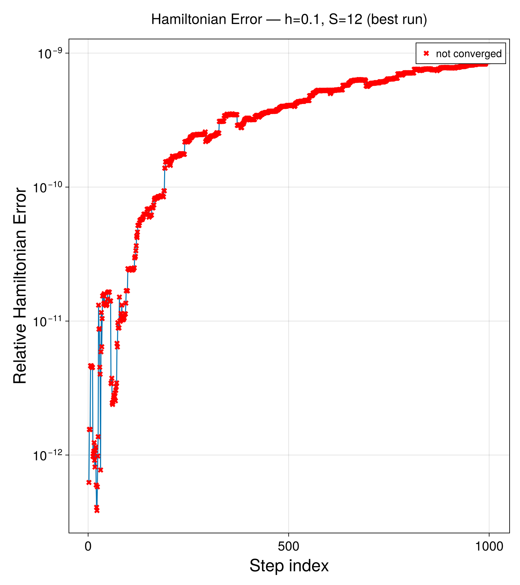<br/><small>S=12 · R=8 · λ=1.0e-5 · f_abs=-2.220446049250313e-16 · x_suc=-2.220446049250313e-16 · dogleg · Float64<br/>Unconverged: 100.0%</small></td><td style="text-align:center;vertical-align:top;width:50%"><strong>Fewest Unconverged Run — Error: 1.185e-08</strong><br/>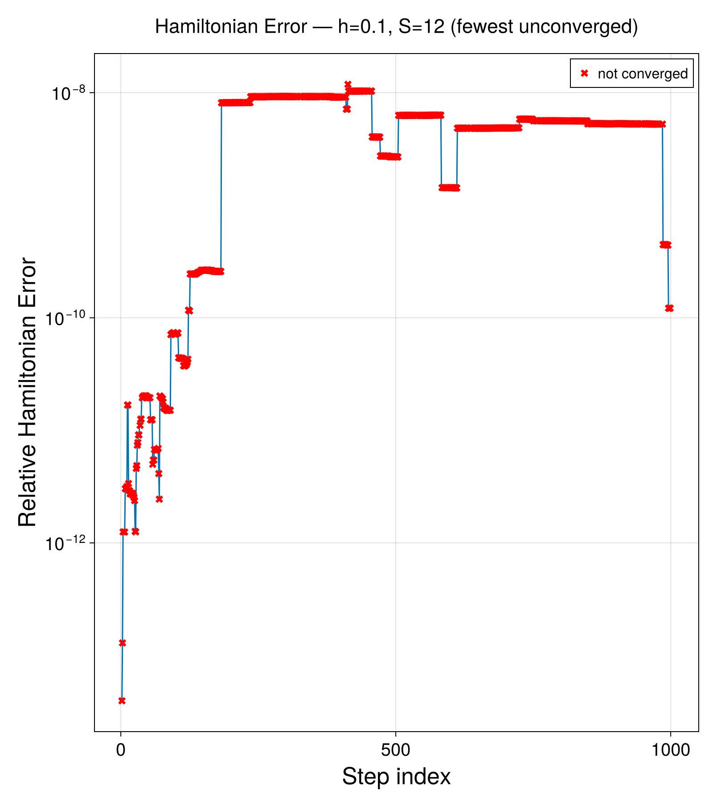<br/><small>S=12 · R=16 · λ=1.0e-7 · f_abs=-2.220446049250313e-16 · x_suc=-2.220446049250313e-16 · backtracking · Float64<br/>Unconverged: 80.3%</small></td></tr></table></td><td><table style="width:100%"><tr><td style="text-align:center;vertical-align:top;width:50%"><strong>Min-Max Error: 4.677e-10</strong><br/>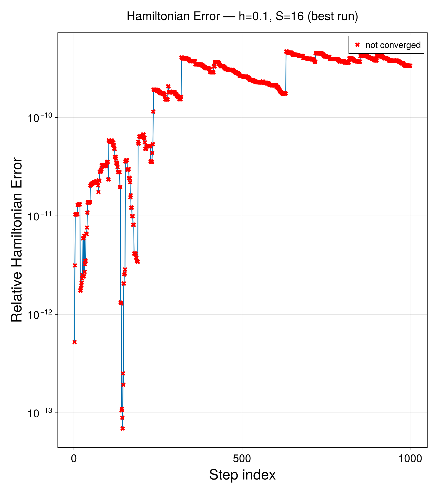<br/><small>S=16 · R=8 · λ=1.0e-5 · f_abs=-2.220446049250313e-16 · x_suc=-2.220446049250313e-16 · backtracking · Float64<br/>Unconverged: 100.0%</small></td><td style="text-align:center;vertical-align:top;width:50%"><strong>Fewest Unconverged Run — Error: 1.516e-07</strong><br/>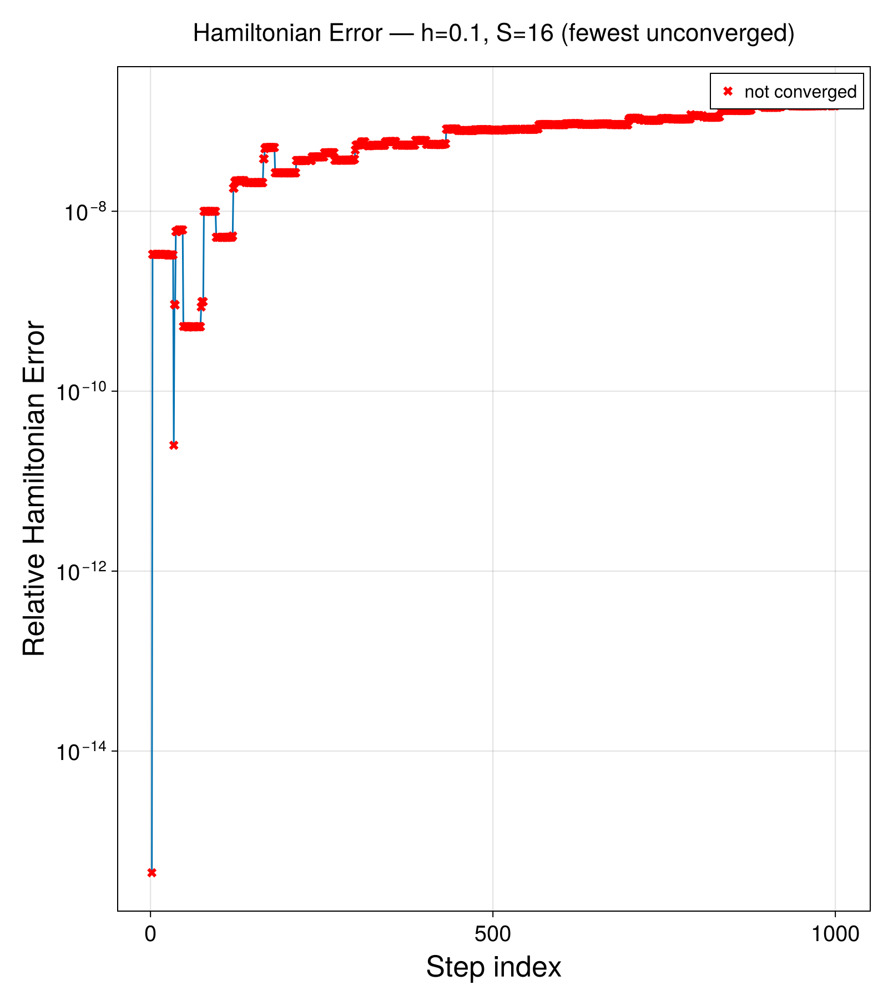<br/><small>S=16 · R=16 · λ=1.0e-7 · f_abs=-2.220446049250313e-16 · x_suc=-2.220446049250313e-16 · dogleg · Float64<br/>Unconverged: 80.8%</small></td></tr></table></td></tr></tbody></table>

### h = 0.2

<table>
<thead><tr><th>S = 4</th><th>S = 6</th><th>S = 8</th><th>S = 10</th><th>S = 12</th><th>S = 16</th></tr></thead>
<tbody><tr>
<td><table style="width:100%"><tr><td style="text-align:center;vertical-align:top;width:50%"><strong>Min-Max Error: 1.262e-05</strong><br/><br/><small>S=4 · R=4 · λ=0.001 · f_abs=-2.220446049250313e-16 · x_suc=-2.220446049250313e-16 · backtracking · Float64<br/>Unconverged: 100.0%</small></td><td style="text-align:center;vertical-align:top;width:50%"><strong>Fewest Unconverged Run — Error: 1.262e-05</strong><br/>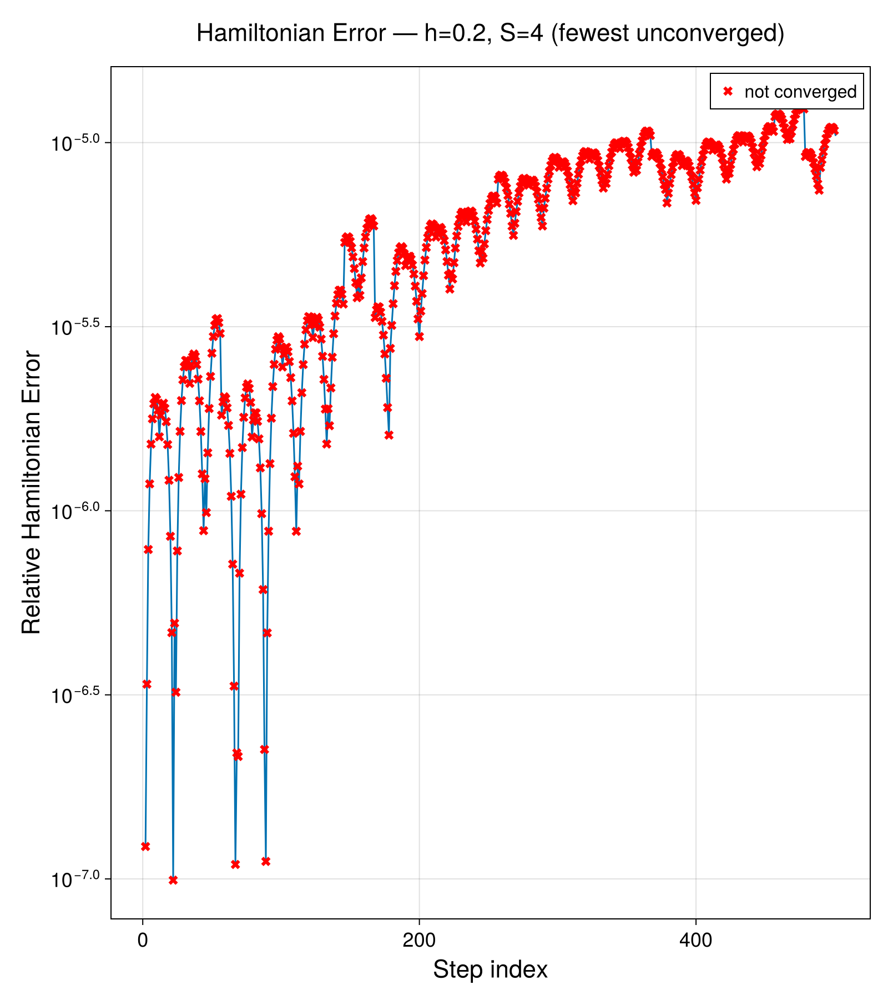<br/><small>S=4 · R=4 · λ=0.001 · f_abs=-2.220446049250313e-16 · x_suc=-2.220446049250313e-16 · backtracking · Float64<br/>Unconverged: 100.0%</small></td></tr></table></td><td><table style="width:100%"><tr><td style="text-align:center;vertical-align:top;width:50%"><strong>Min-Max Error: 1.638e-06</strong><br/><br/><small>S=6 · R=8 · λ=0.001 · f_abs=-2.220446049250313e-16 · x_suc=-2.220446049250313e-16 · dogleg · Float64<br/>Unconverged: 100.0%</small></td><td style="text-align:center;vertical-align:top;width:50%"><strong>Fewest Unconverged Run — Error: 1.638e-06</strong><br/>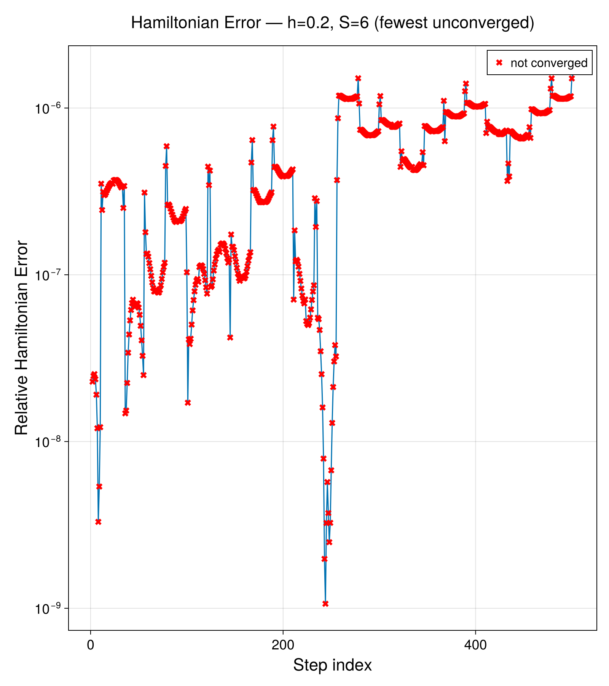<br/><small>S=6 · R=8 · λ=0.001 · f_abs=-2.220446049250313e-16 · x_suc=-2.220446049250313e-16 · dogleg · Float64<br/>Unconverged: 100.0%</small></td></tr></table></td><td><table style="width:100%"><tr><td style="text-align:center;vertical-align:top;width:50%"><strong>Min-Max Error: 1.763e-09</strong><br/><br/><small>S=8 · R=8 · λ=1.0e-5 · f_abs=-2.220446049250313e-16 · x_suc=-2.220446049250313e-16 · backtracking · Float64<br/>Unconverged: 100.0%</small></td><td style="text-align:center;vertical-align:top;width:50%"><strong>Fewest Unconverged Run — Error: 1.763e-09</strong><br/>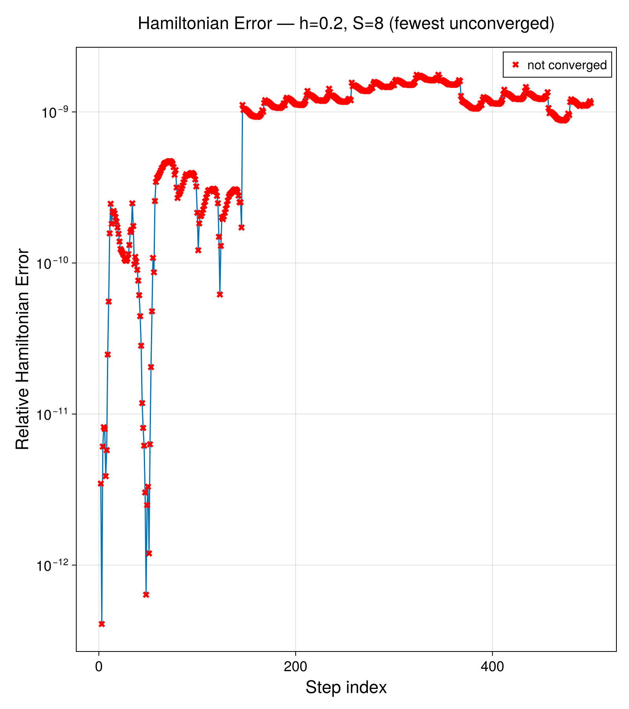<br/><small>S=8 · R=8 · λ=1.0e-5 · f_abs=-2.220446049250313e-16 · x_suc=-2.220446049250313e-16 · backtracking · Float64<br/>Unconverged: 100.0%</small></td></tr></table></td><td><table style="width:100%"><tr><td style="text-align:center;vertical-align:top;width:50%"><strong>Min-Max Error: 2.133e-10</strong><br/>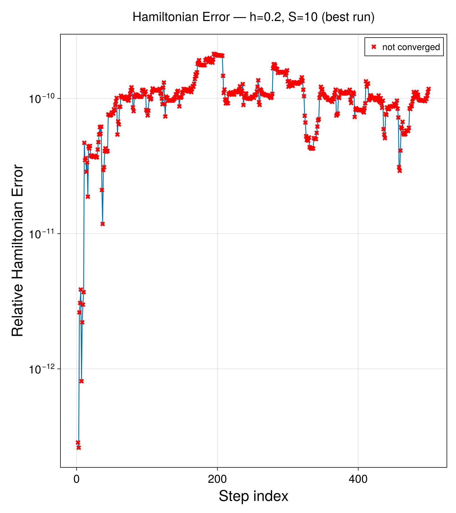<br/><small>S=10 · R=8 · λ=1.0e-5 · f_abs=-2.220446049250313e-16 · x_suc=-2.220446049250313e-16 · backtracking · Float64<br/>Unconverged: 100.0%</small></td><td style="text-align:center;vertical-align:top;width:50%"><strong>Fewest Unconverged Run — Error: 6.031e-08</strong><br/>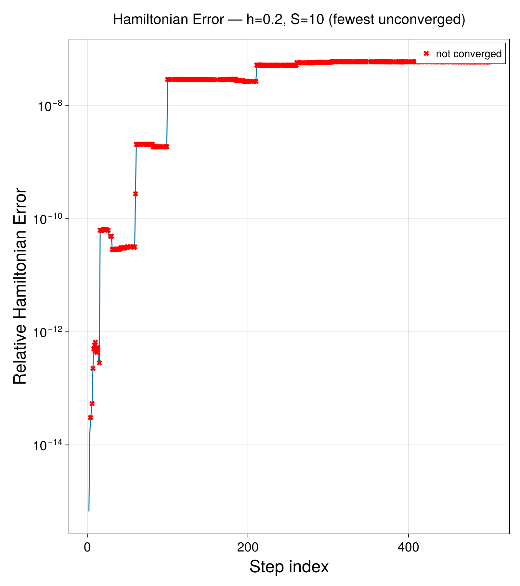<br/><small>S=10 · R=16 · λ=1.0e-7 · f_abs=-2.220446049250313e-16 · x_suc=-2.220446049250313e-16 · backtracking · Float64<br/>Unconverged: 72.6%</small></td></tr></table></td><td><table style="width:100%"><tr><td style="text-align:center;vertical-align:top;width:50%"><strong>Min-Max Error: 2.743e-10</strong><br/>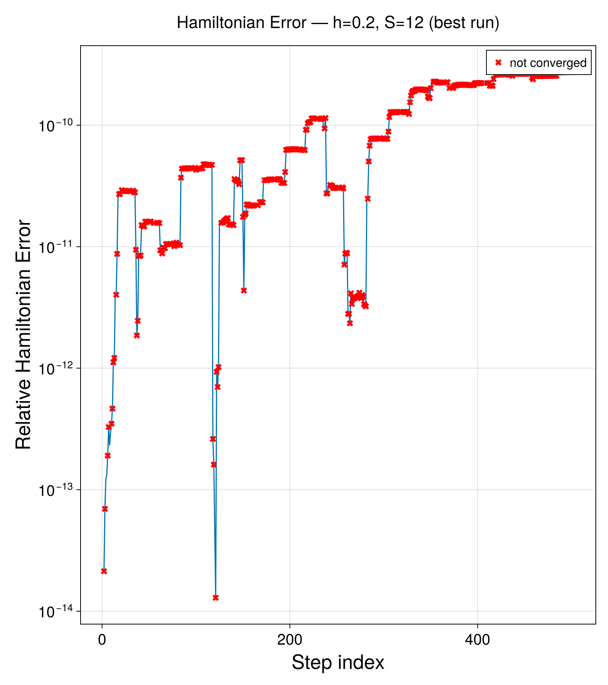<br/><small>S=12 · R=16 · λ=1.0e-5 · f_abs=-2.220446049250313e-16 · x_suc=-2.220446049250313e-16 · dogleg · Float64<br/>Unconverged: 79.2%</small></td><td style="text-align:center;vertical-align:top;width:50%"><strong>Fewest Unconverged Run — Error: 5.133e-08</strong><br/>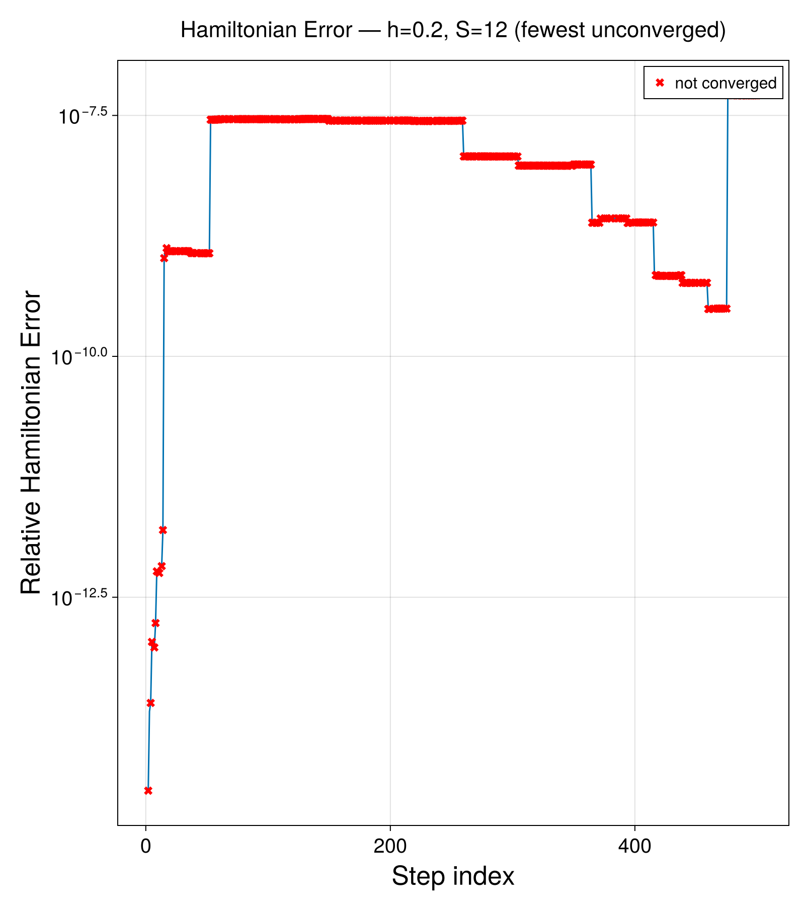<br/><small>S=12 · R=16 · λ=1.0e-7 · f_abs=-2.220446049250313e-16 · x_suc=-2.220446049250313e-16 · backtracking · Float64<br/>Unconverged: 72.6%</small></td></tr></table></td><td><table style="width:100%"><tr><td style="text-align:center;vertical-align:top;width:50%"><strong>Min-Max Error: 3.415e-10</strong><br/>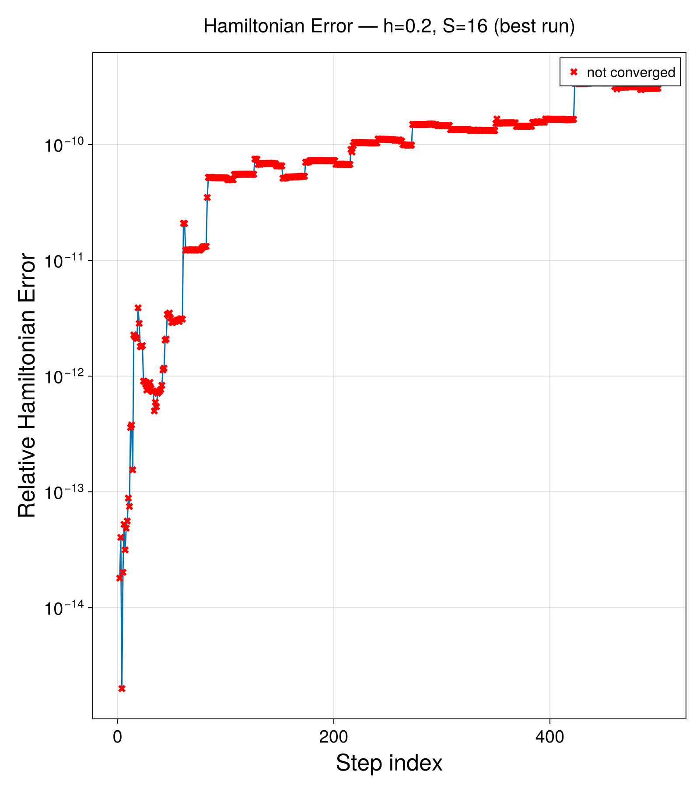<br/><small>S=16 · R=8 · λ=1.0e-5 · f_abs=-2.220446049250313e-16 · x_suc=-2.220446049250313e-16 · backtracking · Float64<br/>Unconverged: 100.0%</small></td><td style="text-align:center;vertical-align:top;width:50%"><strong>Fewest Unconverged Run — Error: 2.845e-09</strong><br/>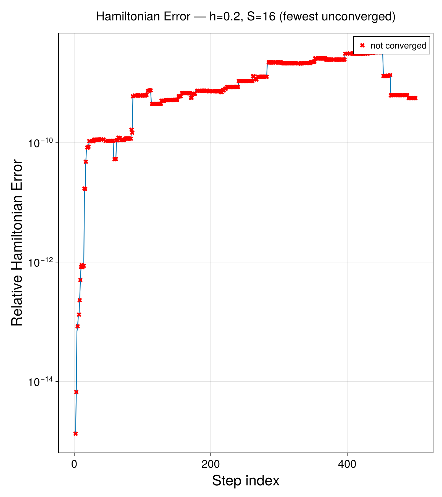<br/><small>S=16 · R=16 · λ=1.0e-7 · f_abs=-2.220446049250313e-16 · x_suc=-2.220446049250313e-16 · backtracking · Float64<br/>Unconverged: 73.2%</small></td></tr></table></td></tr></tbody></table>

### h = 0.5

<table>
<thead><tr><th>S = 4</th><th>S = 6</th><th>S = 8</th><th>S = 10</th><th>S = 12</th><th>S = 16</th></tr></thead>
<tbody><tr>
<td><table style="width:100%"><tr><td style="text-align:center;vertical-align:top;width:50%"><strong>Min-Max Error: 1.566e-04</strong><br/><br/><small>S=4 · R=4 · λ=0.001 · f_abs=-2.220446049250313e-16 · x_suc=-2.220446049250313e-16 · backtracking · Float64<br/>Unconverged: 100.0%</small></td><td style="text-align:center;vertical-align:top;width:50%"><strong>Fewest Unconverged Run — Error: 1.566e-04</strong><br/>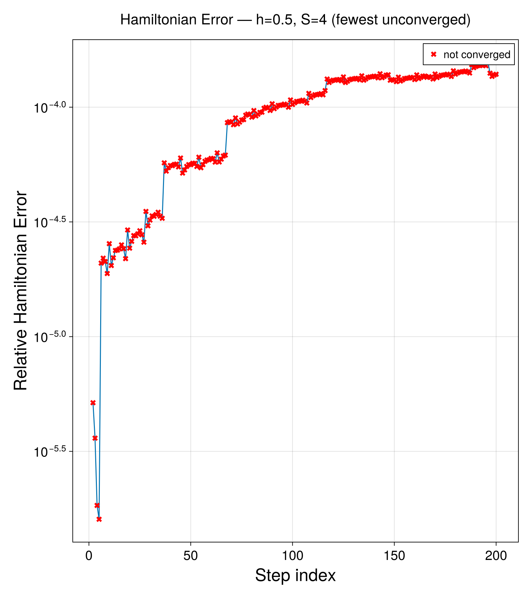<br/><small>S=4 · R=4 · λ=0.001 · f_abs=-2.220446049250313e-16 · x_suc=-2.220446049250313e-16 · backtracking · Float64<br/>Unconverged: 100.0%</small></td></tr></table></td><td><table style="width:100%"><tr><td style="text-align:center;vertical-align:top;width:50%"><strong>Min-Max Error: 4.360e-07</strong><br/><br/><small>S=6 · R=16 · λ=0.001 · f_abs=-2.220446049250313e-16 · x_suc=-2.220446049250313e-16 · dogleg · Float64<br/>Unconverged: 100.0%</small></td><td style="text-align:center;vertical-align:top;width:50%"><strong>Fewest Unconverged Run — Error: 4.360e-07</strong><br/>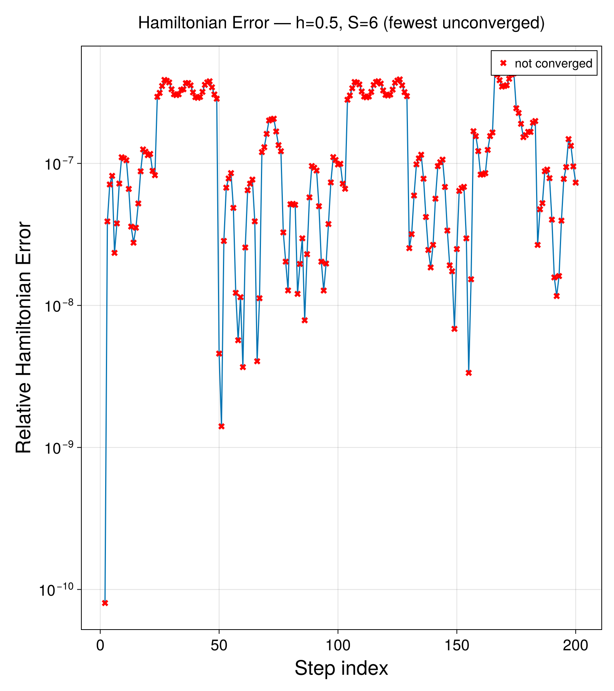<br/><small>S=6 · R=16 · λ=0.001 · f_abs=-2.220446049250313e-16 · x_suc=-2.220446049250313e-16 · dogleg · Float64<br/>Unconverged: 100.0%</small></td></tr></table></td><td><table style="width:100%"><tr><td style="text-align:center;vertical-align:top;width:50%"><strong>Min-Max Error: 2.716e-08</strong><br/><br/><small>S=8 · R=8 · λ=1.0e-5 · f_abs=-2.220446049250313e-16 · x_suc=-2.220446049250313e-16 · dogleg · Float64<br/>Unconverged: 100.0%</small></td><td style="text-align:center;vertical-align:top;width:50%"><strong>Fewest Unconverged Run — Error: 2.716e-08</strong><br/>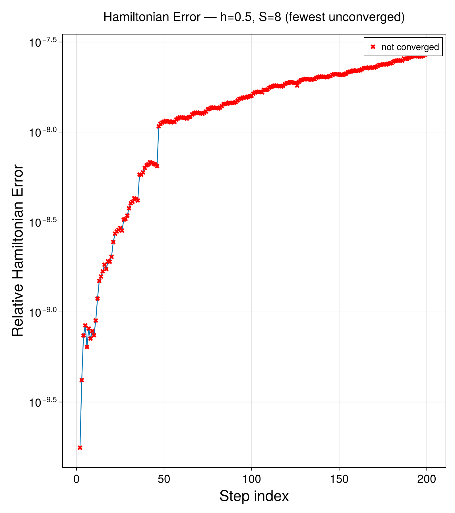<br/><small>S=8 · R=8 · λ=1.0e-5 · f_abs=-2.220446049250313e-16 · x_suc=-2.220446049250313e-16 · dogleg · Float64<br/>Unconverged: 100.0%</small></td></tr></table></td><td><table style="width:100%"><tr><td style="text-align:center;vertical-align:top;width:50%"><strong>Min-Max Error: 6.769e-09</strong><br/>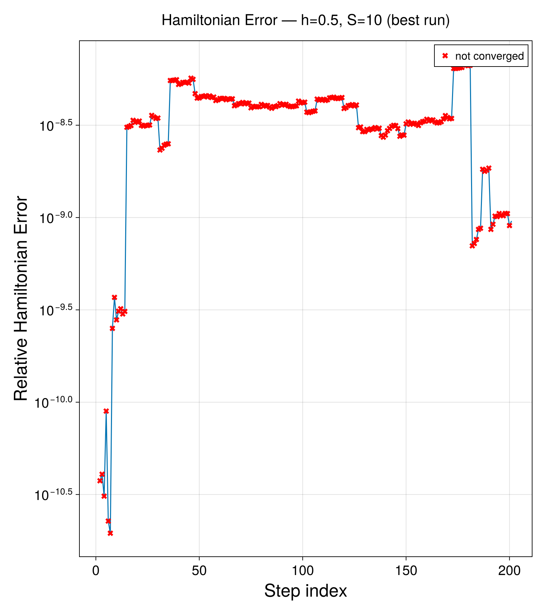<br/><small>S=10 · R=16 · λ=1.0e-5 · f_abs=-2.220446049250313e-16 · x_suc=-2.220446049250313e-16 · dogleg · Float64<br/>Unconverged: 100.0%</small></td><td style="text-align:center;vertical-align:top;width:50%"><strong>Fewest Unconverged Run — Error: 2.964e-08</strong><br/>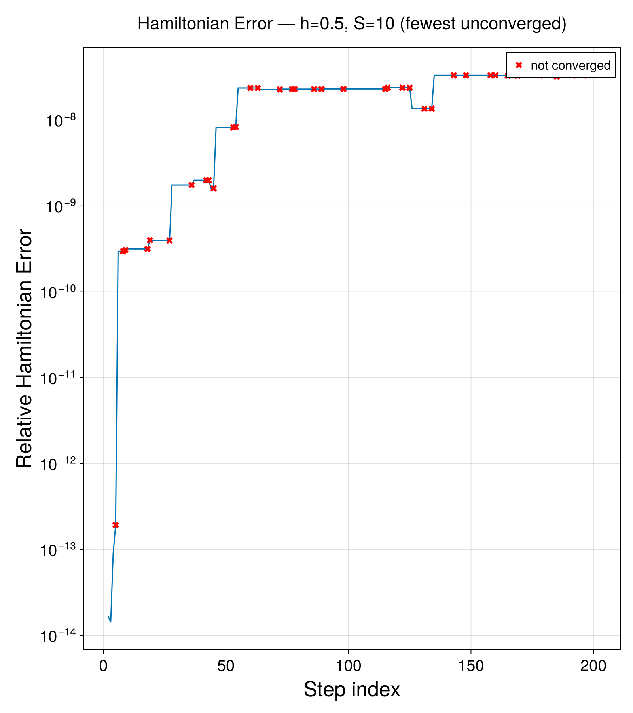<br/><small>S=10 · R=16 · λ=1.0e-7 · f_abs=-2.220446049250313e-16 · x_suc=-2.220446049250313e-16 · dogleg · Float64<br/>Unconverged: 19.0%</small></td></tr></table></td><td><table style="width:100%"><tr><td style="text-align:center;vertical-align:top;width:50%"><strong>Min-Max Error: 1.795e-09</strong><br/>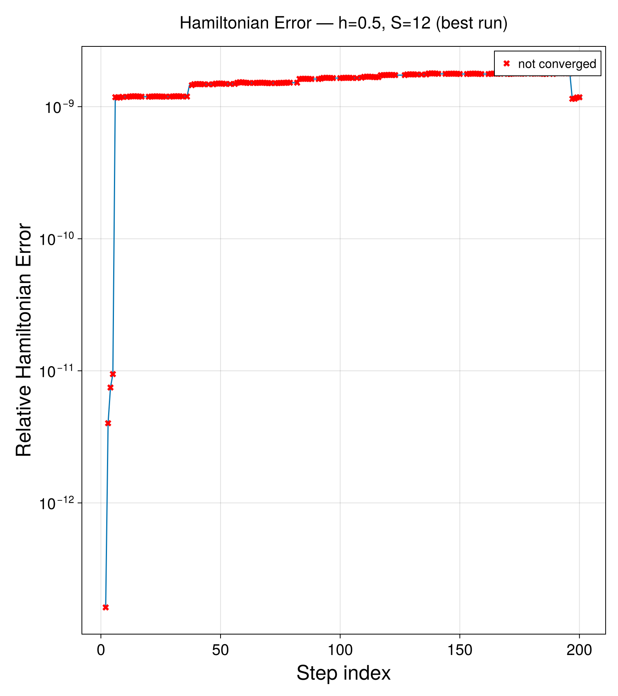<br/><small>S=12 · R=8 · λ=1.0e-7 · f_abs=-2.220446049250313e-16 · x_suc=-2.220446049250313e-16 · dogleg · Float64<br/>Unconverged: 80.5%</small></td><td style="text-align:center;vertical-align:top;width:50%"><strong>Fewest Unconverged Run — Error: 2.061e-06</strong><br/>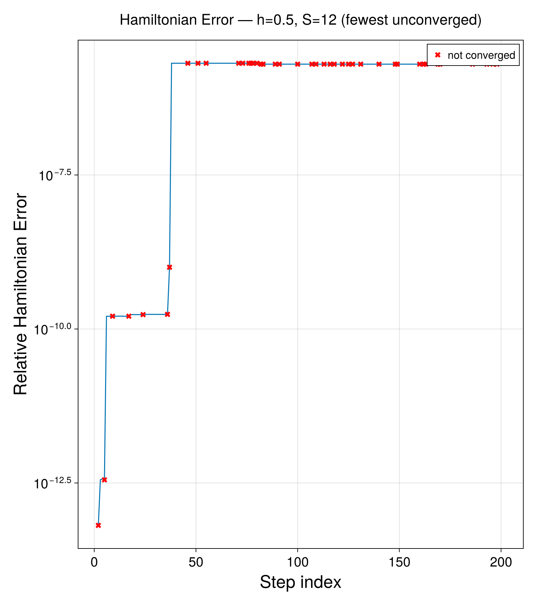<br/><small>S=12 · R=16 · λ=1.0e-7 · f_abs=-2.220446049250313e-16 · x_suc=-2.220446049250313e-16 · backtracking · Float64<br/>Unconverged: 21.0%</small></td></tr></table></td><td><table style="width:100%"><tr><td style="text-align:center;vertical-align:top;width:50%"><strong>Min-Max Error: 1.429e-09</strong><br/>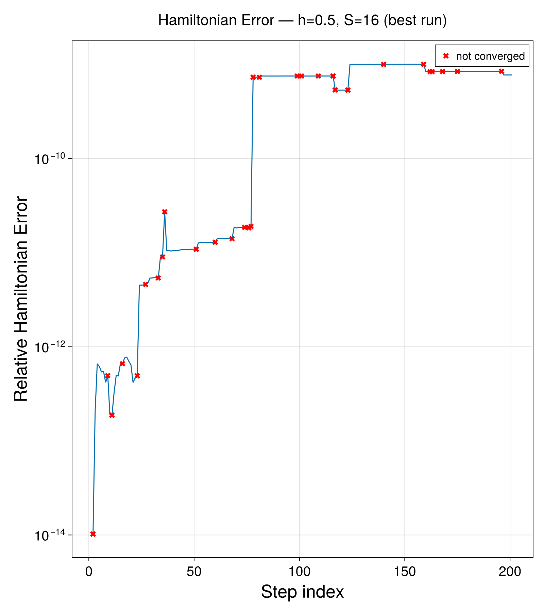<br/><small>S=16 · R=8 · λ=1.0e-7 · f_abs=-2.220446049250313e-16 · x_suc=-2.220446049250313e-16 · dogleg · Float64<br/>Unconverged: 79.0%</small></td><td style="text-align:center;vertical-align:top;width:50%"><strong>Fewest Unconverged Run — Error: 4.382e-07</strong><br/>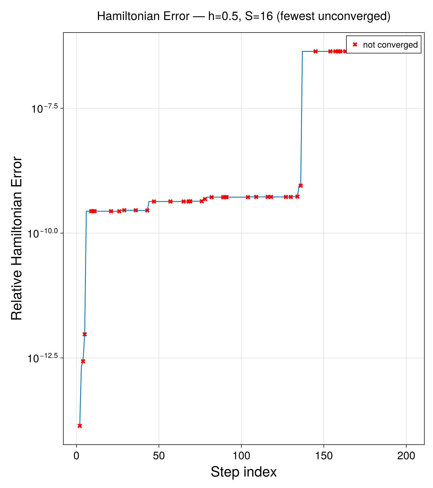<br/><small>S=16 · R=16 · λ=1.0e-7 · f_abs=-2.220446049250313e-16 · x_suc=-2.220446049250313e-16 · backtracking · Float64<br/>Unconverged: 20.5%</small></td></tr></table></td></tr></tbody></table>

### h = 1.0

<table>
<thead><tr><th>S = 4</th><th>S = 6</th><th>S = 8</th><th>S = 10</th><th>S = 12</th><th>S = 16</th></tr></thead>
<tbody><tr>
<td><table style="width:100%"><tr><td style="text-align:center;vertical-align:top;width:50%"><strong>Min-Max Error: 1.239e-04</strong><br/><br/><small>S=4 · R=16 · λ=0.0 · f_abs=-2.220446049250313e-16 · x_suc=-2.220446049250313e-16 · dogleg · Float64<br/>Unconverged: 100.0%</small></td><td style="text-align:center;vertical-align:top;width:50%"><strong>Fewest Unconverged Run — Error: 1.239e-04</strong><br/>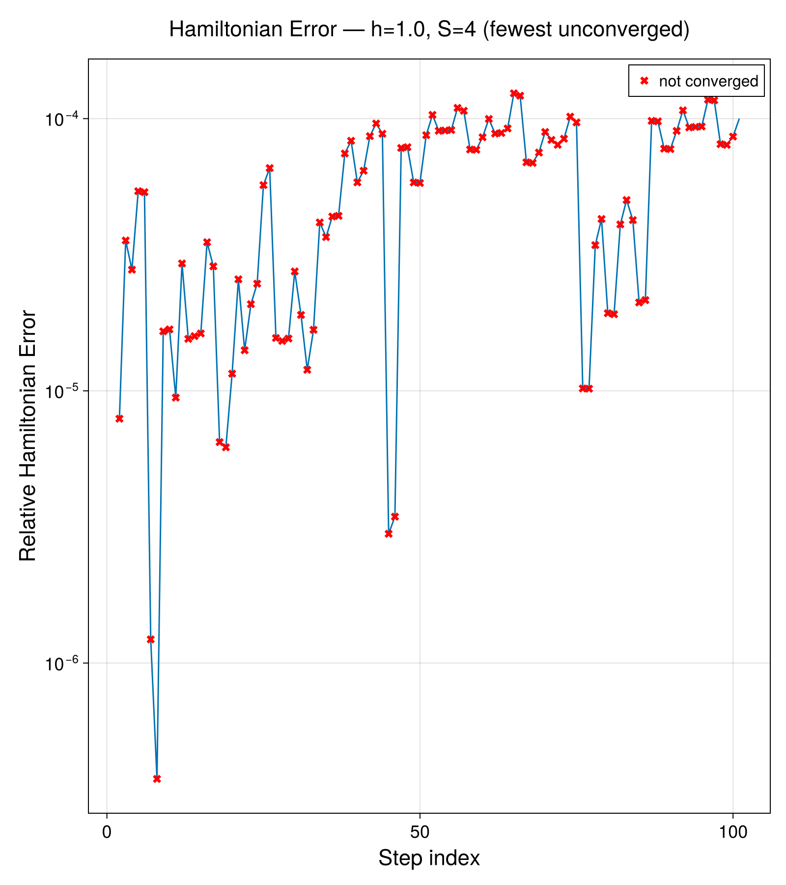<br/><small>S=4 · R=16 · λ=0.0 · f_abs=-2.220446049250313e-16 · x_suc=-2.220446049250313e-16 · dogleg · Float64<br/>Unconverged: 100.0%</small></td></tr></table></td><td><table style="width:100%"><tr><td style="text-align:center;vertical-align:top;width:50%"><strong>Min-Max Error: 2.571e-07</strong><br/><br/><small>S=6 · R=16 · λ=0.001 · f_abs=-2.220446049250313e-16 · x_suc=-2.220446049250313e-16 · backtracking · Float64<br/>Unconverged: 100.0%</small></td><td style="text-align:center;vertical-align:top;width:50%"><strong>Fewest Unconverged Run — Error: 2.571e-07</strong><br/>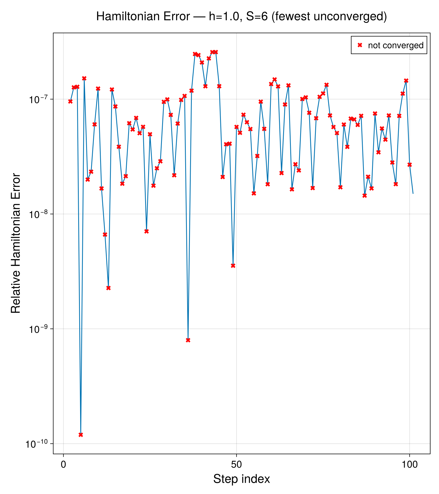<br/><small>S=6 · R=16 · λ=0.001 · f_abs=-2.220446049250313e-16 · x_suc=-2.220446049250313e-16 · backtracking · Float64<br/>Unconverged: 100.0%</small></td></tr></table></td><td><table style="width:100%"><tr><td style="text-align:center;vertical-align:top;width:50%"><strong>Min-Max Error: 5.901e-08</strong><br/><br/><small>S=8 · R=8 · λ=0.001 · f_abs=-2.220446049250313e-16 · x_suc=-2.220446049250313e-16 · backtracking · Float64<br/>Unconverged: 100.0%</small></td><td style="text-align:center;vertical-align:top;width:50%"><strong>Fewest Unconverged Run — Error: 5.901e-08</strong><br/>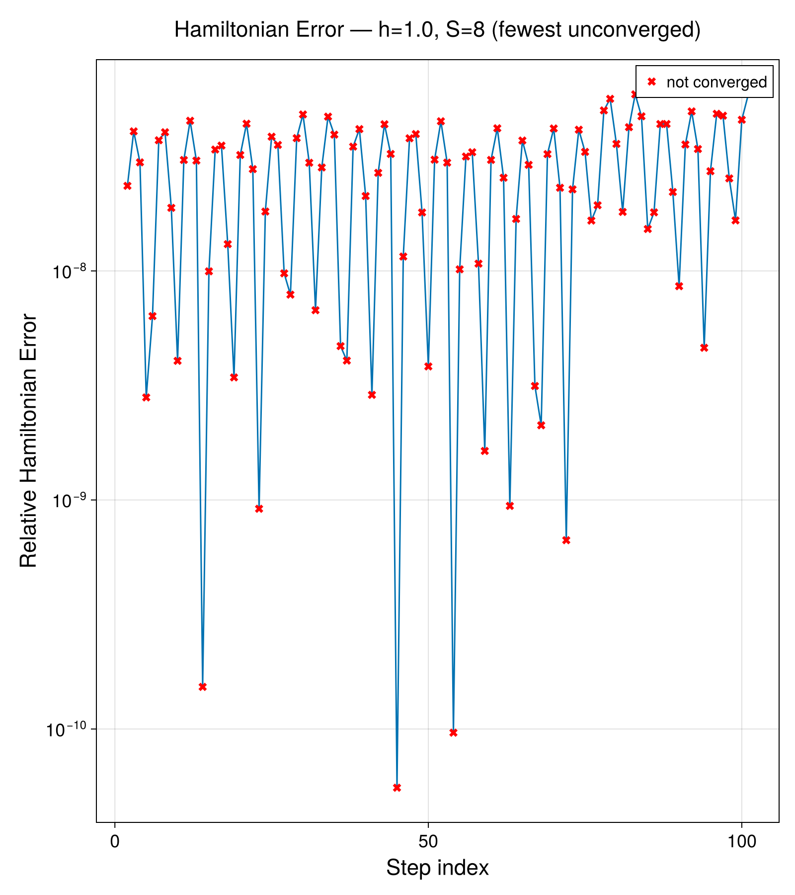<br/><small>S=8 · R=8 · λ=0.001 · f_abs=-2.220446049250313e-16 · x_suc=-2.220446049250313e-16 · backtracking · Float64<br/>Unconverged: 100.0%</small></td></tr></table></td><td><table style="width:100%"><tr><td style="text-align:center;vertical-align:top;width:50%"><strong>Min-Max Error: 5.260e-08</strong><br/>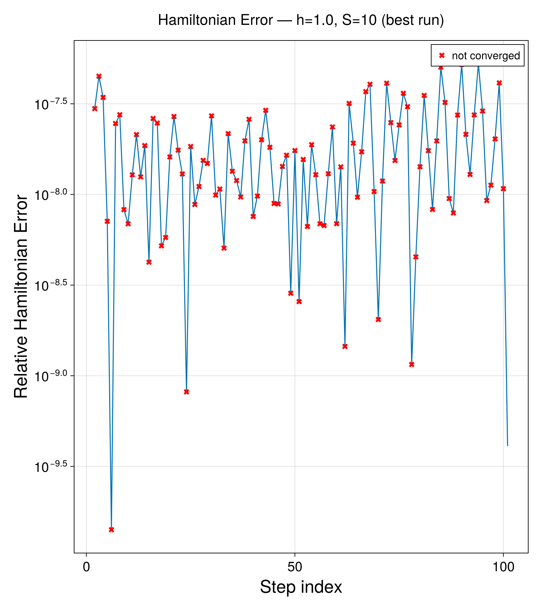<br/><small>S=10 · R=16 · λ=0.001 · f_abs=-2.220446049250313e-16 · x_suc=-2.220446049250313e-16 · dogleg · Float64<br/>Unconverged: 100.0%</small></td><td style="text-align:center;vertical-align:top;width:50%"><strong>Fewest Unconverged Run — Error: 3.104e-07</strong><br/>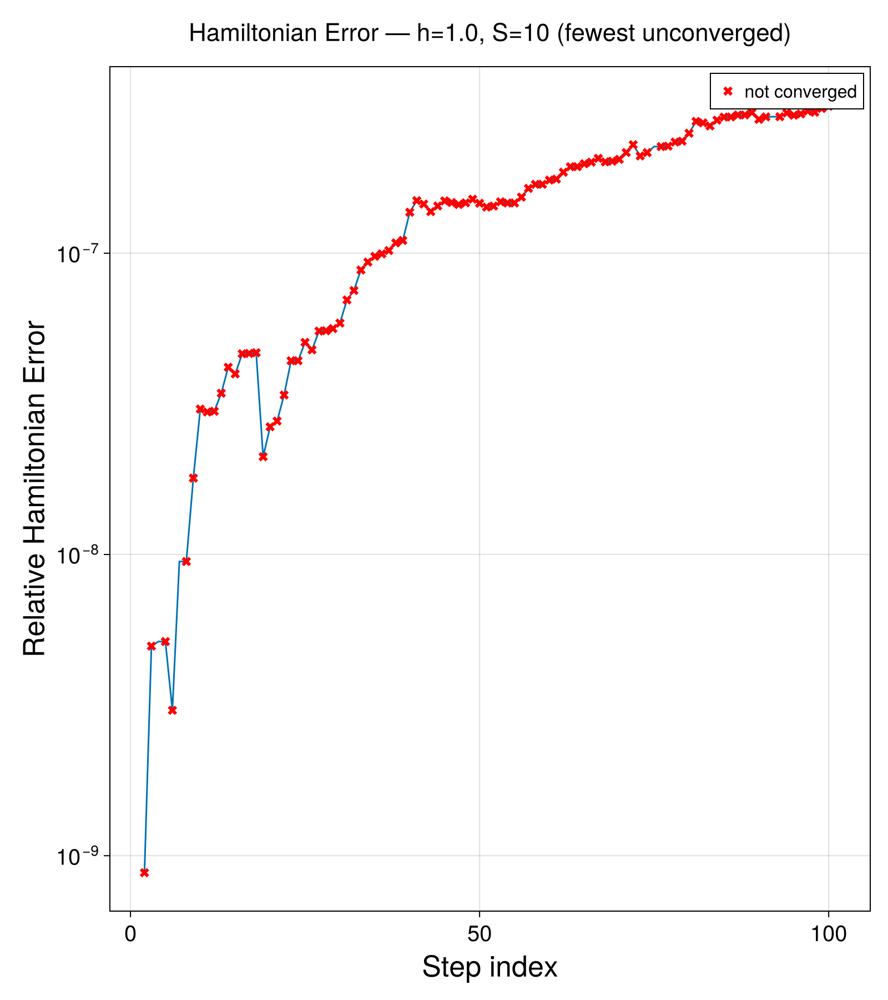<br/><small>S=10 · R=16 · λ=1.0e-7 · f_abs=-2.220446049250313e-16 · x_suc=-2.220446049250313e-16 · dogleg · Float64<br/>Unconverged: 96.0%</small></td></tr></table></td><td><table style="width:100%"><tr><td style="text-align:center;vertical-align:top;width:50%"><strong>Min-Max Error: 6.290e-08</strong><br/>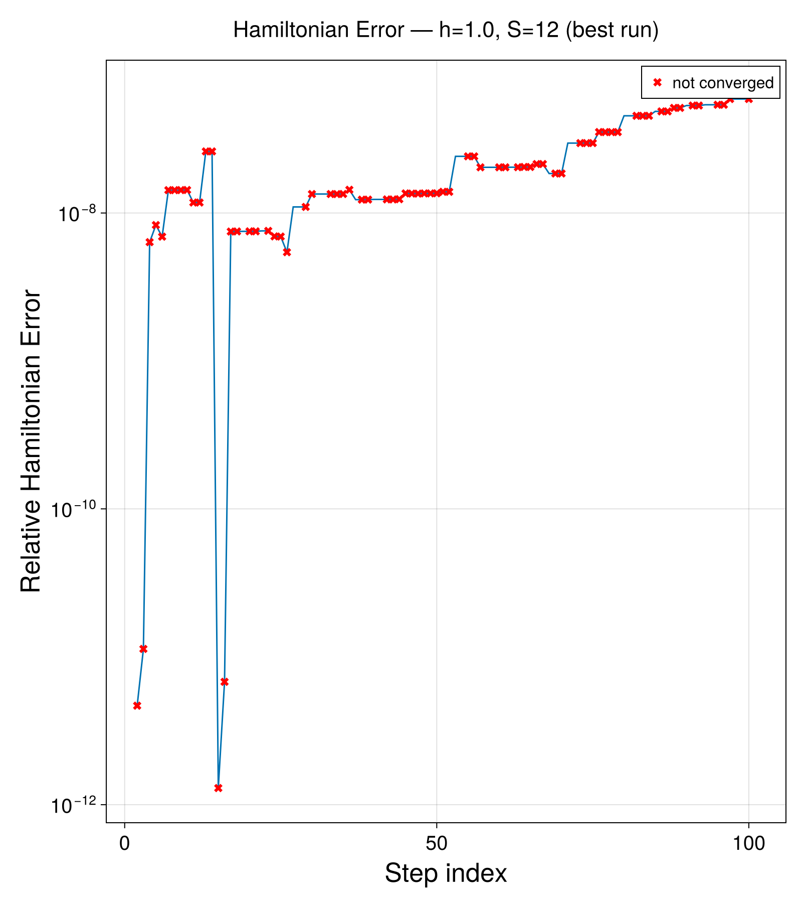<br/><small>S=12 · R=8 · λ=1.0e-7 · f_abs=-2.220446049250313e-16 · x_suc=-2.220446049250313e-16 · dogleg · Float64<br/>Unconverged: 75.0%</small></td><td style="text-align:center;vertical-align:top;width:50%"><strong>Fewest Unconverged Run — Error: 4.523e-06</strong><br/>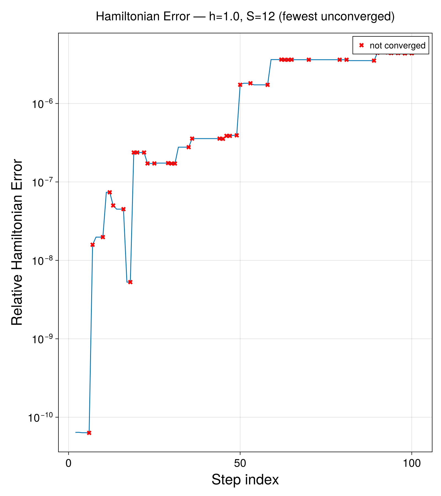<br/><small>S=12 · R=16 · λ=1.0e-7 · f_abs=-2.220446049250313e-16 · x_suc=-2.220446049250313e-16 · backtracking · Float64<br/>Unconverged: 41.0%</small></td></tr></table></td><td><table style="width:100%"><tr><td style="text-align:center;vertical-align:top;width:50%"><strong>Min-Max Error: 9.678e-08</strong><br/>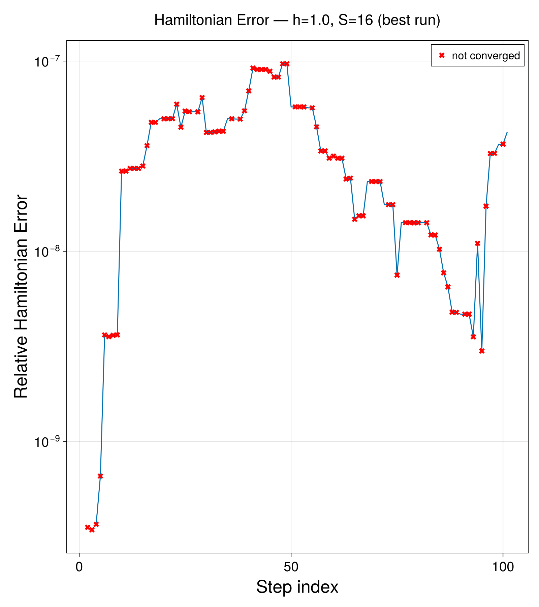<br/><small>S=16 · R=8 · λ=1.0e-7 · f_abs=-2.220446049250313e-16 · x_suc=-2.220446049250313e-16 · dogleg · Float64<br/>Unconverged: 88.0%</small></td><td style="text-align:center;vertical-align:top;width:50%"><strong>Fewest Unconverged Run — Error: 1.214e-07</strong><br/>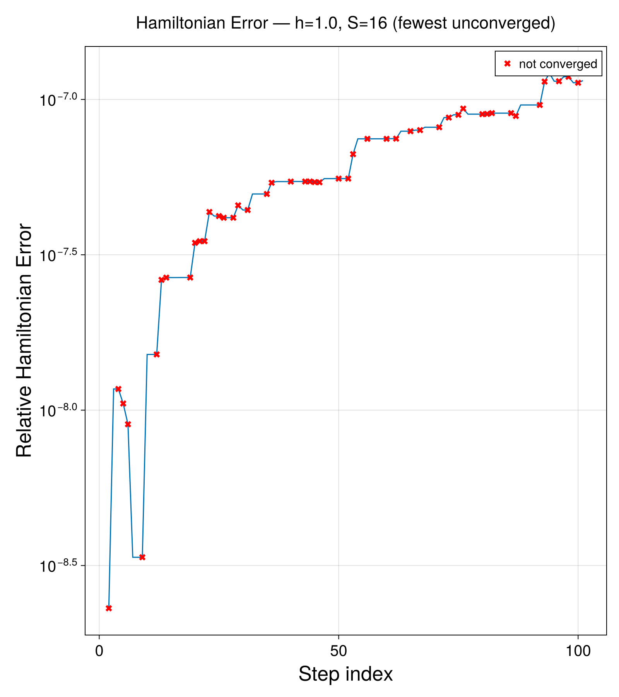<br/><small>S=16 · R=16 · λ=1.0e-7 · f_abs=-2.220446049250313e-16 · x_suc=-2.220446049250313e-16 · dogleg · Float64<br/>Unconverged: 49.0%</small></td></tr></table></td></tr></tbody></table>

### h = 2.0

<table>
<thead><tr><th>S = 4</th><th>S = 6</th><th>S = 8</th><th>S = 10</th><th>S = 12</th><th>S = 16</th></tr></thead>
<tbody><tr>
<td><table style="width:100%"><tr><td style="text-align:center;vertical-align:top;width:50%"><strong>Min-Max Error: 6.605e-04</strong><br/>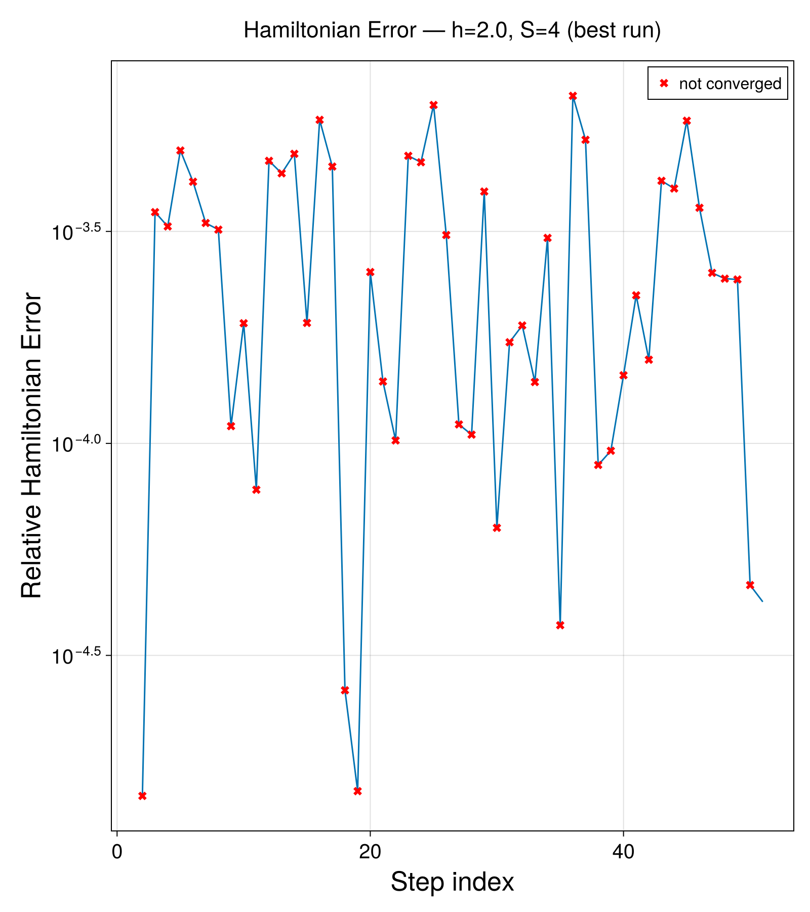<br/><small>S=4 · R=16 · λ=1.0e-5 · f_abs=-2.220446049250313e-16 · x_suc=-2.220446049250313e-16 · dogleg · Float64<br/>Unconverged: 100.0%</small></td><td style="text-align:center;vertical-align:top;width:50%"><strong>Fewest Unconverged Run — Error: 6.605e-04</strong><br/>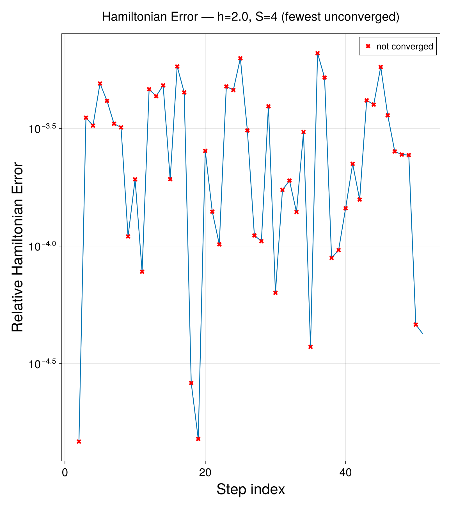<br/><small>S=4 · R=16 · λ=1.0e-5 · f_abs=-2.220446049250313e-16 · x_suc=-2.220446049250313e-16 · dogleg · Float64<br/>Unconverged: 100.0%</small></td></tr></table></td><td><table style="width:100%"><tr><td style="text-align:center;vertical-align:top;width:50%"><strong>Min-Max Error: 1.733e-05</strong><br/>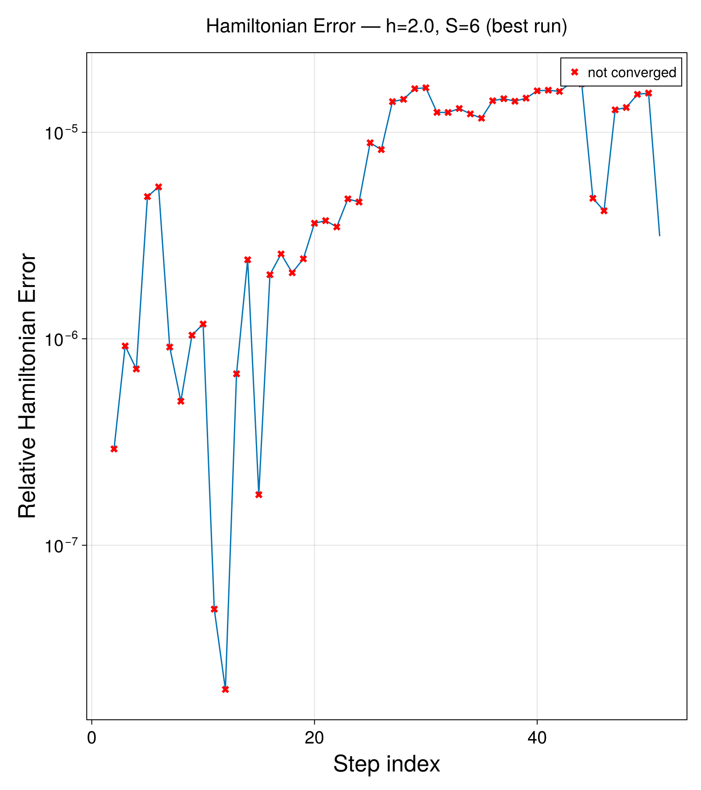<br/><small>S=6 · R=16 · λ=1.0e-5 · f_abs=-2.220446049250313e-16 · x_suc=-2.220446049250313e-16 · dogleg · Float64<br/>Unconverged: 100.0%</small></td><td style="text-align:center;vertical-align:top;width:50%"><strong>Fewest Unconverged Run — Error: 1.733e-05</strong><br/>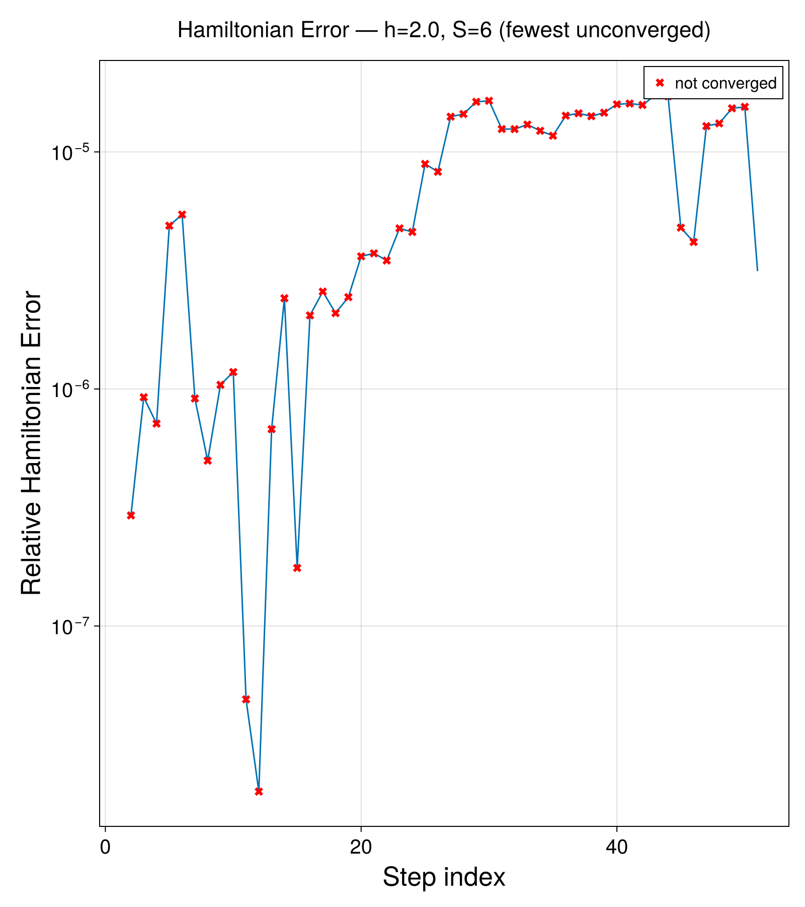<br/><small>S=6 · R=16 · λ=1.0e-5 · f_abs=-2.220446049250313e-16 · x_suc=-2.220446049250313e-16 · dogleg · Float64<br/>Unconverged: 100.0%</small></td></tr></table></td><td><table style="width:100%"><tr><td style="text-align:center;vertical-align:top;width:50%"><strong>Min-Max Error: 2.862e-06</strong><br/>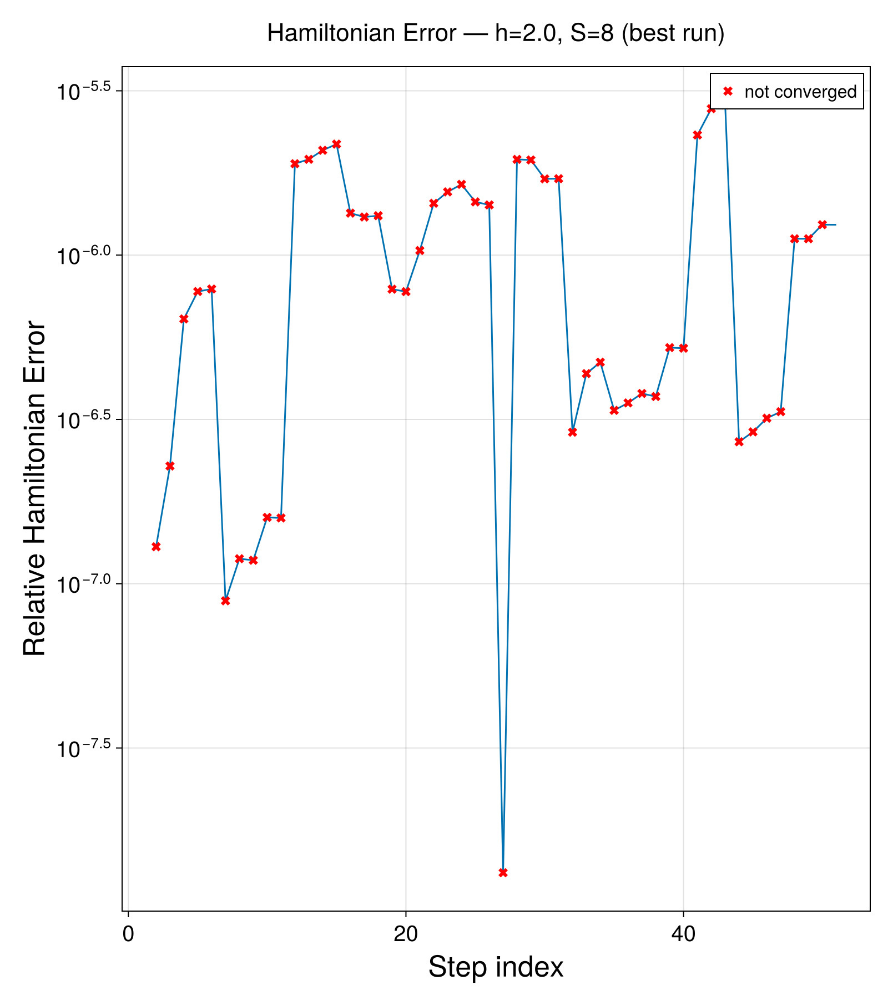<br/><small>S=8 · R=16 · λ=0.0 · f_abs=-2.220446049250313e-16 · x_suc=-2.220446049250313e-16 · backtracking · Float64<br/>Unconverged: 100.0%</small></td><td style="text-align:center;vertical-align:top;width:50%"><strong>Fewest Unconverged Run — Error: 2.862e-06</strong><br/>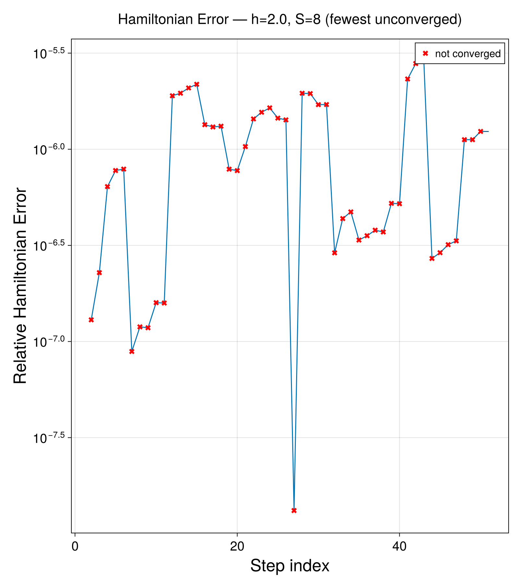<br/><small>S=8 · R=16 · λ=0.0 · f_abs=-2.220446049250313e-16 · x_suc=-2.220446049250313e-16 · backtracking · Float64<br/>Unconverged: 100.0%</small></td></tr></table></td><td><table style="width:100%"><tr><td style="text-align:center;vertical-align:top;width:50%"><strong>Min-Max Error: 2.825e-06</strong><br/>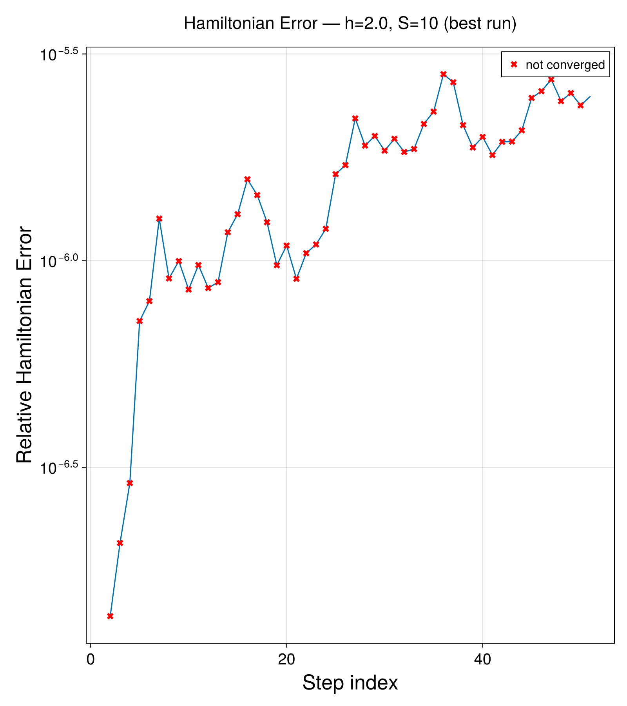<br/><small>S=10 · R=8 · λ=0.001 · f_abs=-2.220446049250313e-16 · x_suc=-2.220446049250313e-16 · dogleg · Float64<br/>Unconverged: 100.0%</small></td><td style="text-align:center;vertical-align:top;width:50%"><strong>Fewest Unconverged Run — Error: 6.296e-06</strong><br/>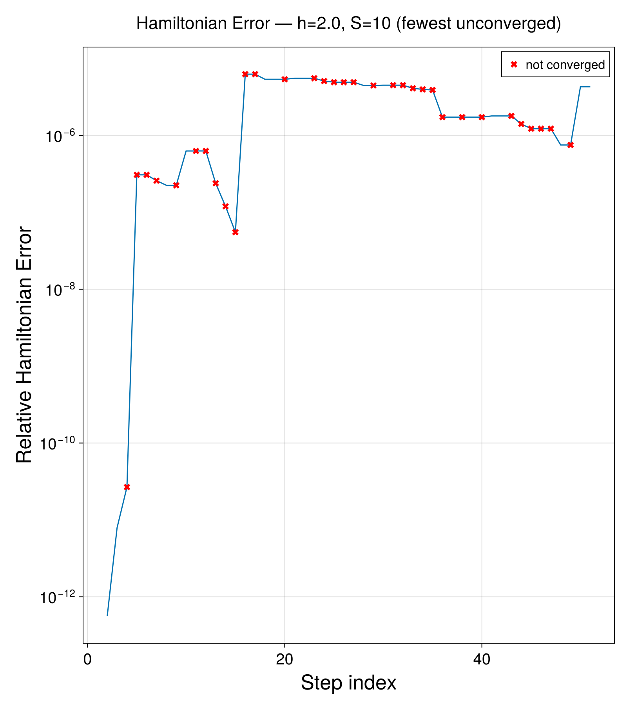<br/><small>S=10 · R=16 · λ=1.0e-7 · f_abs=-2.220446049250313e-16 · x_suc=-2.220446049250313e-16 · dogleg · Float64<br/>Unconverged: 66.0%</small></td></tr></table></td><td><table style="width:100%"><tr><td style="text-align:center;vertical-align:top;width:50%"><strong>Min-Max Error: 3.839e-06</strong><br/>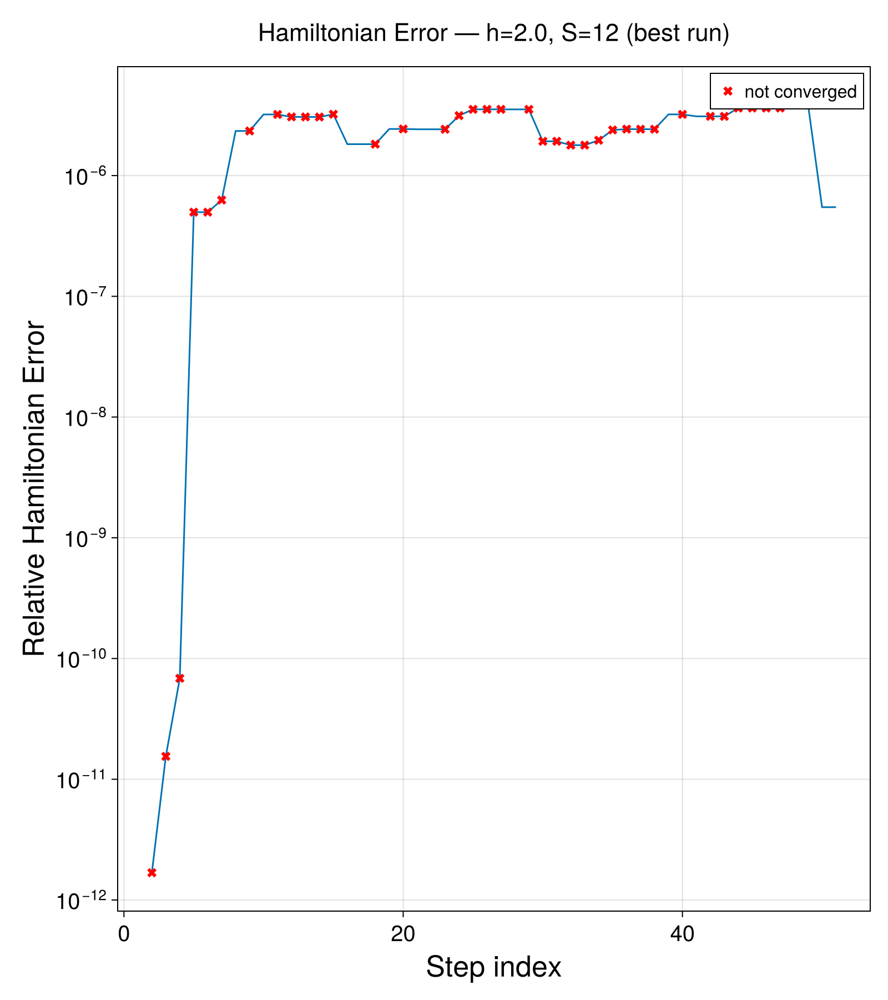<br/><small>S=12 · R=16 · λ=1.0e-7 · f_abs=-2.220446049250313e-16 · x_suc=-2.220446049250313e-16 · dogleg · Float64<br/>Unconverged: 74.0%</small></td><td style="text-align:center;vertical-align:top;width:50%"><strong>Fewest Unconverged Run — Error: 3.839e-06</strong><br/>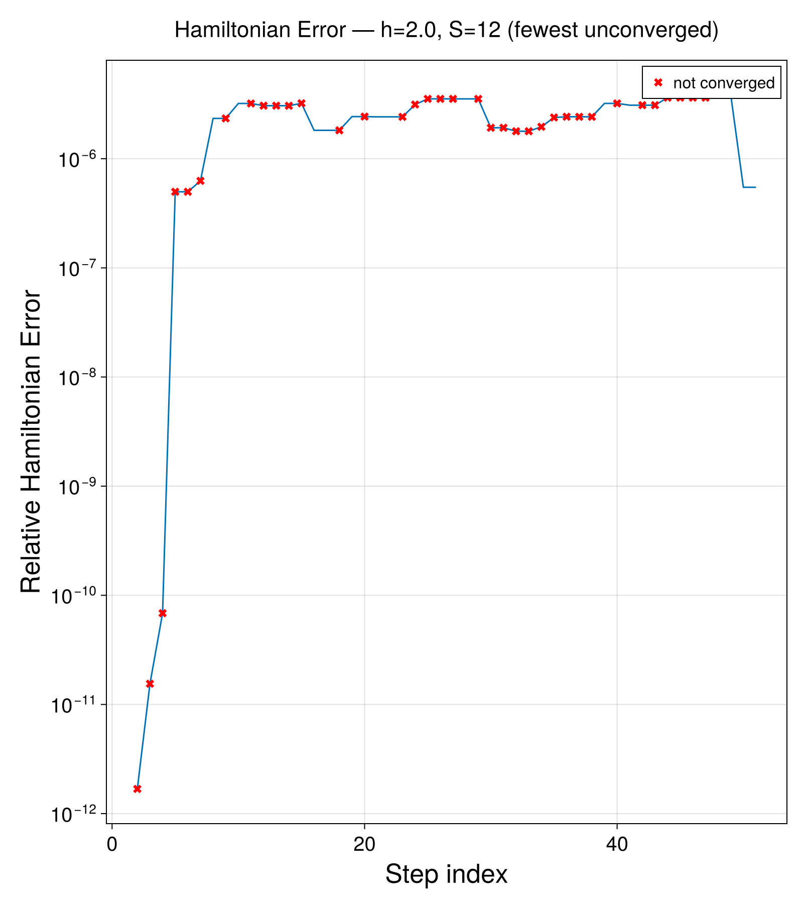<br/><small>S=12 · R=16 · λ=1.0e-7 · f_abs=-2.220446049250313e-16 · x_suc=-2.220446049250313e-16 · dogleg · Float64<br/>Unconverged: 74.0%</small></td></tr></table></td><td><table style="width:100%"><tr><td style="text-align:center;vertical-align:top;width:50%"><strong>Min-Max Error: 9.265e-06</strong><br/>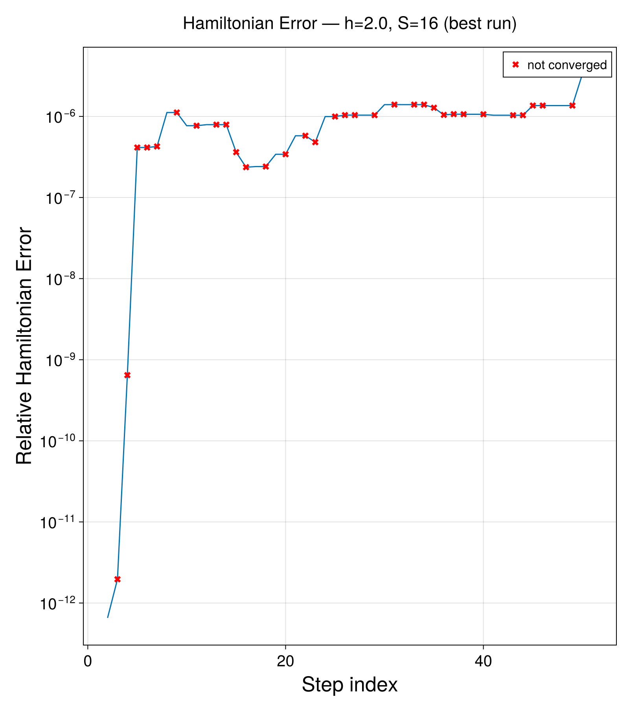<br/><small>S=16 · R=16 · λ=0.0 · f_abs=-2.220446049250313e-16 · x_suc=-2.220446049250313e-16 · dogleg · Float64<br/>Unconverged: 100.0%</small></td><td style="text-align:center;vertical-align:top;width:50%"><strong>Fewest Unconverged Run — Error: 1.468e-05</strong><br/>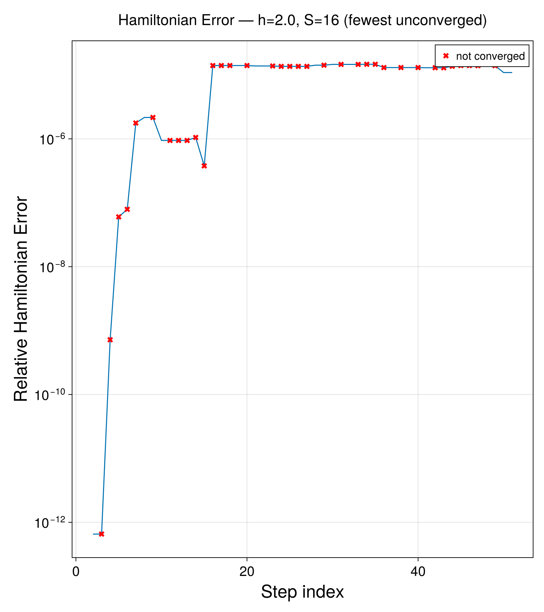<br/><small>S=16 · R=16 · λ=1.0e-7 · f_abs=-2.220446049250313e-16 · x_suc=-2.220446049250313e-16 · dogleg · Float64<br/>Unconverged: 70.0%</small></td></tr></table></td></tr></tbody></table>

### h = 5.0

<table>
<thead><tr><th>S = 4</th><th>S = 6</th><th>S = 8</th><th>S = 10</th><th>S = 12</th><th>S = 16</th></tr></thead>
<tbody><tr>
<td><table style="width:100%"><tr><td style="text-align:center;vertical-align:top;width:50%"><strong>Min-Max Error: 5.511e-02</strong><br/>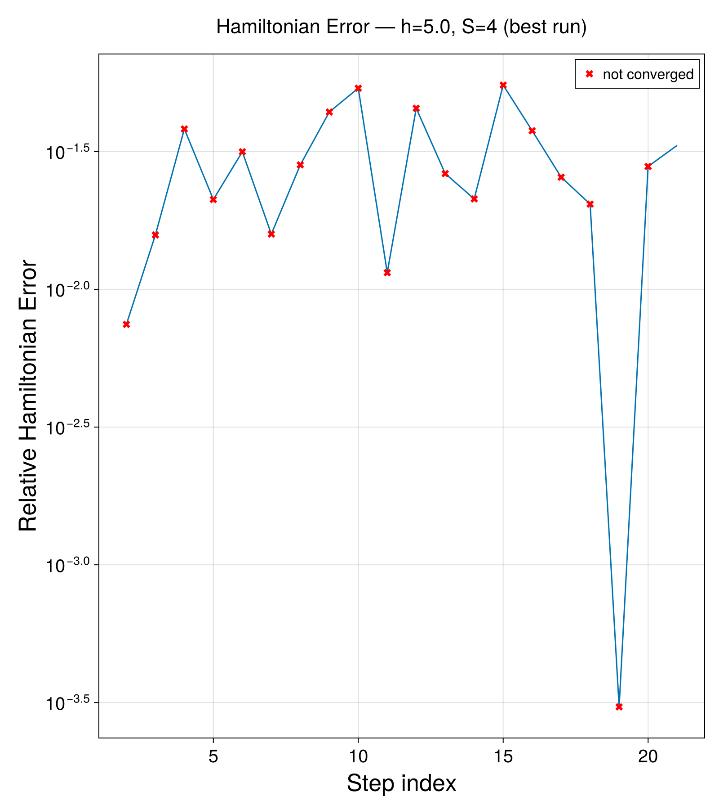<br/><small>S=4 · R=4 · λ=1.0e-7 · f_abs=-2.220446049250313e-16 · x_suc=-2.220446049250313e-16 · backtracking · Float64<br/>Unconverged: 100.0%</small></td><td style="text-align:center;vertical-align:top;width:50%"><strong>Fewest Unconverged Run — Error: 5.511e-02</strong><br/>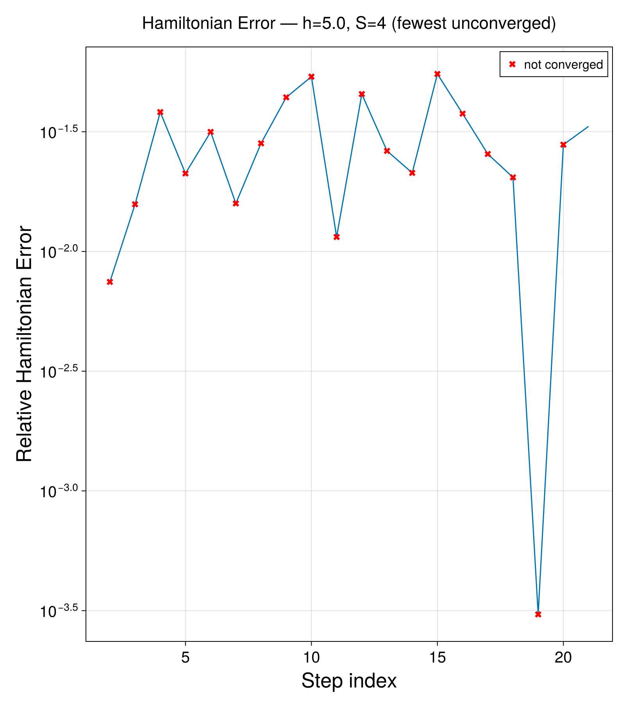<br/><small>S=4 · R=4 · λ=1.0e-7 · f_abs=-2.220446049250313e-16 · x_suc=-2.220446049250313e-16 · backtracking · Float64<br/>Unconverged: 100.0%</small></td></tr></table></td><td><table style="width:100%"><tr><td style="text-align:center;vertical-align:top;width:50%"><strong>Min-Max Error: 3.190e-04</strong><br/>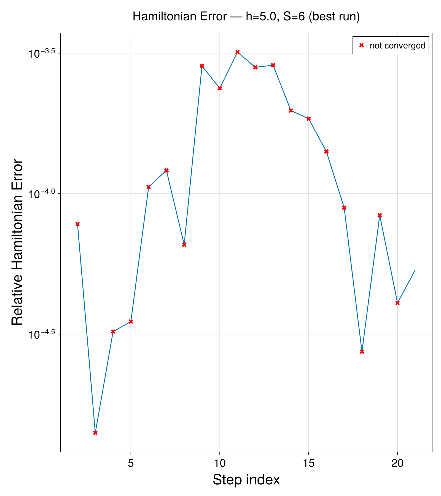<br/><small>S=6 · R=8 · λ=1.0e-5 · f_abs=-2.220446049250313e-16 · x_suc=-2.220446049250313e-16 · dogleg · Float64<br/>Unconverged: 100.0%</small></td><td style="text-align:center;vertical-align:top;width:50%"><strong>Fewest Unconverged Run — Error: 3.190e-04</strong><br/>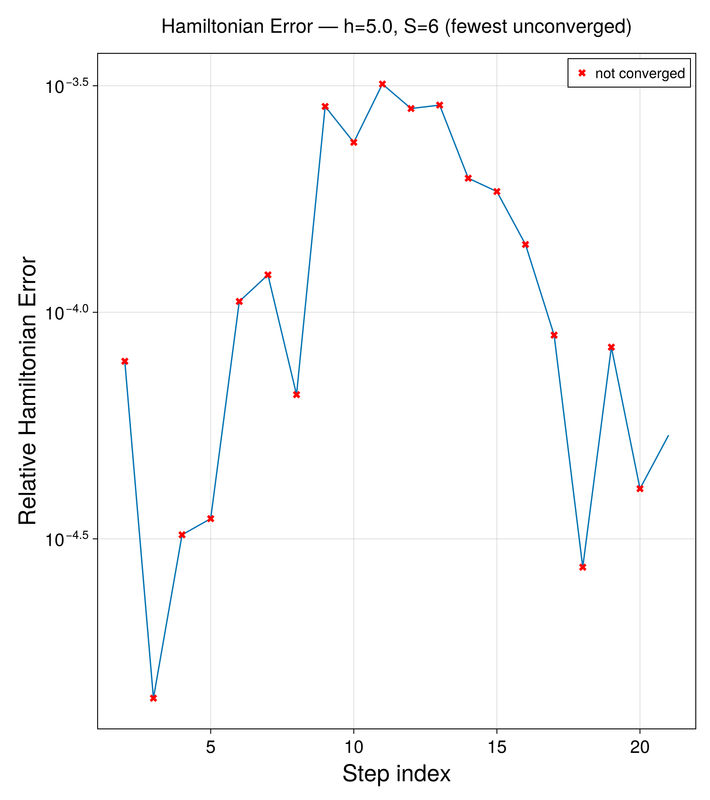<br/><small>S=6 · R=8 · λ=1.0e-5 · f_abs=-2.220446049250313e-16 · x_suc=-2.220446049250313e-16 · dogleg · Float64<br/>Unconverged: 100.0%</small></td></tr></table></td><td><table style="width:100%"><tr><td style="text-align:center;vertical-align:top;width:50%"><strong>Min-Max Error: 6.292e-04</strong><br/>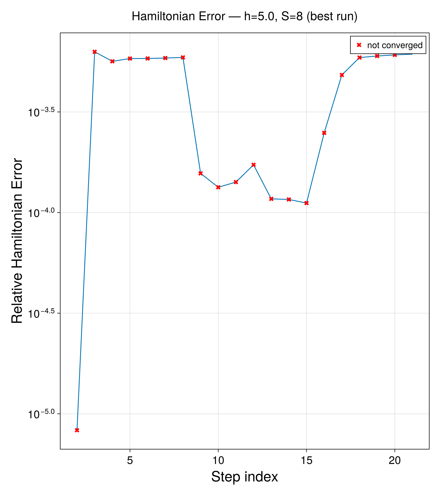<br/><small>S=8 · R=8 · λ=1.0e-7 · f_abs=-2.220446049250313e-16 · x_suc=-2.220446049250313e-16 · backtracking · Float64<br/>Unconverged: 100.0%</small></td><td style="text-align:center;vertical-align:top;width:50%"><strong>Fewest Unconverged Run — Error: 6.292e-04</strong><br/>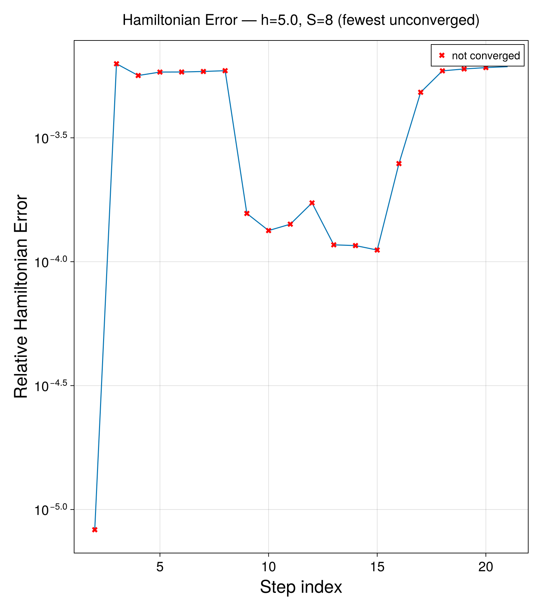<br/><small>S=8 · R=8 · λ=1.0e-7 · f_abs=-2.220446049250313e-16 · x_suc=-2.220446049250313e-16 · backtracking · Float64<br/>Unconverged: 100.0%</small></td></tr></table></td><td><table style="width:100%"><tr><td style="text-align:center;vertical-align:top;width:50%"><strong>Min-Max Error: 2.349e-04</strong><br/>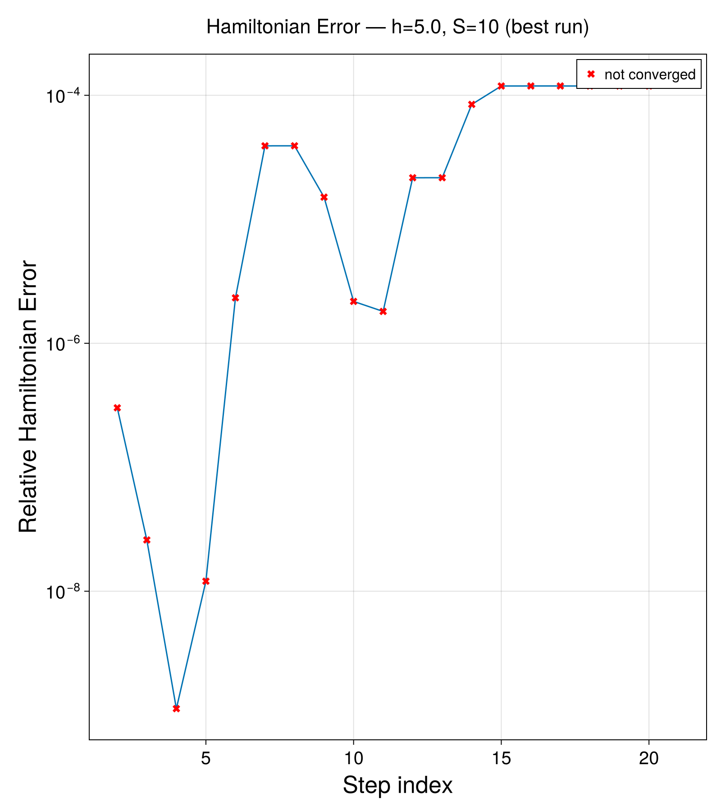<br/><small>S=10 · R=16 · λ=1.0e-7 · f_abs=-2.220446049250313e-16 · x_suc=-2.220446049250313e-16 · dogleg · Float64<br/>Unconverged: 95.0%</small></td><td style="text-align:center;vertical-align:top;width:50%"><strong>Fewest Unconverged Run — Error: 2.349e-04</strong><br/>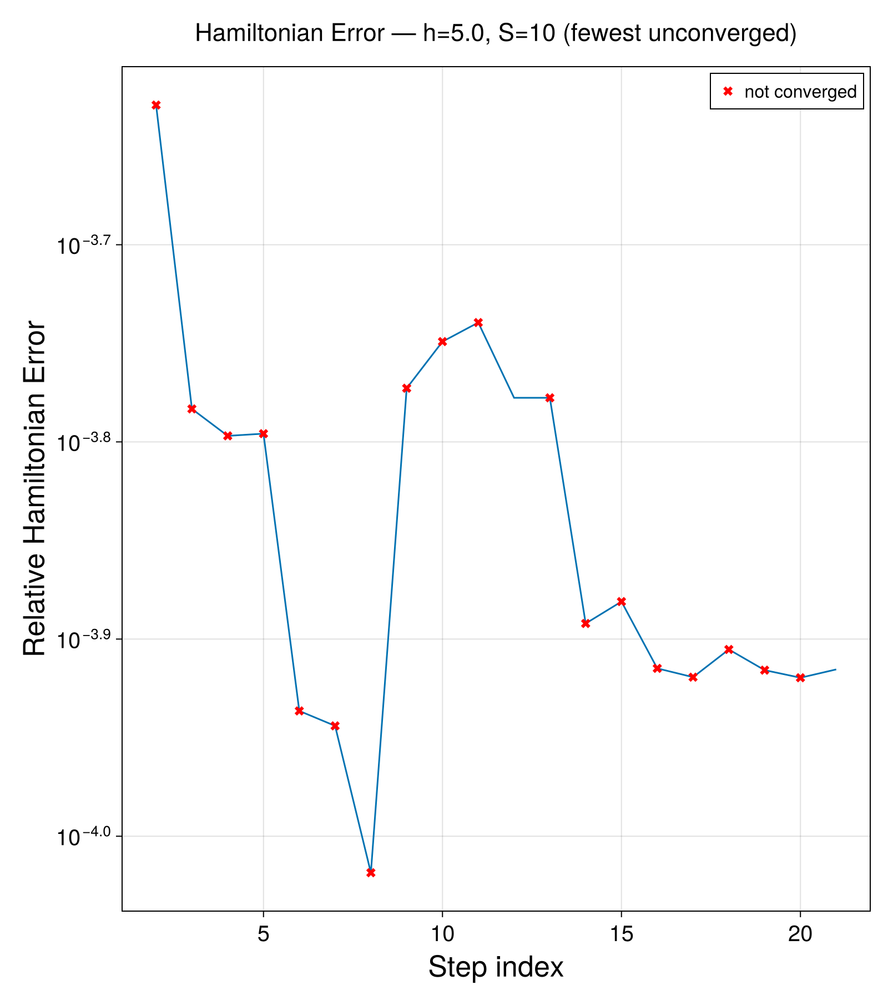<br/><small>S=10 · R=16 · λ=1.0e-7 · f_abs=-2.220446049250313e-16 · x_suc=-2.220446049250313e-16 · dogleg · Float64<br/>Unconverged: 95.0%</small></td></tr></table></td><td><table style="width:100%"><tr><td style="text-align:center;vertical-align:top;width:50%"><strong>Min-Max Error: 1.073e-04</strong><br/>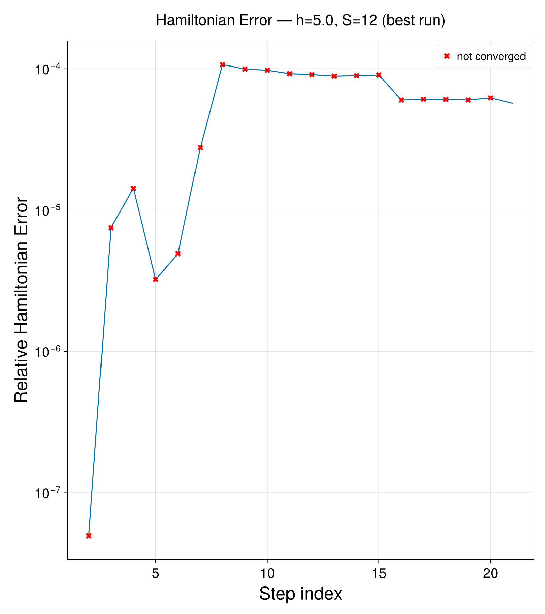<br/><small>S=12 · R=16 · λ=1.0e-7 · f_abs=-2.220446049250313e-16 · x_suc=-2.220446049250313e-16 · dogleg · Float64<br/>Unconverged: 100.0%</small></td><td style="text-align:center;vertical-align:top;width:50%"><strong>Fewest Unconverged Run — Error: 1.073e-04</strong><br/>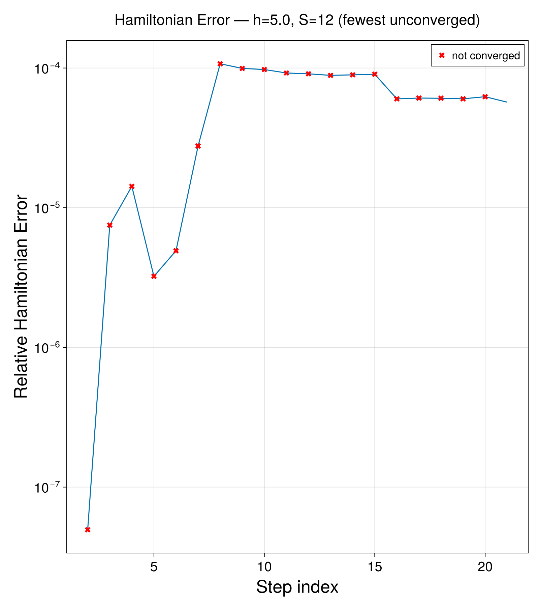<br/><small>S=12 · R=16 · λ=1.0e-7 · f_abs=-2.220446049250313e-16 · x_suc=-2.220446049250313e-16 · dogleg · Float64<br/>Unconverged: 100.0%</small></td></tr></table></td><td><table style="width:100%"><tr><td style="text-align:center;vertical-align:top;width:50%"><strong>Min-Max Error: 1.064e-04</strong><br/>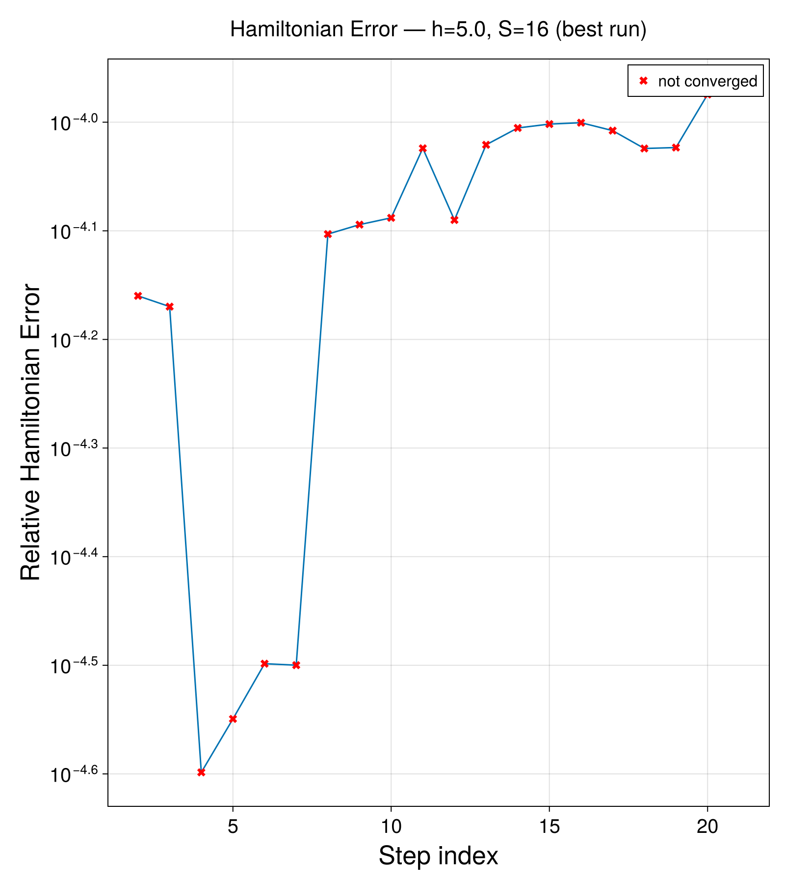<br/><small>S=16 · R=8 · λ=0.0 · f_abs=-2.220446049250313e-16 · x_suc=-2.220446049250313e-16 · dogleg · Float64<br/>Unconverged: 100.0%</small></td><td style="text-align:center;vertical-align:top;width:50%"><strong>Fewest Unconverged Run — Error: 1.358e-03</strong><br/>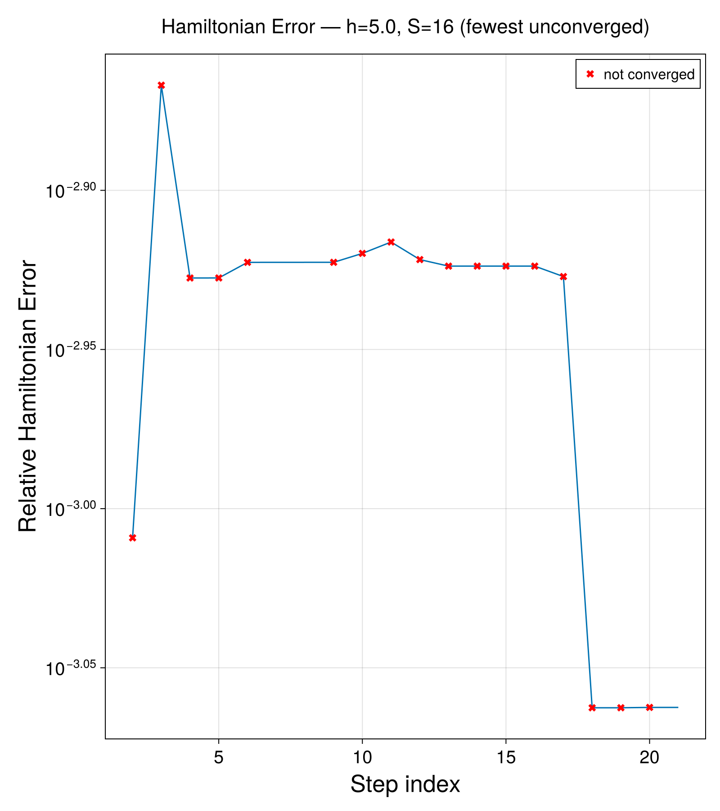<br/><small>S=16 · R=16 · λ=1.0e-5 · f_abs=-2.220446049250313e-16 · x_suc=-2.220446049250313e-16 · dogleg · Float64<br/>Unconverged: 90.0%</small></td></tr></table></td></tr></tbody></table>


<!-- HO_TANH_TABLE_END -->

## Note ##
For the Harmonic Oscillator problem, the Hamiltonian error does not always exhibit the expected oscillatory behavior, mainly due to several issues, including solver convergence problems and improperly chosen hyperparameters.

## Double Pendulum Results

### ReLU Activation


<!-- DP_RELU_TABLE_START -->
<!-- DP_RELU_TABLE_END -->


### tanh Activation


<!-- DP_TANH_TABLE_START -->
<!-- DP_TANH_TABLE_END -->

