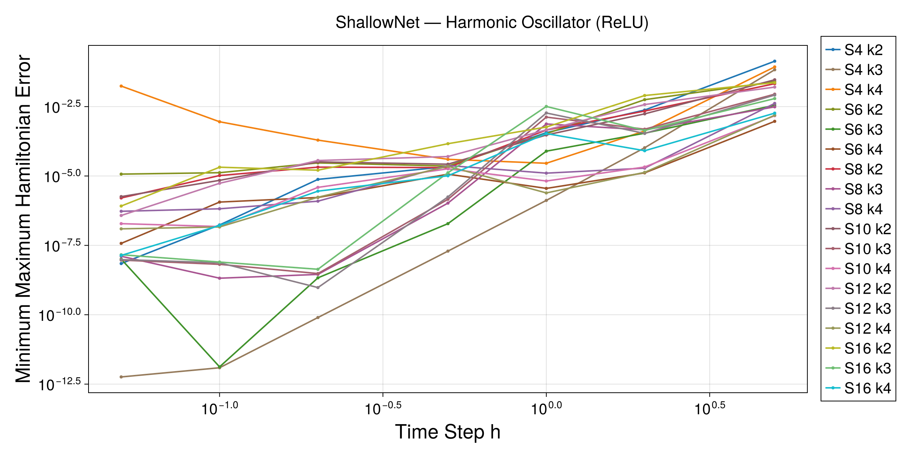
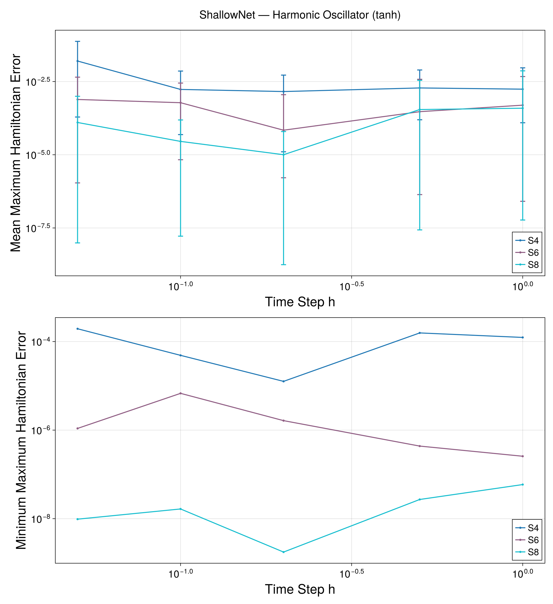

# ShallowNet

`ShallowNet` is the baseline single-hidden-layer neural variational integrator. It uses **symbolic derivatives** (pre-compiled via `SymbolicNeuralNetworks.jl`) to form the variational conditions, and an OGA seed (`OGA1d`) for the Newton initialization. Both `ReLUᵏ` and `tanh` activations are supported.

## Running the Parameter Scan

The parameter grid (`h`, `λ`, `f_abstol`, `x_suctol`, solver, and `dtype`) is configured at the top of `parallel_run.sh`:

```bash
# In parallel_run.sh:
INTEGRATOR="shallownet"
DP_FLAG=""             # set to "--double-pendulum" to include double pendulum

bash parallel_run.sh
```

After all jobs complete, generate the summary figures and error tables:

```bash
julia --project=scripts scripts/result_summary_shallownet.jl
```

Results are written to `docs/src/nvi/figures/`.

## Harmonic Oscillator Results

### ReLU Activation



<!-- HO_RELU_TABLE_START -->

=== ShallowNet HO — ReLU ===

### h=0.05
| S | k | min max Hamiltonian error |
|---|---|--------------------------|
| 4 | 2 | — |
| 4 | 3 | — |
| 4 | 4 | — |
| 6 | 2 | — |
| 6 | 3 | — |
| 6 | 4 | — |
| 8 | 2 | — |
| 8 | 3 | — |
| 8 | 4 | — |

### h=0.1
| S | k | min max Hamiltonian error |
|---|---|--------------------------|
| 4 | 2 | — |
| 4 | 3 | 5.029e-11 |
| 4 | 4 | — |
| 6 | 2 | — |
| 6 | 3 | — |
| 6 | 4 | — |
| 8 | 2 | — |
| 8 | 3 | — |
| 8 | 4 | — |

### h=0.2
| S | k | min max Hamiltonian error |
|---|---|--------------------------|
| 4 | 2 | — |
| 4 | 3 | — |
| 4 | 4 | — |
| 6 | 2 | — |
| 6 | 3 | — |
| 6 | 4 | — |
| 8 | 2 | — |
| 8 | 3 | — |
| 8 | 4 | — |

### h=0.5
| S | k | min max Hamiltonian error |
|---|---|--------------------------|
| 4 | 2 | — |
| 4 | 3 | — |
| 4 | 4 | — |
| 6 | 2 | — |
| 6 | 3 | — |
| 6 | 4 | — |
| 8 | 2 | — |
| 8 | 3 | — |
| 8 | 4 | — |

### h=1.0
| S | k | min max Hamiltonian error |
|---|---|--------------------------|
| 4 | 2 | — |
| 4 | 3 | — |
| 4 | 4 | — |
| 6 | 2 | — |
| 6 | 3 | — |
| 6 | 4 | — |
| 8 | 2 | — |
| 8 | 3 | — |
| 8 | 4 | — |

<!-- HO_RELU_TABLE_END -->


### tanh Activation



<!-- HO_TANH_TABLE_START -->

=== ShallowNet HO — tanh ===

### h=0.05
| S | min max Hamiltonian error |
|---|--------------------------|
| 4 | 4.978e-04 |
| 6 | — |
| 8 | — |

### h=0.1
| S | min max Hamiltonian error |
|---|--------------------------|
| 4 | 6.673e-04 |
| 6 | — |
| 8 | — |

### h=0.2
| S | min max Hamiltonian error |
|---|--------------------------|
| 4 | — |
| 6 | — |
| 8 | — |

### h=0.5
| S | min max Hamiltonian error |
|---|--------------------------|
| 4 | — |
| 6 | — |
| 8 | — |

### h=1.0
| S | min max Hamiltonian error |
|---|--------------------------|
| 4 | — |
| 6 | — |
| 8 | — |

<!-- HO_TANH_TABLE_END -->


## Double Pendulum Results

### ReLU Activation


<!-- DP_RELU_TABLE_START -->
<!-- DP_RELU_TABLE_END -->


### tanh Activation


<!-- DP_TANH_TABLE_START -->
<!-- DP_TANH_TABLE_END -->


