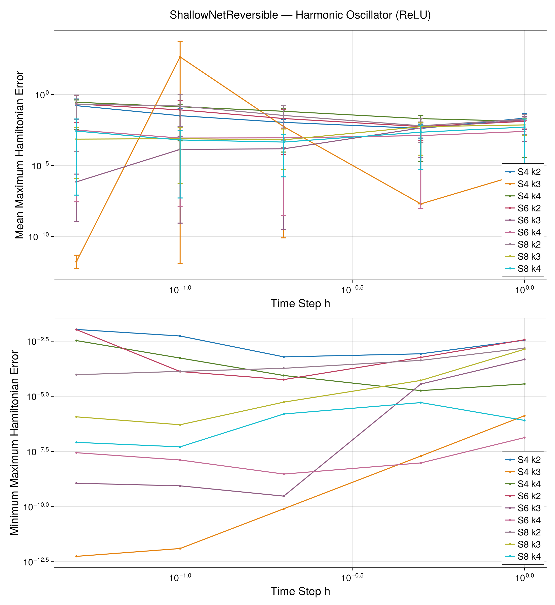
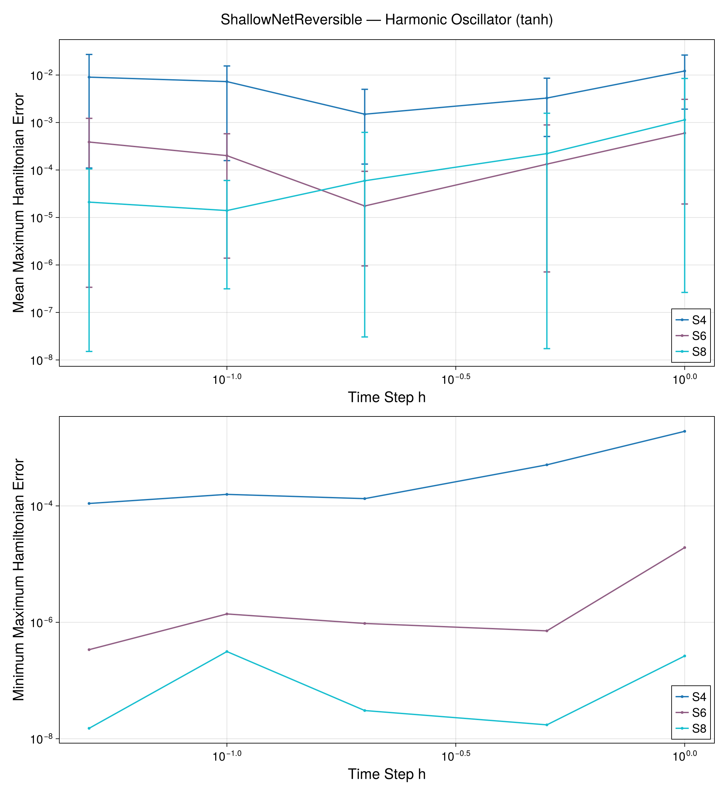
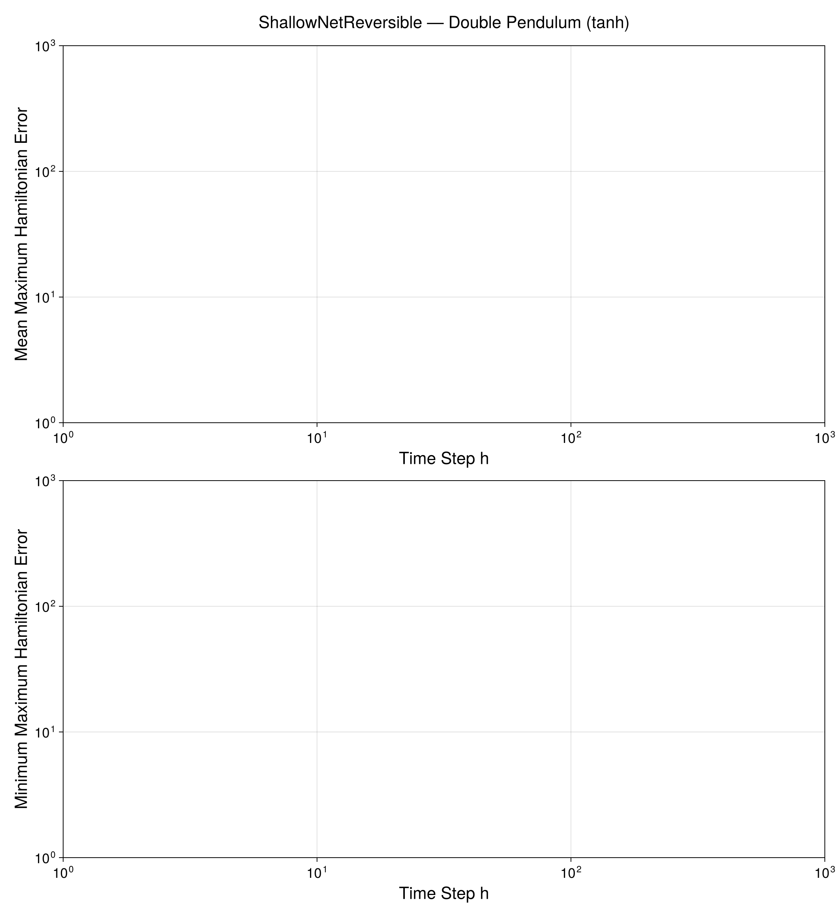

# ShallowNet (Reversible)

`ShallowNetReversible` is a time-symmetric single-hidden-layer neural variational integrator. It enforces the time-reversal symmetry `q(t) = q(T - t)` by requiring an even number of neurons and a palindromic parameter structure. Like `ShallowNet`, it uses symbolic derivatives and an OGA seed for initialization.

## Running the Parameter Scan

The parameter grid (`h`, `λ`, `f_abstol`, `x_suctol`, solver, and `dtype`) is configured at the top of `parallel_run.sh`:

```bash
# In parallel_run.sh:
INTEGRATOR="shallownet_reversible"
DP_FLAG=""             # set to "--double-pendulum" to include double pendulum

bash parallel_run.sh
```

After all jobs complete:

```bash
julia --project=scripts scripts/result_summary_shallownet_reversible.jl
```

## Harmonic Oscillator Results

### ReLU Activation



<!-- HO_RELU_TABLE_START -->
<!-- HO_RELU_TABLE_END -->

### tanh Activation



<!-- HO_TANH_TABLE_START -->
<!-- HO_TANH_TABLE_END -->

## Double Pendulum Results

### ReLU Activation


<!-- DP_RELU_TABLE_START -->
<!-- DP_RELU_TABLE_END -->

### tanh Activation



<!-- DP_TANH_TABLE_START -->
<!-- DP_TANH_TABLE_END -->
